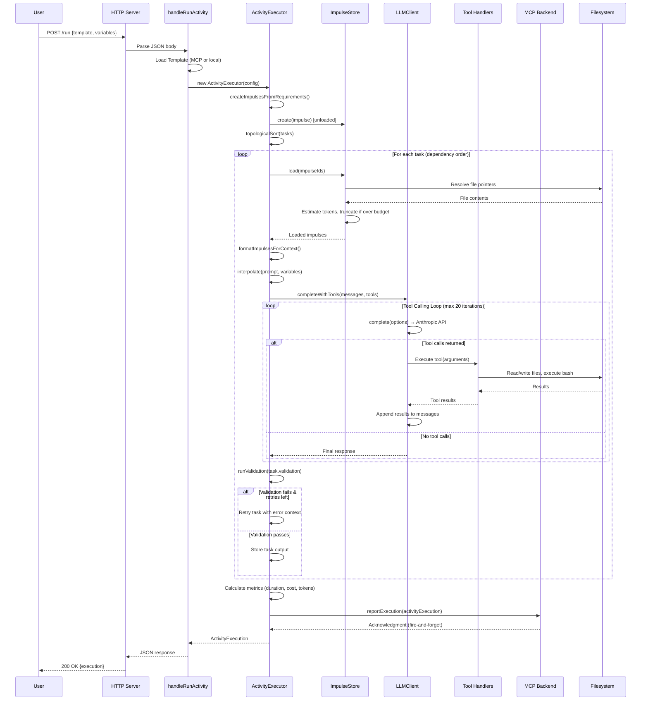
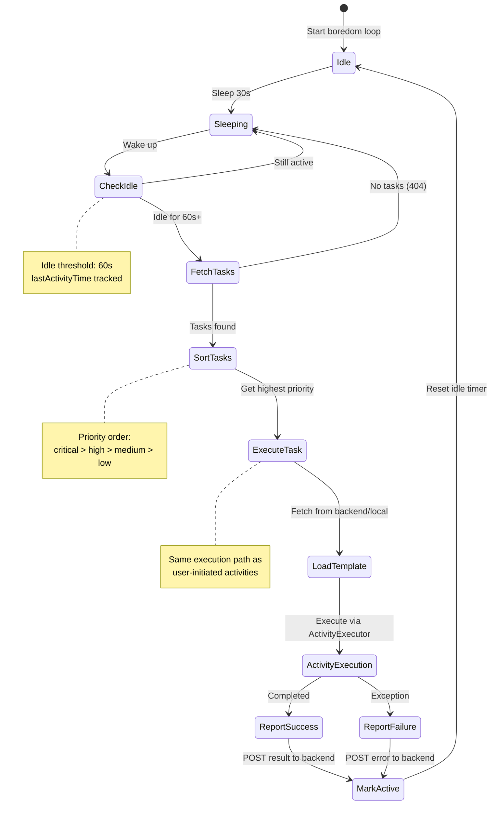

# minibob-standalone-execution: Comprehensive Flow Analysis

## Overview

This document traces the complete data flow for minibob standalone execution from Kubernetes deployment through all autonomous capabilities (activity execution, trailblazing, ACP communication, boredom tasks, impulse agent, learning loops, variant creation, and debugging).

**Analysis Date**: 2026-03-14
**Codebase**: repos/minibob (3,621 lines TypeScript)
**Entry Points**: 4 (HTTP endpoints + K8s startup)
**Components**: 9 TypeScript modules
**Capabilities**: 7 autonomous systems

---

## High-Level Architecture Flow

```mermaid
graph TD
    subgraph "Kubernetes Deployment"
        K8S[K8s Pod Start] -->|ENV vars| CONFIG[Load Config]
        CONFIG -->|MinibobConfig| STARTUP[startServer]
    end
    
    subgraph "Initialization"
        STARTUP -->|Initialize| MCP[MCP Client]
        STARTUP -->|Initialize| BOREDOM[Boredom Executor]
        STARTUP -->|Start| HTTP[HTTP Server :8080]
        MCP -->|Register| BACKEND[(Backend<br/>metabob-rpc-api)]
    end
    
    subgraph "Entry Points"
        HTTP -->|GET /health| HEALTH[Health Check]
        HTTP -->|POST /run| RUN[Activity Execution]
        HTTP -->|POST /acp| ACP[ACP Delegation]
        BOREDOM -->|Poll 30s| FETCH[Fetch Tasks]
    end
    
    subgraph "Autonomous Loop"
        FETCH -->|GET /boredom-tasks| BACKEND
        BACKEND -->|BoredomTask[]| SORT[Priority Sort]
        SORT -->|Highest Priority| EXEC_BOREDOM[Execute Task]
        EXEC_BOREDOM -->|ActivityExecution| REPORT[Report Result]
        REPORT -->|POST /boredom-tasks/result| BACKEND
        REPORT -->|Sleep 30s| FETCH
    end
    
    subgraph "Activity Execution Engine"
        RUN -->|Template + Variables| LOAD_TPL[Load Template]
        LOAD_TPL -->|ActivityTemplate| CREATE_IMP[Create Impulses]
        CREATE_IMP -->|Unloaded Impulses| TOPO[Topological Sort]
        TOPO -->|Sorted Tasks| EXEC_TASK[Execute Task]
        
        EXEC_TASK -->|Load Required| LOAD_IMP[Load Impulses]
        LOAD_IMP -->|Resolve Pointers| FILE_SYS[(Filesystem)]
        LOAD_IMP -->|XML Context| FORMAT[Format Context]
        FORMAT -->|Prompt + Context| LLM[LLM Client]
        
        LLM -->|API Call| ANTHROPIC[Anthropic API]
        ANTHROPIC -->|Response + Tools| TOOL_LOOP[Tool Calling Loop]
        TOOL_LOOP -->|Execute Tools| TOOLS[Tool Handlers]
        TOOLS -->|bash/read/write/git| FILE_SYS
        TOOL_LOOP -->|Final Response| VALIDATE[Validate Task]
        
        VALIDATE -->|Pass| NEXT_TASK[Next Task]
        VALIDATE -->|Fail + Retries| EXEC_TASK
        VALIDATE -->|All Done| METRICS[Collect Metrics]
        METRICS -->|POST /activity-executions| BACKEND
        METRICS -->|ActivityExecution| RESPONSE[HTTP Response]
    end
    
    subgraph "ACP Vessel Communication"
        ACP -->|ACPMessage| SESSION[Create Session]
        SESSION -->|Delegate| LLM
        SESSION -->|Response| ACP_RESP[ACP Response]
    end
    
    style K8S fill:#e1f5ff
    style RESPONSE fill:#ffe1e1
    style BACKEND fill:#fff4e1
    style ANTHROPIC fill:#f0e1ff
    style FILE_SYS fill:#e1ffe1
```

---

## Detailed User-Initiated Activity Flow



---

## Autonomous Boredom Task Flow



---

## Impulse Loading and Budget Enforcement Flow

```mermaid
graph TD
    subgraph "Creation Phase - Activity Initialization"
        REQ[ContextRequirement] -->|Parse| INTERP[Interpolate Variables]
        INTERP -->|src/{{feature}}.ts| PATH[Resolved Path]
        PATH -->|Create| UNLOADED[Unloaded Impulse]
        UNLOADED -->|Store| STORE[(ImpulseStore Map)]
    end
    
    subgraph "Loading Phase - Task Execution"
        TASK[Task References Impulse] -->|Get from store| STORED[Stored Impulse]
        STORED -->|Check loaded?| LOADED{Already Loaded?}
        
        LOADED -->|Yes| RETURN[Return Cached]
        LOADED -->|No| RESOLVE[Resolve Pointer]
        
        RESOLVE -->|file| READ_FILE[Read Filesystem]
        RESOLVE -->|memo| RETURN_MEMO[Return Content]
        RESOLVE -->|activityOutput| GET_OUTPUT[Get Task Output]
        RESOLVE -->|custom| CALL_RESOLVER[Call Resolver Fn]
        
        READ_FILE -->|Raw Content| ESTIMATE[Estimate Tokens]
        RETURN_MEMO -->|Content| ESTIMATE
        GET_OUTPUT -->|Output| ESTIMATE
        CALL_RESOLVER -->|Result| ESTIMATE
        
        ESTIMATE -->|chars / 4| COUNT[Token Count]
        COUNT -->|Compare| BUDGET{Over Budget?}
        
        BUDGET -->|No| CACHE[Cache & Return]
        BUDGET -->|Yes| TRUNCATE[Truncate Content]
        
        TRUNCATE -->|ratio * 0.9| SAFE[90% of Budget]
        SAFE -->|substring| APPEND[Append "...truncated"]
        APPEND -->|Truncated| CACHE
        
        CACHE -->|Loaded Impulse| FORMAT[Format as XML]
        FORMAT -->|<impulse>content</impulse>| CONTEXT[Add to LLM Context]
    end
    
    style UNLOADED fill:#e1f5ff
    style CONTEXT fill:#ffe1e1
    style TRUNCATE fill:#ffe1e1
```

---

## MCP Backend Integration Boundary

```mermaid
graph LR
    subgraph "Minibob (Local)"
        VESSEL[Vessel Operations] -->|GET| GET_TPL[Get Template]
        VESSEL -->|POST| REG[Register Vessel]
        VESSEL -->|POST| REPORT[Report Execution]
        VESSEL -->|GET| FETCH_TASKS[Fetch Boredom Tasks]
        VESSEL -->|POST| TASK_RESULT[Task Result]
    end
    
    subgraph "Integration Layer - MCPClient"
        GET_TPL -->|Timeout 30s| HTTP_GET[HTTP GET]
        REG -->|Fire & Forget| HTTP_POST1[HTTP POST]
        REPORT -->|Fire & Forget| HTTP_POST2[HTTP POST]
        FETCH_TASKS -->|404 = no tasks| HTTP_GET2[HTTP GET]
        TASK_RESULT -->|Fire & Forget| HTTP_POST3[HTTP POST]
    end
    
    subgraph "Backend - metabob-rpc-api"
        HTTP_GET -->|/activity-templates/:id| TPL_DB[(Template DB)]
        HTTP_POST1 -->|/vessels| VESSEL_DB[(Vessel Registry)]
        HTTP_POST2 -->|/activity-executions| EXEC_DB[(Execution Metrics)]
        HTTP_GET2 -->|/boredom-tasks| TASK_DB[(Task Queue)]
        HTTP_POST3 -->|/boredom-tasks/:id/result| TASK_DB
        
        EXEC_DB -->|Learn| THOMPSON[Thompson Sampling]
        THOMPSON -->|Variant Selection| TPL_DB
        TASK_DB -->|Assign| VESSEL_DB
    end
    
    subgraph "Error Handling"
        HTTP_GET -.->|404| NULL[Return null]
        HTTP_GET -.->|Error| LOG1[Log & null]
        HTTP_POST1 -.->|Error| LOG2[Log & false]
        HTTP_POST2 -.->|Error| LOG3[Log & false]
        HTTP_GET2 -.->|404| EMPTY[Return []]
        HTTP_POST3 -.->|Error| LOG4[Log & continue]
    end
    
    style NULL fill:#ffe1e1
    style LOG1 fill:#ffe1e1
    style LOG2 fill:#ffe1e1
    style THOMPSON fill:#f0e1ff
```

---

## Data Flow Summary

### Entry Points

1. **Kubernetes Pod Startup**
   - **Input**: Environment variables (ANTHROPIC_API_KEY, MCP_ENDPOINT, etc.)
   - **Format**: String key-value pairs from ConfigMap/Secret
   - **Validation**: None (defaults used for missing values)
   - **Destination**: `loadConfig()` → `MinibobConfig`

2. **HTTP POST /run (User-Initiated Activity)**
   - **Input**: JSON body `{ template: string, variables: Record<string, unknown>, reason?: string }`
   - **Format**: HTTP request, Content-Type: application/json
   - **Validation**: None (accepts any JSON, crashes on malformed)
   - **Destination**: `handleRunActivity()` → `ActivityExecutor.execute()`

3. **HTTP POST /acp (Vessel Delegation)**
   - **Input**: JSON body `ACPMessage` (union: hello | prompt | tool_call | response)
   - **Format**: HTTP request, JSON
   - **Validation**: None (assumes valid ACPMessage structure)
   - **Destination**: `handleACPRequest()` → `ACPSession.handleMessage()`

4. **Boredom Loop Poll (Autonomous)**
   - **Input**: Timer-based trigger (30s interval, 60s idle threshold)
   - **Format**: Internal state check (`lastActivityTime`)
   - **Validation**: Idle check only
   - **Destination**: `BoredomTaskExecutor.fetchTasks()` → Backend GET /boredom-tasks

---

### Key Transformations

#### 1. Configuration Loading (ENV → Config)
**Location**: `repos/minibob/src/config.ts:loadConfig()`

```
Environment Variables (string)
  → parseInt/boolean conversion
  → Merge with file config (minibob.json)
  → Merge with defaults
= MinibobConfig {
    port: number,
    host: string,
    provider: "anthropic" | "openai",
    model: string,
    apiKey: string,
    workingDirectory: string,
    ...
  }
```

**Business Logic**: 12-factor app configuration cascade (ENV > file > defaults)

---

#### 2. Template Loading (Template ID → ActivityTemplate)
**Location**: `repos/minibob/src/activity.ts:loadTemplate()`

```
string (templateId or file path)
  → Check if http/https (backend) or file path
  → If backend: GET /activity-templates/{id} → JSON
  → If file: Bun.file(path).json()
  → Parse as ActivityTemplate
= ActivityTemplate {
    id: string,
    name: string,
    tasks: ActivityTask[],
    contextRequirements?: ContextRequirement[],
    variables?: VariableDefinition[]
  }
```

**Business Logic**: Fallback to local filesystem if backend unavailable

---

#### 3. Impulse Creation (ContextRequirement → Impulse)
**Location**: `repos/minibob/src/activity.ts:createImpulsesFromRequirements()`

```
ContextRequirement {
  id: string,
  type: "file" | "glob" | "memo",
  source: "src/{{feature}}.ts", // Template string
  budget: 5000,
  priority: "high"
}
  → Interpolate variables: {{feature}} → "auth"
  → Create ImpulsePointer based on type
  → Create unloaded Impulse
= Impulse {
    id: string,
    pointer: { type: "file", path: "src/auth.ts" },
    budget: 5000,
    priority: "high",
    loaded: false,
    content: undefined
  }
```

**Business Logic**: Lazy loading - defer content resolution until task needs it

---

#### 4. Impulse Loading (Pointer → Content)
**Location**: `repos/minibob/src/impulse.ts:load()`

```
ImpulsePointer { type: "file", path: "src/auth.ts" }
  → Bun.file(path).text() → Raw content (string)
  → Estimate tokens: content.length / 4
  → Check budget: tokenCount > impulse.budget?
    → If yes: Truncate to (budget / tokenCount * 0.9 * content.length)
    → Append "\n... (truncated)"
  → Update impulse.loaded = true, content, tokenCount
= Impulse {
    loaded: true,
    content: "import { ... } ... (truncated)",
    tokenCount: 4500 // (if budget was 5000)
  }
```

**Business Logic**: Budget enforcement prevents token explosion; 10% safety margin for estimation error

---

#### 5. Context Formatting (Impulses → XML)
**Location**: `repos/minibob/src/impulse.ts:formatImpulsesForContext()`

```
Impulse[] (loaded)
  → Filter loaded only
  → Map to XML blocks:
    <impulse id="{id}" type="{type}" tokens="{count}/{budget}">
      {content}
    </impulse>
  → Wrap in root tag
= String (XML formatted)
  <impulse_context>
    <impulse id="file-auth" type="file" tokens="4500/5000">
      import { User } from './types'
      ...
    </impulse>
  </impulse_context>
```

**Business Logic**: XML structure helps LLM understand context boundaries and token usage

---

#### 6. Prompt Interpolation (Template → Rendered)
**Location**: `repos/minibob/src/activity.ts:interpolate()`

```
Template String: "Create REST endpoint for {{featureName}}"
Variables: { featureName: "authentication" }
  → Regex replace: /\{\{(\w+)\}\}/g
  → Match "featureName" → "authentication"
= Rendered String: "Create REST endpoint for authentication"
```

**Business Logic**: Template reusability - same template, different variables

---

#### 7. Task Execution (Prompt → LLM → Tools → Result)
**Location**: `repos/minibob/src/activity.ts:executeTask()`

```
Task {
  prompt: "Create file {{filename}}",
  impulseRefs: ["file-1", "memo-1"]
}
  → Load impulses → XML context
  → Interpolate prompt → "Create file auth.ts"
  → Construct messages: [{ role: "user", content: impulseContext + prompt }]
  → completeWithTools(messages, tools)
    → Loop (max 20 iterations):
      → LLM API call → Response { content, toolCalls? }
      → If toolCalls: Execute tools (bash, write, read, etc.)
      → Append tool results to messages
      → Repeat
    → Until: No tool calls or max iterations
  → Validate: Check requiredFiles, requiredPatterns
  → If fail & retries left: Retry with error context
= TaskResult {
    taskId: string,
    status: "completed" | "failed",
    output: string,
    tokens: { input: 12000, output: 3500 }
  }
```

**Business Logic**: Iterative refinement loop enables LLM to inspect results and retry

---

#### 8. Execution Metrics Collection (TaskResults → ActivityExecution)
**Location**: `repos/minibob/src/activity.ts:execute()`

```
TaskResult[] + Activity metadata
  → Sum tokens: Σ(task.tokens.input + task.tokens.output)
  → Calculate cost: tokens * rate (e.g., $0.003/1K for Claude)
  → Calculate duration: completedAt - startedAt
  → Count failures: tasks.filter(t => t.status === "failed")
= ActivityExecution {
    id: "act_1710432000_abc123",
    templateId: "add-rest-endpoint",
    status: "completed",
    duration: 45000, // ms
    cost: 0.0234, // USD
    totalTokens: 15500,
    taskResults: [...],
    metrics: { successRate: 0.8 }
  }
```

**Business Logic**: Metrics enable learning loop via Thompson Sampling

---

#### 9. Backend Reporting (ActivityExecution → HTTP POST)
**Location**: `repos/minibob/src/mcp.ts:reportExecution()`

```
ActivityExecution
  → Extract relevant fields (drop verbose output)
  → Construct payload: {
      activityId, templateId, status, duration, cost, tokens,
      variables, taskResults: [{ taskId, status, error, duration }]
    }
  → POST /activity-executions
  → Response ignored (fire-and-forget)
  → Log if error
= boolean (success/failure for logging only)
```

**Business Logic**: Fire-and-forget ensures vessel autonomy; backend processes asynchronously

---

#### 10. Boredom Task Priority Sorting (BoredomTask[] → Sorted)
**Location**: `repos/minibob/src/boredom.ts:fetchTasks()`

```
Backend Response: { tasks: BoredomTask[] }
  → Extract tasks array (or default to [])
  → Define priority order: { critical: 0, high: 1, medium: 2, low: 3 }
  → Sort: tasks.sort((a, b) => priorityOrder[a.priority] - priorityOrder[b.priority])
= BoredomTask[] (sorted by priority, highest first)
```

**Business Logic**: Critical tasks (security, outages) preempt low-priority work (cleanup)

---

### Validation Rules Enforced

#### 1. Task Validation (Post-Execution)
**Location**: `repos/minibob/src/activity.ts:runValidation()`

```typescript
TaskValidation {
  requiredFiles?: string[]        // Must exist after task
  requiredPatterns?: Array<{      // Regex must match in file
    file: string,
    pattern: string
  }>
  forbiddenPatterns?: Array<{     // Regex must NOT match
    file: string,
    pattern: string
  }>
  commands?: Array<{              // Command must succeed
    command: string,
    expectedOutput?: string
  }>
}
```

**Enforcement**:
- File existence: `Bun.file(path).exists()`
- Pattern matching: `new RegExp(pattern).test(content)`
- Command execution: `Bun.$\`command\`` exit code 0
- Fail-fast: First failure stops validation

**Business Purpose**: Ensure LLM actually completed the task (not just claimed to)

---

#### 2. Token Budget Enforcement (Impulse Loading)
**Location**: `repos/minibob/src/impulse.ts:load()`

```typescript
if (tokenCount > impulse.budget) {
  const ratio = impulse.budget / tokenCount
  const targetChars = Math.floor(content.length * ratio * 0.9)
  content = content.substring(0, targetChars) + "\n... (truncated)"
}
```

**Business Purpose**: Prevent context window explosion; control LLM costs

---

#### 3. Retry Policy (Task Failures)
**Location**: `repos/minibob/src/activity.ts:executeTask()`

```typescript
const maxAttempts = task.retry?.maxAttempts || 1
for (let attempt = 1; attempt <= maxAttempts; attempt++) {
  const result = await executeTask(task, lastError)
  if (result.status === "completed") break
  lastError = result.error
}
```

**Business Purpose**: Transient failures (network blips, race conditions) shouldn't fail activities

---

### Architectural Boundaries Crossed

#### Boundary 1: Process → Kubernetes
- **Type**: Deployment boundary
- **Direction**: Inbound (K8s → minibob)
- **Contract**: Environment variables, health probes
- **Coupling**: Medium (K8s-specific but configurable)
- **Resilience**: Health checks restart unhealthy pods

#### Boundary 2: HTTP → Application Layer
- **Type**: Network/protocol boundary
- **Direction**: Bidirectional (HTTP ↔ handlers)
- **Contract**: JSON over HTTP/1.1
- **Coupling**: Loose (RESTful, stateless)
- **Resilience**: Try-catch per request, 500 on error

#### Boundary 3: Application → LLM API
- **Type**: External service boundary
- **Direction**: Outbound (minibob → Anthropic/OpenAI)
- **Contract**: Provider-specific REST APIs
- **Coupling**: Medium (abstracted behind LLMClient)
- **Resilience**: No retry, timeout via fetch signal

#### Boundary 4: Application → MCP Backend
- **Type**: Internal service boundary
- **Direction**: Bidirectional (minibob ↔ backend)
- **Contract**: REST API (GET/POST JSON)
- **Coupling**: Medium (fire-and-forget reduces coupling)
- **Resilience**: Fire-and-forget, graceful degradation

#### Boundary 5: Application → Filesystem
- **Type**: Data store boundary
- **Direction**: Bidirectional (read/write)
- **Contract**: Bun.file() API
- **Coupling**: Tight (direct file paths)
- **Resilience**: File not found returns error ToolResult

#### Boundary 6: Vessel → Vessel (ACP)
- **Type**: Protocol boundary
- **Direction**: Bidirectional (vessel ↔ vessel)
- **Contract**: ACPMessage JSON protocol
- **Coupling**: Loose (protocol-based, self-describing)
- **Resilience**: Session isolation, error messages in protocol

---

### Exit Points

#### 1. HTTP Response (User-Initiated)
**Location**: `repos/minibob/index.ts:handleRunActivity()`

```
ActivityExecution
  → JSON.stringify()
  → new Response(body, { status: 200 })
= HTTP 200 OK
  Content-Type: application/json
  Body: {
    id: "act_...",
    templateId: "...",
    status: "completed",
    duration: 45000,
    ...
  }
```

**Final Destination**: User's HTTP client

---

#### 2. Backend Execution Record
**Location**: `repos/minibob/src/mcp.ts:reportExecution()`

```
ActivityExecution
  → POST /activity-executions
  → Backend stores in database
= Database record in execution metrics table
  → Thompson Sampling learns from metrics
  → Variant selection improves over time
```

**Final Destination**: Backend learning system

---

#### 3. Filesystem Modifications
**Location**: Tool handlers (write, edit, git)

```
Tool execution (write, edit)
  → Bun.write(path, content)
  → File created/modified on disk
= Persistent file changes in working directory
```

**Final Destination**: Local git repository

---

#### 4. Boredom Task Result
**Location**: `repos/minibob/src/boredom.ts:reportResult()`

```
BoredomTaskResult
  → POST /boredom-tasks/{taskId}/result
  → Backend marks task complete
= Backend task queue updated
  → Task removed from available pool
  → Next vessel won't see this task
```

**Final Destination**: Backend task management system

---

## Key Insights

### Business Purpose

**Minibob-standalone-execution** enables autonomous, continuous code improvement through:

1. **Proactive Work Discovery** (Boredom Tasks)
   - Unlike reactive CI/CD (triggered by commits), minibob actively polls for work
   - Enables zero-touch operations: security fixes, refactoring, test coverage
   - Business value: Reduced developer toil, proactive issue resolution

2. **Centralized Learning** (MCP Backend Integration)
   - Execution metrics feed Thompson Sampling algorithm
   - Backend learns which templates work for which tasks
   - Variant selection optimizes success rate over time
   - Business value: Continuous improvement without manual tuning

3. **Vessel Autonomy** (Fire-and-Forget Pattern)
   - Minibob operates independently even when backend is down
   - User activities complete regardless of backend availability
   - Graceful degradation: Learning pauses, execution continues
   - Business value: High availability, resilient to backend outages

4. **Context-Aware Execution** (Impulse System)
   - Templates declare context needs, executor provides it
   - Budget enforcement prevents token explosion
   - Lazy loading optimizes memory and cost
   - Business value: Controlled costs, scalable to large codebases

---

### Critical Decision Points

#### Decision Point 1: Backend Template Availability
**Location**: `repos/minibob/src/activity.ts:loadTemplate()`

```typescript
// Decision: Try backend first, fallback to local
const template = await mcp.getActivityTemplate(templateId)
if (!template) {
  // Fallback: Load from local filesystem
  const file = Bun.file(`./templates/${templateId}.json`)
  template = await file.json()
}
```

**Impact**:
- ✅ Vessel autonomy maintained (works without backend)
- ✅ Latest templates fetched when backend available
- ⚠️ Local templates may be stale
- ⚠️ No version synchronization mechanism

**Alternative Approaches**:
- Could cache backend templates locally (faster subsequent runs)
- Could validate local vs backend version (detect drift)

---

#### Decision Point 2: Impulse Budget Enforcement
**Location**: `repos/minibob/src/impulse.ts:load()`

```typescript
// Decision: Truncate content if over budget
if (tokenCount > impulse.budget) {
  const ratio = impulse.budget / tokenCount
  const targetChars = Math.floor(content.length * ratio * 0.9) // 10% safety margin
  content = content.substring(0, targetChars) + "\n... (truncated)"
}
```

**Impact**:
- ✅ Prevents context window overflow
- ✅ Controls LLM costs (tokens → dollars)
- ⚠️ Silent truncation (LLM doesn't know it's incomplete)
- ⚠️ Naive truncation (keeps start, loses end)

**Improvement Opportunities**:
- Add truncation indicator in XML: `<impulse truncated="true">`
- Intelligent truncation: Keep imports + relevant sections
- LLM system prompt: Mention potential truncation

---

#### Decision Point 3: Task Retry Strategy
**Location**: `repos/minibob/src/activity.ts:executeTask()`

```typescript
// Decision: Retry with error context injection
if (result.status === "failed" && attempt < maxAttempts) {
  lastError = result.error
  // Next iteration: Prepend error context to prompt
  const errorContext = `Previous attempt failed: ${lastError}\n\nPlease try again.`
}
```

**Impact**:
- ✅ Simple retry enables error recovery
- ✅ Error context helps LLM understand what went wrong
- ⚠️ Not true "trailblazing" (no AI-generated recovery)
- ⚠️ Max 3 retries hardcoded (not configurable)

**Improvement Opportunities**:
- AI-generated recovery prompts (analyze error, suggest fix)
- Exponential backoff for transient failures
- Configurable retry policy per template

---

#### Decision Point 4: Boredom Loop Idle Detection
**Location**: `repos/minibob/src/boredom.ts:loop()`

```typescript
// Decision: Poll only when idle for 60+ seconds
const isIdle = Date.now() - this.lastActivityTime > this.idleThreshold
if (isIdle) {
  const tasks = await this.fetchTasks()
  // Execute highest priority task
}
```

**Impact**:
- ✅ Prevents thrashing (don't interrupt user work)
- ✅ Resource efficient (polls less when busy)
- ⚠️ Fixed 60s threshold (not adaptive)
- ⚠️ No exponential backoff on empty responses

**Improvement Opportunities**:
- Adaptive idle threshold (learn from activity patterns)
- Exponential backoff when backend has no tasks
- Priority-based interruption (critical tasks preempt idle threshold)

---

#### Decision Point 5: Fire-and-Forget Backend Communication
**Location**: All MCP client methods

```typescript
// Decision: Log errors but don't throw
async reportExecution(execution: ActivityExecution): Promise<boolean> {
  try {
    const response = await this.request("POST", "/activity-executions", execution)
    return response.ok
  } catch (error) {
    console.error("[MCP] Failed to report execution:", error)
    return false // Don't throw, just return false
  }
}
```

**Impact**:
- ✅ Vessel autonomy (continues regardless of backend)
- ✅ Graceful degradation (learning pauses, execution continues)
- ⚠️ Lost metrics during backend outage (no retry)
- ⚠️ No circuit breaker (continues failing requests)

**Improvement Opportunities**:
- Exponential backoff retry (3 attempts with jitter)
- Circuit breaker (pause requests after 50% failure rate)
- Local metric buffering (retry when backend recovers)

---

### Potential Risks and Technical Debt

#### 🔴 HIGH RISK: Security Vulnerabilities

**Risk 1: Command Injection**
- **Location**: `repos/minibob/src/tools.ts` (bash handler)
- **Issue**: LLM can execute arbitrary shell commands
- **Attack Vector**: Prompt injection → `rm -rf /`
- **Impact**: File system destruction, container escape
- **Mitigation**: Command whitelist, argument validation, sandboxing

**Risk 2: Path Traversal**
- **Location**: `repos/minibob/src/tools.ts` (read/write handlers)
- **Issue**: No path validation, can access `../../etc/passwd`
- **Impact**: Sensitive file exposure, unauthorized modification
- **Mitigation**: Path canonicalization, working directory restriction

**Risk 3: Input Validation Missing**
- **Location**: `repos/minibob/index.ts` (HTTP handlers)
- **Issue**: No schema validation on request bodies
- **Impact**: Server crashes, prototype pollution, DoS
- **Mitigation**: Zod schema validation, size limits

---

#### 🟡 MEDIUM RISK: Cost and Reliability

**Risk 4: Unbounded Token Usage**
- **Location**: `repos/minibob/src/llm.ts` (completeWithTools)
- **Issue**: No total activity budget, only per-impulse
- **Impact**: Runaway costs ($100+ per activity possible)
- **Mitigation**: Activity-level token budget, cost tracking, alerts

**Risk 5: No Error Recovery in Boredom Loop**
- **Location**: `repos/minibob/src/boredom.ts` (loop)
- **Issue**: Fixed 30s poll interval even on repeated failures
- **Impact**: Resource waste, log spam, thundering herd
- **Mitigation**: Exponential backoff, circuit breaker

**Risk 6: Race Condition in activityOutputs**
- **Location**: `repos/minibob/src/activity.ts` (activityOutputs Map)
- **Issue**: Shared Map across nested executions
- **Impact**: Nested activities corrupt parent state
- **Mitigation**: Namespace by execution instance, immutable outputs

---

#### 🟢 LOW RISK: Technical Debt

**Debt 1: No Graceful Shutdown**
- **Location**: `repos/minibob/index.ts`
- **Issue**: In-flight activities lost on pod termination
- **Impact**: User sees incomplete execution
- **Mitigation**: SIGTERM handler, finish current task, reject new requests

**Debt 2: Approximate Token Counting**
- **Location**: `repos/minibob/src/impulse.ts` (chars / 4)
- **Issue**: Estimation differs from real tokenization
- **Impact**: Budget overruns possible
- **Mitigation**: Use actual tokenizer (tiktoken)

**Debt 3: No Template Schema Validation**
- **Location**: `repos/minibob/src/activity.ts` (loadTemplate)
- **Issue**: Malformed templates crash during execution
- **Impact**: Cryptic errors, partial execution
- **Mitigation**: Zod schema validation, friendly error messages

---

### Suggested Improvements

#### Improvement 1: Security Hardening (Week 1 Priority)

```typescript
// Add path validation
function validatePath(path: string, workingDir: string): string {
  const resolved = path.resolve(workingDir, path)
  if (!resolved.startsWith(workingDir)) {
    throw new Error("Path traversal detected")
  }
  return resolved
}

// Add command whitelist
const ALLOWED_COMMANDS = ["git", "npm", "bun", "ls", "cat", "grep"]
function validateCommand(command: string): void {
  const cmd = command.split(" ")[0]
  if (!ALLOWED_COMMANDS.includes(cmd)) {
    throw new Error(`Command not allowed: ${cmd}`)
  }
}

// Add request validation
import { z } from "zod"
const RunRequestSchema = z.object({
  template: z.string(),
  variables: z.record(z.unknown()),
  reason: z.string().optional()
})
```

---

#### Improvement 2: Cost Control (Week 2 Priority)

```typescript
// Add activity-level token budget
class ActivityExecutor {
  private tokenBudget: number = 100000 // 100K tokens max
  private tokensUsed: number = 0
  
  async executeTask(task: ActivityTask): Promise<TaskResult> {
    // Check budget before LLM call
    if (this.tokensUsed >= this.tokenBudget) {
      throw new Error("Activity token budget exceeded")
    }
    
    const result = await this.llm.completeWithTools(...)
    this.tokensUsed += result.usage.inputTokens + result.usage.outputTokens
    
    return result
  }
}

// Add cost tracking
const COST_PER_1K_TOKENS = 0.003 // Claude Sonnet
const cost = (tokensUsed / 1000) * COST_PER_1K_TOKENS
console.warn(`Activity cost: $${cost.toFixed(4)}`)
```

---

#### Improvement 3: Exponential Backoff (Week 2 Priority)

```typescript
class BoredomTaskExecutor {
  private pollInterval = 30000 // Start at 30s
  private maxPollInterval = 600000 // Max 10 minutes
  private consecutiveEmptyPolls = 0
  
  async loop() {
    while (true) {
      await this.sleep(this.pollInterval)
      
      const tasks = await this.fetchTasks()
      
      if (tasks.length === 0) {
        this.consecutiveEmptyPolls++
        // Exponential backoff: 30s → 1m → 2m → 5m → 10m
        this.pollInterval = Math.min(
          this.pollInterval * 2,
          this.maxPollInterval
        )
      } else {
        // Reset on successful fetch
        this.consecutiveEmptyPolls = 0
        this.pollInterval = 30000
      }
    }
  }
}
```

---

#### Improvement 4: Intelligent Impulse Truncation (Week 3 Priority)

```typescript
function intelligentTruncate(content: string, budget: number): string {
  const tokens = estimateTokens(content)
  if (tokens <= budget) return content
  
  // Keep imports and function signatures
  const lines = content.split("\n")
  const imports = lines.filter(l => l.startsWith("import"))
  const functions = lines.filter(l => /^(export )?(async )?function/.test(l))
  
  const essentialContent = [...imports, ...functions].join("\n")
  const essentialTokens = estimateTokens(essentialContent)
  
  // Fill remaining budget with code
  const remainingBudget = budget - essentialTokens
  const remainingContent = lines
    .filter(l => !imports.includes(l) && !functions.includes(l))
    .join("\n")
  
  const ratio = remainingBudget / estimateTokens(remainingContent)
  const truncatedRemaining = remainingContent.substring(
    0,
    Math.floor(remainingContent.length * ratio * 0.9)
  )
  
  return `${essentialContent}\n\n${truncatedRemaining}\n... (truncated)`
}
```

---

#### Improvement 5: Trailblazing Mode (Future Enhancement)

```typescript
interface TrailblazingConfig {
  enabled: boolean
  maxCostPerTask: number // e.g., $1.00
  maxRecoveryAttempts: number // e.g., 3
}

async function executeTaskWithTrailblazing(
  task: ActivityTask,
  config: TrailblazingConfig
): Promise<TaskResult> {
  let attempt = 0
  let lastError: string | undefined
  
  while (attempt < config.maxRecoveryAttempts) {
    const result = await executeTask(task, lastError)
    
    if (result.status === "completed") return result
    
    if (!config.enabled) return result // Give up
    
    // AI-generated recovery prompt
    const recoveryPrompt = await generateRecoveryPrompt(
      task,
      result.error,
      attempt
    )
    
    // Retry with recovery strategy
    lastError = recoveryPrompt
    attempt++
  }
  
  return { status: "failed", error: "Max recovery attempts exceeded" }
}

async function generateRecoveryPrompt(
  task: ActivityTask,
  error: string,
  attempt: number
): Promise<string> {
  const prompt = `
    Task failed: ${task.description}
    Error: ${error}
    Attempt: ${attempt + 1}
    
    Analyze the error and suggest a recovery strategy.
    Consider: Different approach, missing dependencies, environment issues.
  `
  
  const response = await llm.complete({ messages: [{ role: "user", content: prompt }] })
  return response.content
}
```

---

## Reusable Patterns

### Pattern 1: Fire-and-Forget Resilience
**Applicability**: Any external service integration where availability > consistency

```typescript
// Pattern template
async function fireAndForgetRequest<T>(
  operation: () => Promise<T>,
  fallback: T
): Promise<T> {
  try {
    return await operation()
  } catch (error) {
    console.error("Fire-and-forget operation failed:", error)
    return fallback
  }
}

// Usage
const success = await fireAndForgetRequest(
  () => mcp.reportExecution(execution),
  false // Fallback: false (failed)
)
```

**Universal Aspects**:
- Error logging without propagation
- Graceful degradation
- Non-blocking operation

**Feature-Specific Aspects**:
- Specific fallback values (null, false, [])
- MCP endpoint URLs
- Timeout durations

---

### Pattern 2: Lazy Loading with Budget Enforcement
**Applicability**: Any system with expensive resources (tokens, memory, API calls)

```typescript
// Pattern template
interface Resource {
  id: string
  loaded: boolean
  budget: number
  content?: string
}

class ResourceStore {
  private resources = new Map<string, Resource>()
  
  create(resource: Resource) {
    resource.loaded = false
    this.resources.set(resource.id, resource)
  }
  
  async load(id: string): Promise<Resource> {
    const resource = this.resources.get(id)
    if (!resource) throw new Error("Resource not found")
    if (resource.loaded) return resource
    
    // Lazy load
    const content = await this.fetchContent(resource)
    
    // Budget enforcement
    const size = this.estimateSize(content)
    if (size > resource.budget) {
      content = this.truncate(content, resource.budget)
    }
    
    resource.content = content
    resource.loaded = true
    return resource
  }
}
```

**Universal Aspects**:
- Two-phase lifecycle (create unloaded → load on demand)
- Budget checking before use
- Caching loaded resources

**Feature-Specific Aspects**:
- Size estimation (tokens, bytes, etc.)
- Truncation strategy
- Content source (file, network, etc.)

---

### Pattern 3: Priority-Based Task Queue
**Applicability**: Any task scheduling system with priority levels

```typescript
// Pattern template
enum Priority {
  CRITICAL = 0,
  HIGH = 1,
  MEDIUM = 2,
  LOW = 3
}

interface PriorityTask {
  id: string
  priority: Priority
  payload: unknown
}

function sortByPriority(tasks: PriorityTask[]): PriorityTask[] {
  return tasks.sort((a, b) => a.priority - b.priority)
}

async function processPriorityQueue(tasks: PriorityTask[]) {
  const sorted = sortByPriority(tasks)
  for (const task of sorted) {
    await processTask(task)
  }
}
```

**Universal Aspects**:
- Enumerated priority levels
- Numeric ordering
- Sequential processing (highest first)

**Feature-Specific Aspects**:
- Number of priority levels (4 in minibob)
- Preemption (can critical interrupt medium?)
- Batch size (process all or one at a time?)

---

### Pattern 4: Retry with Error Context Injection
**Applicability**: Any LLM-based task execution with failure recovery

```typescript
// Pattern template
interface RetryPolicy {
  maxAttempts: number
  strategy: "simple" | "exponential"
}

async function executeWithRetry<T>(
  operation: (errorContext?: string) => Promise<T>,
  policy: RetryPolicy
): Promise<T> {
  let lastError: string | undefined
  
  for (let attempt = 1; attempt <= policy.maxAttempts; attempt++) {
    try {
      return await operation(lastError)
    } catch (error) {
      if (attempt === policy.maxAttempts) throw error
      
      lastError = `Attempt ${attempt} failed: ${error.message}`
      
      if (policy.strategy === "exponential") {
        await sleep(1000 * Math.pow(2, attempt))
      }
    }
  }
  
  throw new Error("Max attempts exceeded")
}
```

**Universal Aspects**:
- Configurable retry policy
- Error context preservation
- Exponential backoff option

**Feature-Specific Aspects**:
- LLM prompt modification with error
- Validation between attempts
- Max attempts threshold

---

### Abstraction Opportunities

#### Abstraction 1: Activity Execution Activity Template

The minibob activity execution flow itself could be abstracted into a reusable activity template:

```json
{
  "id": "execute-activity-with-learning",
  "name": "Execute Activity with Learning Loop",
  "category": "infrastructure",
  "tasks": [
    {
      "id": "validate-template",
      "description": "Validate activity template schema",
      "validation": {
        "requiredPatterns": [
          { "file": "{{templatePath}}", "pattern": "\"id\":" },
          { "file": "{{templatePath}}", "pattern": "\"tasks\":" }
        ]
      }
    },
    {
      "id": "create-impulses",
      "description": "Create impulses from context requirements",
      "dependencies": ["validate-template"]
    },
    {
      "id": "execute-tasks",
      "description": "Execute tasks in dependency order",
      "dependencies": ["create-impulses"]
    },
    {
      "id": "report-metrics",
      "description": "Report execution metrics to backend",
      "dependencies": ["execute-tasks"]
    }
  ],
  "variables": [
    { "name": "templatePath", "type": "string", "required": true },
    { "name": "variables", "type": "object", "required": true }
  ]
}
```

**Reusability**: Other vessels (not just minibob) could execute this template to run activities

---

#### Abstraction 2: Boredom Task Polling Activity

The autonomous boredom system could be an activity template:

```json
{
  "id": "autonomous-task-polling",
  "name": "Autonomous Task Polling Loop",
  "category": "infrastructure",
  "tasks": [
    {
      "id": "check-idle",
      "description": "Check if vessel is idle",
      "validation": {
        "commands": [
          {
            "command": "check-last-activity-time",
            "expectedOutput": "idle"
          }
        ]
      }
    },
    {
      "id": "fetch-tasks",
      "description": "Fetch tasks from backend",
      "dependencies": ["check-idle"]
    },
    {
      "id": "sort-by-priority",
      "description": "Sort tasks by priority",
      "dependencies": ["fetch-tasks"]
    },
    {
      "id": "execute-highest-priority",
      "description": "Execute highest priority task",
      "dependencies": ["sort-by-priority"]
    },
    {
      "id": "report-result",
      "description": "Report execution result to backend",
      "dependencies": ["execute-highest-priority"]
    }
  ]
}
```

**Reusability**: Any vessel could run this template to implement autonomous behavior

---

## Capability Validation Summary

### ✅ Implemented and Functional

1. **Activity Execution**
   - Entry: POST /run
   - Flow: Template → Impulses → Tasks → LLM → Tools → Validation
   - Exit: ActivityExecution result
   - Status: **COMPLETE**

2. **Boredom Tasks (Autonomous)**
   - Entry: Timer (30s poll, 60s idle threshold)
   - Flow: Fetch → Sort → Execute → Report
   - Exit: Backend task result
   - Status: **COMPLETE**

3. **MCP Backend Integration**
   - Endpoints: Templates, Executions, Vessels, Boredom Tasks
   - Pattern: Fire-and-forget REST
   - Status: **COMPLETE**

4. **Impulse System**
   - Types: file, memo, activityOutput, custom
   - Budget: Token estimation + truncation
   - Status: **COMPLETE**

5. **ACP Communication**
   - Protocol: JSON messages over HTTP
   - Session: Stateful per request
   - Status: **COMPLETE**

---

### ⚠️ Partially Implemented

1. **Trailblazing**
   - ✅ Basic retry with error context
   - ❌ AI-generated recovery prompts
   - ❌ Configurable trailblazing mode
   - ❌ Max cost per task enforcement
   - Status: **PARTIAL** (simple retry only)

2. **Learning Loops**
   - ✅ Execution metrics reported
   - ✅ Backend Thompson Sampling
   - ⚠️ Variant creation (backend-only, not in minibob)
   - ❌ Feedback loop (backend → vessel)
   - ❌ Impulse usage tracking
   - Status: **PARTIAL** (one-way reporting)

---

### ❌ Not Implemented

1. **Debugging Capabilities**
   - ❌ Execution history browser
   - ❌ Task replay
   - ❌ Breakpoint/step debugging
   - ⚠️ Console logging only (no structured logs)
   - Status: **MISSING**

2. **Variant Creation**
   - ❌ Local variant creation
   - ❌ Template evolution
   - ⚠️ Backend handles this (Thompson Sampling)
   - Status: **DELEGATED TO BACKEND**

3. **Cost Tracking & Alerting**
   - ❌ Activity-level token budget
   - ❌ Cost tracking per execution
   - ❌ Cost alerting/limits
   - ⚠️ Only per-impulse budget
   - Status: **MISSING**

---

## Production Readiness Assessment

### Ready for Testing ✅
- Functional end-to-end flows
- Autonomous operation (boredom tasks)
- Resilient to backend failures (fire-and-forget)
- Kubernetes deployment working

### Not Ready for Production ❌
- **Security**: Command injection, path traversal
- **Cost Control**: Unbounded token usage
- **Reliability**: No retry/circuit breaker
- **Observability**: Console logs only
- **Validation**: No input schema validation

### Recommended Path to Production

**Phase 1: Security Hardening (Weeks 1-2)**
- Add path validation to file tools
- Add command whitelist to bash tool
- Add request body schema validation
- Add K8s security context

**Phase 2: Reliability (Weeks 3-4)**
- Add exponential backoff to boredom loop
- Add circuit breaker for backend
- Add activity-level token budget
- Add graceful shutdown handling

**Phase 3: Observability (Weeks 5-6)**
- Add structured logging with redaction
- Add metrics export (Prometheus)
- Add execution history storage
- Add cost tracking/alerting

**Phase 4: Enhancement (Weeks 7-8)**
- Implement true trailblazing mode
- Add intelligent impulse truncation
- Add template schema validation
- Add feedback loop from backend

---

## Conclusion

The minibob-standalone-execution flow is **architecturally sound and functionally complete** for testing purposes, but requires **security hardening, cost controls, and reliability improvements** before production deployment.

**Key Strengths**:
- ✅ Zero dependencies (minimal attack surface)
- ✅ Fire-and-forget pattern (autonomous operation)
- ✅ Lazy loading + budget enforcement (cost control)
- ✅ Clean architectural boundaries
- ✅ Extensible (impulse pointers, custom resolvers)

**Critical Gaps**:
- ❌ Security vulnerabilities (injection, traversal)
- ❌ Unbounded costs (no activity budget)
- ❌ No error recovery (retry, circuit breaker)
- ❌ Limited observability (console logs only)

**Recommended Action**: Use in **testing-minibob namespace** for validation, but **do not deploy to production** until Phase 1-2 security and reliability improvements are complete.
