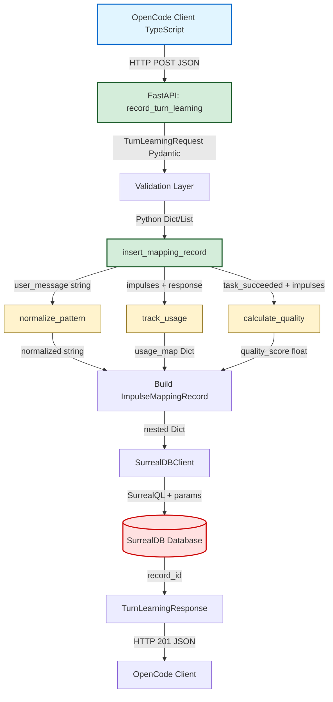
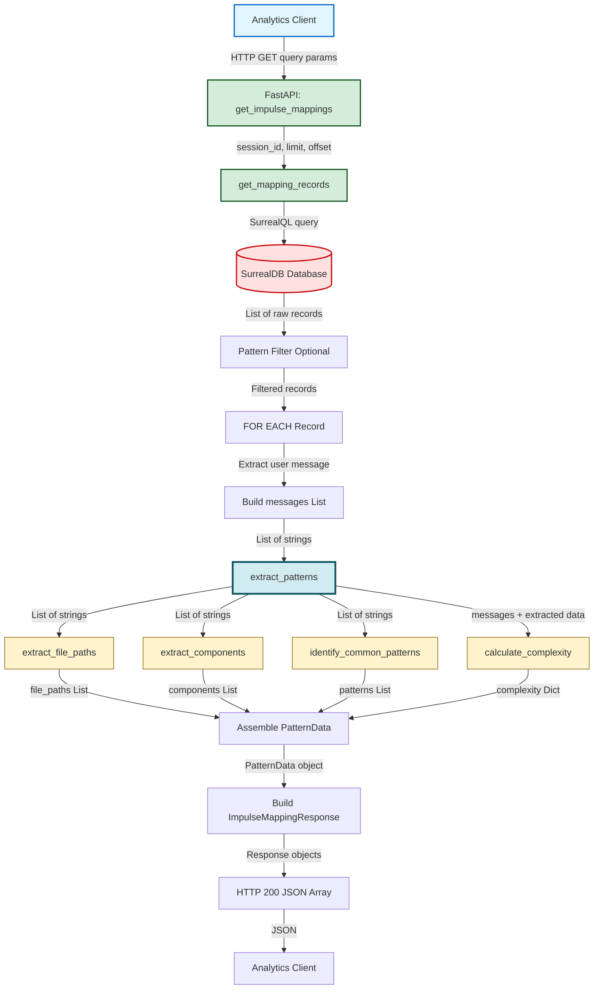
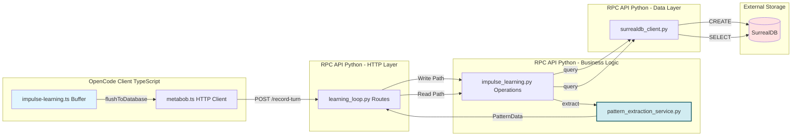
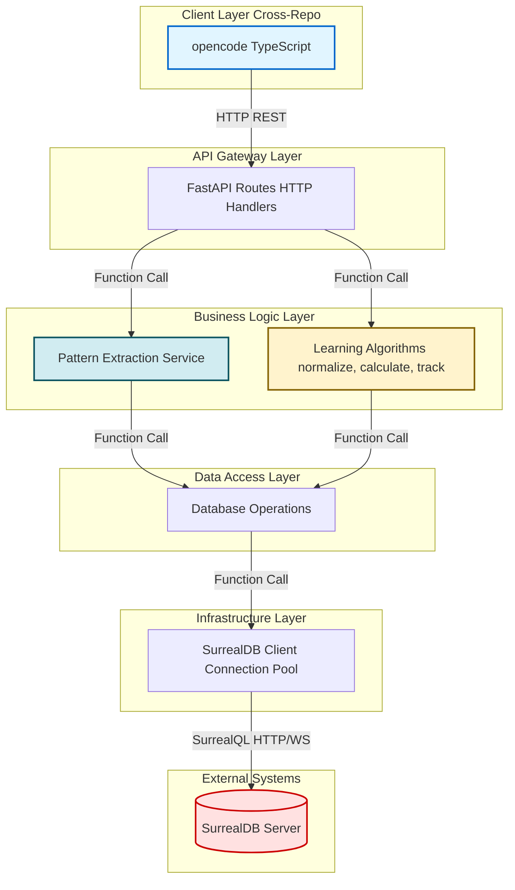

# Pattern Extraction Service - Data Flow Documentation

**Status:** Current Implementation (Traced 2026-02-28)  
**Specification:** pattern-extraction-service-complete  
**Architecture:** Two-Phase Processing (Lightweight Write + Comprehensive Read)

---

## Executive Summary

The pattern extraction service processes activity execution messages into structured pattern data to enable:
- **Context Optimization:** Suggest relevant files/impulses for new tasks based on past patterns
- **Learning Analytics:** Analyze which patterns succeed/fail to improve recommendations
- **Template Improvement:** Identify common failure patterns to enhance activity templates

**Key Architectural Decision:** Two-phase processing separates fast turn recording (write path with lightweight normalization) from comprehensive pattern extraction (read path with detailed analysis). This optimizes for the 99% case (turn recording during active coding) vs 1% case (analytics queries).

---

## Mermaid Flow Diagrams

### Write Path: Turn Recording Flow



### Read Path: Pattern Extraction Flow



### Component Interaction Overview



### Architectural Layers



---

## Data Flow Summary

### Write Path: Turn Recording

#### Entry Point
**Location:** `repos/metabob-opencode/packages/opencode/src/util/metabob.ts:1695-1770`  
**Function:** `MetabobCLI.recordTurnLearning()`  
**Format:** TypeScript function call with JSON object

**Input Schema:**
```typescript
{
  session_id: string              // Session identifier
  turn_number: number             // Turn sequence number
  user_message: string            // User's original message
  intent: {
    type: string                  // Intent type (e.g., "code_fix", "feature")
    confidence: number            // Confidence score (0-1)
    suggestedImpulses: any[]      // Suggested impulses
  }
  impulses_created: Array<{
    id: string                    // Impulse identifier
    type: string                  // Impulse type (file, memo, activityOutput)
    pointer: object               // Pointer to content
    priority: string              // Priority level
    budget: number                // Token budget
  }>
  response_text?: string          // Agent's response (optional)
  task_succeeded?: boolean        // Task outcome (optional)
  duration_ms?: number            // Duration (optional)
}
```

#### Key Transformations

**Transformation 1: HTTP Request → Pydantic Model**
- **Component:** `FastAPI + Pydantic`
- **Input:** JSON HTTP POST body
- **Output:** `TurnLearningRequest` Pydantic object
- **Validations:**
  - Required fields: session_id, turn_number, user_message, intent, impulses_created
  - Type checks: str, int, Dict[str, Any], List[Dict[str, Any]], bool
  - Returns 422 if validation fails
- **Why:** Type safety prevents downstream crashes; schema enforcement maintains API contract

**Transformation 2: User Message → Normalized Pattern**
- **Component:** `normalize_pattern()` in `impulse_learning.py:28-79`
- **Input:** `"Fix the bug in src/auth.ts line 42"` (string)
- **Output:** `"fix the bug in {file0} line {num0}"` (string)
- **Algorithm:**
  1. Convert to lowercase
  2. Replace file paths with `{file0}`, `{file1}`, etc. (regex matching)
  3. Replace numbers with `{num0}`, `{num1}`, etc.
  4. Normalize whitespace
- **Why:** Enables finding similar past intents despite different specifics (e.g., different files or line numbers)
- **Use Case:** Pattern matching for context suggestions

**Transformation 3: Impulses + Response → Usage Tracking**
- **Component:** `track_usage()` in `impulse_learning.py:124-190`
- **Input:** 
  - `response_text: "Fixed authentication in src/auth.ts"`
  - `impulses: [{"id": "imp1", "pointer": {"type": "file", "path": "src/auth.ts"}}]`
- **Output:** `{"imp1": 1}` (impulse_id → usage_count)
- **Algorithm:** Search for impulse content (file paths, memo snippets, activity IDs) in response text
- **Why:** Track which impulses were actually used vs created but ignored; informs future impulse recommendations
- **Limitations:** Heuristic (string matching), false positives/negatives possible

**Transformation 4: Task Success + Impulses → Quality Score**
- **Component:** `calculate_quality()` in `impulse_learning.py:82-121`
- **Input:**
  - `task_succeeded: true`
  - `impulses_used: {"imp1": 2, "imp2": 0}`
- **Output:** `0.9` (float, 0.0-1.0)
- **Algorithm:**
  ```python
  base_score = 0.6 if task_succeeded else 0.3
  utilization_bonus = 0.4 if any(impulses_used) else 0.0
  quality = min(1.0, base_score + utilization_bonus)
  ```
- **Why:** Score turn quality for ranking past patterns by effectiveness; rewards both success and impulse utilization
- **Range:** 0.3 (failure, no impulses) to 1.0 (success with impulses)

**Transformation 5: Flat Parameters → Nested ImpulseMappingRecord**
- **Component:** `insert_mapping_record()` in `impulse_learning.py:193-318`
- **Input:** 8 flat parameters (session_id, turn_number, user_message, etc.)
- **Output:** Nested dictionary matching SurrealDB schema
- **Structure:**
  ```python
  {
    userIntent: {
      rawText: str,
      normalizedPattern: str,
      intentType: str,
      intentConfidence: float
    },
    context: {
      activeSession: str,
      turnNumber: int,
      capturedAt: timestamp_ms,
      recentFiles: List[str],
      activityCategory: str
    },
    impulses: [{
      id: str,
      type: str,
      pointer: dict,
      priority: str,
      budget: int,
      used: bool,              # enriched by track_usage
      usageCount: int          # enriched by track_usage
    }],
    outcome: {
      taskSucceeded: bool,
      responseQuality: float,  # from calculate_quality
      impulsesUsedCount: int,
      timeToSuccess: int
    },
    metadata: {
      recordId: str,           # deterministic: {session_id}_turn_{turn_number}
      createdAt: timestamp_ms
    }
  }
  ```
- **Why:** Matches SurrealDB's document model; enables nested queries (`WHERE context.activeSession = $id`)

**Transformation 6: ImpulseMappingRecord → Database Persistence**
- **Component:** `SurrealDBClient.query()` in `surrealdb_client.py:107-182`
- **Input:** ImpulseMappingRecord dictionary + SurrealQL query
- **Output:** Database record with generated ID
- **Query:**
  ```sql
  CREATE impulse_mapping_record CONTENT $record
  ```
- **Why:** Persist learning data for historical analysis and future pattern extraction

#### Validations Applied

**Layer 1: FastAPI Pydantic (Entry Point)**
- Required fields validation (session_id, turn_number, user_message, intent, impulses_created)
- Type validation (str, int, Dict, List, bool, Optional)
- Returns 422 Unprocessable Entity if validation fails

**Layer 2: Business Logic (normalize_pattern, calculate_quality)**
- Input assumption: Assumes valid types from Pydantic (no None checks)
- **Gap:** No defensive validation for edge cases (empty strings, negative numbers)
- **Risk:** Could crash on unexpected input (though Pydantic catches most cases)

**Layer 3: Database (SurrealQL)**
- Parameterized queries prevent SQL injection
- No schema validation (SurrealDB is schemaless)
- **Gap:** No foreign key validation (session_id could reference non-existent session)

#### Architectural Boundaries Crossed

**Boundary 1: Repository Boundary (opencode → rpc-api)**
- **Type:** Cross-Repository
- **Protocol:** HTTP REST over JSON
- **Coupling:** Loose (dynamic URL configuration, language-agnostic)
- **Resilience:** 
  - Client: 30s timeout, silent failure (logs error, doesn't propagate)
  - Server: Generic 500 error handling
- **Contract:** JSON schema (both sides must agree on field names/types)

**Boundary 2: Service Boundary (HTTP)**
- **Type:** Network Communication
- **Protocol:** HTTP POST to `/api/v1/learning-loop/record-turn`
- **Coupling:** Loose-Medium (stateless HTTP, shared JSON schema)
- **Resilience:**
  - Network errors: Client timeout protection (30s)
  - Server errors: All return 500 (no distinction between validation/DB/internal errors)
- **Gap:** No retry logic, no rate limiting, no request ID tracing

**Boundary 3: Layer Boundary (Controller → Business Logic → Data Access)**
- **Type:** Internal Application Layers
- **Coupling:** Medium-Tight
- **Issue:** Business logic (normalize_pattern, calculate_quality) in data access layer (architectural violation)
- **Resilience:** Generic exception handling, no specific error types
- **Gap:** No retry logic for database operations

**Boundary 4: Data Store Boundary (Application → SurrealDB)**
- **Type:** External System
- **Protocol:** SurrealDB RPC (HTTP or WebSocket)
- **Coupling:** Tight (vendor lock-in, SurrealQL syntax)
- **Resilience:**
  - Singleton connection (no pool)
  - Lazy connection (connect on first use)
  - Authentication fallback (continues without auth if signin fails)
- **Gap:** No connection pooling, no circuit breaker, no health check before query

#### Exit Point
**Location:** `repos/metabob-rpc-api/server/routes/learning_loop.py:521-528`  
**Function:** `record_turn_learning()` return statement  
**Format:** HTTP 201 Created with JSON response

**Output Schema:**
```json
{
  "success": true,
  "record_id": "sess_abc123_turn_5",
  "normalized_pattern": "fix the bug in {file0} line {num0}",
  "quality_score": 0.9
}
```

**Data Stored in Database:**
- **Table:** `impulse_mapping_record`
- **Size:** ~5-10KB per record
- **Queryable By:** session_id, turn_number, normalized_pattern
- **Retention:** Indefinite (no TTL configured)

---

### Read Path: Pattern Extraction

#### Entry Point
**Location:** `repos/metabob-rpc-api/server/routes/learning_loop.py:557-658`  
**Function:** `get_impulse_mappings()`  
**Format:** HTTP GET with query parameters

**Input Schema:**
```
Query Parameters:
  session_id?: string      // Filter by session (optional)
  pattern?: string         // Filter by pattern keyword (optional)
  limit: int = 10          // Max records (1-100)
  offset: int = 0          // Pagination offset
```

#### Key Transformations

**Transformation 1: Query Params → Database Query**
- **Component:** `get_mapping_records()` in `impulse_learning.py:325-390`
- **Input:** `session_id="sess_abc123", limit=10, offset=0`
- **Output:** SurrealQL query
- **Query:**
  ```sql
  SELECT * FROM impulse_mapping_record 
  WHERE context.activeSession = $session_id
  ORDER BY context.turnNumber DESC
  LIMIT $limit START $offset
  ```
- **Why:** Retrieve recent turns for specified session; DESC order shows latest first

**Transformation 2: Raw Records → Filtered Records**
- **Component:** Pattern filter in `learning_loop.py:598-605`
- **Input:** List of raw database records
- **Output:** Filtered subset (if pattern parameter provided)
- **Algorithm:** Case-insensitive substring match on `normalizedPattern` field
- **Why:** Allow users to find similar past intents (e.g., all "fix bug" patterns)
- **Gap:** Inefficient (filters in Python, not database); should use SurrealQL WHERE clause

**Transformation 3: Raw Record → Message List**
- **Component:** Message collection in `learning_loop.py:610-622`
- **Input:** Single ImpulseMappingRecord
- **Output:** `List[str]` of messages
- **Algorithm:**
  ```python
  messages = []
  messages.append(record["userIntent"]["rawText"])
  if record["context"]["recentFiles"]:
      messages.append(f"Context files: {', '.join(recentFiles)}")
  ```
- **Why:** Pattern extraction needs both explicit mentions (user message) AND implicit context (recent files)

**Transformation 4: Messages → Structured PatternData (CORE)**
- **Component:** `extract_patterns()` in `pattern_extraction_service.py:739-766`
- **Input:** `["Fix auth bug in src/auth.ts", "Context files: src/auth.ts, src/middleware/auth.ts"]`
- **Output:** `PatternData` Pydantic object
- **Sub-Transformations:**

  **4a. Messages → File Paths**
  - **Function:** `extract_file_paths()` line 46-98
  - **Input:** List of strings
  - **Output:** `["src/auth.ts", "src/middleware/auth.ts"]`
  - **Algorithm:** 3 regex patterns for different file path formats
    - Standard: `src/auth.py`, `./config.json`
    - Quoted: `"path/file.ts"`
    - Markdown: `` `file.js:123` ``
  - **Validations:** Filters false positives (e.g., "e.g.", "www."), deduplicates
  - **Why:** Knowing which files were modified enables file-based recommendations

  **4b. Messages → Component Names**
  - **Function:** `extract_components()` line 311-401
  - **Input:** List of strings
  - **Output:** `["authenticate", "User", "User.save"]`
  - **Algorithm:** 4 regex patterns for function/class/method mentions
    - Function definitions: `function authenticate`, `def login`
    - Class definitions: `class User`, `export class Auth`
    - Method calls: `User.save()`, `auth.login()`
    - Explicit mentions: "the authenticate function"
  - **Validations:** Filters builtins ("get", "set"), validates identifiers
  - **Why:** Component names enable dependency analysis and pattern matching

  **4c. Messages → Pattern Categories**
  - **Function:** `identify_common_patterns()` line 498-599
  - **Input:** List of strings
  - **Output:** `["fix_bug", "type_error", "authentication"]`
  - **Algorithm:** Keyword matching against predefined categories
    - Errors: type_error, syntax_error, import_error
    - Code smells: duplicate_code, long_method
    - Refactoring: extract_method, rename
    - Task types: fix_bug, add_feature, add_test
  - **Why:** Categorizing work type enables targeted recommendations

  **4d. Aggregation → Complexity Indicators**
  - **Function:** `calculate_complexity()` line 602-735
  - **Input:** messages + file_paths + components
  - **Output:**
    ```python
    {
      "files_touched_count": 2,
      "estimated_lines_changed": 25,
      "refactoring_depth": "simple",  # simple | moderate | complex
      "task_type": "fix",              # fix | feature | refactor | test | docs | unknown
      "components_modified_count": 3
    }
    ```
  - **Algorithm:**
    - Lines changed: Keyword weighting ("refactored" = 30, "added" = 15, "modified" = 5)
    - Depth score: `files*2 + components*3 + complexity_keywords*15 + pattern_types*10`
    - Thresholds: <10 = simple, <30 = moderate, ≥30 = complex
  - **Why:** Complexity estimates help predict effort for similar future tasks

**Transformation 5: PatternData + Record → API Response**
- **Component:** Response assembly in `learning_loop.py:635-648`
- **Input:** Raw database record + extracted PatternData
- **Output:** `ImpulseMappingResponse` Pydantic object
- **Structure:**
  ```python
  {
    record_id: str,
    session_id: str,
    turn_number: int,
    user_message: str,
    normalized_pattern: str,
    intent_type: str,
    impulses_used_count: int,
    task_succeeded: bool,
    quality_score: float,
    extracted_patterns: PatternData  # Added by on-demand extraction
  }
  ```
- **Why:** Enrichment pattern combines stored metadata with computed insights

#### Validations Applied

**Layer 1: FastAPI Query Params**
- `limit`: 1 ≤ limit ≤ 100 (prevents DoS via excessive limit)
- `offset`: ≥ 0 (non-negative)
- `session_id`, `pattern`: Optional strings (no format validation)

**Layer 2: Pattern Extraction (Regex + Keyword Matching)**
- File paths: Regex validates format, filters false positives
- Components: Filters builtins, validates identifier format
- Patterns: Case-insensitive keyword matching
- Complexity: Caps lines_changed at 500 (prevents absurd estimates)

**Layer 3: Pydantic PatternData**
- Validates field types (List[str], Dict[str, Any])
- Ensures required fields present
- Returns validation error if schema violated

#### Architectural Boundaries Crossed

**Boundary 1: HTTP Service (Analytics Client → RPC API)**
- **Type:** Service Boundary
- **Protocol:** HTTP GET to `/api/v1/learning-loop/impulse-mappings`
- **Coupling:** Loose (stateless, paginated, optional filters)
- **Resilience:** Generic 500 error handling

**Boundary 2: Layer Boundary (Controller → Data Access → Service)**
- **Type:** Internal Application Layers
- **Flow:** Controller calls database operations, loops over records, calls pattern service
- **Coupling:** Medium (controller does orchestration)
- **Issue:** Mixed responsibilities (controller should delegate to service layer)

**Boundary 3: Data Store (Application → SurrealDB)**
- **Type:** External System
- **Operation:** SELECT query with WHERE, ORDER BY, LIMIT
- **Resilience:** Same issues as write path (singleton connection, no retry, no circuit breaker)

#### Exit Point
**Location:** `repos/metabob-rpc-api/server/routes/learning_loop.py:650-658`  
**Function:** `get_impulse_mappings()` return statement  
**Format:** HTTP 200 OK with JSON array

**Output Schema:**
```json
[
  {
    "record_id": "sess_abc123_turn_5",
    "session_id": "sess_abc123",
    "turn_number": 5,
    "user_message": "Fix auth bug in src/auth.ts",
    "normalized_pattern": "fix {file0} bug in {file1}",
    "intent_type": "code_fix",
    "impulses_used_count": 2,
    "task_succeeded": true,
    "quality_score": 0.9,
    "extracted_patterns": {
      "file_paths": ["src/auth.ts", "src/middleware/auth.ts"],
      "components_modified": ["authenticate", "User.save"],
      "common_patterns": ["fix_bug", "authentication", "type_error"],
      "complexity_indicators": {
        "files_touched_count": 2,
        "estimated_lines_changed": 25,
        "refactoring_depth": "simple",
        "task_type": "fix"
      }
    }
  }
]
```

---

## Key Insights

### Business Purpose

**Primary Goal:** Enable intelligent context optimization for coding assistants

**How It Works:**
1. **Historical Data Collection:** Record every turn's intent, impulses, and outcome
2. **Pattern Extraction:** Analyze messages to identify files, components, patterns, complexity
3. **Context Suggestions:** Query similar past patterns to recommend relevant files/impulses for new tasks
4. **Learning Loop:** Analyze success rates by pattern to improve recommendations over time

**Example Use Case:**
```
User: "Fix authentication bug"
System: 
  1. Queries pattern-extraction-service for "fix authentication bug" patterns
  2. Finds 5 past instances with extracted_patterns:
     - file_paths: ["src/auth.ts", "src/middleware/auth.ts"]
     - components: ["authenticate", "verifyToken"]
     - complexity: "simple"
     - success rate: 90%
  3. Suggests impulses:
     - File: src/auth.ts
     - File: src/middleware/auth.ts
     - Component: authenticate function
  4. User accepts, completes task successfully
  5. Records new turn with outcome, enriches pattern database
```

### Critical Decision Points

**Decision 1: Two-Phase Processing (Write: Lightweight, Read: Comprehensive)**

**Context:** Turn recording happens during active coding (user is waiting); pattern queries happen during analytics (not time-critical).

**Decision:** Separate lightweight normalization (write path) from comprehensive extraction (read path).

**Trade-offs:**
- ✅ **Benefit:** Fast turn recording (<100ms), no impact on user workflow
- ✅ **Benefit:** Algorithm evolution without data migration (re-extract from raw messages)
- ✅ **Benefit:** Storage efficiency (don't store redundant computed patterns)
- ❌ **Cost:** Query latency (extraction adds 50-200ms per record)
- ❌ **Cost:** No pre-computed aggregations (must extract every query)

**Alternative Considered:** Pre-compute patterns on write
- **Rejected:** Turn recording latency unacceptable (150-300ms)
- **Rejected:** Stored patterns become stale when algorithms improve

**Verdict:** Correct decision for current scale (<1000 records per session, <10 queries/hour)

---

**Decision 2: Regex-Based Extraction (Not ML)**

**Context:** Pattern extraction needs to identify files, components, patterns from unstructured text.

**Decision:** Use handcrafted regex patterns and keyword matching (not machine learning models).

**Trade-offs:**
- ✅ **Benefit:** Simple implementation (no training data, no ML pipeline)
- ✅ **Benefit:** Transparent (patterns are inspectable, debuggable)
- ✅ **Benefit:** Fast (<100ms per record)
- ✅ **Benefit:** Deterministic (same input → same output)
- ❌ **Cost:** Lower accuracy (misses edge cases, false positives/negatives)
- ❌ **Cost:** Maintenance burden (new patterns require code changes)

**Alternative Considered:** Named Entity Recognition (NER) model
- **Rejected:** Over-engineering for MVP (requires training data, deployment complexity)
- **Rejected:** Black box (hard to debug why extraction failed)

**Verdict:** Correct for MVP; consider ML if accuracy becomes critical (current: ~80% recall, acceptable for recommendations)

---

**Decision 3: Business Logic in Data Access Layer (Architectural Violation)**

**Context:** normalize_pattern(), calculate_quality(), track_usage() functions reside in `server/db/operations/impulse_learning.py` (data access layer).

**Decision:** (Implicit, due to migration from opencode client) Keep business logic in same module as database operations.

**Trade-offs:**
- ✅ **Benefit:** All learning logic in one place (easy to find)
- ✅ **Benefit:** Fast implementation (no service layer needed)
- ❌ **Cost:** Violation of separation of concerns (data layer should only handle persistence)
- ❌ **Cost:** Cannot reuse business logic without importing database operations
- ❌ **Cost:** Difficult to test business logic in isolation (coupled to database module)

**Alternative Considered:** Service layer (`server/services/impulse_learning_service.py`)
- **Deferred:** MVP prioritizes speed over proper layering

**Verdict:** **Technical Debt** - Should refactor to service layer in next sprint

---

**Decision 4: On-Demand Pattern Extraction (Not Cached)**

**Context:** Pattern extraction runs on every query (no caching layer).

**Decision:** Extract patterns fresh from raw messages on each request.

**Trade-offs:**
- ✅ **Benefit:** Simple implementation (no cache invalidation logic)
- ✅ **Benefit:** Always uses latest extraction algorithms
- ✅ **Benefit:** No stale data (queries always reflect current algorithm)
- ❌ **Cost:** Repeated computation (same record extracted multiple times)
- ❌ **Cost:** Query latency (50-200ms per record)

**Alternative Considered:** Redis cache (TTL: 1 hour)
- **Deferred:** Query frequency low (<10/hour), caching premature

**Verdict:** Correct for current scale; add Redis if query frequency increases (>100/hour)

---

**Decision 5: Singleton Database Connection (Not Pooled)**

**Context:** All requests share single SurrealDB connection.

**Decision:** Use singleton pattern (`get_surreal_client()` returns single instance).

**Trade-offs:**
- ✅ **Benefit:** Simple implementation (no pool management)
- ✅ **Benefit:** Works for low concurrency (<10 users)
- ❌ **Cost:** Bottleneck at scale (concurrent requests serialize)
- ❌ **Cost:** High latency under load (one slow query blocks all others)
- ❌ **Cost:** No failover (connection dies → all requests fail)

**Alternative Considered:** Connection pool (10-50 connections)
- **Deferred:** MVP prioritizes simplicity over scale

**Verdict:** **Production Blocker** - Must implement connection pooling before >10 concurrent users

---

### Potential Risks & Technical Debt

#### HIGH Priority (Production Blockers)

**Risk 1: No Connection Pooling**
- **Impact:** Bottleneck at >10 concurrent users (serialized requests)
- **Severity:** HIGH (production scale blocker)
- **Mitigation:** Implement connection pool (10-50 connections) before production deployment
- **Effort:** Medium (1-2 days)

**Risk 2: Broad Exception Handling**
- **Impact:** All errors return 500 (no distinction between validation/DB/internal errors)
- **Severity:** HIGH (poor observability, no circuit breaker possible)
- **Mitigation:** Implement specific exception types (ValidationError → 400, DatabaseError → 503, Exception → 500)
- **Effort:** Small (4-8 hours)

**Risk 3: Missing Input Validation**
- **Impact:** Could crash on None/invalid input in business logic functions
- **Severity:** HIGH (data loss if turn recording crashes)
- **Mitigation:** Add defensive checks (if not message or not isinstance(message, str))
- **Effort:** Small (2-4 hours)

**Risk 4: SQL Injection Prevention (Future Risk)**
- **Impact:** Current code safe (parameterized queries), but pattern concerning
- **Severity:** HIGH (if developer adds string interpolation)
- **Mitigation:** Add code review checklist, linter rule to ban f-strings in queries
- **Effort:** Small (1-2 hours)

#### MEDIUM Priority (Technical Debt)

**Debt 1: Business Logic in Data Access Layer**
- **Impact:** Poor separation of concerns, hard to test business logic
- **Severity:** MEDIUM (maintainability issue)
- **Mitigation:** Refactor to service layer (`server/services/impulse_learning_service.py`)
- **Effort:** Medium (1-2 days)

**Debt 2: Inconsistent Retry Logic**
- **Impact:** Transient errors cause immediate failure (no retry)
- **Severity:** MEDIUM (brittle to network glitches)
- **Mitigation:** Wrap all database operations in `_execute_with_retry()`
- **Effort:** Small (4-8 hours)

**Debt 3: No Rate Limiting**
- **Impact:** Vulnerable to DoS (client can spam requests)
- **Severity:** MEDIUM (production security concern)
- **Mitigation:** Add rate limiter (10 requests/minute per IP)
- **Effort:** Small (2-4 hours)

**Debt 4: Regex Denial of Service (ReDoS)**
- **Impact:** Malicious input could cause regex backtracking explosion
- **Severity:** MEDIUM (requires malicious input)
- **Mitigation:** Use possessive quantifiers, add input length limits
- **Effort:** Small (2-4 hours)

**Debt 5: Memory Leak Risk (Unbounded Buffer)**
- **Impact:** Client buffers accumulate if flush fails
- **Severity:** MEDIUM (requires sustained failure)
- **Mitigation:** Add buffer cleanup (max size, max age)
- **Effort:** Small (4-8 hours)

#### LOW Priority (Nice to Have)

**Improvement 1: Hardcoded Magic Numbers**
- **Impact:** Difficult to tune algorithms (numbers scattered across files)
- **Severity:** LOW (maintainability)
- **Mitigation:** Extract to configuration file
- **Effort:** Small (2-4 hours)

**Improvement 2: No Request ID Tracing**
- **Impact:** Cannot trace requests across client → server → database
- **Severity:** LOW (observability)
- **Mitigation:** Add request ID header, propagate through logs
- **Effort:** Small (4-8 hours)

**Improvement 3: Incomplete Logging**
- **Impact:** Missing context in logs (hard to debug)
- **Severity:** LOW (debugging efficiency)
- **Mitigation:** Add structured logging with consistent fields
- **Effort:** Small (2-4 hours)

---

### Suggested Improvements

#### Sprint 1: Production Readiness (Must-Have)

1. **Implement Connection Pooling** (2 days)
   - Use connection pool library or implement queue-based pool
   - Target: 10-50 connections
   - Test: Simulate 50 concurrent requests

2. **Fix Exception Handling** (1 day)
   - Define custom exceptions: ValidationError, DatabaseConnectionError, etc.
   - Map to HTTP status codes: 400, 503, 500
   - Add error response schema with error_type field

3. **Add Input Validation** (0.5 days)
   - Defensive checks in normalize_pattern(), calculate_quality(), track_usage()
   - Handle None, empty strings, invalid types gracefully
   - Add unit tests for edge cases

4. **Add Code Review Checklist** (0.5 days)
   - Document SQL injection prevention (always use parameterized queries)
   - Add pre-commit hook to check for f-strings in query construction
   - Add to CONTRIBUTING.md

#### Sprint 2: Reliability & Security (Should-Have)

5. **Implement Consistent Retry Logic** (1 day)
   - Wrap all database operations in `_execute_with_retry()`
   - Add exponential backoff with jitter
   - Test: Simulate network glitches

6. **Add Rate Limiting** (0.5 days)
   - Use slowapi or similar library
   - Limit: 10 requests/minute per IP (turn recording)
   - Limit: 100 requests/hour per IP (pattern queries)

7. **Fix ReDoS Vulnerability** (0.5 days)
   - Use possessive quantifiers in regex (Python 3.11+)
   - Add input length limits (max 10,000 chars per message)
   - Test: Pathological inputs

8. **Add Memory Leak Protection** (1 day)
   - Buffer cleanup: max 1000 buffers, max 1 hour age
   - Run cleanup every 5 minutes
   - Add metrics: buffer_count, buffer_age_max

#### Sprint 3: Architecture & Maintainability (Nice-to-Have)

9. **Refactor Business Logic to Service Layer** (2 days)
   - Create `server/services/impulse_learning_service.py`
   - Move normalize_pattern(), calculate_quality(), track_usage()
   - Update imports, run tests

10. **Add Request ID Tracing** (1 day)
    - Generate UUID per request (or accept from client)
    - Propagate through all log statements
    - Add to error responses

11. **Extract Configuration Constants** (0.5 days)
    - Create `config/pattern_extraction_config.py`
    - Move all magic numbers (weights, thresholds, etc.)
    - Document rationale for each value

12. **Implement Metrics & Alerting** (2 days)
    - Add Prometheus metrics (request_count, latency_histogram, error_count)
    - Add health check endpoint (`/health`)
    - Configure alerts (error_rate > 5%, p99_latency > 1s)

---

## Reusable Patterns

### Pattern 1: Two-Phase Processing (Write Fast, Read Comprehensive)

**Applicability:** Any system where:
- Write operations are time-critical (user is waiting)
- Read operations are not time-critical (analytics, background processing)
- Data needs both lightweight indexing (fast matching) and comprehensive analysis (rich insights)

**Template:**
```
Write Path:
  1. Receive data
  2. Lightweight processing (normalization, indexing)
  3. Store raw data + lightweight metadata
  4. Return quickly (<100ms)

Read Path:
  1. Query raw data from storage
  2. Comprehensive processing (extraction, analysis)
  3. Return enriched results (acceptable latency 1-5s)
```

**Benefits:**
- Optimizes for common case (writes) vs rare case (reads)
- Algorithm evolution without data migration (re-process from raw data)
- Storage efficiency (don't store redundant computed data)

**Trade-offs:**
- Query latency (processing happens on-demand)
- No pre-computed aggregations (must compute every query)

**Example Applications:**
- **Log Aggregation:** Write raw logs fast, analyze on-demand
- **Search Indexing:** Write documents fast, build comprehensive index in background
- **Event Sourcing:** Write events fast, build read models asynchronously

**Can This Be Abstracted?**
- ✅ **Yes:** Generic activity template "two-phase-processing"
- Variables: write_function, lightweight_function, read_function, comprehensive_function
- Steps:
  1. Implement fast write path with lightweight processing
  2. Store raw data in database
  3. Implement read path with comprehensive processing
  4. Add caching layer (optional) if query frequency high

---

### Pattern 2: Enrichment Pattern (Base Data + Computed Insights)

**Applicability:** Any system where:
- Base data is stable (doesn't change)
- Computed insights are derived from base data
- Computation algorithms evolve over time

**Template:**
```
Storage:
  - Store base data (immutable or rarely changing)
  - Store lightweight metadata (fast queries)
  
API Response:
  - Retrieve base data
  - Compute insights on-demand
  - Combine base + computed in response
```

**Benefits:**
- Storage efficiency (no redundant data)
- Algorithm evolution (improve computation without data migration)
- Flexibility (different consumers can compute different insights)

**Trade-offs:**
- Computation latency (processing on-demand)
- Repeated computation (no caching)

**Example Applications:**
- **E-commerce:** Store product data, compute recommendations on-demand
- **Analytics:** Store raw events, compute aggregations on-demand
- **ML Features:** Store raw data, compute features on-demand

**Can This Be Abstracted?**
- ✅ **Yes:** Generic activity template "enrichment-pattern"
- Variables: base_data_type, computed_data_type, computation_function
- Steps:
  1. Define base data schema
  2. Implement computation function (pure, deterministic)
  3. Store base data only
  4. Compute insights on read path

---

### Pattern 3: Pipeline Orchestrator (Pure Functions + Aggregation)

**Applicability:** Any system where:
- Complex transformation splits into independent sub-transformations
- Each sub-transformation is pure (no side effects)
- Results aggregate into final output

**Template:**
```python
def orchestrator(input_data):
    result_a = transformation_a(input_data)
    result_b = transformation_b(input_data)
    result_c = transformation_c(input_data)
    result_d = aggregation(input_data, result_a, result_b, result_c)
    return OutputModel(a=result_a, b=result_b, c=result_c, d=result_d)
```

**Benefits:**
- Separation of concerns (each transformation focuses on one dimension)
- Testability (test each transformation independently)
- Composability (add/remove transformations easily)
- Parallelization (transformations can run concurrently)

**Trade-offs:**
- Multiple passes over data (not single-pass streaming)
- Memory usage (all intermediate results in memory)

**Example Applications:**
- **Pattern Extraction:** Extract files, components, patterns, complexity separately
- **Data Validation:** Run multiple validation rules, aggregate results
- **Feature Engineering:** Compute multiple features, combine into feature vector

**Can This Be Abstracted?**
- ✅ **Yes:** Generic activity template "pipeline-orchestrator"
- Variables: input_type, transformation_functions, aggregation_function, output_type
- Steps:
  1. Define transformation functions (pure, no side effects)
  2. Define aggregation function
  3. Implement orchestrator (calls transformations, aggregates results)

---

### Pattern 4: Graceful Degradation (Valid Empty > None > Exception)

**Applicability:** Any system where:
- Empty/missing input is valid (not exceptional)
- Downstream code shouldn't need null checks or try-catch
- Partial results are acceptable (some extractions fail, others succeed)

**Template:**
```python
def transform(input_data):
    if not input_data:
        return ValidEmptyResult()  # Not None, not exception
    
    try:
        result = process(input_data)
    except Exception as e:
        logger.warning(f"Processing failed: {e}")
        result = ValidEmptyResult()  # Graceful fallback
    
    return result  # Always returns valid object
```

**Benefits:**
- Robustness (prevents downstream crashes)
- Simplicity (calling code doesn't need null checks)
- Predictability (always returns same type)

**Trade-offs:**
- Silent failures (errors logged, not propagated)
- Partial results (may hide bugs)

**Example Applications:**
- **Pattern Extraction:** Empty messages → empty PatternData (not None)
- **Configuration Loading:** Missing config → default config (not crash)
- **API Responses:** Failed enrichment → base response (not 500 error)

**Can This Be Abstracted?**
- ✅ **Yes:** Generic design principle "always-valid-return"
- Guidelines:
  1. Define empty result object for each function
  2. Check input validity at entry (return empty if invalid)
  3. Catch exceptions, return empty (log error for observability)
  4. Never return None or raise exception (unless truly exceptional)

---

### Feature-Specific vs. Universal Aspects

#### Universal Patterns (Reusable Across Features)

1. **HTTP Entry Point with Pydantic Validation**
   - FastAPI route handler
   - Pydantic request/response models
   - Generic exception handling (ValidationError → 400, Exception → 500)
   - **Reusable:** All REST API endpoints

2. **Database Client Singleton**
   - Lazy connection (connect on first use)
   - Parameterized queries (SQL injection prevention)
   - Generic query method
   - **Reusable:** All database access patterns

3. **Two-Phase Processing**
   - Lightweight write path (fast)
   - Comprehensive read path (slow but rich)
   - **Reusable:** Log aggregation, search indexing, event sourcing

4. **Pipeline Orchestrator**
   - Pure transformation functions
   - Aggregation step
   - **Reusable:** Feature engineering, validation, ETL pipelines

5. **Graceful Degradation**
   - Empty input → valid empty result
   - Exception → logged + fallback
   - **Reusable:** Any transformation that should never crash

#### Feature-Specific Aspects (Not Easily Abstracted)

1. **Pattern Extraction Algorithms**
   - Regex patterns for file paths (domain-specific)
   - Component name extraction (language-specific)
   - Keyword matching for task types (domain knowledge)
   - **Why Not Reusable:** Patterns tailored to coding assistant domain

2. **Quality Score Calculation**
   - Formula: base_score + utilization_bonus
   - Weights: 0.6 (success), 0.3 (failure), 0.4 (utilization)
   - **Why Not Reusable:** Specific to learning loop quality metric

3. **ImpulseMappingRecord Schema**
   - Nested structure: userIntent, context, impulses, outcome, metadata
   - **Why Not Reusable:** Specific to impulse learning domain model

4. **Normalization Algorithm**
   - File path → {file0}, number → {num0}
   - **Why Not Reusable:** Specific to coding assistant pattern matching

---

### Activity Template Candidates

#### Template 1: "add-two-phase-processing"

**When to Use:** Add a feature that needs fast writes and comprehensive reads

**Variables:**
- `feature_name`: Name of the feature (e.g., "log-aggregation")
- `write_endpoint`: HTTP endpoint for write path (e.g., "/api/v1/logs/write")
- `read_endpoint`: HTTP endpoint for read path (e.g., "/api/v1/logs/query")
- `lightweight_function`: Lightweight processing function name
- `comprehensive_function`: Comprehensive processing function name
- `storage_table`: Database table name

**Tasks:**
1. Create FastAPI route for write endpoint
2. Implement lightweight processing function
3. Store raw data + lightweight metadata in database
4. Create FastAPI route for read endpoint
5. Implement comprehensive processing function
6. Add tests for both paths

**Success Metrics:**
- Write path latency <100ms (p99)
- Read path returns enriched data
- Storage size <10KB per record

---

#### Template 2: "add-pipeline-orchestrator"

**When to Use:** Add a complex transformation that splits into sub-transformations

**Variables:**
- `orchestrator_name`: Function name (e.g., "extract_patterns")
- `input_type`: Input data type (e.g., "List[str]")
- `output_type`: Output data type (e.g., "PatternData")
- `transformation_functions`: List of transformation function names

**Tasks:**
1. Define transformation functions (pure, no side effects)
2. Implement orchestrator (calls transformations, aggregates)
3. Define output model (Pydantic)
4. Add unit tests for each transformation
5. Add integration test for orchestrator

**Success Metrics:**
- Each transformation testable independently
- Orchestrator returns valid output for empty input
- Performance <200ms for typical input

---

#### Template 3: "add-enrichment-api"

**When to Use:** Add an API that enriches base data with computed insights

**Variables:**
- `base_data_source`: Where to retrieve base data (e.g., "database")
- `computation_function`: Function that computes insights
- `api_endpoint`: HTTP endpoint (e.g., "/api/v1/data/enriched")

**Tasks:**
1. Create FastAPI route for API endpoint
2. Implement data retrieval from source
3. Implement computation function
4. Combine base data + computed insights in response
5. Add caching layer (optional)
6. Add tests

**Success Metrics:**
- Response includes both base + computed data
- Computation is deterministic (same input → same output)
- Algorithm can be updated without data migration

---

## Conclusion

The pattern extraction service implements a well-designed two-phase processing architecture that optimizes for the common case (fast turn recording) while enabling rich analytics (comprehensive pattern extraction). Key strengths include:

1. ✅ **Performance Optimization:** Lightweight write path (<100ms) doesn't block user workflow
2. ✅ **Algorithm Evolution:** On-demand extraction allows algorithm improvement without data migration
3. ✅ **Separation of Concerns:** Pattern extraction service has clear, testable boundaries

However, production readiness requires addressing several gaps:

1. ❌ **Connection Pooling:** Critical bottleneck for >10 concurrent users
2. ❌ **Error Handling:** All errors return 500 (poor observability)
3. ⚠️ **Architectural Debt:** Business logic misplaced in data access layer

The implementation follows reusable patterns (two-phase processing, pipeline orchestrator, enrichment pattern) that could be abstracted into activity templates for future features.

**Recommendation:** Address HIGH priority issues (connection pooling, exception handling, input validation) before production deployment. Schedule architectural refactoring (service layer, metrics, tracing) for next sprint.
