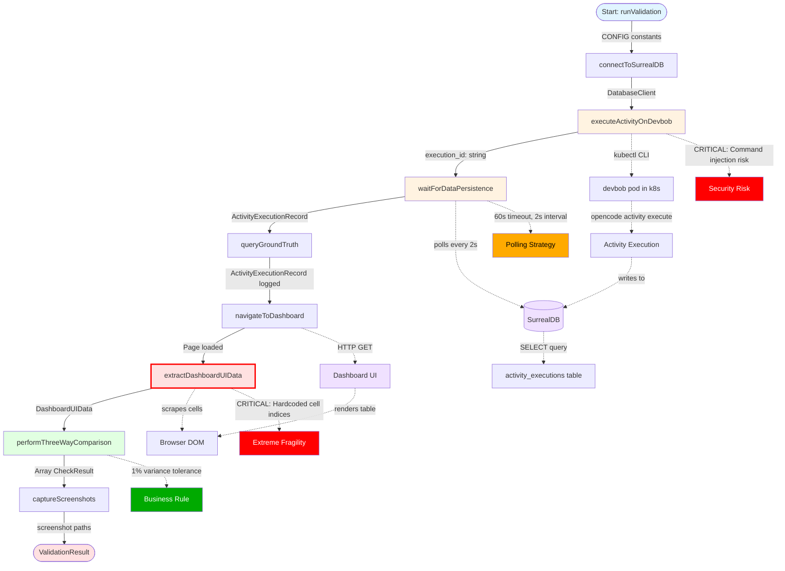

# Data Flow Documentation: playwright-validation-workflow

**Feature**: Playwright Validation Workflow
**Purpose**: Three-way validation ensuring activity system deployments accurately track and display activity executions
**Status**: ✅ Implemented | ⚠️ Production-Ready with Critical Issues
**Last Updated**: 2026-03-16

---

## Executive Summary

The Playwright validation workflow is an end-to-end test harness that validates the complete activity execution pipeline by tracing a real activity through three layers:

1. **Execution Layer** (devbob in Kubernetes)
2. **Persistence Layer** (SurrealDB)
3. **Display Layer** (Dashboard UI)

**Business Value**: Ensures users see accurate activity costs, durations, and status in the dashboard, enabling informed financial and performance decisions.

**Critical Path**: Test harness → kubectl exec → devbob pod → OpenCode CLI → activity execution → SurrealDB persistence → Dashboard UI → Browser scraping → Data comparison

**Validation Criteria**: ALL checks must pass (execution ID match, template name match, status match, cost variance ≤1%, duration variance ≤1%, token accuracy, task count match, impulse refs preserved) AND zero JavaScript console errors.

---

## Mermaid Flow Diagram



### Flow Diagram Legend

- **Blue boxes**: Entry/Exit points
- **Orange boxes**: Kubernetes/External service boundaries
- **Red outline**: Critical fragility point
- **Green box**: Core business logic
- **Purple cylinders**: Data stores
- **Dotted lines**: External system calls or side effects

---

## Data Flow Summary

### Entry Point
**Location**: `tests/validation-harnesses/playwright-dashboard-data-accuracy-validation-harness.ts:649`
**Function**: `runValidation()`
**Input**: None (uses CONFIG constants)
**Format**: Configuration object with URLs, timeouts, test template parameters
```typescript
CONFIG = {
  devbobUrl: 'http://devbob.metabob.local',
  dashboardUrl: 'http://app.metabob.local',
  surrealdbUrl: 'ws://surrealdb.metabob.local:8000/rpc',
  surrealdbNs: 'metabob',
  surrealdbDb: 'metabob',
  kubectlNamespace: 'metabob',
  devbobPodSelector: 'app=devbob',
  costVariancePercent: 1,
  durationVariancePercent: 1,
  activityExecutionTimeout: 120000,
  dataPersistenceTimeout: 60000,
  dashboardLoadTimeout: 10000,
  testTemplateName: 'add-rest-endpoint',
  testTemplateVariables: {
    method: 'POST',
    path: '/api/validation-test',
    description: 'Test endpoint for three-way validation',
  },
}
```

### Key Transformations

#### Transformation 1: Variables Object → CLI Arguments
**Component**: `executeActivityOnDevbob()`
**Input**: `{ method: "POST", path: "/api/test" }`
**Output**: `'--var method="POST" --var path="/api/test"'`
**Purpose**: Convert JavaScript object to OpenCode CLI arguments
**Risk**: ⚠️ Command injection vulnerability (no escaping)

#### Transformation 2: kubectl Output → Execution ID
**Component**: `executeActivityOnDevbob()`
**Input**: JSON stdout from OpenCode CLI
```json
{
  "execution_id": "act_abc123",
  "status": "completed",
  "duration_ms": 45000,
  "cost_usd": 0.0234
}
```
**Output**: `"act_abc123"`
**Resilience**: Fallback field names (`execution_id || activity_id || id`)

#### Transformation 3: Polling → Ground Truth Record
**Component**: `waitForDataPersistence()`
**Input**: `{ db: DatabaseClient, executionId: "act_abc123" }`
**Output**: Full `ActivityExecutionRecord`
**Mechanism**: Polls SurrealDB every 2 seconds for 60 seconds until `status='completed'` or `duration_ms > 0`
**Schema**:
```typescript
interface ActivityExecutionRecord {
  execution_id: string;
  session_id?: string;
  template_name?: string;
  status: 'running' | 'completed' | 'failed';
  duration_ms: number;
  cost_usd: number;
  tokens_used: { input: number; output: number; cache: number };
  task_count?: number;
  impulse_refs?: string[];
  // ... 9 more fields
}
```

#### Transformation 4: HTML Cells → Structured Data
**Component**: `extractDashboardUIData()`
**Input**: Browser DOM with table cells
**Output**: Parsed `DashboardUIData`
**Critical Transformations**:
- Duration: `"1.5s"` → `1500` (milliseconds)
- Cost: `"$0.0234"` → `0.0234` (number)
- Tokens: `"12,500"` → `12500` (integer)
- Status: `CheckCircleIcon` → `'completed'`

**Parsing Functions**:
```typescript
parseDuration("1.5s") → 1500
parseCost("$0.0234") → 0.0234
parseTokens("12,500") → 12500
```

#### Transformation 5: Ground Truth + UI Data → Validation Checks
**Component**: `performThreeWayComparison()`
**Input**: `{ groundTruth: ActivityExecutionRecord, uiData: DashboardUIData }`
**Output**: `Array<CheckResult>` (8 checks)
**Logic**:
```typescript
// Exact matches
✓ Execution ID matches exactly
✓ Template name matches exactly
✓ Status matches exactly
✓ Task count matches exactly
✓ Impulse refs count matches exactly

// Variance checks (1% tolerance)
✓ Cost variance ≤ 1%
✓ Duration variance ≤ 1%
✓ Tokens total accurate (sum of input+output+cache)
```

### Validation Rules Enforced

#### Input Validation
- ❌ **No CONFIG validation** - URLs, timeouts, variance percentages not validated
- ❌ **No runtime schema validation** - Type assertions without Zod/validation
- ⚠️ **Parsing returns 0 on failure** - Ambiguous error signal

#### Business Rule Validation
- ✅ **1% variance tolerance** for costs and durations
  - Example: $0.0234 (DB) vs $0.0235 (UI) = 0.43% → PASS
  - Example: $0.0234 (DB) vs $0.0250 (UI) = 6.8% → FAIL
- ✅ **Exact match required** for execution ID, template name, status, counts
- ✅ **Zero console errors** - JavaScript errors fail validation

#### Data Quality Validation
- ✅ **Completion detection** - Multiple criteria (`status='completed'` OR `duration_ms > 0`)
- ✅ **Cell count check** - Requires ≥9 cells in table row
- ⚠️ **No cell content validation** - Doesn't verify duration is in expected cell

### Architectural Boundaries Crossed

#### Boundary 1: Test Harness → Kubernetes (kubectl)
**Type**: Infrastructure Control Plane
**Protocol**: Shell command execution
**Risk**: 🔴 **CRITICAL** - Command injection, tight kubectl coupling
**Contract**:
```bash
kubectl get pods -n metabob -l app=devbob -o jsonpath='{.items[0].metadata.name}'
kubectl exec -n metabob ${podName} -- /app/bin/opencode activity execute ...
```
**Coupling**: VERY TIGHT
- Hardcoded namespace, pod selector, binary path
- No retry logic, no health checks
- Assumes kubectl in PATH and configured

#### Boundary 2: Test Harness → SurrealDB (HTTP)
**Type**: Data Store Access
**Protocol**: HTTP POST with custom headers
**Risk**: 🟡 **MEDIUM** - SQL injection risk, no schema versioning
**Contract**:
```http
POST /sql HTTP/1.1
Host: surrealdb.metabob.local:8000
NS: metabob
DB: metabob
Content-Type: application/json

{
  "query": "SELECT * FROM activity_executions WHERE execution_id = $execution_id",
  "vars": { "execution_id": "act_abc123" }
}
```
**Coupling**: MEDIUM-TIGHT
- Nested array unwrapping specific to SurrealDB
- No ORM or query builder
- No timeout on individual queries

#### Boundary 3: Test Harness → Dashboard UI (Browser)
**Type**: HTTP/Browser Interface
**Protocol**: HTTP GET + DOM scraping
**Risk**: 🔴 **CRITICAL** - Extremely fragile UI coupling
**Contract**: Assumes specific HTML structure:
```html
<table>
  <tbody>
    <tr>
      <td>Expand</td>
      <td><svg data-testid="CheckCircleIcon"/></td>
      <td>Template Name</td>
      <td>Execution ID</td>
      <td>Timestamp</td>
      <td>Duration</td>  <!-- cells[5] -->
      <td>Cost</td>      <!-- cells[6] -->
      <td>Tokens</td>    <!-- cells[7] -->
      <td>Tasks</td>     <!-- cells[8] -->
    </tr>
  </tbody>
</table>
```
**Coupling**: EXTREMELY TIGHT
- Hardcoded cell indices (magic numbers)
- Material-UI icon dependency
- No semantic selectors (`data-testid`)
- Any UI refactoring breaks extraction

#### Boundary 4: Test Harness → Local Filesystem (Screenshots)
**Type**: File I/O
**Protocol**: Node.js fs/promises API
**Risk**: 🟢 **LOW** - Loose coupling, optional
**Contract**:
```
screenshots/playwright-validation-list-{execution_id}.png
screenshots/playwright-validation-expanded-{execution_id}.png
```
**Coupling**: LOOSE
- Cross-platform paths
- Screenshots optional (test passes if screenshots fail)

### Exit Point
**Location**: `tests/validation-harnesses/playwright-dashboard-data-accuracy-validation-harness.ts:741`
**Function**: `runValidation()` return
**Output**: `ValidationResult`
**Format**:
```typescript
interface ValidationResult {
  pass: boolean;                      // Overall pass/fail
  execution_id: string;               // Activity that was validated
  groundTruth: ActivityExecutionRecord | null;
  uiData: DashboardUIData | null;
  checks: Array<{
    name: string;
    pass: boolean;
    expected: any;
    actual: any;
    variance?: number;
    tolerance?: number;
  }>;
  screenshots: {
    dashboardList?: string;
    dashboardExpanded?: string;
  };
  errors: string[];                   // Caught exceptions
  consoleErrors: string[];            // Browser console errors
  timestamp: string;                  // ISO 8601
}
```

**Usage**: Playwright test assertions
```typescript
test('Playwright Dashboard Data Accuracy Validation', async () => {
  const result = await runValidation();
  
  expect(result.pass).toBe(true);
  expect(result.checks.filter(c => c.pass).length).toBe(result.checks.length);
  expect(result.consoleErrors.length).toBe(0);
});
```

---

## Key Insights

### Business Purpose

**Primary Goal**: Validate end-to-end data accuracy in the activity execution system to ensure users can trust dashboard metrics for financial and performance decisions.

**Why This Matters**:
- Users make **financial decisions** based on activity costs displayed in dashboard
- Users assess **performance** based on durations displayed in dashboard
- Users track **success rates** based on status displayed in dashboard
- Incorrect data → bad decisions → lost money or wasted time

**Three-Way Validation Rationale**:
1. **Database could be wrong** → devbob writes incorrect data
2. **UI could be wrong** → dashboard displays incorrect data even if database correct
3. **Both could be wrong** → need to validate entire pipeline

**1% Tolerance Rationale**:
- **Too strict (0.1%)**: False failures on legitimate rounding ($0.0234 → $0.02)
- **Too loose (5%)**: Miss significant discrepancies ($0.10 vs $0.105)
- **1% is business sweet spot**: Catch real bugs, tolerate display formatting

### Critical Decision Points

#### Decision 1: Sequential vs Parallel Execution
**Chosen**: Sequential orchestration
**Rationale**: 
- Each step depends on previous step's output (execution_id needed for queries)
- Database polling requires execution to complete first
- UI navigation requires execution_id to find row

**Trade-off**:
- ✅ Simpler implementation
- ✅ Clear dependency chain
- ❌ Slower (~3 minutes total)
- ❌ Single failure point

**Alternative**: Parallel screenshot capture while polling
- Could save ~10-20 seconds
- Not implemented (premature optimization)

#### Decision 2: kubectl CLI vs Kubernetes SDK
**Chosen**: kubectl CLI with shell command construction
**Rationale**:
- ✅ Simpler (no k8s SDK dependency)
- ✅ Works with any kubectl version
- ✅ Faster to implement

**Trade-off**:
- ✅ No complex library setup
- ❌ **Command injection risk** (SECURITY)
- ❌ Shell parsing fragility
- ❌ No retry logic built-in

**Alternative**: @kubernetes/client-node library
- ✅ Type-safe API calls
- ✅ Built-in retries
- ✅ No command injection
- ❌ More complex setup
- ❌ Requires k8s version compatibility

**Recommendation**: **Migrate to Kubernetes SDK** (security > simplicity)

#### Decision 3: DOM Scraping vs API Endpoint
**Chosen**: DOM scraping with Playwright
**Rationale**:
- ✅ Validates actual user experience
- ✅ Catches JavaScript rendering errors
- ✅ No API endpoint implementation required

**Trade-off**:
- ✅ Tests what users see
- ❌ **EXTREMELY FRAGILE** (hardcoded cell indices)
- ❌ Breaks on any UI refactoring
- ❌ Tight coupling to UI structure

**Alternative**: Dashboard API endpoint `/api/activity-executions/:id`
- ✅ Stable contract
- ✅ No UI coupling
- ✅ Easier to version
- ❌ Doesn't validate rendering
- ❌ Requires backend implementation

**Recommendation**: **Dual approach**
1. Add API endpoint for data validation
2. Keep DOM scraping for rendering validation
3. Add `data-testid` attributes to eliminate cell indices

#### Decision 4: Polling vs Event-Driven
**Chosen**: Polling every 2 seconds for 60 seconds
**Rationale**:
- ✅ Simple implementation
- ✅ Works with any database
- ✅ Tolerates transient errors

**Trade-off**:
- ✅ No WebSocket/SSE setup
- ❌ Inefficient (30 queries for slow activity)
- ❌ Race condition (could miss completion)
- ❌ Fixed interval (no backoff)

**Alternative**: SurrealDB LIVE queries (event-driven)
- ✅ Real-time notification on data change
- ✅ More efficient
- ❌ Requires WebSocket connection
- ❌ More complex error handling

**Recommendation**: **Add exponential backoff** to polling (low-hanging fruit)

#### Decision 5: Fail-Fast vs Partial Pass
**Chosen**: Fail-fast (ALL checks must pass)
**Rationale**:
- ✅ Any discrepancy indicates bug
- ✅ Clear pass/fail signal
- ✅ No ambiguity

**Trade-off**:
- ✅ Strict validation
- ❌ Single minor issue fails entire test
- ❌ No partial results
- ❌ Can't distinguish critical vs minor failures

**Alternative**: Severity levels (CRITICAL, WARNING, INFO)
- ✅ Flexible validation
- ✅ Can pass with warnings
- ❌ More complex logic
- ❌ Could hide real issues

**Recommendation**: **Keep fail-fast** for deployment validation (correctness > flexibility)

### Potential Risks & Technical Debt

#### 🔴 CRITICAL RISKS (Must Fix Before Production)

##### Risk 1: Command Injection Vulnerability
**Location**: `executeActivityOnDevbob()` Line 182-184
**Impact**: Arbitrary code execution in devbob pod
**Likelihood**: Medium (requires malicious test input)
**Severity**: CRITICAL
**Example Attack**:
```typescript
variables = { "key; rm -rf /": "value" }
// Becomes: --var key; rm -rf /="value"
```
**Mitigation**:
```typescript
// Option 1: Use shell-escape library
import shellescape from 'shell-escape';
const escapedValue = shellescape([value])[0];

// Option 2: Replace kubectl with Kubernetes client library (RECOMMENDED)
```

##### Risk 2: Hardcoded Cell Indices (Silent Failures)
**Location**: `extractDashboardUIData()` Line 373-400
**Impact**: Wrong data extracted → false positives
**Likelihood**: HIGH (UI refactoring is common)
**Severity**: CRITICAL
**Failure Scenario**:
```
1. Dashboard adds new column at index 3
2. Cell indices shift: duration now at cells[6] instead of cells[5]
3. Test extracts cost as duration
4. Comparison uses wrong values
5. Test PASSES but validates incorrect data
```
**Mitigation**:
```typescript
// Option 1: Add data-testid attributes (RECOMMENDED)
<td data-testid="duration-cell">1.5s</td>
await row.$('[data-testid="duration-cell"]')

// Option 2: Pattern-based extraction (fallback)
async function extractCellByPattern(cells, pattern) {
  for (const cell of cells) {
    const text = await cell.textContent();
    if (pattern.test(text)) return text;
  }
}
```

##### Risk 3: Unsafe Type Assertions
**Location**: `waitForDataPersistence()` Line 254
**Impact**: Runtime errors if schema changes
**Likelihood**: Medium (schema evolution expected)
**Severity**: HIGH
**Example**:
```typescript
// Database schema adds required field
const record = records[0] as ActivityExecutionRecord; // No validation!
// record.new_required_field is undefined → comparison fails cryptically
```
**Mitigation**:
```typescript
// Use Zod for runtime validation
import { z } from 'zod';

const ActivityExecutionRecordSchema = z.object({
  execution_id: z.string(),
  status: z.enum(['running', 'completed', 'failed']),
  duration_ms: z.number(),
  cost_usd: z.number(),
  // ... define all fields
});

const record = ActivityExecutionRecordSchema.parse(records[0]);
```

#### 🟡 MEDIUM RISKS (Should Fix Soon)

##### Risk 4: No Retry Logic on kubectl Failures
**Location**: `executeActivityOnDevbob()` Line 199
**Impact**: Transient network blips fail entire test
**Likelihood**: LOW (kubectl usually reliable)
**Severity**: MEDIUM
**Mitigation**: Add retry with exponential backoff (3 attempts, max 10s)

##### Risk 5: No Timeout on Individual Database Queries
**Location**: `connectToSurrealDB()` Line 145
**Impact**: Slow query hangs test indefinitely
**Likelihood**: LOW (SurrealDB usually fast)
**Severity**: MEDIUM
**Mitigation**: Add AbortController with 10s timeout per query

##### Risk 6: Race Condition in Polling
**Location**: `waitForDataPersistence()` Line 239-268
**Impact**: Could miss completion between polls
**Likelihood**: LOW (2s interval usually sufficient)
**Severity**: MEDIUM
**Mitigation**: Add exponential backoff (start 500ms, max 5s)

#### 🟢 LOW RISKS (Technical Debt)

##### Risk 7: No Config Validation
**Location**: CONFIG object Line 34-60
**Impact**: Invalid URLs/timeouts cause cryptic errors
**Mitigation**: Validate config at module load

##### Risk 8: Parsing Functions Lack Validation
**Location**: `parseDuration()`, `parseCost()`, `parseTokens()` Lines 420-465
**Impact**: Returns 0 on failure (ambiguous)
**Mitigation**: Return `null` on failure, handle explicitly

##### Risk 9: No Structured Logging
**Location**: Throughout (console.log/warn/error)
**Impact**: Hard to parse logs, no severity filtering
**Mitigation**: Use winston or pino with log levels

##### Risk 10: No Metrics Collection
**Location**: Throughout (no timing/counts)
**Impact**: Can't measure performance over time
**Mitigation**: Add timing metrics for each step

### Suggested Improvements

#### Priority 1: Critical Security & Stability (Before Production)

1. **Fix Command Injection** (2-3 hours)
   - Replace kubectl CLI with @kubernetes/client-node
   - OR use shell-escape library for variable escaping
   - Add integration tests with special characters

2. **Add data-testid Attributes to Dashboard** (1-2 hours UI work)
   - Update Dashboard UI: `<td data-testid="duration-cell">1.5s</td>`
   - Update test harness: `await row.$('[data-testid="duration-cell"]')`
   - Remove hardcoded cell indices

3. **Add Runtime Schema Validation** (2-3 hours)
   - Install Zod: `npm install zod`
   - Define `ActivityExecutionRecordSchema`
   - Replace type assertions with `.parse()`
   - Add schema version detection

4. **Add Config Validation** (1 hour)
   - Validate URLs with `new URL()`
   - Validate timeouts are positive numbers
   - Validate variance percentages 0-100
   - Call at module load

5. **Add Error Handling to Screenshot Capture** (30 minutes)
   - Wrap screenshot operations in try-catch
   - Log warnings but don't fail test
   - Return partial result

#### Priority 2: Reliability Improvements (Next Sprint)

6. **Add Retry Logic to kubectl Execution** (1-2 hours)
   - 3 attempts with exponential backoff
   - Detect retryable errors (timeout, ECONNRESET)
   - Log retry attempts

7. **Add Query Timeouts** (1 hour)
   - Use AbortController with 10s timeout
   - Clear timeout on success
   - Throw descriptive error on timeout

8. **Improve Polling Strategy** (2 hours)
   - Exponential backoff (500ms → 5s)
   - Add jitter to prevent thundering herd
   - Early exit on consecutive errors (5 attempts)

9. **Add Parsing Validation** (1-2 hours)
   - Return `null` on parse failure
   - Check `isNaN()` and negative values
   - Handle `null` explicitly in comparison

10. **Add Page State Validation** (1 hour)
    - Check `page.isClosed()` before extraction
    - Verify table exists before scraping
    - Check for critical JS errors

#### Priority 3: Observability & Maintenance (Backlog)

11. **Add Structured Logging** (2-3 hours)
    - Install winston or pino
    - Replace console.log with logger
    - Add log levels (debug, info, warn, error)
    - Add correlation IDs

12. **Add Performance Metrics** (2-3 hours)
    - Track timing for each step
    - Track database query counts
    - Track screenshot file sizes
    - Export metrics to monitoring system

13. **Add Environment Variable Config** (1 hour)
    - `process.env.DASHBOARD_URL || default`
    - Allow running against different environments
    - Document env vars in README

14. **Extract Duplicate Query Logic** (1 hour)
    - Share query logic between `waitForDataPersistence` and `queryGroundTruth`
    - DRY principle

15. **Add Dashboard API Endpoint** (4-6 hours backend work)
    - Create `/api/activity-executions/:id` endpoint
    - Return JSON with activity data
    - Version API (`/v1/api/...`)
    - Keep DOM scraping for rendering validation

#### Priority 4: Long-Term Architecture (Future)

16. **Replace kubectl with Kubernetes SDK** (4-6 hours)
    - Migrate to @kubernetes/client-node
    - Type-safe API calls
    - Built-in retries and connection pooling
    - Remove shell command construction

17. **Add Partial Pass Support** (3-4 hours)
    - Severity levels: CRITICAL, WARNING, INFO
    - Fail only on CRITICAL issues
    - Report warnings but continue
    - Useful for non-deployment validation

18. **Add Event-Driven Polling** (6-8 hours)
    - Use SurrealDB LIVE queries
    - Real-time notification on data change
    - Fallback to polling if LIVE not supported
    - More efficient than polling

19. **Add Parallel Execution** (4-6 hours)
    - Run screenshot capture in parallel with comparisons
    - Use Promise.all for independent operations
    - Reduce total execution time

20. **Create Activity Template** (2-3 hours)
    - Generalize validation workflow
    - Allow validating any activity template
    - Parameterize test template and variables
    - Reusable for CI/CD across templates

---

## Reusable Patterns

### Pattern 1: Three-Way Validation (Domain-Specific)

**Pattern Description**: Validate data flow through three layers (execution, persistence, display) by comparing ground truth against user-facing view.

**When to Use**:
- Systems where user-facing data must match backend data
- Financial systems (cost accuracy critical)
- Performance dashboards (duration accuracy critical)
- Any system where users make decisions based on displayed data

**Components**:
1. Execute operation in production-like environment
2. Wait for data persistence (polling or event-driven)
3. Extract user-facing display (DOM scraping or API)
4. Compare with business-defined tolerances
5. Capture visual evidence (screenshots)

**Abstraction Potential**: ⚠️ **MEDIUM**
- **Reusable**: Validation logic, polling strategy, comparison with variance
- **Feature-specific**: Activity execution, SurrealDB schema, Dashboard UI structure

**Activity Template Candidate**: ✅ **YES**
```typescript
// Generalized template
{
  templateId: "three-way-validation",
  variables: {
    executionMethod: "kubectl" | "http" | "sdk",
    executionTarget: { /* target system config */ },
    persistenceCheck: { /* database config */ },
    displayCheck: { /* UI or API config */ },
    validationRules: { /* tolerances and exact matches */ }
  }
}
```

**Challenges**:
- Each layer (execution, persistence, display) has different contracts
- Hard to generalize DOM scraping across different UIs
- Business rules (1% tolerance) are domain-specific

### Pattern 2: Polling with Timeout and Error Tolerance (Universal)

**Pattern Description**: Poll external system until condition met, tolerating transient errors, with timeout protection.

**When to Use**:
- Async operations (job completion, data persistence)
- Systems with eventual consistency
- External services with transient failures

**Implementation**:
```typescript
async function pollUntil<T>(
  check: () => Promise<T | null>,
  isComplete: (result: T) => boolean,
  options: {
    interval: number,          // Polling interval (ms)
    timeout: number,           // Max wait time (ms)
    tolerateErrors: boolean,   // Continue on errors
    backoff?: 'fixed' | 'exponential'
  }
): Promise<T> {
  const startTime = Date.now();
  let interval = options.interval;
  
  while (Date.now() - startTime < options.timeout) {
    try {
      const result = await check();
      if (result && isComplete(result)) {
        return result;
      }
    } catch (error) {
      if (!options.tolerateErrors) throw error;
      console.warn(`Poll error: ${error.message}`);
    }
    
    await sleep(interval);
    
    if (options.backoff === 'exponential') {
      interval = Math.min(interval * 1.5, 5000);
    }
  }
  
  throw new Error(`Timeout after ${options.timeout}ms`);
}
```

**Abstraction Potential**: ✅ **HIGH** (Universal pattern)
**Activity Template Candidate**: ✅ **YES** (utility function)

### Pattern 3: Percentage Variance Comparison (Universal)

**Pattern Description**: Compare two numbers with percentage-based tolerance, handling edge cases (zero, NaN, Infinity).

**When to Use**:
- Comparing measurements with expected values
- Allowing for rounding or formatting differences
- Any domain where absolute tolerance doesn't scale

**Implementation**:
```typescript
function compareWithVariance(
  expected: number,
  actual: number,
  variancePercent: number
): { pass: boolean; variance: number; error?: string } {
  // Handle NaN
  if (isNaN(expected) || isNaN(actual)) {
    return { pass: false, variance: NaN, error: 'Invalid numbers' };
  }
  
  // Handle zero
  if (expected === 0 && actual === 0) {
    return { pass: true, variance: 0 };
  }
  if (expected === 0) {
    return { pass: false, variance: Infinity, error: 'Expected zero' };
  }
  
  // Calculate percentage variance
  const variance = Math.abs((actual - expected) / expected) * 100;
  return { pass: variance <= variancePercent, variance };
}
```

**Abstraction Potential**: ✅ **HIGH** (Universal pattern)
**Activity Template Candidate**: ✅ **YES** (utility function)

### Pattern 4: Display String Parsing with Regex (Domain-Specific)

**Pattern Description**: Parse human-readable display strings into machine-comparable numbers using regex patterns.

**When to Use**:
- Extracting data from UI text
- Converting display formats to canonical values
- Handling various formatting conventions

**Implementation**:
```typescript
interface Parser<T> {
  pattern: RegExp;
  transform: (match: RegExpMatchArray) => T;
}

const durationParser: Parser<number> = {
  pattern: /^([\d.]+)(ms|s|m|h)$/,
  transform: (match) => {
    const value = parseFloat(match[1]);
    const multipliers = { ms: 1, s: 1000, m: 60000, h: 3600000 };
    return value * multipliers[match[2]];
  }
};

function parseWithPattern<T>(text: string, parser: Parser<T>): T | null {
  const match = text.match(parser.pattern);
  if (!match) return null;
  return parser.transform(match);
}
```

**Abstraction Potential**: ⚠️ **MEDIUM** (patterns are domain-specific)
**Activity Template Candidate**: ⚠️ **MAYBE** (depends on use case)

### Pattern 5: Sequential Orchestration with Progressive Results (Universal)

**Pattern Description**: Execute dependent steps sequentially, populating result object progressively, with cleanup in finally block.

**When to Use**:
- Multi-step workflows with dependencies
- Operations that must be executed in order
- Need partial results even on failure

**Implementation**:
```typescript
async function orchestrate<T>(
  steps: Array<(context: any) => Promise<any>>,
  cleanup: () => Promise<void>
): Promise<T> {
  const result = { errors: [] } as T;
  
  try {
    let context = {};
    
    for (const step of steps) {
      const output = await step(context);
      context = { ...context, ...output };
      Object.assign(result, output);
    }
    
    return result;
  } catch (error) {
    result.errors.push(error.message);
    throw error;
  } finally {
    await cleanup();
  }
}
```

**Abstraction Potential**: ✅ **HIGH** (Universal pattern)
**Activity Template Candidate**: ✅ **YES** (orchestration framework)

### Pattern 6: Browser Scraping with Playwright (Domain-Specific but Common)

**Pattern Description**: Navigate to page, wait for elements, extract text, parse display formats.

**When to Use**:
- Validating UI rendering
- Extracting data from web pages
- E2E testing without backend API

**Best Practices**:
- Use semantic selectors (`data-testid`) not indices
- Wait for `networkidle` before extraction
- Handle missing elements gracefully
- Store both raw and parsed values

**Abstraction Potential**: ⚠️ **MEDIUM** (UI-specific but common need)
**Activity Template Candidate**: ⚠️ **MAYBE** (generic page scraper utility)

### Recommended Activity Templates

Based on this analysis, the following activity templates would be valuable:

#### Template 1: `poll-until-condition`
**Purpose**: Generic polling utility with timeout and error tolerance
**Variables**:
- `checkFunction`: Function to call repeatedly
- `completionCondition`: Predicate to check result
- `interval`: Polling interval (ms)
- `timeout`: Max wait time (ms)
- `tolerateErrors`: Continue on errors (boolean)
- `backoff`: 'fixed' | 'exponential'

**Reusability**: ✅ **HIGH** (universal pattern)

#### Template 2: `compare-with-variance`
**Purpose**: Compare numbers with percentage tolerance
**Variables**:
- `expected`: Expected value (number)
- `actual`: Actual value (number)
- `variancePercent`: Tolerance (1-100)

**Reusability**: ✅ **HIGH** (universal pattern)

#### Template 3: `parse-display-formats`
**Purpose**: Parse common UI display formats
**Variables**:
- `text`: Display string
- `format`: 'duration' | 'currency' | 'number' | 'percentage'

**Reusability**: ⚠️ **MEDIUM** (common but format-specific)

#### Template 4: `validate-data-flow-accuracy`
**Purpose**: Three-way validation framework
**Variables**:
- `executionConfig`: How to execute operation
- `groundTruthConfig`: How to fetch ground truth
- `displayConfig`: How to extract display data
- `validationRules`: Exact matches and variance tolerances

**Reusability**: ⚠️ **MEDIUM** (pattern is universal, implementation is domain-specific)

---

## Execution Instructions

### Manual Execution
```bash
# From repository root
cd tests/validation-harnesses

# Run Playwright test
npx playwright test playwright-dashboard-data-accuracy-validation-harness.ts

# Run with headed browser (visible)
npx playwright test playwright-dashboard-data-accuracy-validation-harness.ts --headed

# Run with debug mode
npx playwright test playwright-dashboard-data-accuracy-validation-harness.ts --debug

# Run with retries
npx playwright test playwright-dashboard-data-accuracy-validation-harness.ts --retries=3
```

### Programmatic Execution
```typescript
import { runValidation } from './tests/validation-harnesses/playwright-dashboard-data-accuracy-validation-harness';

const result = await runValidation();

if (result.pass) {
  console.log('✅ Validation passed');
  console.log(`Execution ID: ${result.execution_id}`);
  console.log(`Checks: ${result.checks.filter(c => c.pass).length}/${result.checks.length}`);
} else {
  console.log('❌ Validation failed');
  result.errors.forEach(err => console.error(err));
  
  // Failed checks
  result.checks
    .filter(c => !c.pass)
    .forEach(check => {
      console.error(`  ❌ ${check.name}`);
      console.error(`     Expected: ${check.expected}`);
      console.error(`     Actual: ${check.actual}`);
      if (check.variance !== undefined) {
        console.error(`     Variance: ${check.variance.toFixed(2)}% (tolerance: ${check.tolerance}%)`);
      }
    });
}
```

### CI/CD Integration
```yaml
# .github/workflows/validation.yml
name: Activity System Validation

on:
  push:
    branches: [main, develop]
  pull_request:
    branches: [main]

jobs:
  validate:
    runs-on: ubuntu-latest
    
    steps:
      - uses: actions/checkout@v3
      
      - name: Setup Node.js
        uses: actions/setup-node@v3
        with:
          node-version: '18'
      
      - name: Install dependencies
        run: |
          cd tests/validation-harnesses
          npm install
      
      - name: Install Playwright
        run: npx playwright install --with-deps chromium
      
      - name: Configure kubectl
        uses: azure/k8s-set-context@v1
        with:
          kubeconfig: ${{ secrets.KUBECONFIG }}
      
      - name: Verify prerequisites
        run: |
          kubectl get pods -n metabob -l app=devbob
          curl -f http://surrealdb.metabob.local:8000/health || exit 1
          curl -f http://app.metabob.local/health || exit 1
      
      - name: Run validation
        run: |
          cd tests/validation-harnesses
          npx playwright test playwright-dashboard-data-accuracy-validation-harness.ts
      
      - name: Upload screenshots
        if: always()
        uses: actions/upload-artifact@v3
        with:
          name: validation-screenshots
          path: tests/validation-harnesses/screenshots/
      
      - name: Upload test results
        if: always()
        uses: actions/upload-artifact@v3
        with:
          name: playwright-results
          path: tests/validation-harnesses/test-results/
```

---

## Related Documentation

### Implementation Files
- `tests/validation-harnesses/playwright-dashboard-data-accuracy-validation-harness.ts` (780 lines)

### Specification Files
- `impulses/trace-playwright-dashboard-data-accuracy-validation.json`
- `impulses/enforcement-playwright-dashboard-data-accuracy-validation.json`
- `impulses/harness-playwright-dashboard-data-accuracy-validation.json`

### Documentation Files
- `ACTIVITY_HISTORY_DEMO_SUMMARY.md` - Execution instructions
- `ACTIVITY_HISTORY_VISUALIZATION_DEMO.md` - Validation criteria
- `ACTIVITY_HISTORY_LIVE_DEMO.html` - Visual demonstration

### Architectural Analysis (Generated by This Trace)
- `/tmp/playwright_validation_workflow_trace.md` - Entry point and component identification
- `/tmp/dependency_chain_analysis.md` - Dependency chain and data flow
- `/tmp/data_transformations_analysis.md` - Data transformations at each step
- `/tmp/architectural_boundaries_analysis.md` - Architectural boundaries and coupling
- `/tmp/code_quality_issues_analysis.md` - Code quality issues found (18 issues)
- `/tmp/component_annotations.md` - Component annotations with business context

---

## Appendix: Data Schemas

### ActivityExecutionRecord Schema (Ground Truth)
```typescript
interface ActivityExecutionRecord {
  execution_id: string;               // Primary identifier
  session_id?: string;                // OpenCode session
  activity_id?: string;               // Activity instance ID
  variant_id?: string;                // Template variant
  template_id?: string;               // Template identifier
  template_name?: string;             // Human-readable name
  status: 'running' | 'completed' | 'failed';
  start_time: string;                 // ISO 8601
  end_time?: string;                  // ISO 8601
  duration_ms: number;                // Execution time in milliseconds
  cost_usd: number;                   // Total cost in USD
  tokens_used: {
    input: number;                    // Input tokens
    output: number;                   // Output tokens
    cache: number;                    // Cached tokens
  };
  task_count?: number;                // Number of tasks executed
  impulse_refs?: string[];            // Impulse IDs used
  result?: any;                       // Activity result data
  error_message?: string;             // Error if failed
  created_at: string;                 // ISO 8601
  updated_at?: string;                // ISO 8601
}
```

### DashboardUIData Schema (Extracted from UI)
```typescript
interface DashboardUIData {
  execution_id: string;               // Matched row identifier
  template_name?: string;             // Displayed template name
  status?: 'completed' | 'failed' | 'unknown';
  success_indicator?: boolean;        // Icon-based status
  duration_display?: string;          // Raw: "1.5s", "123ms"
  duration_ms?: number;               // Parsed: 1500, 123
  cost_display?: string;              // Raw: "$0.0234", "$1.23"
  cost_usd?: number;                  // Parsed: 0.0234, 1.23
  tokens_display?: string;            // Raw: "12,500", "1234"
  tokens_total?: number;              // Parsed: 12500, 1234
  task_count_display?: string;        // Raw: "3 tasks", "5"
  task_count?: number;                // Parsed: 3, 5
  impulse_count?: number;             // Count of impulse refs
}
```

### ValidationResult Schema (Final Output)
```typescript
interface ValidationResult {
  pass: boolean;                      // Overall pass/fail
  execution_id: string;               // Activity validated
  groundTruth: ActivityExecutionRecord | null;
  uiData: DashboardUIData | null;
  checks: Array<{
    name: string;                     // Check description
    pass: boolean;                    // Check result
    expected: any;                    // Expected value
    actual: any;                      // Actual value
    variance?: number;                // Percentage variance
    tolerance?: number;               // Tolerance threshold
  }>;
  screenshots: {
    dashboardList?: string;           // List view screenshot path
    dashboardExpanded?: string;       // Expanded view screenshot path
  };
  errors: string[];                   // Caught exceptions
  consoleErrors: string[];            // Browser console errors
  timestamp: string;                  // Validation timestamp (ISO 8601)
}
```

### CheckResult Schema (Individual Validation Check)
```typescript
interface CheckResult {
  name: string;                       // e.g., "Cost variance ≤ 1%"
  pass: boolean;                      // true if check passed
  expected: any;                      // Expected value from ground truth
  actual: any;                        // Actual value from UI
  variance?: number;                  // Percentage variance (for numeric checks)
  tolerance?: number;                 // Tolerance threshold (for numeric checks)
}
```

**8 Checks Performed**:
1. Execution ID matches exactly
2. Template name matches exactly
3. Status matches exactly
4. Cost variance ≤ 1%
5. Duration variance ≤ 1%
6. Tokens total accurate (≤ 1% variance)
7. Task count matches exactly
8. Impulse references preserved (count match)

---

## Changelog

| Date | Version | Changes | Author |
|------|---------|---------|--------|
| 2026-03-16 | 1.0 | Initial comprehensive documentation | Data Flow Analysis System |

---

## Feedback & Questions

For questions about this data flow or to report issues:
- File an issue: [GitHub Issues](https://github.com/metabob/metabob-devbob/issues)
- Slack channel: #activity-system-validation
- Email: devbob-team@metabob.com

---

**Document Status**: ✅ Complete | 📝 Ready for Review | 🔄 Living Document
