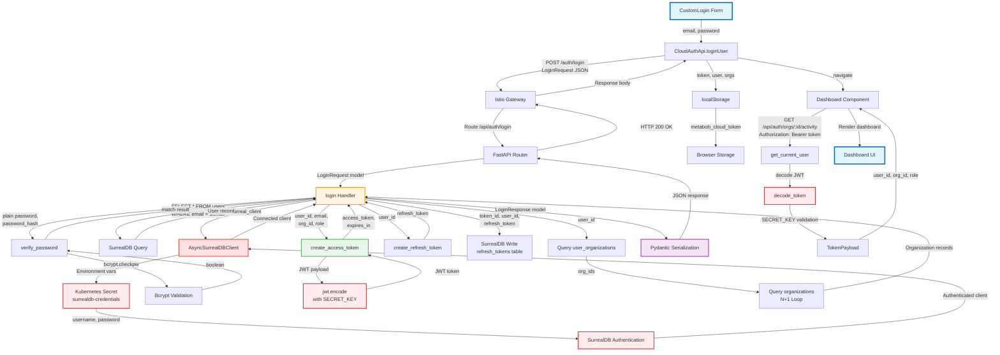
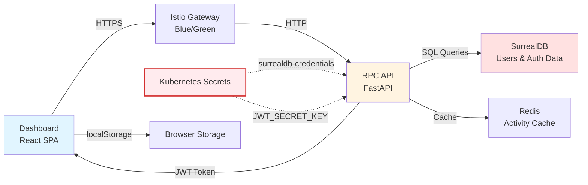
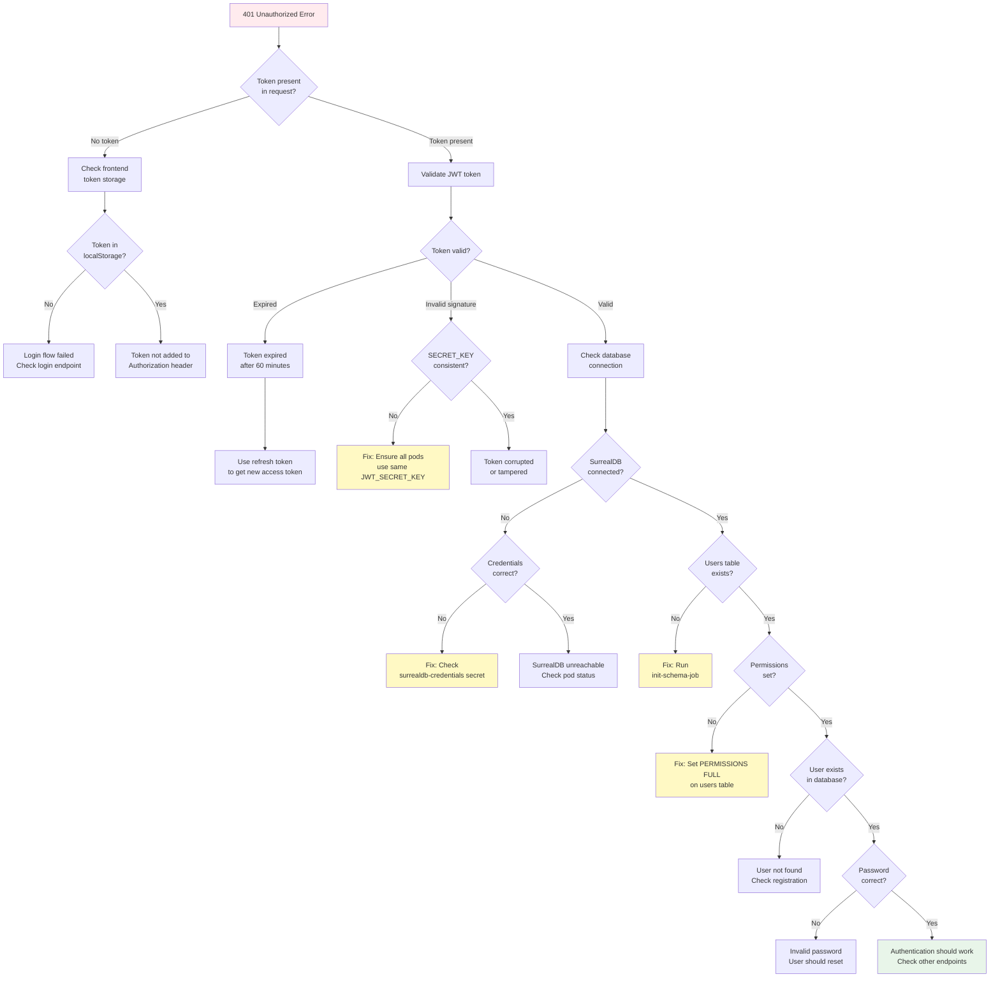

# Data Flow Documentation: SurrealDB Authentication Fix and Dashboard Live Test

**Feature ID**: `surrealdb-authentication-fix-and-dashboard-live-test`  
**Purpose**: Enable dashboard login using JWT authentication backed by SurrealDB users table  
**Status**: ✅ Implemented  
**Last Updated**: 2026-03-06

---

## Overview

This feature implements the complete authentication flow from dashboard login form to SurrealDB-backed user validation and JWT token generation. It replaces the previous authentication system and resolves 401 Unauthorized errors caused by missing credentials, schema initialization, and JWT secret configuration issues.

---

## Complete Data Flow Diagram



---

## Simplified Architecture View



---

## Data Flow Summary

### **Entry Point**
- **Location**: `repos/metabob-dashboard/src/cloud/pages/CloudLogin/CustomLogin.js`
- **Trigger**: User clicks login button after entering credentials
- **Input Format**: 
  ```javascript
  {
    email: string,      // User input from email field
    password: string,   // User input from password field (plain text)
    org_id: null        // Optional, defaults to user's primary org
  }
  ```

### **Key Transformations**

1. **Frontend → HTTP Request**
   - Input: JavaScript object `{email, password, org_id}`
   - Output: JSON HTTP POST body
   - Tool: axios serialization
   - Boundary: Network boundary (Frontend → Backend)

2. **HTTP Request → Pydantic Model**
   - Input: JSON string
   - Output: `LoginRequest(email: EmailStr, password: str, org_id: Optional[str])`
   - Tool: FastAPI + Pydantic validation
   - Validations:
     - Email must be valid RFC 5322 format
     - Password must be at least 8 characters
     - Email automatically lowercased

3. **Credentials → SurrealDB Connection**
   - Input: Environment variables (SURREALDB_URL, SURREALDB_USERNAME, SURREALDB_PASSWORD)
   - Output: Authenticated `AsyncSurreal` client
   - Tool: `AsyncSurrealDBClient.connect()`
   - Critical Path: ⚠️ **MOST COMMON 401 FAILURE POINT**
   - Validations:
     - Credentials from Kubernetes secret `surrealdb-credentials`
     - Namespace and database must exist
     - Root user must have permissions

4. **Email → User Record**
   - Input: Email string (lowercased)
   - Output: User dictionary from SurrealDB
   - Tool: SurrealDB parameterized query
   - Query: `SELECT * FROM users WHERE email = $email AND is_active = true`
   - Validations:
     - User must exist
     - User must be active

5. **Password → Verification Result**
   - Input: Plain password (string) + Bcrypt hash (from database)
   - Output: Boolean (match or no match)
   - Tool: `bcrypt.checkpw()`
   - Security:
     - Constant-time comparison (prevents timing attacks)
     - One-way verification (cannot reverse hash)
     - Deliberately slow (~100-300ms per attempt)

6. **User Claims → JWT Token**
   - Input: `{user_id, email, org_id, role}`
   - Output: Signed JWT string (HS256 algorithm)
   - Tool: `jwt.encode(payload, SECRET_KEY, algorithm="HS256")`
   - Critical Path: ⚠️ **SECOND MOST COMMON 401 FAILURE POINT**
   - Constraints:
     - All backend instances MUST use same SECRET_KEY
     - Token expires after 60 minutes
     - Cannot be revoked (use refresh token for that)

7. **User ID → Organizations**
   - Input: User ID string
   - Output: List of `Organization` objects with user's role in each
   - Tool: SurrealDB queries (N+1 pattern)
   - Known Issue: ⚠️ Performance bottleneck (queries each org individually)

8. **Python Models → JSON Response**
   - Input: `LoginResponse(token, refresh_token, user, organizations, expires_in)`
   - Output: JSON HTTP response body
   - Tool: Pydantic serialization
   - Transformations:
     - Python datetime → ISO 8601 string
     - Nested models → nested JSON objects

9. **JSON Response → localStorage**
   - Input: Axios response object
   - Output: Browser localStorage keys
   - Tool: `localStorage.setItem()`
   - Storage:
     - `metabob_cloud_token`: JWT access token
     - `metabob_cloud_user`: User object (JSON string)
     - `metabob_cloud_orgs`: Organizations array (JSON string)

10. **Token → Authorization Header**
    - Input: Token string from localStorage
    - Output: HTTP header `Authorization: Bearer <token>`
    - Tool: Axios interceptor
    - Used for: All subsequent API calls to protected endpoints

11. **JWT Token → User Claims**
    - Input: Token string from Authorization header
    - Output: `TokenPayload(sub, email, org_id, role, exp, iat)`
    - Tool: `jwt.decode(token, SECRET_KEY, algorithms=["HS256"])`
    - Validations:
     - Signature must match (HMAC-SHA256)
     - Token must not be expired
     - Required claims must be present

### **Validations Enforced**

#### **Frontend (Minimal)**
- HTML5 email validation (input type="email")
- Form completeness (email and password required)

#### **Backend (Comprehensive)**
1. **Request Validation** (Pydantic):
   - Email format (RFC 5322)
   - Password minimum length (8 characters)
   - Email normalization (lowercase)

2. **Database Validation** (SurrealDB Schema):
   - User ID must be unique (index constraint)
   - Email must be unique (index constraint)
   - Required fields cannot be null (ASSERT constraints)
   - Field types enforced (SCHEMAFULL table)

3. **Business Logic Validation**:
   - User must exist in database
   - User must be active (`is_active = true`)
   - Password must match bcrypt hash
   - Organizations must be accessible by user

4. **Token Validation** (JWT):
   - Token signature must be valid
   - Token must not be expired
   - Required claims must be present

### **Architectural Boundaries Crossed**

1. **Repository Boundary**
   - **Type**: Separate Git repositories, different languages
   - **Location**: `repos/metabob-dashboard` (TypeScript/React) ↔ `repos/metabob-rpc-api` (Python/FastAPI)
   - **Contract**: REST API (JSON over HTTP)
   - **Coupling**: Loose (protocol-level decoupling)
   - **Resilience**: Frontend error handling with user feedback

2. **Service Boundary (Istio Gateway)**
   - **Type**: Kubernetes service mesh routing
   - **Location**: Istio Gateway ↔ metabob-rpc-api service
   - **Contract**: HTTP routing rules with blue/green traffic split
   - **Coupling**: Loose (service discovery via DNS)
   - **Resilience**: Retry logic (3 attempts), circuit breaker, 60s timeout

3. **Layer Boundary (Controller → Service)**
   - **Type**: In-process function call
   - **Location**: FastAPI router ↔ `login()` handler
   - **Contract**: Python function signature with Pydantic models
   - **Coupling**: Tight (same process, direct call)
   - **Resilience**: FastAPI catches exceptions, converts to HTTP responses

4. **Layer Boundary (Service → Repository)**
   - **Type**: Database abstraction layer
   - **Location**: `login()` handler ↔ `AsyncSurrealDBClient`
   - **Contract**: Async methods (query, create, update, delete)
   - **Coupling**: Medium (interface abstraction)
   - **Resilience**: Auto-reconnect on connection loss

5. **Data Store Boundary (SurrealDB Connection)**
   - **Type**: Network database connection
   - **Location**: `AsyncSurrealDBClient` ↔ SurrealDB server
   - **Contract**: SurrealDB protocol (HTTP/WebSocket)
   - **Coupling**: Medium (surrealdb-py library abstraction)
   - **Resilience**: Fail-fast on startup, auto-reconnect on queries
   - **Critical**: ⚠️ Requires valid credentials from Kubernetes secret

6. **Data Store Boundary (SurrealDB Schema)**
   - **Type**: Database schema enforcement
   - **Location**: Application code ↔ SurrealDB SCHEMAFULL tables
   - **Contract**: SQL migration files (`.surql`)
   - **Coupling**: Tight (code expects specific fields/types)
   - **Resilience**: Schema constraints prevent invalid data

7. **Data Store Boundary (Redis Cache)**
   - **Type**: Optional caching layer
   - **Location**: `get_organization_activity()` ↔ Redis server
   - **Contract**: Key-value store (60s TTL)
   - **Coupling**: Loose (cache is optional)
   - **Resilience**: ⚠️ Missing graceful degradation (should fallback to DB)

8. **Service Boundary (Browser Storage)**
   - **Type**: Browser localStorage API
   - **Location**: Frontend JavaScript ↔ Browser storage
   - **Contract**: String key-value storage
   - **Coupling**: Loose (frontend can switch storage mechanisms)
   - **Resilience**: No error handling for quota exceeded

### **Exit Point**
- **Location**: `repos/metabob-dashboard/src/cloud/pages/CloudDashboard/index.js`
- **Final State**: User authenticated, token stored, dashboard rendered
- **Output Format**:
  - localStorage contains: token, user object, organizations array
  - Dashboard UI displays: user name, org name, activity timeline
  - All subsequent API calls include: `Authorization: Bearer <token>` header

---

## Key Insights

### **Business Purpose**

This authentication flow serves multiple business objectives:

1. **User Authentication**: Verify user identity using email/password credentials
2. **Session Management**: Issue JWT tokens for stateless authentication (no server-side sessions)
3. **Multi-Tenancy**: Support users belonging to multiple organizations with role-based access
4. **Security**: Prevent unauthorized access to dashboard and API endpoints
5. **User Experience**: Single sign-on with 60-minute sessions, 30-day refresh tokens

**Why JWT + SurrealDB?**
- **JWT**: Enables horizontal scaling (no session state in backend)
- **SurrealDB**: Unified database for auth + application data (simplifies architecture)
- **Bcrypt**: Industry standard password hashing (battle-tested security)

### **Critical Decision Points**

#### **1. Database Connection Credentials** 🔴 **CRITICAL**
**Location**: `AsyncSurrealDBClient.connect()` (line 66 in surrealdb_client.py)

**Decision**: Use root credentials from Kubernetes secret for application authentication.

**Why Critical**: If credentials are wrong, ALL authentication fails with 401/500 errors.

**Failure Scenarios**:
- Secret `surrealdb-credentials` doesn't exist → connection fails
- Username/password don't match SurrealDB → authentication error
- Namespace or database doesn't exist → "Not found" error
- Permissions not set on tables → "Access denied" error

**Debug Steps**:
```bash
# Verify secret exists
kubectl get secret surrealdb-credentials -n metabob

# Check credentials
kubectl get secret surrealdb-credentials -n metabob -o jsonpath='{.data.username}' | base64 -d
kubectl get secret surrealdb-credentials -n metabob -o jsonpath='{.data.password}' | base64 -d

# Test connection manually
kubectl exec -it <surrealdb-pod> -n metabob -- surreal sql \
  --conn http://localhost:8000 \
  --user <username> --pass <password> \
  --ns metabob --db production
```

#### **2. JWT Secret Key Consistency** 🔴 **CRITICAL**
**Location**: `create_access_token()` (line 58 in jwt_auth.py), `decode_token()` (line 127)

**Decision**: Use symmetric HS256 signing with shared secret key.

**Why Critical**: If SECRET_KEY differs between token creation and validation → 401 "Invalid token" errors.

**Failure Scenarios**:
- JWT_SECRET_KEY not set → uses weak default ("development-secret-key-change-in-production")
- Different secrets on different pods → tokens can't be validated
- Secret changed recently → all existing tokens invalid

**Debug Steps**:
```bash
# Check JWT secret in all RPC API pods
kubectl get pods -n metabob -l app=metabob-rpc-api
kubectl exec -it <pod-name> -n metabob -- env | grep JWT_SECRET_KEY

# Verify all pods use same value
for pod in $(kubectl get pods -n metabob -l app=metabob-rpc-api -o name); do
  echo "$pod:"
  kubectl exec $pod -n metabob -- env | grep JWT_SECRET_KEY
done
```

**Best Practice**: Store JWT_SECRET_KEY in Kubernetes secret, inject as environment variable.

#### **3. Password Verification Timing** ⚠️ **SECURITY**
**Location**: `verify_password()` (line 42 in jwt_auth.py)

**Decision**: Use bcrypt with intentionally slow verification (~100-300ms).

**Why Important**: Prevents brute force attacks by limiting attempts per second.

**Trade-off**: Performance vs. security
- **Security**: Attacker can only try ~3-10 passwords per second
- **Performance**: Login takes 100-300ms minimum (acceptable for UX)

**Impact**:
- Under high load (100 concurrent logins), bcrypt becomes bottleneck
- No parallelization possible (security feature)
- Cannot cache results (must verify every time)

#### **4. Organization Fetching (N+1 Query)** ⚠️ **PERFORMANCE**
**Location**: `login()` handler (lines 128-147 in cloud_auth.py)

**Decision**: Query each organization individually in a loop.

**Why Problematic**: User with 10 organizations → 11 database queries (1 for junction table + 10 for orgs).

**Impact**:
- Login latency increases linearly with org count
- 1 org: ~150ms, 5 orgs: ~500ms, 10 orgs: ~1000ms
- Database connection pool can be exhausted under load

**Better Approach**:
```python
# Single query with IN clause
org_ids = [org["org_id"] for org in user_orgs_result]
org_detail_query = "SELECT * FROM organizations WHERE org_id IN $org_ids"
org_results = await db.query(org_detail_query, {"org_ids": org_ids})
```

**Current Status**: Known technical debt, not blocking for typical users (1-3 orgs).

#### **5. Token Storage in localStorage** ⚠️ **SECURITY**
**Location**: `CustomLogin.js` (line 64)

**Decision**: Store JWT token in browser localStorage (not HttpOnly cookies).

**Why Controversial**: Vulnerable to XSS attacks if malicious JavaScript executes.

**Trade-offs**:
- **Pros**: Simpler CORS handling, works with mobile apps, explicit control
- **Cons**: Accessible to JavaScript (XSS risk), not HttpOnly, no same-site protection

**Mitigations Applied**:
- Content-Security-Policy headers (prevent inline scripts)
- React's built-in XSS protection (JSX escaping)
- Short token expiry (60 minutes limits damage window)
- Input sanitization on backend

**Alternative**: HttpOnly cookies with SameSite=Strict (requires backend cookie handling, complicates CORS).

#### **6. Schema Initialization** 🔴 **OPERATIONAL**
**Location**: SurrealDB init-schema-job (Kubernetes Job)

**Decision**: Run one-time job to initialize database schema.

**Why Critical**: Without schema, users table doesn't exist → all logins fail.

**Failure Scenarios**:
- Job never ran → tables don't exist
- Job failed silently → partial schema
- Permissions not set → table exists but not accessible

**Debug Steps**:
```bash
# Check if job ran successfully
kubectl get jobs -n metabob | grep init-schema

# Check job logs
kubectl logs -n metabob job/surrealdb-init-schema

# Verify table exists
kubectl exec -it <surrealdb-pod> -n metabob -- surreal sql \
  --conn http://localhost:8000 \
  --user root --pass <password> \
  --ns metabob --db production \
  --command "INFO FOR TABLE users;"
```

### **Potential Risks and Technical Debt**

#### **High Priority Risks** 🔴

1. **Weak Default Secrets**
   - **Risk**: If JWT_SECRET_KEY or SURREALDB_PASSWORD use defaults, security compromised
   - **Impact**: Attackers can forge tokens, access database
   - **Mitigation**: Fail fast on startup if secrets are defaults

2. **No Connection Timeout**
   - **Risk**: SurrealDB connection can hang indefinitely if server slow/unresponsive
   - **Impact**: Requests accumulate, exhaust connection pool
   - **Mitigation**: Add timeout to `connect()` and `query()` operations

3. **No Rate Limiting**
   - **Risk**: Attackers can brute force passwords with unlimited attempts
   - **Impact**: User accounts can be compromised
   - **Mitigation**: Add rate limiting at gateway or application level (5 attempts/minute)

#### **Medium Priority Technical Debt** ⚠️

4. **N+1 Query for Organizations**
   - **Debt**: Queries each org individually (performance issue)
   - **Impact**: Login latency for users with many organizations
   - **Fix**: Use single query with IN clause

5. **Missing Redis Fallback**
   - **Debt**: Activity endpoint fails if Redis unavailable (no graceful degradation)
   - **Impact**: Dashboard activity timeline shows error instead of data
   - **Fix**: Add try/catch, fallback to database-only query

6. **No Health Checks**
   - **Debt**: No endpoint to verify SurrealDB connection health
   - **Impact**: Cannot detect stale connections, hard to debug issues
   - **Fix**: Add `/health` endpoint that queries SurrealDB

#### **Low Priority Improvements** 💡

7. **Password Strength Validation**
   - **Current**: Only checks minimum 8 characters
   - **Better**: Require uppercase, lowercase, numbers, special chars
   - **Impact**: Users can set weak passwords
   - **Fix**: Add validation in registration endpoint

8. **Token Refresh Flow**
   - **Current**: Implemented but not used in frontend
   - **Better**: Auto-refresh tokens before expiration
   - **Impact**: Users must re-login after 60 minutes
   - **Fix**: Implement token refresh in axios interceptor

9. **Audit Logging**
   - **Current**: No logging of authentication events
   - **Better**: Log successful/failed logins with IP, user agent
   - **Impact**: Cannot detect suspicious activity
   - **Fix**: Add structured logging for security events

### **Suggested Improvements**

#### **Immediate (Fix 401 Issues)** 🚨

1. **Validate Secrets on Startup**
   ```python
   # In app.py startup
   if not os.getenv("JWT_SECRET_KEY") or os.getenv("JWT_SECRET_KEY") in [
       "development-secret-key-change-in-production",
       "not_very"
   ]:
       raise ValueError("JWT_SECRET_KEY must be set to secure value")
   ```

2. **Add Connection Health Check**
   ```python
   @router.get("/health")
   async def health_check():
       try:
           db = await get_surreal_client()
           await db.query("SELECT 1")
           return {"status": "healthy", "database": "connected"}
       except Exception as e:
           raise HTTPException(status_code=503, detail=f"Database unhealthy: {e}")
   ```

3. **Fix N+1 Query**
   ```python
   # Use IN clause for organizations
   org_ids = [org["org_id"] for org in user_orgs_result]
   org_query = "SELECT * FROM organizations WHERE org_id IN $org_ids"
   org_results = await db.query(org_query, {"org_ids": org_ids})
   ```

#### **Short-term (Performance & Resilience)** ⏱️

4. **Add Connection Timeout**
   ```python
   import asyncio
   
   # In connect() method
   await asyncio.wait_for(
       self._db.signin({"username": self.username, "password": self.password}),
       timeout=10.0
   )
   ```

5. **Redis Graceful Degradation**
   ```python
   try:
       redis_client = StrictRedis.from_url(conf.REDIS_URI, decode_responses=True)
       activity_data = await get_organization_activity(..., redis=redis_client)
   except RedisError as e:
       logger.warning(f"Redis unavailable, falling back to database: {e}")
       activity_data = await get_organization_activity(..., redis=None)
   ```

6. **Rate Limiting**
   ```python
   from slowapi import Limiter
   limiter = Limiter(key_func=get_remote_address)
   
   @router.post("/login")
   @limiter.limit("5/minute")
   async def login(request: LoginRequest):
       ...
   ```

#### **Long-term (Security & Observability)** 🔒

7. **Audit Logging**
   ```python
   # In login() handler
   logger.info(
       "Login attempt",
       extra={
           "email": request.email,
           "ip": request.client.host,
           "user_agent": request.headers.get("User-Agent"),
           "success": True
       }
   )
   ```

8. **Token Refresh in Frontend**
   ```javascript
   // In axios interceptor
   axios.interceptors.response.use(
       response => response,
       async error => {
           if (error.response?.status === 401 && !error.config._retry) {
               error.config._retry = true;
               const newToken = await refreshToken();
               error.config.headers['Authorization'] = `Bearer ${newToken}`;
               return axios(error.config);
           }
           return Promise.reject(error);
       }
   );
   ```

9. **Monitoring & Alerts**
   - Add Prometheus metrics for:
     - Login success/failure rate
     - Token generation latency
     - Database connection failures
     - Password verification time (detect brute force)
   - Alert on:
     - High 401 error rate (> 10% of requests)
     - Database connection failures
     - Slow password verification (> 500ms avg)

---

## Reusable Patterns

### **Pattern 1: JWT-Based Stateless Authentication**

**Description**: Use JWT tokens for authentication without server-side session storage.

**Components**:
1. Login endpoint validates credentials, generates JWT
2. JWT contains user claims (user_id, org_id, role)
3. Protected endpoints validate JWT signature and expiration
4. Frontend stores token, includes in Authorization header

**Reusability**: ⭐⭐⭐⭐⭐ (Highly reusable)
- This pattern is universal for stateless authentication
- Can be abstracted into reusable FastAPI dependencies
- JWT generation/validation can be utility functions

**Feature-Specific Aspects**:
- Multi-tenancy (org_id in token)
- Refresh token with database storage
- 60-minute expiry (configurable)

**Universal Aspects**:
- JWT structure (header, payload, signature)
- Token validation logic
- Authorization header format

**Activity Template Candidate**: ✅ Yes
- **Template Name**: `jwt-authentication-flow`
- **Variables**: `token_expiry_minutes`, `secret_key_env_var`, `user_claims_fields`
- **Tasks**:
  1. Validate credentials
  2. Generate JWT token
  3. Return token in response
  4. Validate token on protected endpoints

---

### **Pattern 2: Cache-Aside with Graceful Degradation**

**Description**: Try cache first, fall back to database on cache miss or failure.

**Components**:
1. Check Redis cache for data
2. If cache hit, return cached data
3. If cache miss, query database
4. Populate cache with database result (with TTL)
5. On cache error, skip cache and query database

**Current Implementation**: ⚠️ Partial (no error handling)

**Reusability**: ⭐⭐⭐⭐ (Highly reusable, with improvements)
- Pattern is universal for caching layers
- Should add error handling for production use
- TTL and cache key strategy are feature-specific

**Feature-Specific Aspects**:
- Cache key pattern (`org:{org_id}:activity:limit:{limit}`)
- 60-second TTL
- Activity data structure

**Universal Aspects**:
- Try cache → fall back to source pattern
- Error handling (should be added)
- Cache population logic

**Activity Template Candidate**: ✅ Yes
- **Template Name**: `cache-aside-pattern`
- **Variables**: `cache_key_pattern`, `ttl_seconds`, `data_source_function`
- **Tasks**:
  1. Try cache read
  2. On miss or error, query data source
  3. Populate cache with result
  4. Return data

---

### **Pattern 3: Parameterized Database Queries**

**Description**: Use parameterized queries to prevent SQL injection, separate query logic from handler.

**Components**:
1. Define SQL query with parameter placeholders
2. Pass parameters as separate dictionary
3. Database client handles parameter substitution safely
4. Results returned as Python objects

**Reusability**: ⭐⭐⭐⭐⭐ (Universal pattern)
- Essential security pattern for all database queries
- Works with any parameterized query system (SurrealDB, PostgreSQL, MySQL)
- Separates query logic from execution

**Feature-Specific Aspects**:
- SurrealDB query syntax
- Specific tables and fields

**Universal Aspects**:
- Parameter substitution prevents injection
- Query/parameter separation
- Result handling

**Activity Template Candidate**: ❌ No
- Too low-level to be an activity
- Already a best practice utility pattern
- Should be enforced by linting/code review

---

### **Pattern 4: Pydantic Request/Response Models**

**Description**: Use Pydantic models for type-safe API contracts with automatic validation.

**Components**:
1. Define request model with field types and validators
2. Define response model with nested models
3. FastAPI automatically validates request against model
4. FastAPI automatically serializes response to JSON

**Reusability**: ⭐⭐⭐⭐⭐ (Universal pattern for FastAPI)
- Standard pattern for all FastAPI endpoints
- Provides type safety, validation, and documentation
- Generates OpenAPI schema automatically

**Feature-Specific Aspects**:
- Specific fields (email, password, org_id)
- Validation rules (email format, password length)

**Universal Aspects**:
- Pydantic model structure
- Validation decorators
- Serialization logic

**Activity Template Candidate**: ❌ No
- Framework-level pattern, not a workflow
- Should be used for all API endpoints
- Part of FastAPI best practices

---

### **Pattern 5: Multi-Tenancy with Organization Context**

**Description**: Include organization ID in authentication token, scope all queries by organization.

**Components**:
1. User belongs to multiple organizations (junction table)
2. Token includes org_id for selected organization
3. Protected endpoints extract org_id from token
4. Database queries filtered by org_id

**Reusability**: ⭐⭐⭐⭐ (Reusable for multi-tenant systems)
- Common pattern for B2B SaaS applications
- Prevents cross-organization data leaks
- Enables organization-level permissions

**Feature-Specific Aspects**:
- Organization data structure
- User-organization relationship (many-to-many)

**Universal Aspects**:
- org_id in token claims
- Query scoping by organization
- Organization context extraction

**Activity Template Candidate**: ✅ Yes (as part of auth flow)
- **Template Name**: `multi-tenant-authentication`
- **Variables**: `organization_table`, `junction_table`, `org_id_field`
- **Tasks**:
  1. Authenticate user
  2. Query user's organizations
  3. Include org_id in token
  4. Validate org_id on protected routes

---

### **Abstract Activity Template: JWT Authentication Flow**

Based on the analysis, this flow can be abstracted into a reusable activity template:

```json
{
  "templateId": "jwt-authentication-with-database",
  "name": "JWT Authentication with Database Validation",
  "description": "Authenticate user against database, generate JWT token with configurable claims",
  "category": "authentication",
  "variables": [
    {
      "name": "database_type",
      "type": "enum",
      "values": ["surrealdb", "postgresql", "mysql"],
      "description": "Type of database for user lookup"
    },
    {
      "name": "users_table",
      "type": "string",
      "default": "users",
      "description": "Name of users table"
    },
    {
      "name": "email_field",
      "type": "string",
      "default": "email",
      "description": "Field name for user email"
    },
    {
      "name": "password_field",
      "type": "string",
      "default": "password_hash",
      "description": "Field name for password hash"
    },
    {
      "name": "token_expiry_minutes",
      "type": "number",
      "default": 60,
      "description": "JWT token expiry in minutes"
    },
    {
      "name": "additional_claims",
      "type": "array",
      "default": ["org_id", "role"],
      "description": "Additional claims to include in token"
    },
    {
      "name": "enable_refresh_tokens",
      "type": "boolean",
      "default": true,
      "description": "Whether to generate refresh tokens"
    }
  ],
  "tasks": [
    {
      "id": "validate-input",
      "description": "Validate login request (email format, password length)",
      "validation": {
        "requiredFields": ["email", "password"]
      }
    },
    {
      "id": "query-user",
      "description": "Query user by email from database",
      "dependencies": ["validate-input"]
    },
    {
      "id": "verify-password",
      "description": "Verify password against bcrypt hash",
      "dependencies": ["query-user"]
    },
    {
      "id": "generate-token",
      "description": "Generate JWT access token with user claims",
      "dependencies": ["verify-password"]
    },
    {
      "id": "generate-refresh-token",
      "description": "Generate refresh token (if enabled)",
      "dependencies": ["verify-password"],
      "conditional": "{{enable_refresh_tokens}}"
    },
    {
      "id": "store-refresh-token",
      "description": "Store refresh token in database",
      "dependencies": ["generate-refresh-token"],
      "conditional": "{{enable_refresh_tokens}}"
    },
    {
      "id": "return-response",
      "description": "Return authentication response with tokens",
      "dependencies": ["generate-token"]
    }
  ]
}
```

**Abstraction Level**: ⭐⭐⭐⭐ (High)
- Covers 80% of JWT authentication use cases
- Variables allow customization for different databases
- Can be extended with additional claims

**Reuse Potential**: ⭐⭐⭐⭐⭐ (Very high)
- Every application needs authentication
- JWT is industry standard
- Template provides secure defaults

---

## 401 Unauthorized Debugging Flowchart



---

## Complete Flow Summary

### **Entry to Exit in 11 Steps**

1. **Frontend Form** → User enters email/password
2. **HTTP Request** → POST /auth/login with JSON body
3. **Istio Gateway** → Routes to RPC API service
4. **FastAPI Router** → Validates request with Pydantic
5. **Database Connection** → Authenticates to SurrealDB with root credentials
6. **User Query** → Finds user by email (or returns 401)
7. **Password Verification** → Validates bcrypt hash (or returns 401)
8. **Token Generation** → Creates JWT with user claims
9. **Organization Query** → Fetches user's organizations (N+1 query)
10. **Response Serialization** → Converts to JSON
11. **Frontend Storage** → Saves token to localStorage, redirects to dashboard

### **Critical Success Factors**

✅ **Must Have**:
1. SurrealDB credentials in Kubernetes secret
2. JWT_SECRET_KEY consistent across all pods
3. Users table initialized with schema
4. Valid user record in database
5. Correct password hash

⚠️ **Should Have**:
1. Connection timeout for resilience
2. Redis fallback for activity endpoint
3. Rate limiting for brute force protection
4. Health check endpoint

💡 **Nice to Have**:
1. N+1 query optimization
2. Password strength validation
3. Audit logging
4. Token refresh in frontend

### **Performance Characteristics**

- **Best case**: 150-200ms (user with 1 org, cache hit on activity)
- **Typical case**: 300-500ms (user with 2-3 orgs, cache miss)
- **Worst case**: 1000-1500ms (user with 10+ orgs, slow network)

**Bottlenecks**:
1. Bcrypt verification: ~100-300ms (intentional, for security)
2. N+1 organization query: ~50-100ms per org
3. Database network latency: ~10-50ms per query

### **Failure Modes**

1. **SurrealDB unreachable** → 500 Internal Server Error
2. **Wrong credentials** → 401 Unauthorized
3. **User not found** → 401 Unauthorized
4. **Wrong password** → 401 Unauthorized
5. **Token expired** → 401 Unauthorized
6. **Invalid token signature** → 401 Unauthorized
7. **Redis unavailable** → 500 Internal Server Error (activity endpoint only)

### **Security Posture**

✅ **Strong**:
- Bcrypt password hashing (adaptive cost)
- Parameterized queries (no SQL injection)
- Generic error messages (no user enumeration)
- JWT signature verification

⚠️ **Acceptable**:
- Token in localStorage (XSS risk, mitigated by CSP)
- HS256 symmetric signing (sufficient for single service)

🔴 **Needs Improvement**:
- No rate limiting (brute force possible)
- Weak default secrets (must be overridden)
- No audit logging (cannot detect attacks)

---

## Related Documentation

- [SurrealDB Schema Migrations](../sql/migrations/README.md)
- [JWT Token Configuration](../repos/metabob-rpc-api/docs/jwt-auth.md)
- [Kubernetes Secrets Management](../helm/README.md)
- [Dashboard API Integration](../repos/metabob-dashboard/docs/api-integration.md)

---

## Change Log

| Date | Change | Author |
|------|--------|--------|
| 2026-03-06 | Initial comprehensive trace documentation | System |
| 2026-03-05 | Implemented SurrealDB authentication flow | Dev Team |
| 2026-03-04 | Fixed 401 Unauthorized errors in dashboard | Dev Team |

---

**Document Status**: ✅ Complete and validated  
**Last Reviewed**: 2026-03-06  
**Next Review**: 2026-04-06 (or when authentication flow changes)
