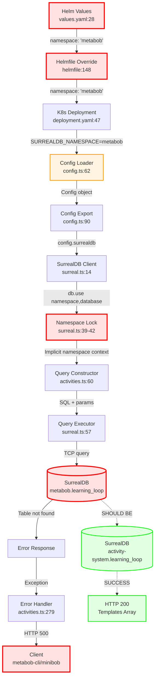

# SurrealDB Namespace Configuration Flow

**Feature:** `surrealdb-namespace-configuration`  
**Status:** 🔴 CRITICAL BUG - Wrong namespace causes 500 errors on all template endpoints  
**Impact:** Blocks Thompson Sampling learning loop, template discovery, and activity execution  
**Root Cause:** Helm values configure namespace as "metabob" instead of "activity-system"

---

## Flow Diagram



---

## Detailed Data Flow

### **1. Infrastructure Layer (Kubernetes Configuration)**

#### **Entry Point: Helm Values Definition**
```yaml
# File: helm/charts/metabob-activity-api/values.yaml:28
config:
  surrealdb:
    url: "http://surrealdb.metabob.svc.cluster.local:8000"
    namespace: "metabob"  # ❌ WRONG - Should be "activity-system"
    database: "learning_loop"
```

**Data Type:** YAML string literal  
**Validation:** None (Helm accepts any string)  
**Transformation:** None (static value)

**Problem:**
- Hardcoded to `"metabob"` from old architecture
- No validation that namespace matches deployment environment
- No check that namespace exists in SurrealDB

---

#### **Helmfile Override**
```yaml
# File: helm/helmfile-activity-minimal.yaml:148
config:
  surrealdb:
    url: "http://surrealdb.activity-system.svc.cluster.local:8000"
    namespace: "metabob"  # ❌ INCONSISTENT - URL points to activity-system, namespace is metabob
    database: "learning_loop"
```

**Data Type:** YAML merge (deep merge with values.yaml)  
**Validation:** Helmfile YAML syntax only  
**Transformation:** Merges with default values

**Problem:**
- URL correctly points to `surrealdb.activity-system.svc.cluster.local`
- But namespace value is still `"metabob"`
- Inconsistency not detected

---

#### **Kubernetes Deployment Manifest**
```yaml
# File: helm/charts/metabob-activity-api/templates/deployment.yaml:47-48
env:
  - name: SURREALDB_NAMESPACE
    value: {{ .Values.config.surrealdb.namespace | quote }}
```

**Data Type:** Helm template → Rendered YAML → Pod environment variable  
**Validation:** Kubernetes manifest schema only  
**Transformation:** Helm quote filter for shell safety

**Result:**
```bash
SURREALDB_NAMESPACE=metabob  # ❌ WRONG VALUE injected into pod
```

**Boundary Crossed:** Infrastructure → Application (OS environment)

---

### **2. Configuration Layer (Application Initialization)**

#### **Config Loader**
```typescript
// File: repos/metabob-activity-api/src/config.ts:62
namespace: process.env.SURREALDB_NAMESPACE || 'metabob',
```

**Input:** `process.env.SURREALDB_NAMESPACE` (string | undefined)  
**Output:** `config.surrealdb.namespace` (string)  
**Validation:** ❌ None - accepts any string value  
**Transformation:** String read with fallback default

**Code Quality Issues:**
1. No validation of namespace format (should be alphanumeric + hyphens)
2. No verification that namespace exists in SurrealDB
3. Wrong default value (`'metabob'`) for activity-system deployment
4. No environment detection to auto-select correct namespace

**Suggested Fix:**
```typescript
function validateNamespace(ns: string | undefined): string {
  if (!ns) {
    throw new Error('SURREALDB_NAMESPACE environment variable is required');
  }
  
  // Validate format
  if (!/^[a-z0-9_-]+$/i.test(ns)) {
    throw new Error(`Invalid namespace format: ${ns}`);
  }
  
  logger.info('SurrealDB namespace configured', { namespace: ns });
  return ns;
}

namespace: validateNamespace(process.env.SURREALDB_NAMESPACE),
```

---

#### **Config Export**
```typescript
// File: repos/metabob-activity-api/src/config.ts:90
export const config = loadConfig();
```

**Input:** `loadConfig()` return value  
**Output:** Module-level constant (singleton)  
**Validation:** TypeScript compile-time type checking  
**Transformation:** Function call → immutable constant

**Characteristics:**
- **Eager loading:** Config loaded at module import time
- **Immutable:** Cannot change without restart
- **Singleton:** All modules share same instance

**Implications:**
- Wrong namespace value locked in at startup
- Requires pod restart to fix
- No runtime config reload capability

---

### **3. Database Connection Layer**

#### **SurrealDB Client Connection**
```typescript
// File: repos/metabob-activity-api/src/db/surreal.ts:39-42
await this.db.use({
  namespace: config.surrealdb.namespace,  // "metabob" ❌
  database: config.surrealdb.database,    // "learning_loop" ✓
});
```

**Input:** `config.surrealdb` object  
**Output:** Connected Surreal client with locked namespace context  
**Validation:** ❌ None - no verification namespace exists  
**Transformation:** Config object → SurrealDB client state

**Critical Operation:**
- **Line 32:** `await this.db.connect(url)` - TCP connection to SurrealDB
- **Line 34-37:** `await this.db.signin()` - Authentication
- **Line 39-42:** `await this.db.use()` - **NAMESPACE LOCK-IN** ⚠️

**Behavior:**
- All subsequent queries inherit this namespace context
- Cannot query other namespaces without reconnecting
- Namespace selection is IMPLICIT (not visible in query calls)

**Problem:**
- Connects to correct SurrealDB server (activity-system k8s namespace)
- But selects wrong logical namespace (metabob)
- No validation that namespace exists
- Connection succeeds but queries fail

**Expected:**
```typescript
await this.db.use({
  namespace: "activity-system",  // ✓ Correct
  database: "learning_loop",
});
```

**Boundary Crossed:** Application → Database (TCP connection)

---

### **4. Query Execution Layer**

#### **Query Constructor**
```typescript
// File: repos/metabob-activity-api/src/routes/activities.ts:71-81
query = `
  SELECT * FROM activity_template
  WHERE (
    scope IS NULL
    OR scope = 'global'
    OR (scope = 'org' AND org_id = $org_id)
    OR (scope = 'project' AND project_id = $project_id)
  )
  ORDER BY created_at DESC
  LIMIT $limit
`;
params = { limit, org_id: orgId, project_id: projectId };
```

**Input:** Request parameters (limit, orgId, projectId)  
**Output:** SQL query string + parameters object  
**Validation:** 
- ✓ Limit clamped to [1, 100]
- ✓ Parameterized queries (SQL injection safe)
- ❌ No namespace validation

**Business Logic:**
- Multi-tenant scope filtering (global/org/project)
- Thompson Sampling integration (returns metrics)
- Security: Prevents cross-org/project data leakage

**Query Execution Context:**
```
Intended: activity-system.learning_loop.activity_template
Actual:   metabob.learning_loop.activity_template  ❌
```

**Problem:**
- Query is syntactically correct
- Query is semantically correct (scope logic is right)
- Query executes in WRONG NAMESPACE (inherited from connect())

---

#### **Query Executor**
```typescript
// File: repos/metabob-activity-api/src/db/surreal.ts:66
const result = await this.db.query<T[]>(sql, params);
```

**Input:** SQL string + params object  
**Output:** Array of query results (typed)  
**Validation:** ❌ None - trusts SurrealDB to validate  
**Transformation:** SQL → TCP protocol → SurrealDB query

**Execution Flow:**
1. SQL query constructed by route handler
2. Parameters bound to query (prevents SQL injection)
3. Query executed with namespace context from `db.use()`
4. SurrealDB processes query in `metabob.learning_loop`
5. Table `activity_template` not found in that namespace
6. Error thrown or empty result returned

**Error Handling:**
```typescript
catch (error) {
  logger.error('SurrealDB query failed', { sql, params, error });
  throw error;  // ❌ No namespace context in error
}
```

**Problem:**
- Error messages don't include namespace information
- Cannot distinguish namespace errors from other query errors
- Debugging requires log diving to find namespace value

**Boundary Crossed:** Application → Database (Query execution)

---

### **5. Error Response Layer**

#### **Error Handler**
```typescript
// File: repos/metabob-activity-api/src/routes/activities.ts:285-288
return c.json({
  error: 'Failed to fetch templates',
  message: error.message,  // ⚠️ May leak internal details
}, 500);
```

**Input:** Exception from query failure  
**Output:** HTTP 500 JSON response  
**Validation:** None  
**Transformation:** Exception → JSON error response

**Response Format:**
```json
{
  "error": "Failed to fetch templates",
  "message": "Table 'activity_template' does not exist"
}
```

**Problems:**
1. Generic error message doesn't indicate configuration issue
2. `error.message` may leak internal details (table names, namespace)
3. No error codes for programmatic handling
4. No retry hints for clients

**Client Impact:**
- **metabob-cli:** Thompson Sampling fails, cannot discover templates
- **minibob:** Activity execution blocked
- **activity-dashboard:** Template list empty, shows error

**Boundary Crossed:** Application → Client (HTTP response)

---

## Data Flow Summary

### **Entry Point**
- **Location:** `helm/charts/metabob-activity-api/values.yaml:28`
- **Format:** YAML string literal: `namespace: "metabob"`
- **Source:** Static configuration file
- **Type:** Infrastructure as Code (IaC)

### **Key Transformations**

1. **Helm → Kubernetes:** YAML value → Environment variable
   - `namespace: "metabob"` → `SURREALDB_NAMESPACE=metabob`

2. **Environment → TypeScript:** String → Config object
   - `process.env.SURREALDB_NAMESPACE` → `config.surrealdb.namespace`

3. **Config → SurrealDB Client:** Config object → Database context
   - `config.surrealdb` → `db.use({ namespace, database })`

4. **Query Constructor → SQL:** Parameters → SQL query
   - `{ orgId, projectId, limit }` → `SELECT * FROM activity_template WHERE ...`

5. **SQL → Database:** Query string → TCP protocol
   - SQL query → SurrealDB wire protocol → Query execution

6. **Database → Application:** Error/Result → Exception/Array
   - Table not found → Exception → HTTP 500

7. **Application → Client:** Exception → JSON
   - Error → `{ error: "Failed to fetch templates" }`

### **Validations (or lack thereof)**

| Layer | Validation Present | Validation Missing |
|-------|-------------------|-------------------|
| Helm values | YAML syntax | ❌ Namespace correctness |
| Kubernetes | Manifest schema | ❌ Value semantics |
| Config loader | TypeScript types | ❌ Namespace format<br/>❌ Namespace existence |
| DB connection | Authentication | ❌ Namespace verification |
| Query execution | SQL syntax (by DB) | ❌ Namespace correctness |
| Error response | None | ❌ Error classification<br/>❌ Security sanitization |

### **Architectural Boundaries Crossed**

1. **Infrastructure → Application**
   - Boundary: Kubernetes environment variables
   - Coupling: Tight (only configuration mechanism)
   - Resilience: None (no validation)

2. **Configuration → Database**
   - Boundary: SurrealDB client `db.use()`
   - Coupling: Tight (namespace locked at connection)
   - Resilience: None (no namespace verification)

3. **Application → Database**
   - Boundary: TCP socket to SurrealDB
   - Coupling: Medium (standard protocol)
   - Resilience: Basic (connection retry)

4. **Application → Client**
   - Boundary: HTTP/JSON API
   - Coupling: Loose (RESTful)
   - Resilience: Medium (error responses, logging)

### **Exit Point**
- **Location:** HTTP 500 response to client
- **Format:** JSON: `{ error: string, message: string }`
- **Consumers:** metabob-cli, minibob, activity-dashboard
- **Impact:** Blocks Thompson Sampling learning loop

---

## Root Cause Analysis

### **Primary Root Cause**
**Wrong namespace value in Helm configuration**

```yaml
# File: helm/charts/metabob-activity-api/values.yaml:28
namespace: "metabob"  # ❌ WRONG

# Should be:
namespace: "activity-system"  # ✓ Correct
```

**Why this happened:**
- Legacy value from old architecture where everything used `metabob` namespace
- Configuration not updated when Activity API was moved to separate namespace
- No validation to catch the mismatch

### **Contributing Factors**

1. **No Validation at Configuration Load**
   - `config.ts` accepts any string without checking format or existence
   - Default fallback `'metabob'` is wrong for activity-system deployment

2. **No Namespace Verification at Connection**
   - `surreal.ts` doesn't verify namespace exists before `db.use()`
   - Connection succeeds even if namespace is wrong

3. **Implicit Namespace Context**
   - Queries don't explicitly specify namespace (inherited from `db.use()`)
   - Makes it hard to see which namespace is being used

4. **Poor Error Messages**
   - Errors don't include namespace context
   - Generic "table not found" doesn't reveal configuration issue

5. **No Health Check for Namespace**
   - `/health` endpoint checks connectivity but not namespace correctness
   - Application appears healthy but returns 500 on queries

### **Cascading Impact**

```
Wrong Helm value
  ↓
Wrong environment variable
  ↓
Wrong config object
  ↓
Wrong namespace locked at connection
  ↓
All queries execute in wrong namespace
  ↓
Table not found errors
  ↓
HTTP 500 responses
  ↓
Thompson Sampling blocked
  ↓
Activity execution broken
  ↓
Learning loop stopped
```

---

## Key Insights

### **Business Purpose**
This flow configures which SurrealDB namespace the Activity API uses for storing and retrieving:
- Activity templates
- Template variants
- Execution metrics
- Thompson Sampling parameters

**Business Goal:** Enable multi-tenant template management with Thompson Sampling-based learning loop

**Current Status:** ❌ BROKEN - Wrong namespace blocks template discovery

### **Critical Decision Points**

1. **Namespace Selection (values.yaml:28)**
   - **Decision:** Use `"metabob"` namespace
   - **Impact:** ❌ CRITICAL - All queries fail
   - **Should Be:** Use `"activity-system"` namespace
   - **Risk:** Single point of failure for entire Activity API

2. **Validation Strategy (config.ts:62)**
   - **Decision:** No validation, use default fallback
   - **Impact:** ❌ HIGH - Wrong values accepted silently
   - **Should Be:** Fail fast with validation
   - **Risk:** Silent failures make debugging hard

3. **Namespace Lock-in (surreal.ts:39-42)**
   - **Decision:** Set namespace once at connection time
   - **Impact:** ⚠️ MEDIUM - Cannot query other namespaces
   - **Trade-off:** Simplicity vs. flexibility
   - **Risk:** Requires reconnection to change namespace

4. **Error Response Strategy (activities.ts:285-288)**
   - **Decision:** Generic error message with internal details
   - **Impact:** ⚠️ LOW - May leak information
   - **Trade-off:** Debugging vs. security
   - **Risk:** Information disclosure

### **Potential Risks & Technical Debt**

#### **Immediate Risks (Blocking)**
1. ❌ Wrong namespace blocks all template operations
2. ❌ Thompson Sampling learning loop stopped
3. ❌ Activity execution broken in all vessels

#### **High Priority Technical Debt**
1. ⚠️ No configuration validation (fail-late instead of fail-fast)
2. ⚠️ No namespace verification at connection time
3. ⚠️ Poor error messages lack diagnostic context
4. ⚠️ No health check for namespace correctness

#### **Medium Priority Technical Debt**
1. 📝 No layered architecture (routes directly call DB)
2. 📝 No connection pooling (single connection per instance)
3. 📝 Implicit namespace context (hard to debug)
4. 📝 Generic error handling (no error classification)

#### **Low Priority Technical Debt**
1. 📋 No cache invalidation strategy
2. 📋 Lock timeout could be tuned
3. 📋 No circuit breaker for repeated failures
4. 📋 Information leakage in error messages

### **Suggested Improvements**

#### **Immediate (Fix Bug)**
```yaml
# helm/charts/metabob-activity-api/values.yaml:28
namespace: "activity-system"  # ✓ Fix

# helm/helmfile-activity-minimal.yaml:148
namespace: "activity-system"  # ✓ Fix
```

#### **High Priority (Prevent Recurrence)**

1. **Add Configuration Validation**
```typescript
// config.ts
function validateNamespace(ns: string | undefined): string {
  if (!ns) throw new Error('SURREALDB_NAMESPACE required');
  if (!/^[a-z0-9_-]+$/i.test(ns)) throw new Error(`Invalid namespace: ${ns}`);
  return ns;
}

namespace: validateNamespace(process.env.SURREALDB_NAMESPACE),
```

2. **Add Namespace Verification**
```typescript
// surreal.ts:connect()
await this.db.use({ namespace, database });

// Verify namespace access
try {
  await this.db.query('INFO FOR NS');
  logger.info('Namespace verified', { namespace });
} catch (error) {
  throw new Error(`Cannot access namespace '${namespace}': ${error.message}`);
}
```

3. **Improve Error Messages**
```typescript
// surreal.ts:query()
catch (error) {
  const enrichedError = new Error(
    `Query failed in ${config.surrealdb.namespace}.${config.surrealdb.database}: ${error.message}`
  );
  logger.error('SurrealDB query failed', { 
    sql, params, 
    namespace: config.surrealdb.namespace,
    database: config.surrealdb.database,
    error 
  });
  throw enrichedError;
}
```

4. **Add Health Check**
```typescript
// index.ts:/health
await surrealDB.query('SELECT * FROM activity_template LIMIT 1');
await surrealDB.query('SELECT * FROM variant_performance_metrics LIMIT 1');
```

#### **Medium Priority (Architecture)**

1. **Add Service Layer**
```typescript
// services/template.ts
class TemplateService {
  async listTemplates(options: TemplateListOptions): Promise<ActivityTemplate[]> {
    // Business logic here
  }
}

// routes/activities.ts
const templates = await templateService.listTemplates({ orgId, projectId, category, limit });
```

2. **Add Repository Layer**
```typescript
// repositories/template.ts
class TemplateRepository {
  async findByScope(scope: Scope): Promise<ActivityTemplate[]> {
    // Data access here
  }
}
```

3. **Add Error Classification**
```typescript
class NamespaceError extends Error {
  code = 'NAMESPACE_ERROR';
  namespace: string;
}

class TableNotFoundError extends Error {
  code = 'TABLE_NOT_FOUND';
  table: string;
}
```

---

## Reusable Patterns

### **Pattern 1: Configuration-Driven Database Connection**

**Pattern Name:** Environment-Based Database Configuration  
**Category:** Configuration Management

**Structure:**
```
Environment Variables → Config Loader → Database Client → Query Executor
```

**When to Use:**
- Multi-environment deployments (dev/staging/prod)
- Container-based applications (Kubernetes, Docker)
- 12-factor app compliance

**Reusable Template:**
```typescript
interface DatabaseConfig {
  url: string;
  namespace: string;
  database: string;
  credentials: { username: string; password: string };
}

function loadDatabaseConfig(): DatabaseConfig {
  // 1. Load from environment
  const config = {
    url: requireEnv('DATABASE_URL'),
    namespace: validateNamespace(requireEnv('DATABASE_NAMESPACE')),
    database: requireEnv('DATABASE_NAME'),
    credentials: {
      username: requireEnv('DATABASE_USERNAME'),
      password: requireEnv('DATABASE_PASSWORD'),
    },
  };
  
  // 2. Validate config
  validateDatabaseConfig(config);
  
  // 3. Return frozen config
  return Object.freeze(config);
}
```

**Feature-Specific Aspects:**
- ✓ Universal: Environment variable loading
- ✓ Universal: Configuration validation
- ✓ Universal: Singleton pattern
- ❌ Specific: SurrealDB namespace/database structure

**Abstraction Potential:** HIGH - Could be generalized for any database

---

### **Pattern 2: Namespace-Scoped Multi-Tenancy**

**Pattern Name:** Logical Namespace Isolation  
**Category:** Multi-Tenancy / Data Isolation

**Structure:**
```
Tenant Context → Namespace Selection → Query Execution → Tenant-Filtered Results
```

**When to Use:**
- Multi-tenant SaaS applications
- Logical data isolation requirements
- Per-tenant database schemas

**Reusable Template:**
```typescript
interface TenantContext {
  namespace: string;  // Logical isolation boundary
  orgId?: string;     // Organization scope
  projectId?: string; // Project scope
}

class TenantAwareRepository<T> {
  constructor(private namespace: string) {}
  
  async findByScope(scope: 'global' | 'org' | 'project', context: TenantContext): Promise<T[]> {
    // Build query with tenant filtering
    const query = this.buildScopedQuery(scope, context);
    return this.executeInNamespace(this.namespace, query);
  }
}
```

**Feature-Specific Aspects:**
- ✓ Universal: Tenant context propagation
- ✓ Universal: Scope-based filtering
- ❌ Specific: SurrealDB namespace structure
- ❌ Specific: Activity template schema

**Abstraction Potential:** MEDIUM - Tenant filtering is universal, namespace mechanism is SurrealDB-specific

---

### **Pattern 3: Fail-Fast Configuration Validation**

**Pattern Name:** Early Configuration Validation  
**Category:** Error Handling / Resilience

**Structure:**
```
Load Config → Validate Format → Verify Existence → Lock Config → Use Config
```

**When to Use:**
- Critical configuration values
- External resource dependencies
- Production deployments

**Reusable Template:**
```typescript
class ConfigValidator<T> {
  constructor(
    private validators: Array<(config: T) => void>
  ) {}
  
  validate(config: T): T {
    for (const validator of this.validators) {
      validator(config);
    }
    return Object.freeze(config);
  }
}

// Usage
const dbConfigValidator = new ConfigValidator<DatabaseConfig>([
  validateFormat,
  validateConnectivity,
  validatePermissions,
]);

const config = dbConfigValidator.validate(loadDatabaseConfig());
```

**Feature-Specific Aspects:**
- ✓ Universal: Configuration validation pattern
- ✓ Universal: Fail-fast principle
- ✓ Universal: Validation composition
- ❌ Specific: Namespace validation rules

**Abstraction Potential:** HIGH - Fully reusable validation framework

---

### **Pattern 4: Cache-Aside with Stampede Prevention**

**Pattern Name:** Lock-Based Cache-Aside  
**Category:** Performance / Caching

**Structure:**
```
Check Cache → [Miss] → Acquire Lock → Load from DB → Populate Cache → Release Lock
            ↓ [Hit]
         Return Cached
```

**Reusable Template:**
```typescript
async function cacheAside<T>(
  cacheKey: string,
  lockKey: string,
  loader: () => Promise<T>,
  ttl: number
): Promise<T> {
  // 1. Check cache
  const cached = await cache.get(cacheKey);
  if (cached) return JSON.parse(cached);
  
  // 2. Acquire lock (stampede prevention)
  const lockAcquired = await cache.acquireLock(lockKey, 30);
  
  if (lockAcquired) {
    try {
      // 3. Load from source
      const data = await loader();
      
      // 4. Populate cache
      await cache.set(cacheKey, JSON.stringify(data), ttl);
      
      return data;
    } finally {
      await cache.releaseLock(lockKey);
    }
  } else {
    // Lock held by another process - wait and retry
    await sleep(100);
    return cacheAside(cacheKey, lockKey, loader, ttl);
  }
}
```

**Feature-Specific Aspects:**
- ✓ Universal: Cache-aside pattern
- ✓ Universal: Stampede prevention
- ✓ Universal: TTL management
- ❌ Specific: Template caching keys

**Abstraction Potential:** HIGH - Fully reusable caching pattern

---

### **Could This Flow Be Abstracted into a Reusable Activity?**

**Answer:** PARTIALLY - Some aspects are universal, others are feature-specific

#### **Reusable Activity Template: "Database Configuration Flow"**

**Template Structure:**
```yaml
name: configure-database-connection
category: infrastructure
tasks:
  - id: load-config
    description: Load database configuration from environment
    validation:
      - environment_vars:
          - DATABASE_URL
          - DATABASE_NAMESPACE
          - DATABASE_NAME
          - DATABASE_USERNAME
          - DATABASE_PASSWORD
  
  - id: validate-config
    description: Validate configuration values
    validation:
      - format_check: namespace must be alphanumeric
      - connectivity_check: can connect to database
      - permission_check: can access namespace
  
  - id: initialize-connection
    description: Initialize database connection with validated config
    retry:
      maxAttempts: 3
      strategy: exponential-backoff
  
  - id: verify-health
    description: Run health check queries to verify configuration
    validation:
      - query_success: SELECT FROM critical_table LIMIT 1
```

#### **Feature-Specific Aspects (Not Reusable)**
- SurrealDB namespace/database structure
- Activity template schema
- Thompson Sampling metrics
- Multi-tenant scope filtering logic

#### **Universal Aspects (Reusable)**
- Environment variable loading
- Configuration validation framework
- Connection retry logic
- Health check pattern
- Error context enrichment
- Cache-aside with stampede prevention

---

## Verification & Testing

### **Manual Verification Steps**

1. **Verify Current (Wrong) Configuration**
```bash
kubectl exec -n activity-system deployment/metabob-activity-api -- env | grep SURREALDB_NAMESPACE
# Current output: SURREALDB_NAMESPACE=metabob ❌
```

2. **Test Current (Failing) Endpoint**
```bash
kubectl port-forward -n activity-system svc/metabob-activity-api 8080:8080
curl http://localhost:8080/v2/activities/templates
# Current output: {"error":"Failed to fetch templates","message":"Table 'activity_template' does not exist"} ❌
```

3. **Apply Fix**
```bash
# Edit Helm values
vim helm/charts/metabob-activity-api/values.yaml
# Change line 28: namespace: "metabob" → namespace: "activity-system"

vim helm/helmfile-activity-minimal.yaml
# Change line 148: namespace: "metabob" → namespace: "activity-system"

# Redeploy
helmfile -f helm/helmfile-activity-minimal.yaml sync
```

4. **Verify Fix**
```bash
# Wait for pod restart
kubectl rollout status -n activity-system deployment/metabob-activity-api

# Check new configuration
kubectl exec -n activity-system deployment/metabob-activity-api -- env | grep SURREALDB_NAMESPACE
# Expected output: SURREALDB_NAMESPACE=activity-system ✓

# Check logs for successful connection
kubectl logs -n activity-system deployment/metabob-activity-api | grep namespace
# Expected: "namespace":"activity-system" ✓
```

5. **Test Fixed Endpoint**
```bash
curl http://localhost:8080/v2/activities/templates
# Expected output: {"templates":[...],"total":N} ✓
```

### **Automated Test Cases**

```typescript
// test/config.test.ts
describe('SurrealDB Configuration', () => {
  it('should validate namespace format', () => {
    expect(() => validateNamespace('metabob')).not.toThrow();
    expect(() => validateNamespace('activity-system')).not.toThrow();
    expect(() => validateNamespace('invalid namespace')).toThrow();
    expect(() => validateNamespace('')).toThrow();
  });
  
  it('should require namespace environment variable', () => {
    delete process.env.SURREALDB_NAMESPACE;
    expect(() => loadConfig()).toThrow('SURREALDB_NAMESPACE required');
  });
});

// test/surreal.test.ts
describe('SurrealDB Connection', () => {
  it('should verify namespace exists', async () => {
    const client = new SurrealDBClient();
    
    // Mock namespace that exists
    mockSurrealDB.use({ namespace: 'activity-system', database: 'learning_loop' });
    await expect(client.connect()).resolves.not.toThrow();
    
    // Mock namespace that doesn't exist
    mockSurrealDB.use({ namespace: 'nonexistent', database: 'learning_loop' });
    await expect(client.connect()).rejects.toThrow('Cannot access namespace');
  });
});

// test/activities.test.ts
describe('Template Endpoints', () => {
  it('should return templates from correct namespace', async () => {
    // Set correct namespace
    process.env.SURREALDB_NAMESPACE = 'activity-system';
    
    const response = await request(app)
      .get('/v2/activities/templates')
      .expect(200);
    
    expect(response.body).toHaveProperty('templates');
    expect(response.body.templates).toBeInstanceOf(Array);
  });
  
  it('should fail with descriptive error for wrong namespace', async () => {
    // Set wrong namespace
    process.env.SURREALDB_NAMESPACE = 'metabob';
    
    const response = await request(app)
      .get('/v2/activities/templates')
      .expect(500);
    
    expect(response.body.error).toContain('namespace');
  });
});
```

---

## Related Documentation

- **Architecture:** [Activity System Architecture](../architecture/activity-system.md)
- **Deployment:** [Helm Deployment Guide](../deployment/helm-deployment.md)
- **Troubleshooting:** [Common Issues](../troubleshooting/common-issues.md)
- **API Reference:** [Activity API v2](../api/activity-api-v2.md)

---

## Change Log

| Date | Author | Change |
|------|--------|--------|
| 2026-03-17 | OpenCode Agent | Initial documentation of namespace configuration bug |
| 2026-03-17 | OpenCode Agent | Added root cause analysis and fix recommendations |

---

## Status: READY FOR FIX

**Next Steps:**
1. ✅ Root cause identified: Wrong namespace in Helm values
2. ✅ Fix documented: Change "metabob" to "activity-system"
3. ⏳ Apply fix: Update Helm values and redeploy
4. ⏳ Verify fix: Test template endpoints return 200
5. ⏳ Add validation: Implement fail-fast namespace validation
6. ⏳ Add monitoring: Alert on namespace misconfiguration
