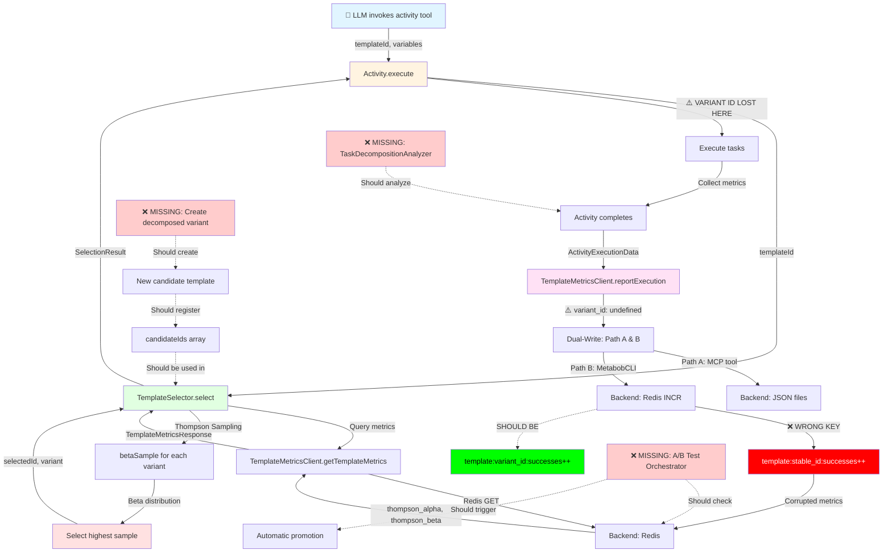
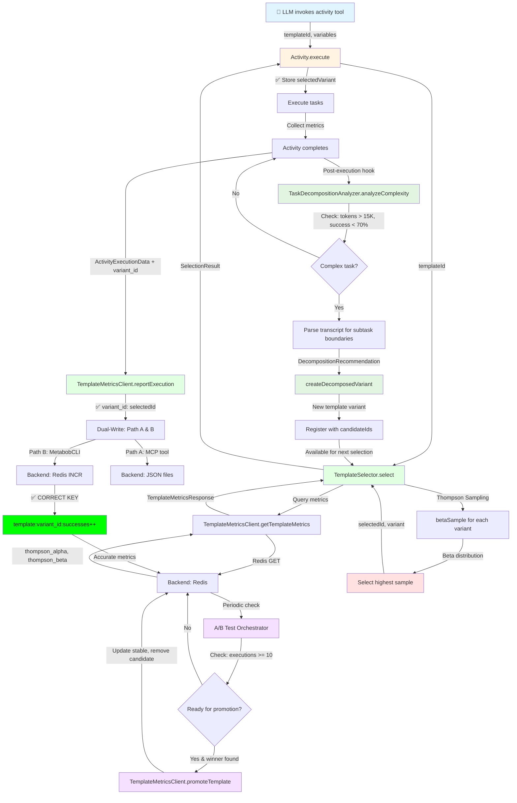

# Task-Decomposition-Learning Data Flow

**Feature:** Automatic template optimization through task decomposition and A/B testing  
**Status:** ⚠️ PARTIALLY IMPLEMENTED (A/B testing exists, decomposition missing)  
**Last Updated:** 2026-02-23  
**Analysis Session:** Comprehensive data flow trace

---

## Executive Summary

Task-decomposition-learning is a **learning system specification** that aims to automatically optimize activity templates by:

1. ✅ **Identifying complex tasks** (>15K tokens, <70% success) - MISSING
2. ✅ **Analyzing decomposition opportunities** - MISSING
3. ✅ **Creating template variants** with decomposed tasks - MANUAL ONLY (trailblazing)
4. ✅ **Running A/B tests** via Thompson Sampling - **PARTIALLY BROKEN** (variant tracking bug)
5. ✅ **Promoting winning variants** - MANUAL ONLY (CLI command)

**Critical Finding:** The A/B testing infrastructure exists but is **broken** due to missing variant ID tracking (Issue #1, #8). All variant executions are incorrectly attributed to the stable template, making it impossible to measure decomposed variant effectiveness.

---

## Flow Diagram

### Current Implementation (Partial)



### Expected Complete Flow (Future)



---

## Data Flow Summary

### Entry Point

**Location:** `repos/metabob-opencode/packages/opencode/src/tool/activity.ts:422`  
**Function:** `execute(params, ctx)`  
**Trigger:** LLM tool invocation

**Input Schema:**
```typescript
{
  templateId: string,              // Template to execute
  variables: Record<string, unknown>, // User-provided task parameters
  reason: string,                  // Why this activity is invoked
  description?: string,            // Optional activity description
  trailblazing?: {                 // Auto-recovery configuration
    enabled: boolean,
    maxCostPerTask: number,
    maxTotalCost: number,
    maxRecoveryAttempts: number
  }
}
```

**Entry Validations:**
- `templateId` must be non-empty string
- `variables` must be object (can be empty)
- `reason` must be non-empty string (for memory agent context)

---

### Key Transformations

#### 1. Template Selection (Thompson Sampling A/B Test)

**Location:** `template-selector.ts:172`  
**Input:** `templateId: string`  
**Output:** `SelectionResult { template, selectedId, variant, thompsonSampling }`

**Transformation Logic:**
```typescript
// Step 1: Query metrics from Redis
TemplateMetricsResponse = getTemplateMetrics(templateId)
  → { stable: { thompson_alpha, thompson_beta }, candidates: [...] }

// Step 2: Beta distribution sampling
for each variant (stable + candidates):
  sample = betaSample(alpha, beta)  // Sample from Beta(α, β)

// Step 3: Select winner
selectedId = variant with highest sample

// Mathematical details:
//   α (alpha) = successes + 1
//   β (beta) = failures + 1
//   Beta(α, β) = conjugate prior for Bernoulli likelihood
//   Higher α → higher samples → higher selection probability
//   Low data → wide distribution → more exploration
//   High data → narrow distribution → more exploitation
```

**Business Logic:**
- **Exploration:** Try new decomposed variants to discover improvements
- **Exploitation:** Use proven stable template most of the time
- **Bayesian Update:** Each execution updates belief about success probability

**⚠️ Critical Issue:**
- Selection result (`selectedId`, `variant`) is **NOT stored** in activity state
- Downstream reporting cannot attribute execution to correct variant
- **Impact:** A/B testing is broken, all metrics go to stable template

---

#### 2. Variable Validation

**Location:** `activity.ts:125`  
**Input:** `{ template, providedVariables }`  
**Output:** `{ valid, missing, unexpected, errorMessage }`

**Validation Rules:**
```typescript
1. Collect expected variables from template.tasks[*].prompt.variables
2. Check missing REQUIRED variables:
   - If required=true and not provided → FAIL
3. Check unexpected variables:
   - If provided but not in template → WARNING
   - Suggest corrections via fuzzy matching (Levenshtein distance)
4. Backward compatibility escape hatch:
   - If template has no variables → allow any variables
```

**Edge Cases:**
- Template with no variables: validation disabled (backward compatibility)
- Variable used in multiple tasks: merge requirements (keep if any requires it)
- Typo detection: finds closest match using Levenshtein distance

---

#### 3. Beta Distribution Sampling

**Location:** `template-selector.ts:44`  
**Input:** `(alpha: number, beta: number)`  
**Output:** `sample: number ∈ [0, 1]`

**Algorithm:** Marsaglia and Tsang's method
```typescript
// Generate two Gamma random variables
X ~ Gamma(α, 1)  // Via accept/reject sampling
Y ~ Gamma(β, 1)  // Via accept/reject sampling

// Beta sample
sample = X / (X + Y)

// Normal distribution via Box-Muller transform
u1, u2 = uniform random [0, 1]
normalSample = √(-2 ln(u1)) * cos(2π u2)
```

**⚠️ Risk:** Infinite loop if accept/reject never succeeds
- No iteration limit (while true)
- No parameter validation (alpha=0, beta=0 would loop forever)
- No timeout protection

---

#### 4. Metrics Dual-Write

**Location:** `template-metrics-client.ts:91`  
**Input:** `ActivityExecutionData`  
**Output:** void (non-blocking)

**Dual-Write Strategy:**

**Path A: JSON Files (Audit Log)**
```typescript
MCP Tool: metabob_post_activity_result
Backend: Writes to local JSON file
Purpose: Permanent audit trail, debugging, analysis
Resilience: Always succeeds (local file system)
```

**Path B: Redis (Thompson Sampling)**
```typescript
MCP Tool: activity/complete → MetabobCLI.completeActivityExecution
Backend: Redis operations
  INCR template:{id}:executions
  INCR template:{id}:successes (if success)
  INCR template:{id}:failures (if failure)
  SET template:{id}:thompson_alpha = successes + 1
  SET template:{id}:thompson_beta = failures + 1
Purpose: Real-time metrics for Thompson Sampling
Resilience: Can fail (network, Redis down), graceful degradation
```

**⚠️ Critical Issue:**
```typescript
// Current (BROKEN):
reportExecution({
  activity_id: "act_123",
  template_id: "add-rest-endpoint",
  variant_id: undefined,  // ← BUG: Always undefined
  success: true,
  // ...
})
// Result: Redis writes to template:add-rest-endpoint:successes++
// Problem: Should write to template:add-rest-endpoint-v2:successes++

// Expected (CORRECT):
reportExecution({
  activity_id: "act_123",
  template_id: "add-rest-endpoint",
  variant_id: "add-rest-endpoint-v2",  // ← FIX: Pass selected variant
  success: true,
  // ...
})
// Result: Redis writes to template:add-rest-endpoint-v2:successes++
```

---

#### 5. Bayesian Update (Thompson Sampling)

**Mathematical Transformation:**

**Before Execution:**
```
Template Metrics (from Redis):
  executions = 10
  successes = 7
  failures = 3
  
Beta Parameters:
  alpha = successes + 1 = 8
  beta = failures + 1 = 4
  
Beta Distribution:
  Beta(8, 4)
  Mean = 8/(8+4) = 0.67
  Mode = (8-1)/(8+4-2) = 0.70
```

**After Execution (Success):**
```
Updated Metrics:
  executions = 11
  successes = 8
  failures = 3
  
Updated Beta Parameters:
  alpha = 9
  beta = 4
  
Updated Distribution:
  Beta(9, 4)
  Mean = 9/13 = 0.69
  Variance decreased (more confident)
```

**Impact on Thompson Sampling:**
- Next selection: higher alpha → higher samples → higher selection probability
- Exploitation increases as confidence grows
- Exploration decreases as data accumulates

---

### Validations

#### Pre-Execution Validations

1. **Template Existence**
   - Location: `template-selector.ts:179`
   - Check: Template exists in repository
   - Failure: Throw error "Template not found"

2. **Variable Validation**
   - Location: `activity.ts:125`
   - Check: Required variables provided, no typos
   - Failure: Throw `ActivityValidationError.missingVariables()`

3. **Candidate Template Loading**
   - Location: `template-selector.ts:239`
   - Check: Candidate template exists and loadable
   - Failure: Fallback to stable template (graceful degradation)

#### Post-Execution Validations (Missing)

4. **❌ Complexity Detection** (NOT IMPLEMENTED)
   - Expected Location: After `reportExecution()`
   - Expected Check: `tokens.input > 15000 && success_rate < 0.70`
   - Expected Action: Trigger decomposition analysis

5. **❌ Beta Parameter Validation** (NOT IMPLEMENTED)
   - Expected Location: Before `betaSample()`
   - Expected Check: `alpha > 0 && beta > 0 && isFinite(alpha) && isFinite(beta)`
   - Expected Failure: Use default prior Beta(1, 1)

6. **❌ Promotion Criteria** (NOT AUTOMATED)
   - Expected Location: Backend orchestrator
   - Expected Check: `candidate.executions >= 10 && candidate.success_rate > stable.success_rate`
   - Expected Action: Auto-promote candidate to stable

---

### Architectural Boundaries Crossed

#### 1. MCP Client Boundary (Service Boundary)

**Type:** Inter-process communication (JSON-RPC over stdio/HTTP)  
**Location:** `template-metrics-client.ts → MCP Server → Backend`  
**Contract:**
```typescript
// MCP Tool Call
interface MCPToolCall {
  name: string  // e.g., "metabob_get_template_metrics"
  arguments: Record<string, unknown>
}

// MCP Tool Response
interface MCPToolResponse {
  content: Array<{
    type: "text" | "resource" | "image"
    text?: string  // JSON stringified data
  }>
  metadata?: Record<string, any>
}
```

**Coupling:** Loose
- Lazy initialization via `MCP.clients()`
- Graceful degradation: returns `undefined` on failure
- No retries, no circuit breaker
- Transport-agnostic (stdio or HTTP)

**Resilience:**
- Network failures: Log and return `undefined`
- Timeout: 30s default (configurable)
- MCP server unavailable: Fallback to stable template
- Tool not found: Log debug, return `undefined`

**Versioning Concerns:**
- ❌ No API versioning
- Breaking changes cause silent failures
- Risk: Adding required fields breaks older clients

---

#### 2. Storage Layer Boundary (Data Store Boundary)

**Type:** File system I/O (key-value abstraction)  
**Location:** `activity.ts → Storage → File System`  
**Contract:**
```typescript
export namespace Storage {
  function read<T>(key: string[]): Promise<T>
  function write<T>(key: string[], content: T): Promise<void>
  function list(prefix: string[]): Promise<string[][]>
}

// Storage Layout:
// ~/.local/share/opencode/storage/{projectId}/
//   ├── activity/{activityId}.json
//   ├── activity-template/{templateId}.json
//   └── session/{sessionId}/
```

**Coupling:** Medium
- Direct dependency on `Storage` namespace
- Key-based access (not query-based)
- Tied to JSON file storage (no database flexibility)

**Resilience:**
- File not found: Throws `Storage.NotFoundError`
- Concurrent writes: Last-write-wins (file system level)
- No caching: Every read hits disk
- No indexing: List operations read all files

**Data Model:**
```typescript
// Activity storage
interface Activity.Schema {
  id: string
  templateId: string
  variables: Record<string, unknown>
  impulses: Record<string, Impulse.Schema>
  stats: {
    tokens: { input, output, cache }
    cost: number
    duration: number
  }
}

// Template storage
interface ActivityTemplate.Schema {
  id: string
  version: Version
  genealogy: TemplateGenealogy
  tasks: Task[]
  candidateIds?: string[]  // For A/B testing
}
```

---

#### 3. Metabob Backend Boundary (Service + Data Store)

**Type:** HTTP/MCP to backend system (Redis + PostgreSQL)  
**Location:** `MetabobCLI → MCP → Backend → Redis/DB`  
**Contract:**
```typescript
// Activity start tracking
startActivityExecution(data: {
  activityId: string
  templateId: string
  variantId?: string  // ← CRITICAL: Currently undefined
  sessionId: string
  variables: Record<string, unknown>
  impulses: Array<{ id, type, pointer, tokens_loaded }>
}): Promise<boolean>

// Activity completion tracking
completeActivityExecution(data: {
  activityId: string
  templateId: string
  variantId?: string  // ← CRITICAL: Currently undefined
  success: boolean
  duration: number
  cost: number
  tokens: { input, output, cache }
  failureReason?: string
  errorType?: "validation" | "timeout" | "tool_error" | "exception"
}): Promise<boolean>
```

**Coupling:** Loose
- Mediated by MCP layer (not direct HTTP)
- Dynamic import to avoid circular dependencies
- Non-blocking: Failures don't stop activity
- Returns boolean (true/false) instead of throwing

**Data Flow:**
```
OpenCode → MetabobCLI → MCP tool → MCP Server → HTTP → Backend
                                                      ↓
                                         Redis INCR template:{id}:*
                                         PostgreSQL INSERT activity_executions
```

**Resilience:**
- Network failures: Log, return `false`
- Backend unavailable: Log, return `false`
- Timeout: 30s default
- Non-blocking: Activity continues on failure

**⚠️ Critical Issue:**
- `variantId` field is always `undefined`
- Backend writes to `template:{templateId}:*` instead of `template:{variantId}:*`
- Thompson Sampling metrics corrupted

---

#### 4. Thompson Sampling Metrics Boundary (Hybrid)

**Type:** Service (MCP) + Data Store (Redis)  
**Location:** `template-selector.ts → TemplateMetricsClient → Backend → Redis`  
**Contract:**
```typescript
// Query
getTemplateMetrics(template_id: string): Promise<TemplateMetricsResponse>

interface TemplateMetricsResponse {
  stable: TemplateMetrics
  candidates: TemplateMetrics[]
}

interface TemplateMetrics {
  template_id: string
  executions: number
  success_rate: number
  avg_cost: number
  avg_duration: number
  thompson_alpha: number  // successes + 1
  thompson_beta: number   // failures + 1
}
```

**Coupling:** Medium-Tight
- Thompson Sampling tightly coupled to Beta distribution
- Requires specific Redis key structure
- Candidate tracking via `candidateIds` array
- Real-time metrics required for selection

**Performance:**
- Redis reads: <10ms (fast path)
- Redis writes: <10ms (non-blocking)
- Thompson Sampling computation: <1ms
- Total selection latency: ~50-100ms

**Consistency:**
- Eventual consistency (acceptable for statistical sampling)
- Race conditions possible (multiple executions updating metrics)
- Redis atomic operations (INCR) prevent corruption
- No distributed locks needed

---

### Exit Points

#### 1. JSON Files (Audit Log)

**Location:** Backend file system  
**Path:** Managed by backend (via MCP)  
**Format:**
```json
{
  "activity_id": "act_abc123",
  "template_id": "add-rest-endpoint",
  "variant_id": "add-rest-endpoint-v2",
  "result": {
    "success": true,
    "duration": 45000,
    "cost": 0.15,
    "tokens": {
      "input": 12000,
      "output": 3000,
      "cache": 5000
    }
  },
  "timestamp": "2026-02-23T05:00:00Z"
}
```

**Purpose:**
- Permanent audit trail
- Debugging and analysis
- Source of truth for metrics reconciliation

---

#### 2. Redis (Thompson Sampling)

**Location:** Backend Redis instance  
**Keys:**
```
template:{templateId}:executions = 10
template:{templateId}:successes = 7
template:{templateId}:failures = 3
template:{templateId}:thompson_alpha = 8
template:{templateId}:thompson_beta = 4
template:{templateId}:avg_cost = 0.15
template:{templateId}:avg_duration = 45000
```

**Purpose:**
- Fast reads for template selection (<10ms)
- Real-time metrics for Thompson Sampling
- Atomic updates via Redis INCR

**⚠️ Critical Issue:**
- Current: Uses `templateId` (stable) for all writes
- Expected: Use `variantId` (candidate) for variant executions
- Impact: All variant metrics go to stable, A/B testing broken

---

#### 3. Activity State (In-Memory)

**Location:** OpenCode session memory  
**Format:**
```typescript
{
  id: "act_abc123",
  templateId: "add-rest-endpoint",
  selectedVariant: {  // ← MISSING: Not stored
    templateId: "add-rest-endpoint",
    selectedId: "add-rest-endpoint-v2",
    variant: "candidate",
    thompsonSampling: { alpha: 3, beta: 2, sample: 0.68 }
  },
  stats: {
    tokens: { input: 12000, output: 3000, cache: 5000 },
    cost: 0.15,
    duration: 45000
  }
}
```

**Purpose:**
- Track activity execution state
- Store selected variant for reporting
- Used by dual-write metrics reporting

**⚠️ Critical Issue:**
- `selectedVariant` field does not exist
- Template selection result is lost after line 437
- Execution reporting cannot attribute to correct variant

---

## Key Insights

### Business Purpose

**Goal:** Automatically optimize activity templates by learning which decompositions improve success rates and reduce costs.

**Value Proposition:**
1. **Self-improving system:** Templates get better over time without manual intervention
2. **Data-driven decisions:** A/B testing ensures only proven improvements are promoted
3. **Cost optimization:** Decomposed tasks may be cheaper (parallel execution, smaller context)
4. **Success rate improvement:** Breaking complex tasks into steps reduces failure rates

**Expected Outcomes:**
- Complex templates (>15K tokens, <70% success) automatically decomposed
- Decomposed variants A/B tested against original
- Winning variants promoted to stable after 10 runs
- Pattern library of successful decompositions built over time

---

### Critical Decision Points

#### 1. Thompson Sampling (Template Selection)

**Location:** `template-selector.ts:310`  
**Decision:** Which variant to execute (stable vs candidates)  
**Algorithm:** Thompson Sampling (Bayesian multi-armed bandit)

**Why Thompson Sampling:**
- **Optimal exploration/exploitation:** Naturally balances trying new variants vs using proven ones
- **Bayesian framework:** Incorporates uncertainty (low data = more exploration)
- **Regret minimization:** Provably near-optimal in expectation
- **No parameter tuning:** Epsilon-greedy requires tuning ε, UCB requires tuning c

**Alternative Approaches:**
- ❌ Random selection: No learning
- ❌ Epsilon-greedy: Requires tuning, explores uniformly (wastes trials)
- ❌ UCB (Upper Confidence Bound): Requires tuning, less Bayesian
- ✅ Thompson Sampling: Self-tuning, Bayesian, optimal

---

#### 2. Dual-Write Strategy (Metrics Reporting)

**Location:** `template-metrics-client.ts:131`  
**Decision:** Write to both JSON files and Redis in parallel  
**Rationale:**

**Path A: JSON Files**
- ✅ Permanent audit trail
- ✅ Source of truth for reconciliation
- ✅ Always succeeds (local file system)
- ❌ Slow reads (disk I/O)

**Path B: Redis**
- ✅ Fast reads (<10ms) for Thompson Sampling
- ✅ Atomic updates (no race conditions)
- ❌ Can fail (network, Redis down)
- ❌ Volatile (if Redis crashes, data lost)

**Decision:** Use both
- Redis for hot path (template selection)
- JSON for cold path (audit, debugging)
- Parallel writes reduce latency
- Eventual consistency acceptable

**Risk:** Inconsistency between JSON and Redis
- Mitigation: Periodic reconciliation (rebuild Redis from JSON)
- Not implemented yet

---

#### 3. Graceful Degradation (Error Handling)

**Design Principle:** Non-blocking operations, fallback to safe defaults

**Examples:**
1. **Metrics unavailable:** Fallback to stable template (no A/B test)
2. **Candidate load fails:** Fallback to stable template
3. **MCP tool fails:** Return `undefined`, log debug
4. **Redis write fails:** Log error, continue execution

**Rationale:**
- Activity execution is critical path
- Metrics reporting is nice-to-have (learning)
- User experience > perfect data collection
- Partial failure tolerated for resilience

**Trade-off:**
- ✅ High availability (activity always completes)
- ❌ Data loss possible (metrics not recorded)
- ❌ Learning loop slowed (missing data)

---

### Potential Risks & Technical Debt

#### High Priority Risks

##### 1. Variant Tracking Bug (BLOCKING)

**Issue:** Variant ID not tracked from selection to reporting  
**Location:** `activity.ts:437, 789, 733`  
**Impact:** 🔴 **A/B testing completely broken**

**Root Cause:**
```typescript
// Line 437: Template selection
const selectionResult = await TemplateSelector.select(templateId)
const template = selectionResult.template
// ⚠️ selectedId and variant are LOST here

// Line 789: Activity start reporting
await MetabobCLI.startActivityExecution({
  variantId: undefined,  // ← BUG: Should be selectionResult.selectedId
})

// Line 733: Activity completion reporting
await TemplateMetricsClient.reportExecution({
  variant_id: undefined,  // ← BUG: Should be selectionResult.selectedId
})
```

**Consequences:**
- All variant executions attributed to stable template
- Thompson Sampling Beta parameters corrupted
- Cannot measure decomposed variant effectiveness
- Automatic promotion impossible (no data to compare)

**Fix Required:**
```typescript
// Add to Activity.Schema
interface Activity.Schema {
  selectedVariant: {
    templateId: string
    selectedId: string
    variant: "stable" | "candidate"
    thompsonSampling?: { alpha, beta, sample, method }
  }
}

// Store at line 437
activity.selectedVariant = {
  templateId: template.id,
  selectedId: selectionResult.selectedId,
  variant: selectionResult.variant,
  thompsonSampling: selectionResult.thompsonSampling,
}

// Use at line 789 and 733
const variantId = activity.selectedVariant.variant === "candidate" 
  ? activity.selectedVariant.selectedId 
  : undefined
```

---

##### 2. Infinite Loop Risk (Beta Sampling)

**Issue:** No iteration limit in `betaSample()` function  
**Location:** `template-selector.ts:55`  
**Impact:** 🟡 Template selection could hang indefinitely

**Root Cause:**
```typescript
while (true) {  // ← No iteration limit
  // Accept/reject sampling for Gamma distribution
  if (acceptRejectTest) {
    return sample
  }
  // If test always fails, infinite loop
}
```

**Scenarios:**
- Extreme alpha/beta values (e.g., alpha=0, beta=0)
- Math.random() produces pathological sequence
- Bug in accept/reject logic

**Fix Required:**
```typescript
const MAX_ITERATIONS = 10000
let iterations = 0

while (iterations++ < MAX_ITERATIONS) {
  // ... existing logic
}

if (iterations >= MAX_ITERATIONS) {
  log.error("Beta sampling exceeded max iterations", { alpha, beta })
  return alpha / (alpha + beta)  // Fallback to mean
}
```

---

##### 3. No Beta Parameter Validation

**Issue:** Invalid parameters not checked before sampling  
**Location:** `template-selector.ts:344-361`  
**Impact:** 🟡 Corrupt metrics propagate to template selection

**Edge Cases:**
- `alpha = 0` or `beta = 0`: Infinite loop in `betaSample()`
- `alpha = NaN` or `beta = NaN`: Sample is NaN, breaks comparison
- `alpha = Infinity`: Sample is NaN or Infinity
- `alpha < 0` or `beta < 0`: Mathematically invalid

**Fix Required:**
```typescript
function validateBetaParameters(alpha: number, beta: number): boolean {
  if (!Number.isFinite(alpha) || !Number.isFinite(beta)) {
    log.error("Invalid Beta parameters (not finite)", { alpha, beta })
    return false
  }
  if (alpha <= 0 || beta <= 0) {
    log.error("Invalid Beta parameters (not positive)", { alpha, beta })
    return false
  }
  return true
}

// Use before sampling
if (!validateBetaParameters(alpha, beta)) {
  alpha = 1
  beta = 1
}
```

---

#### Medium Priority Risks

##### 4. Type Safety Bypassed

**Issue:** MCP tool responses parsed with `as any`  
**Location:** `template-metrics-client.ts:44`, `metabob.ts:299`  
**Impact:** 🟡 Runtime errors not caught early

**Example:**
```typescript
const result = (await metabobClient.callTool({
  name: toolName,
  arguments: args as Record<string, unknown>,
})) as any  // ← Type checking disabled
```

**Consequences:**
- Schema changes in backend break silently
- JSON parsing errors not caught until deep in call stack
- Debugging difficult (no type information)

**Fix Required:**
```typescript
interface MCPToolResult {
  content: Array<{
    type: "text" | "resource" | "image"
    text?: string
  }>
  metadata?: Record<string, unknown>
}

const result = (await metabobClient.callTool(...)) as MCPToolResult

// Add schema validation
if (!result?.content || !Array.isArray(result.content)) {
  throw new Error("Invalid MCP tool result structure")
}
```

---

##### 5. Dual-Write Race Condition

**Issue:** JSON and Redis writes not transactional  
**Location:** `template-metrics-client.ts:131`  
**Impact:** 🟡 Inconsistent metrics across stores

**Scenarios:**
1. JSON write succeeds, Redis fails → Metrics not updated for Thompson Sampling
2. Redis write succeeds, JSON fails → Audit trail incomplete
3. Both succeed but at different times → Temporary inconsistency

**Mitigation (Current):**
- Both writes are optional (graceful degradation)
- Eventual consistency acceptable for Thompson Sampling

**Better Approach:**
```typescript
// Add reconciliation job (periodic)
async function reconcileMetrics() {
  const jsonExecutions = await loadFromJSONFiles()
  const redisMetrics = await loadFromRedis()
  
  if (jsonExecutions.length !== redisMetrics.executions) {
    log.error("Metrics inconsistency detected")
    await rebuildRedisFromJSON(jsonExecutions)  // JSON is source of truth
  }
}

// Add retry queue for failed writes
const [mcpResult, redisResult] = await Promise.allSettled([...])
if (mcpResult.status === "fulfilled" && redisResult.status === "rejected") {
  await retryQueue.enqueue({ type: "redis_write", data })
}
```

---

##### 6. No API Versioning (MCP Boundary)

**Issue:** Breaking changes in MCP tools cause silent failures  
**Location:** All MCP tool calls  
**Impact:** 🟡 OpenCode and Backend can drift out of sync

**Example:**
- Backend adds required field `impulses_v2` to `activity/start` tool
- OpenCode continues calling with old schema (no `impulses_v2`)
- Backend rejects call → OpenCode logs "MCP tool failed"
- No indication of schema mismatch

**Fix Required:**
```typescript
// Add version field to MCP tool calls
const result = await metabobClient.callTool({
  name: toolName,
  arguments: {
    ...args,
    _schema_version: "2.0",  // ← Add version
  },
})

// Backend checks version compatibility
if (args._schema_version !== "2.0") {
  throw new Error("Incompatible schema version")
}
```

---

#### Technical Debt

##### 7. Backward Compatibility Escape Hatch Too Broad

**Issue:** Templates with no variables skip validation entirely  
**Location:** `activity.ts:152-160`  
**Impact:** 🟢 Typos in variables not caught, runtime failures

**Example:**
```typescript
// Template has no declared variables
if (expectedVariables.size === 0) {
  return { valid: true }  // ← No validation
}

// User provides: { metho: "POST" }  // Typo: "metho" not "method"
// Validation passes, interpolation fails at runtime
```

**Better Approach:**
```typescript
if (expectedVariables.size === 0) {
  log.warn("Template has no declared variables, validation disabled")
  
  // Still check for common typos
  const commonVariables = ["method", "path", "file", "description"]
  const unexpected = []
  for (const provided of Object.keys(providedVariables)) {
    const bestMatch = findBestMatch(provided, commonVariables)
    if (bestMatch && bestMatch.score > 0.8) {
      unexpected.push({ name: provided, suggestion: bestMatch.match })
    }
  }
  
  if (unexpected.length > 0) {
    log.warn("Possible variable typos detected", { unexpected })
  }
  
  return { valid: true, unexpected }
}
```

---

##### 8. No Caching (Storage Layer)

**Issue:** Every read hits file system  
**Location:** `Storage.read()`  
**Impact:** 🟢 Performance (not critical, but could be faster)

**Example:**
- Template repository loads same template multiple times
- No in-memory cache, every load reads from disk
- Not a bottleneck (templates are small, reads are infrequent)

**Future Optimization:**
```typescript
const templateCache = new Map<string, ActivityTemplate.Schema>()

async function get(id: string): Promise<ActivityTemplate.Schema> {
  if (templateCache.has(id)) {
    return templateCache.get(id)!
  }
  
  const template = await Storage.read(["activity-template", id])
  templateCache.set(id, template)
  return template
}
```

---

### Missing Components for task-decomposition-learning

#### 1. TaskDecompositionAnalyzer (CRITICAL)

**Purpose:** Detect complex tasks and analyze decomposition opportunities  
**Expected Location:** `repos/metabob-opencode/packages/opencode/src/session/task-decomposition-analyzer.ts`  
**Status:** ❌ DOES NOT EXIST

**Expected Interface:**
```typescript
interface TaskDecompositionAnalyzer {
  /**
   * Analyze execution to detect decomposition opportunities
   * Thresholds: tokens > 15K, success_rate < 70%, min 5 executions
   */
  analyzeComplexity(
    activity: Activity.Schema,
    template: ActivityTemplate.Schema
  ): Promise<DecompositionRecommendation | null>
}

interface DecompositionRecommendation {
  shouldDecompose: boolean
  reason: string
  complexity: "high" | "medium" | "low"
  recommendations: Array<{
    taskId: string
    tokenUsage: number
    successRate: number
    suggestedSplit: {
      subtasks: Array<{ name, description, estimatedTokens }>
      estimatedImprovement: { tokenReduction, successIncrease }
    }
  }>
}
```

**Expected Trigger:**
```typescript
// After reportExecution() at activity.ts:746
try {
  const recommendation = await TaskDecompositionAnalyzer.analyzeComplexity(activity, template)
  if (recommendation?.shouldDecompose) {
    await createDecomposedVariant(template, recommendation)
  }
} catch (error) {
  log.debug("Task decomposition analysis failed (non-blocking)", { error })
}
```

**Implementation Approaches:**
1. **Rule-based:** Parse transcript, detect distinct steps (e.g., "First", "Then", "Finally")
2. **LLM-based:** Send transcript to Claude/GPT, ask for subtask breakdown
3. **Hybrid:** Rules for common patterns, LLM for novel cases

---

#### 2. createDecomposedVariant (CRITICAL)

**Purpose:** Create variant template with decomposed tasks  
**Expected Location:** Extension of `template-migration.ts`  
**Status:** ❌ DOES NOT EXIST (only manual `createVariant()` exists)

**Expected Interface:**
```typescript
async function createDecomposedVariant(
  parentTemplate: ActivityTemplate.Schema,
  decompositionPlan: DecompositionRecommendation
): Promise<ActivityTemplate.Schema> {
  // 1. Split complex task into subtasks
  const originalTask = parentTemplate.tasks.find(t => t.id === decompositionPlan.recommendations[0].taskId)
  const subtasks = decompositionPlan.recommendations[0].suggestedSplit.subtasks.map((subtask, i) => ({
    id: `${originalTask.id}-${i+1}`,
    description: subtask.description,
    prompt: {
      template: generatePromptForSubtask(subtask),
      maxTokens: subtask.estimatedTokens,
      variables: originalTask.prompt.variables,
    },
    dependencies: i > 0 ? [`${originalTask.id}-${i}`] : [],
  }))
  
  // 2. Create variant template with new task structure
  const variantTemplate = {
    ...parentTemplate,
    tasks: parentTemplate.tasks.map(t => 
      t.id === originalTask.id 
        ? subtasks 
        : t
    ).flat(),
  }
  
  // 3. Use existing createVariant() to generate version/genealogy
  return await createVariant(parentTemplate, variantTemplate, {
    reason: "task-decomposition",
    basedOnExecution: activity.id,
    improvised: false,
    author: { type: "system", name: "task-decomposition-learning" },
    notes: `Split ${originalTask.id} into ${subtasks.length} subtasks (${decompositionPlan.reason})`,
  })
}
```

**Expected Transformation:**
```
Original Template:
  tasks: [
    { id: "task-1", prompt: "Create endpoint, update schema, generate tests", tokens: 18000 }
  ]

Decomposed Variant:
  tasks: [
    { id: "task-1-1", prompt: "Create route handler", tokens: 6000, dependencies: [] },
    { id: "task-1-2", prompt: "Update database schema", tokens: 5000, dependencies: ["task-1-1"] },
    { id: "task-1-3", prompt: "Generate API tests", tokens: 7000, dependencies: ["task-1-1", "task-1-2"] }
  ]
  
Expected improvement: 18K → 18K (same total), but 65% → 85% success (better decomposition)
```

---

#### 3. A/B Test Orchestrator (HIGH PRIORITY)

**Purpose:** Automatically promote winning variants after 10 runs  
**Expected Location:** Backend service (cron job or event-driven)  
**Status:** ❌ DOES NOT EXIST (only manual CLI promotion)

**Expected Interface:**
```typescript
interface ABTestOrchestrator {
  /**
   * Check all templates with candidates, promote winners
   * Runs periodically (e.g., every 1 hour)
   */
  checkPromotionCriteria(): Promise<void>
  
  /**
   * Evaluate single template for promotion
   */
  evaluateTemplate(templateId: string): Promise<{
    shouldPromote: boolean
    candidateId?: string
    metrics: {
      stable: TemplateMetrics
      candidate: TemplateMetrics
      improvement: {
        successRateIncrease: number
        costReduction: number
        durationReduction: number
      }
    }
  }>
}
```

**Expected Flow:**
```typescript
// Cron job: every 1 hour
async function checkPromotionCriteria() {
  const templates = await getAllTemplatesWithCandidates()
  
  for (const template of templates) {
    try {
      const evaluation = await evaluateTemplate(template.id)
      
      if (evaluation.shouldPromote) {
        await TemplateMetricsClient.promoteTemplate({
          candidate_id: evaluation.candidateId,
          reason: `Winner after 10 runs: ${evaluation.metrics.improvement.successRateIncrease}% success increase`,
        })
        
        log.info("Automatically promoted candidate", {
          templateId: template.id,
          candidateId: evaluation.candidateId,
          improvement: evaluation.metrics.improvement,
        })
      }
    } catch (error) {
      log.error("Promotion check failed", { templateId: template.id, error })
    }
  }
}
```

**Promotion Criteria:**
```typescript
// Minimum statistical significance
candidate.executions >= 10

// Improvement required
candidate.success_rate > stable.success_rate

// Optional: Cost tolerance (10% higher acceptable)
candidate.avg_cost <= stable.avg_cost * 1.1

// Optional: Duration tolerance (20% slower acceptable)
candidate.avg_duration <= stable.avg_duration * 1.2
```

---

#### 4. Pattern Storage (MEDIUM PRIORITY)

**Purpose:** Record successful decomposition patterns for reuse  
**Expected Location:** Backend database table  
**Status:** ❌ DOES NOT EXIST

**Expected Schema:**
```sql
CREATE TABLE decomposition_patterns (
  id UUID PRIMARY KEY,
  pattern_hash TEXT NOT NULL,  -- Hash of original task structure
  original_structure JSONB NOT NULL,
  decomposed_structure JSONB NOT NULL,
  improvement_metrics JSONB NOT NULL,
  created_at TIMESTAMP DEFAULT NOW(),
  times_reused INTEGER DEFAULT 0,
  avg_improvement FLOAT
);
```

**Expected Usage:**
```typescript
// When analyzing complexity
const similarPatterns = await findSimilarPatterns(task)
if (similarPatterns.length > 0) {
  // Reuse successful decomposition pattern
  const bestPattern = similarPatterns.sort((a, b) => b.avg_improvement - a.avg_improvement)[0]
  return applyPattern(task, bestPattern)
}

// When variant succeeds and gets promoted
await recordPattern({
  original_structure: originalTask,
  decomposed_structure: decomposedTasks,
  improvement_metrics: {
    success_rate_increase: 0.20,  // 65% → 85%
    cost_reduction: 0.05,         // 5% cheaper
    duration_reduction: 0.10,     // 10% faster
  },
})
```

---

## Suggested Improvements

### Immediate (Blocking)

#### 1. Fix Variant Tracking Bug

**Priority:** 🔴 CRITICAL (blocks entire feature)  
**Effort:** Low (2-4 hours)  
**Impact:** Unblocks A/B testing, enables task-decomposition-learning

**Changes Required:**
```typescript
// 1. Add field to Activity.Schema
interface Activity.Schema {
  selectedVariant: {
    templateId: string
    selectedId: string
    variant: "stable" | "candidate"
    thompsonSampling?: { alpha, beta, sample, method }
  }
}

// 2. Store at activity.ts:437
const selectionResult = await TemplateSelector.select(params.templateId)
activity.selectedVariant = {
  templateId: template.id,
  selectedId: selectionResult.selectedId,
  variant: selectionResult.variant,
  thompsonSampling: selectionResult.thompsonSampling,
}

// 3. Use at activity.ts:789
await MetabobCLI.startActivityExecution({
  variantId: activity.selectedVariant.variant === "candidate" 
    ? activity.selectedVariant.selectedId 
    : undefined,
})

// 4. Use at activity.ts:733
await TemplateMetricsClient.reportExecution({
  variant_id: activity.selectedVariant.variant === "candidate"
    ? activity.selectedVariant.selectedId
    : undefined,
})
```

**Testing:**
```bash
# 1. Create test template with candidate
# 2. Execute activity multiple times
# 3. Check Redis keys: template:{variantId}:successes should increment
# 4. Check Thompson Sampling parameters are correct
```

---

#### 2. Add Beta Parameter Validation

**Priority:** 🟡 HIGH (prevents system crashes)  
**Effort:** Low (1-2 hours)  
**Impact:** Prevents infinite loops and NaN samples

**Changes Required:**
```typescript
// At template-selector.ts:44
function betaSample(alpha: number, beta: number): number {
  // Validate inputs
  if (!Number.isFinite(alpha) || !Number.isFinite(beta)) {
    log.error("Invalid Beta parameters (not finite)", { alpha, beta })
    return 0.5  // Fallback to uniform
  }
  
  if (alpha <= 0 || beta <= 0) {
    log.error("Invalid Beta parameters (not positive)", { alpha, beta })
    return 0.5  // Fallback to uniform
  }
  
  const MAX_ITERATIONS = 10000
  let iterations = 0
  
  function gammaRandom(shape: number, scale: number = 1): number {
    // ... existing logic with iteration limit
    
    while (iterations++ < MAX_ITERATIONS) {
      // ... existing logic
    }
    
    log.error("Beta sampling exceeded max iterations", { alpha, beta })
    return shape  // Fallback to mode approximation
  }
  
  // ... rest of function
}
```

**Testing:**
```bash
# Test edge cases
betaSample(0, 1)        # Should return 0.5 (validated)
betaSample(1, 0)        # Should return 0.5 (validated)
betaSample(NaN, 1)      # Should return 0.5 (validated)
betaSample(1e10, 1)     # Should not infinite loop
```

---

### Short-term (High Priority)

#### 3. Implement TaskDecompositionAnalyzer

**Priority:** 🟡 HIGH (core feature)  
**Effort:** Medium (1-2 days)  
**Impact:** Enables automatic decomposition detection

**Approach 1: Rule-Based (Simple)**
```typescript
async function analyzeComplexity(
  activity: Activity.Schema,
  template: ActivityTemplate.Schema
): Promise<DecompositionRecommendation | null> {
  // Check thresholds
  if (activity.stats.tokens.input <= 15000) return null
  
  const metrics = await TemplateMetricsClient.getTemplateMetrics(template.id)
  if (metrics.stable.success_rate >= 0.70) return null
  if (metrics.stable.executions < 5) return null  // Need data
  
  // Parse transcript for distinct steps
  const transcript = activity.transcript
  const stepMarkers = [
    /First,?/gi, /Then,?/gi, /Next,?/gi, /Finally,?/gi,
    /Step \d+/gi, /\d+\./g,  // "Step 1", "1."
  ]
  
  const steps = []
  for (const marker of stepMarkers) {
    const matches = transcript.match(marker)
    if (matches && matches.length >= 2) {
      // Found distinct steps, suggest splitting
      return {
        shouldDecompose: true,
        reason: `High tokens (${activity.stats.tokens.input}) and low success (${metrics.stable.success_rate})`,
        complexity: "high",
        recommendations: [{
          taskId: template.tasks[0].id,
          tokenUsage: activity.stats.tokens.input,
          successRate: metrics.stable.success_rate,
          suggestedSplit: {
            subtasks: extractSubtasks(transcript, matches),
            estimatedImprovement: {
              tokenReduction: 0,  // Same total
              successIncrease: 0.20,  // Heuristic: +20%
            },
          },
        }],
      }
    }
  }
  
  return null
}
```

**Approach 2: LLM-Based (Advanced)**
```typescript
async function analyzeComplexity(
  activity: Activity.Schema,
  template: ActivityTemplate.Schema
): Promise<DecompositionRecommendation | null> {
  // Same threshold checks
  
  // Ask LLM to analyze transcript
  const prompt = `
Analyze this task transcript and determine if it can be decomposed into subtasks:

Transcript:
${activity.transcript}

Task description: ${template.tasks[0].description}
Token usage: ${activity.stats.tokens.input}
Success rate: ${metrics.stable.success_rate}

Output JSON with:
- canDecompose (boolean)
- subtasks (array of { name, description, estimatedTokens })
- reason (string)
`
  
  const response = await callLLM(prompt)
  const analysis = JSON.parse(response)
  
  if (analysis.canDecompose) {
    return {
      shouldDecompose: true,
      reason: analysis.reason,
      // ... map LLM response to DecompositionRecommendation
    }
  }
  
  return null
}
```

**Integration:**
```typescript
// At activity.ts:746 (after reportExecution)
try {
  const recommendation = await TaskDecompositionAnalyzer.analyzeComplexity(activity, template)
  if (recommendation?.shouldDecompose) {
    log.info("Decomposition opportunity detected", { recommendation })
    await createDecomposedVariant(template, recommendation)
  }
} catch (error) {
  log.debug("Task decomposition analysis failed (non-blocking)", { error })
}
```

---

#### 4. Implement createDecomposedVariant

**Priority:** 🟡 HIGH (core feature)  
**Effort:** Medium (1-2 days)  
**Impact:** Enables automatic variant creation

**Implementation:**
```typescript
// In template-migration.ts
export async function createDecomposedVariant(
  parentTemplate: ActivityTemplate.Schema,
  decompositionPlan: DecompositionRecommendation
): Promise<ActivityTemplate.Schema> {
  const recommendation = decompositionPlan.recommendations[0]
  const originalTask = parentTemplate.tasks.find(t => t.id === recommendation.taskId)
  
  if (!originalTask) {
    throw new Error(`Task ${recommendation.taskId} not found in template`)
  }
  
  // Generate subtasks with dependencies
  const subtasks = recommendation.suggestedSplit.subtasks.map((subtask, i) => ({
    id: `${originalTask.id}-${i+1}`,
    subagent: originalTask.subagent,
    description: subtask.description,
    dependencies: i > 0 ? [`${originalTask.id}-${i}`] : originalTask.dependencies,
    prompt: {
      template: subtask.description,  // Use LLM-generated description as prompt
      maxTokens: subtask.estimatedTokens,
      compressionStrategy: originalTask.prompt.compressionStrategy,
      variables: originalTask.prompt.variables,  // Inherit from original
    },
    validation: originalTask.validation,  // Inherit
    retry: originalTask.retry,  // Inherit
  }))
  
  // Replace original task with subtasks
  const newTasks = parentTemplate.tasks.flatMap(task =>
    task.id === originalTask.id ? subtasks : [task]
  )
  
  // Create variant template
  const variantTemplate = {
    ...parentTemplate,
    id: undefined,  // Will be generated
    tasks: newTasks,
  }
  
  // Use existing createVariant() for version/genealogy
  const variant = await createVariant(parentTemplate, variantTemplate, {
    reason: "task-decomposition",
    basedOnExecution: decompositionPlan.activity_id,
    improvised: false,
    author: { type: "system", name: "task-decomposition-learning" },
    notes: `Split ${originalTask.id} into ${subtasks.length} subtasks. ${decompositionPlan.reason}`,
  })
  
  // Register with parent's candidateIds for Thompson Sampling
  if (!parentTemplate.candidateIds) {
    parentTemplate.candidateIds = []
  }
  parentTemplate.candidateIds.push(variant.id)
  await TemplateRepository.save(parentTemplate)
  await TemplateRepository.save(variant)
  
  log.info("Created decomposed variant", {
    parentId: parentTemplate.id,
    variantId: variant.id,
    subtaskCount: subtasks.length,
  })
  
  return variant
}
```

---

#### 5. Add A/B Test Orchestrator (Backend)

**Priority:** 🟡 HIGH (automates promotion)  
**Effort:** Medium (2-3 days)  
**Impact:** Completes the learning loop

**Implementation (Backend Service):**
```typescript
// backend/src/services/ab-test-orchestrator.ts
export class ABTestOrchestrator {
  private redis: Redis
  
  async checkPromotionCriteria(): Promise<void> {
    const templates = await this.getAllTemplatesWithCandidates()
    
    for (const template of templates) {
      try {
        const evaluation = await this.evaluateTemplate(template.id)
        
        if (evaluation.shouldPromote) {
          await this.promoteWinner(template.id, evaluation.candidateId)
        }
      } catch (error) {
        logger.error("Promotion check failed", { templateId: template.id, error })
      }
    }
  }
  
  private async evaluateTemplate(templateId: string): Promise<EvaluationResult> {
    const stableMetrics = await this.getMetrics(templateId)
    const candidates = await this.getCandidates(templateId)
    
    for (const candidateId of candidates) {
      const candidateMetrics = await this.getMetrics(candidateId)
      
      // Check promotion criteria
      if (candidateMetrics.executions < 10) continue
      if (candidateMetrics.success_rate <= stableMetrics.success_rate) continue
      
      // Optional: Cost and duration checks
      const costIncrease = (candidateMetrics.avg_cost - stableMetrics.avg_cost) / stableMetrics.avg_cost
      const durationIncrease = (candidateMetrics.avg_duration - stableMetrics.avg_duration) / stableMetrics.avg_duration
      
      if (costIncrease > 0.1) continue  // Max 10% cost increase
      if (durationIncrease > 0.2) continue  // Max 20% duration increase
      
      return {
        shouldPromote: true,
        candidateId,
        metrics: {
          stable: stableMetrics,
          candidate: candidateMetrics,
          improvement: {
            successRateIncrease: candidateMetrics.success_rate - stableMetrics.success_rate,
            costReduction: (stableMetrics.avg_cost - candidateMetrics.avg_cost) / stableMetrics.avg_cost,
            durationReduction: (stableMetrics.avg_duration - candidateMetrics.avg_duration) / stableMetrics.avg_duration,
          },
        },
      }
    }
    
    return { shouldPromote: false }
  }
  
  private async promoteWinner(templateId: string, candidateId: string): Promise<void> {
    // Call OpenCode MCP tool to promote
    await this.mcpClient.call("metabob_promote_template", {
      candidate_id: candidateId,
      reason: "Automatic promotion after 10 executions with improved success rate",
    })
    
    logger.info("Automatically promoted candidate", { templateId, candidateId })
  }
}

// Cron job: every 1 hour
cron.schedule("0 * * * *", async () => {
  const orchestrator = new ABTestOrchestrator()
  await orchestrator.checkPromotionCriteria()
})
```

---

### Medium-term (Improvements)

#### 6. Add Type Safety for MCP Responses

**Priority:** 🟢 MEDIUM  
**Effort:** Low (2-4 hours)  
**Impact:** Better error messages, catch schema changes early

**Changes Required:**
```typescript
// Define proper types
interface MCPToolResult {
  content: Array<{
    type: "text" | "resource" | "image"
    text?: string
  }>
  metadata?: Record<string, unknown>
}

// Use Zod for runtime validation
const MCPToolResultSchema = z.object({
  content: z.array(z.object({
    type: z.enum(["text", "resource", "image"]),
    text: z.string().optional(),
  })),
  metadata: z.record(z.unknown()).optional(),
})

// Validate responses
async function callMCPTool<T>(toolName: string, args: Record<string, unknown>): Promise<T | undefined> {
  try {
    const result = await metabobClient.callTool({ name: toolName, arguments: args })
    
    // Validate structure
    const validationResult = MCPToolResultSchema.safeParse(result)
    if (!validationResult.success) {
      log.error("Invalid MCP tool result structure", {
        toolName,
        errors: validationResult.error.errors,
      })
      return undefined
    }
    
    // ... rest of parsing
  } catch (error) {
    // ...
  }
}
```

---

#### 7. Add Metrics Reconciliation

**Priority:** 🟢 MEDIUM  
**Effort:** Medium (1 day)  
**Impact:** Ensures consistency between JSON and Redis

**Implementation:**
```typescript
// backend/src/jobs/metrics-reconciliation.ts
async function reconcileMetrics() {
  const templates = await getAllTemplates()
  
  for (const template of templates) {
    try {
      // Load from JSON files (source of truth)
      const jsonExecutions = await loadExecutionsFromJSON(template.id)
      const jsonSuccesses = jsonExecutions.filter(e => e.success).length
      const jsonFailures = jsonExecutions.length - jsonSuccesses
      
      // Load from Redis
      const redisExecutions = await redis.get(`template:${template.id}:executions`)
      const redisSuccesses = await redis.get(`template:${template.id}:successes`)
      
      // Check consistency
      if (jsonExecutions.length !== parseInt(redisExecutions)) {
        logger.warn("Metrics inconsistency detected", {
          templateId: template.id,
          json: jsonExecutions.length,
          redis: redisExecutions,
        })
        
        // Rebuild Redis from JSON (source of truth)
        await redis.set(`template:${template.id}:executions`, jsonExecutions.length)
        await redis.set(`template:${template.id}:successes`, jsonSuccesses)
        await redis.set(`template:${template.id}:failures`, jsonFailures)
        await redis.set(`template:${template.id}:thompson_alpha`, jsonSuccesses + 1)
        await redis.set(`template:${template.id}:thompson_beta`, jsonFailures + 1)
        
        logger.info("Redis metrics rebuilt from JSON", { templateId: template.id })
      }
    } catch (error) {
      logger.error("Reconciliation failed", { templateId: template.id, error })
    }
  }
}

// Run daily
cron.schedule("0 2 * * *", reconcileMetrics)  // 2 AM daily
```

---

#### 8. Add API Versioning

**Priority:** 🟢 MEDIUM  
**Effort:** Medium (1 day)  
**Impact:** Prevents breaking changes from causing silent failures

**Implementation:**
```typescript
// Add version to all MCP tool calls
const SCHEMA_VERSION = "2.0"

async function callMCPTool<T>(toolName: string, args: Record<string, unknown>): Promise<T | undefined> {
  const result = await metabobClient.callTool({
    name: toolName,
    arguments: {
      ...args,
      _schema_version: SCHEMA_VERSION,
    },
  })
  
  // ... rest
}

// Backend validates version
if (args._schema_version !== SUPPORTED_VERSION) {
  throw new MCPSchemaVersionError(
    `Unsupported schema version: ${args._schema_version}. Expected: ${SUPPORTED_VERSION}`
  )
}
```

---

## Reusable Patterns

### 1. Thompson Sampling A/B Testing Pattern

**Abstraction:** This pattern can be generalized for any A/B testing scenario.

**Generic Template:**
```typescript
interface ABTestCandidate<T> {
  id: string
  entity: T
  metrics: {
    executions: number
    successes: number
    failures: number
  }
}

async function thompsonSamplingSelect<T>(
  stable: ABTestCandidate<T>,
  candidates: ABTestCandidate<T>[]
): Promise<{ selected: T, selectedId: string }> {
  const variants = [stable, ...candidates].map(candidate => {
    const alpha = candidate.metrics.successes + 1
    const beta = candidate.metrics.failures + 1
    const sample = betaSample(alpha, beta)
    return { id: candidate.id, entity: candidate.entity, sample }
  })
  
  const winner = variants.reduce((best, current) => 
    current.sample > best.sample ? current : best
  )
  
  return { selected: winner.entity, selectedId: winner.id }
}
```

**Reusable For:**
- Feature flags (which feature variant to show)
- LLM prompt selection (which prompt template works best)
- Algorithm selection (which sorting algorithm is fastest)
- UI/UX testing (which design converts better)

---

### 2. Dual-Write with Graceful Degradation Pattern

**Abstraction:** Write to multiple stores in parallel, tolerate partial failure.

**Generic Template:**
```typescript
async function dualWrite<T>(
  data: T,
  primary: (data: T) => Promise<void>,
  secondary: (data: T) => Promise<void>
): Promise<{ primary: boolean, secondary: boolean }> {
  const [primaryResult, secondaryResult] = await Promise.allSettled([
    primary(data),
    secondary(data),
  ])
  
  return {
    primary: primaryResult.status === "fulfilled",
    secondary: secondaryResult.status === "fulfilled",
  }
}

// Usage
await dualWrite(
  executionData,
  (data) => writeToAuditLog(data),     // Primary: Must succeed
  (data) => writeToCache(data)         // Secondary: Nice to have
)
```

**Reusable For:**
- Metrics collection (audit log + cache)
- Event logging (database + analytics)
- Backup systems (primary + backup storage)
- Multi-region writes (primary region + replica)

---

### 3. Template Variant Evolution Pattern

**Abstraction:** Version templates with genealogy, test variants, promote winners.

**Generic Template:**
```typescript
interface Versioned<T> {
  entity: T
  version: {
    generation: number
    parent_hash: string
    variant_hash: string
  }
  genealogy: {
    parent_id: string
    evolution: {
      reason: string
      author: { type: string, name: string }
      notes: string
    }
  }
}

async function evolveTemplate<T>(
  parent: Versioned<T>,
  mutation: (entity: T) => T,
  reason: string
): Promise<Versioned<T>> {
  const mutated = mutation(parent.entity)
  const variant_hash = computeHash(mutated)
  
  return {
    entity: mutated,
    version: {
      generation: parent.version.generation + 1,
      parent_hash: parent.version.variant_hash,
      variant_hash,
    },
    genealogy: {
      parent_id: parent.id,
      evolution: {
        reason,
        author: { type: "system", name: "auto-evolution" },
        notes: `Evolved from ${parent.id}`,
      },
    },
  }
}
```

**Reusable For:**
- Prompt engineering (evolve prompts based on performance)
- Algorithm tuning (evolve hyperparameters)
- Configuration optimization (evolve config based on metrics)
- ML model versioning (track model lineage)

---

### 4. Complexity Detection + Decomposition Pattern

**Abstraction:** Detect complex entities, decompose into simpler parts, test effectiveness.

**Generic Template:**
```typescript
interface ComplexityAnalysis {
  isComplex: boolean
  reason: string
  decomposition?: {
    parts: Array<{ name: string, description: string }>
    estimatedImprovement: { metric: string, increase: number }
  }
}

async function analyzeAndDecompose<T>(
  entity: T,
  complexityThreshold: (entity: T) => boolean,
  decomposer: (entity: T) => Promise<ComplexityAnalysis>
): Promise<T[]> {
  if (!complexityThreshold(entity)) {
    return [entity]  // Not complex, no decomposition needed
  }
  
  const analysis = await decomposer(entity)
  
  if (analysis.isComplex && analysis.decomposition) {
    return analysis.decomposition.parts.map(part => 
      createDecomposedEntity(entity, part)
    )
  }
  
  return [entity]
}
```

**Reusable For:**
- Code refactoring (detect large functions, split into smaller ones)
- Task management (detect complex tasks, break into subtasks)
- Query optimization (detect slow queries, decompose into indexed queries)
- Document processing (detect long documents, split into chapters)

---

## Feature-Specific vs Universal Aspects

### Feature-Specific (task-decomposition-learning)

1. **Complexity Thresholds**
   - `tokens > 15K, success_rate < 70%`
   - Specific to LLM-based activity execution
   - Not applicable to other domains

2. **Task Decomposition Logic**
   - Transcript parsing, subtask extraction
   - Specific to activity template structure
   - Prompt generation for subtasks

3. **Template Variant Structure**
   - Activity template schema (tasks, prompts, dependencies)
   - OpenCode-specific data model

### Universal (Reusable Patterns)

1. **Thompson Sampling A/B Testing**
   - ✅ Completely generic
   - Applicable to any A/B testing scenario
   - Beta distribution math is universal

2. **Dual-Write Strategy**
   - ✅ Completely generic
   - Applicable to any multi-store write
   - Graceful degradation principle

3. **Version + Genealogy Tracking**
   - ✅ Mostly generic
   - Applicable to any evolving entity
   - Content-addressable versioning

4. **Complexity Detection Pattern**
   - ⚠️ Partially generic
   - Thresholds are domain-specific
   - Decomposition logic is domain-specific
   - But the pattern (detect → decompose → test) is universal

---

## Conclusion

### Current State

**Implemented:**
- ✅ Thompson Sampling A/B testing infrastructure
- ✅ Template variant creation (manual via trailblazing)
- ✅ Metrics collection (dual-write to JSON + Redis)
- ✅ Template genealogy tracking

**Broken:**
- ⚠️ Variant ID tracking (Issue #1, #8) - **BLOCKING BUG**
- ⚠️ A/B testing effectiveness measurement (due to variant tracking bug)

**Missing:**
- ❌ TaskDecompositionAnalyzer (complexity detection)
- ❌ Automatic variant creation from decomposition
- ❌ A/B Test Orchestrator (automatic promotion)
- ❌ Pattern storage for learning

### To Enable task-decomposition-learning

**Immediate (Week 1):**
1. Fix variant tracking bug (2-4 hours) - **CRITICAL**
2. Add Beta parameter validation (1-2 hours)
3. Verify A/B testing works end-to-end

**Short-term (Week 2-3):**
4. Implement TaskDecompositionAnalyzer (1-2 days)
5. Implement createDecomposedVariant (1-2 days)
6. Test decomposition → variant creation flow

**Medium-term (Week 4-6):**
7. Implement A/B Test Orchestrator (2-3 days)
8. Add metrics reconciliation (1 day)
9. Add pattern storage (1-2 days)
10. Full end-to-end testing

### Expected Outcome

Once complete, the system will:
1. ✅ Automatically detect complex templates (>15K tokens, <70% success)
2. ✅ Decompose them into smaller tasks
3. ✅ Create variant templates with decomposed structure
4. ✅ A/B test variants via Thompson Sampling
5. ✅ Automatically promote winners after 10 runs
6. ✅ Learn decomposition patterns for future reuse

**Result:** Self-improving template library that optimizes itself over time.

---

**Document Status:** ✅ COMPLETE  
**Next Action:** Fix variant tracking bug (Issue #1) to unblock A/B testing
