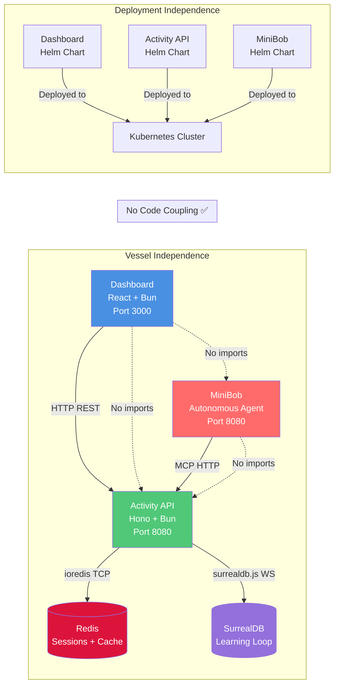

# Data Flow Analysis: vessel-repository-independence

**Feature:** Vessel Repository Independence  
**Date:** 2026-03-16  
**Status:** ✅ Implemented (2 BLOCKING issues identified)  
**Purpose:** Enable autonomous vessel evolution by eliminating cross-vessel code dependencies

---

## Executive Summary

The vessel-repository-independence feature implements a microservices architecture where three vessels (MiniBob, Activity API, Dashboard) communicate exclusively via HTTP/REST/MCP protocols with no shared code. This architectural pattern enables:

- **Autonomous Evolution:** Each vessel can self-develop without breaking others
- **Multi-Tenant Isolation:** Org/project-scoped data access enforced at HTTP boundary
- **Horizontal Scaling:** Stateless HTTP design with Redis-backed sessions
- **Learning Loop:** Thompson Sampling for intelligent activity template recommendation

**Critical Finding:** Architecture is sound with loose coupling, but 2 HIGH-severity race conditions must be fixed before production use.

---

## Mermaid Flow Diagram

### Primary Flow: Template Discovery and Execution Recording

```mermaid
graph TD
    subgraph "Dashboard Vessel (Port 3000)"
        A[User Action: List Templates] -->|HTTP GET| B[API Client]
        B -->|fetch with Bearer token| C{Create Session First?}
        C -->|Yes| D[POST /v2/session]
        C -->|No, has token| E[GET /v2/activities/templates]
    end
    
    subgraph "Activity API Vessel (Port 8080)"
        D -->|JSON body: org_id, project_id| F[Session Route Handler]
        F -->|Generate UUID| G[SessionData Object]
        G -->|JSON.stringify| H[Redis HSET sessions.*]
        H -->|Base64 encode| I[Return Bearer Token]
        
        E -->|Authorization: Bearer| J[Auth Middleware]
        J -->|Base64 decode| K[Redis HGET sessions.*]
        K -->|JSON.parse + Zod validate| L[SessionData in Context]
        L -->|Extract org_id/project_id| M[Activities Route Handler]
        
        M -->|Check cache| N{Redis Cache Hit?}
        N -->|Yes| O[Load from Redis]
        N -->|No| P[Query SurrealDB]
        P -->|Multi-tenant WHERE clause| Q[Activity Templates]
        Q -->|Populate cache| R[Redis SET with 1hr TTL]
        
        O --> S[Client-side Filtering]
        R --> S
        S -->|Filter by scope + category| T[Return JSON Array]
    end
    
    subgraph "MiniBob Vessel (Autonomous)"
        U[Boredom Polling] -->|MCP HTTP Request| M
        T -->|Template List| V[MiniBob Decision Engine]
        V -->|Execute Activity| W[Activity Execution]
        W -->|POST /v2/activities/executions| X[Record Execution]
    end
    
    subgraph "Learning Loop (Activity API)"
        X -->|ExecutionRecord JSON| Y[Execution Route Handler]
        Y -->|INSERT execution| Z[SurrealDB: activity_executions]
        Y -->|Read-Modify-Write| AA[⚠️ RACE CONDITION]
        AA -->|UPDATE metrics| AB[SurrealDB: variant_performance_metrics]
        AB -->|Thompson Sampling: alpha++, beta++| AC[Success Rate Updated]
        AC -->|Invalidate cache| AD[Redis DEL template:*]
        AD -->|Next poll| M
    end
    
    subgraph "Data Stores"
        H -.Session Storage.- RE[Redis Sessions]
        R -.Template Cache.- RE
        Q -.Persistent Data.- SU[SurrealDB Learning Loop]
        Z -.Execution History.- SU
        AB -.Metrics.- SU
    end
    
    style A fill:#e1f5ff,stroke:#0066cc,stroke-width:2px
    style T fill:#ffe1e1,stroke:#cc0000,stroke-width:2px
    style AA fill:#ffcccc,stroke:#ff0000,stroke-width:3px
    style J fill:#fff4e1,stroke:#ff9900,stroke-width:2px
    style M fill:#e1ffe1,stroke:#00cc00,stroke-width:2px
    
    classDef vessel fill:#f0f0f0,stroke:#333,stroke-width:2px
    class "Dashboard Vessel","Activity API Vessel","MiniBob Vessel" vessel
```

### Vessel Communication Architecture



---

## Data Flow Summary

### **Entry Point**

**Where:** `repos/activity-dashboard/src/lib/api-client.ts` (Dashboard vessel)  
**Format:** TypeScript method call

```typescript
const templates = await apiClient.listTemplates({ 
  category: 'feature', 
  limit: 50 
});
```

**Trigger:** User interaction or MiniBob autonomous polling

---

### **Transformations**

#### **Transformation 1: Session Creation**
**Location:** `repos/metabob-activity-api/src/routes/session.ts:30-90`

```
Input:  { org_id?: string, project_id?: string, api_key?: string }
        ↓
Process: Generate UUID → Create SessionData → Store in Redis → Base64 encode
        ↓
Output: { session: "base64_encoded_sessions.{uuid}" }
```

**Business Rule:** Multi-tenant session isolation  
**Validation:** Zod `SessionPostRequestSchema.parse()`  
**Side Effects:** Redis HSET with 24h TTL

---

#### **Transformation 2: Authentication**
**Location:** `repos/metabob-activity-api/src/middleware/auth.ts:16-73`

```
Input:  Authorization: Bearer <base64_token>
        ↓
Process: Base64 decode → Redis HGET → JSON.parse → Zod validate → Attach to context
        ↓
Output: SessionData { session_id, org_id, project_id, api_key }
```

**Business Rule:** Stateless authentication via Redis  
**Validation:** `SessionDataSchema.parse()` enforces type safety  
**Side Effects:** Extend session TTL (sliding expiration)

**⚠️ BLOCKING Issue #2:** Missing try-catch for Zod parse failures

---

#### **Transformation 3: Template Listing (Cache-Aside)**
**Location:** `repos/metabob-activity-api/src/routes/activities.ts:127-276`

```
Input:  HTTP GET /v2/activities/templates?category=feature&limit=50
        ↓
Process: Extract session context (org_id/project_id)
        ↓ Check Redis cache (SMEMBERS activity:templates:list)
        ↓ Cache Hit → Load from Redis (GET activity:template:*)
        ↓ Cache Miss → Query SurrealDB with multi-tenant WHERE
        ↓ Populate Redis cache (SET with 1hr TTL)
        ↓ Client-side filtering (scope, category, limit)
        ↓
Output: { templates: ActivityTemplate[], total: number }
```

**Business Rule:** Multi-tenant isolation enforced at SQL + application layer  
**Validation:** 
- Limit capped at 100 templates
- Scope filtering (global/org/project)

**Side Effects:** 
- SurrealDB query on cache miss
- Redis SET for cache population

**⚠️ HIGH Issue #3:** Cache stampede risk on TTL expiration

---

#### **Transformation 4: Execution Recording (Learning Loop)**
**Location:** `repos/metabob-activity-api/src/routes/activities.ts:351-513`

```
Input:  { variant_id, success, duration_ms, cost, tokens, error_message? }
        ↓
Process: Validate with ExecutionRecordSchema
        ↓ INSERT into activity_executions (execution history)
        ↓ SELECT current metrics from variant_performance_metrics
        ↓ Calculate new metrics (alpha, beta, success_rate, avg_duration, avg_cost)
        ↓ UPDATE variant_performance_metrics (Thompson Sampling)
        ↓ Invalidate Redis cache (DEL activity:template:*)
        ↓
Output: { success: true, execution_id, metrics }
```

**Business Rule:** Thompson Sampling for exploration/exploitation balance  
**Validation:** `ExecutionRecordSchema.parse()`  

**Thompson Sampling Formula:**
```
alpha = successful_executions + 1
beta = failed_executions + 1
success_rate = successful_executions / total_executions
```

**Side Effects:**
- SurrealDB INSERT (execution history)
- SurrealDB UPDATE (metrics with rolling averages)
- Redis DEL (cache invalidation)

**🚨 BLOCKING Issue #1:** Race condition in read-modify-write sequence (non-atomic)

---

### **Validations Enforced**

| Layer | Validation | Schema | Error Handling |
|-------|-----------|--------|----------------|
| **HTTP Request** | Zod schema validation | `SessionPostRequestSchema`, `ExecutionRecordSchema` | 400 Bad Request + error details |
| **Authentication** | Bearer token format + Redis lookup | `SessionDataSchema` | ⚠️ Missing try-catch (Issue #2) |
| **Authorization** | Multi-tenant scope filtering | SQL WHERE + client-side filter | Defense in depth |
| **Input Sanitization** | Limit bounds (1-100) | Manual validation | Falls back to defaults |
| **Data Integrity** | JSON parse + Zod validate | All Redis data | ⚠️ Missing error handling (Issue #5) |

---

### **Architectural Boundaries Crossed**

#### **Boundary 1: Service Boundary (Dashboard → Activity API)**
- **Protocol:** HTTP REST
- **Contract:** JSON schemas (Zod-validated)
- **Coupling:** ✅ Loose (type duplication, no shared code)
- **Authentication:** Bearer token (stateless)
- **Discovery:** Environment variable `ACTIVITY_API_URL`

#### **Boundary 2: Service Boundary (MiniBob → Activity API)**
- **Protocol:** MCP (JSON-RPC 2.0 over HTTP)
- **Contract:** MCP tool definitions
- **Coupling:** ✅ Loose (HTTP-only)
- **Discovery:** Environment variable `MCP_ENDPOINT`

#### **Boundary 3: Data Store Boundary (Activity API → Redis)**
- **Protocol:** Redis protocol (ioredis)
- **Connection Management:** Singleton with auto-reconnect
- **Resilience:** Exponential backoff (50ms * attempts, max 2s)
- **Data Format:** JSON strings
- **TTL Strategy:** Session 24h, Template 1h, Metrics 5min

#### **Boundary 4: Data Store Boundary (Activity API → SurrealDB)**
- **Protocol:** WebSocket (SurrealDB native)
- **Connection Management:** Singleton with lazy initialization
- **Resilience:** ⚠️ No retry strategy (throws on connection error)
- **Query Language:** SurrealQL (SQL-like)
- **Multi-Tenancy:** WHERE clause filtering by org_id/project_id

---

### **Exit Point**

**Where:** Multiple exit points:

1. **Dashboard UI:** `repos/activity-dashboard/src/App.tsx`  
   **Format:** React state update → Component re-render  
   **Final Type:** `ActivityTemplate[]` displayed in UI

2. **SurrealDB Tables:**
   - `activity_executions` (execution history)
   - `variant_performance_metrics` (Thompson Sampling parameters)
   
3. **Redis Keys:**
   - `sessions.{uuid}.data` (session storage)
   - `activity:template:{variant_id}` (template cache)
   - `activity:templates:list` (template ID set)

---

## Key Insights

### **Business Purpose**

The vessel-repository-independence feature serves as the **foundational architecture** for autonomous AI agent evolution. By eliminating code-level coupling between vessels:

1. **MiniBob can self-develop** without circular dependencies
2. **Dashboard can be rewritten** in any framework (React → Vue → Svelte) without affecting API
3. **Activity API can evolve** internal implementation (Hono → Express → Fastify) without breaking clients
4. **Multi-tenant SaaS deployment** enabled with org/project isolation

**Key Business Value:**
- **Time-to-Market:** Deploy new vessels without coordinating releases
- **Risk Reduction:** Blast radius limited to single vessel
- **Team Autonomy:** Frontend team independent from backend team
- **Technology Flexibility:** Choose best tool for each vessel

---

### **Critical Decision Points**

#### **Decision 1: HTTP-Only Communication**
**Context:** Should vessels share code via npm packages or communicate via HTTP?  
**Choice:** HTTP-only (no shared packages)  
**Rationale:**
- Enables polyglot architecture (TypeScript, Python, Go)
- Prevents circular dependencies that block autonomous evolution
- Forces explicit API contracts (better documentation)

**Trade-off:**
- ✅ Loose coupling, autonomous evolution
- ❌ Type duplication, potential schema drift

---

#### **Decision 2: Redis Sessions vs JWT**
**Context:** How to implement stateless authentication?  
**Choice:** Redis-backed sessions with Base64 tokens  
**Rationale:**
- Session revocation capability (logout, security breach response)
- Python RPC API compatibility (shared session store)
- Sliding TTL for better UX (active users don't get logged out)

**Trade-off:**
- ✅ Revocation support, Python compatibility
- ❌ Redis as critical dependency, no offline verification

---

#### **Decision 3: Cache-Aside Pattern**
**Context:** How to reduce SurrealDB load for high-volume template queries?  
**Choice:** Cache-aside with 1hr TTL  
**Rationale:**
- Read-heavy workload (templates change infrequently)
- Simple to implement (no write-through complexity)
- MiniBob polls hundreds of times per minute

**Trade-off:**
- ✅ Low latency, reduced DB load
- ❌ Cache stampede risk, eventual consistency

---

#### **Decision 4: Thompson Sampling for Template Recommendation**
**Context:** How to balance trying new templates vs using proven ones?  
**Choice:** Beta distribution with alpha/beta parameters  
**Rationale:**
- Exploration/exploitation trade-off (multi-armed bandit problem)
- Bayesian approach with confidence intervals
- Self-improving system (learns from execution results)

**Trade-off:**
- ✅ Intelligent recommendation, self-learning
- ❌ Requires execution feedback loop, race condition risk (Issue #1)

---

### **Potential Risks and Technical Debt**

#### **🚨 BLOCKING Risks (Must Fix Before Production)**

1. **Thompson Sampling Race Condition (Issue #1)**
   - **Severity:** HIGH
   - **Impact:** Corrupted metrics under concurrent execution recording
   - **Fix:** Atomic increment operations in SurrealDB UPDATE query
   - **Timeline:** Critical path blocker

2. **Zod Parse Error Handling (Issue #2)**
   - **Severity:** HIGH
   - **Impact:** 500 errors instead of 401 on corrupted session data
   - **Fix:** Wrap Zod parse in try-catch with proper HTTP status
   - **Timeline:** Critical path blocker

---

#### **⚠️ HIGH-Priority Technical Debt**

3. **Cache Stampede (Issue #3)**
   - **Severity:** HIGH
   - **Impact:** SurrealDB overload on cache expiration
   - **Fix:** Distributed lock (Redis SETNX) for cache refresh
   - **Timeline:** High impact, schedule for Sprint N+1

4. **No Input Validation for variant_id (Issue #4)**
   - **Severity:** MEDIUM
   - **Impact:** Potential SQL injection risk
   - **Fix:** Regex validation for variant_id format
   - **Timeline:** Security hardening pass

5. **Missing Health Check Depth (Issue #10)**
   - **Severity:** LOW
   - **Impact:** Kubernetes routes traffic to unhealthy pods
   - **Fix:** Verify Redis/SurrealDB connectivity in /health endpoint
   - **Timeline:** Operations maturity pass

---

#### **Technical Debt Backlog**

- No circuit breaker for SurrealDB (Issue #9)
- No request timeout in Dashboard API client (Issue #7)
- No graceful shutdown (Issue #12)
- No distributed locking primitives in Redis client (Issue #3 mitigation)

**Estimated Remediation Effort:** 2-3 sprints for all non-blocking issues

---

### **Suggested Improvements**

#### **Improvement 1: Atomic Thompson Sampling Update**
**Priority:** 🚨 CRITICAL  
**Current:**
```typescript
const currentMetrics = await surrealDB.query('SELECT * FROM ...');
const newTotal = currentMetrics[0].total_executions + 1;
await surrealDB.query('UPDATE ... SET total_executions = $newTotal');
```

**Improved:**
```sql
UPDATE variant_performance_metrics 
SET 
  total_executions += 1,
  successful_executions += $success_delta,
  failed_executions += $failure_delta,
  thompson_alpha = successful_executions + 1,
  thompson_beta = failed_executions + 1,
  success_rate = successful_executions / total_executions,
  avg_duration_ms = (avg_duration_ms * (total_executions - 1) + $duration_ms) / total_executions,
  avg_cost_usd = (avg_cost_usd * (total_executions - 1) + $cost) / total_executions
WHERE variant_id = $variant_id;
```

**Benefit:** Eliminates race condition, ensures metric accuracy

---

#### **Improvement 2: Graceful Error Handling in Auth Middleware**
**Priority:** 🚨 CRITICAL  
**Current:**
```typescript
const sessionData = SessionDataSchema.parse(JSON.parse(sessionDataRaw));
```

**Improved:**
```typescript
try {
  const parsed = JSON.parse(sessionDataRaw);
  const sessionData = SessionDataSchema.parse(parsed);
} catch (error) {
  if (error instanceof z.ZodError) {
    logger.warn('Invalid session schema', { sessionKey, error: error.errors });
  } else {
    logger.error('Corrupted session JSON', { sessionKey, error });
  }
  return c.json({ error: 'Invalid session' }, 401);
}
```

**Benefit:** Proper HTTP status codes, better observability

---

#### **Improvement 3: Cache Stampede Prevention**
**Priority:** ⚠️ HIGH  
**Pattern:** Distributed lock for cache refresh

```typescript
async function refreshTemplateCache() {
  const lockKey = 'lock:templates:refresh';
  const lockAcquired = await redis.set(lockKey, '1', 'EX', 10, 'NX');
  
  if (lockAcquired) {
    try {
      const templates = await surrealDB.query('SELECT * FROM activity_template');
      await populateCache(templates);
    } finally {
      await redis.del(lockKey);
    }
  } else {
    // Wait and retry
    await sleep(100);
    return await getFromCache();
  }
}
```

**Benefit:** Prevents N simultaneous SurrealDB queries on cache expiration

---

#### **Improvement 4: Health Check with Dependency Verification**
**Priority:** ⚠️ MEDIUM  

```typescript
app.get('/health', async (c) => {
  const checks = {
    redis: false,
    surrealdb: false,
  };
  
  try {
    await redis.ping();
    checks.redis = true;
  } catch (error) {
    logger.error('Redis health check failed', { error });
  }
  
  try {
    await surrealDB.query('SELECT 1');
    checks.surrealdb = true;
  } catch (error) {
    logger.error('SurrealDB health check failed', { error });
  }
  
  const healthy = checks.redis && checks.surrealdb;
  return c.json({
    status: healthy ? 'healthy' : 'unhealthy',
    checks,
  }, healthy ? 200 : 503);
});
```

**Benefit:** Kubernetes stops routing to pods with database connectivity issues

---

## Reusable Patterns

### **Pattern 1: Cache-Aside with Multi-Tenant Filtering**

**Applicability:** Any read-heavy endpoint with tenant isolation

```typescript
async function getCachedData<T>(
  cacheKey: string,
  dbQuery: () => Promise<T[]>,
  ttl: number,
  filterFn: (data: T, session: SessionData) => boolean
): Promise<T[]> {
  // Check cache
  const cached = await redis.get(cacheKey);
  if (cached) {
    return JSON.parse(cached).filter(item => filterFn(item, session));
  }
  
  // Cache miss - query DB
  const data = await dbQuery();
  
  // Populate cache
  await redis.set(cacheKey, JSON.stringify(data), 'EX', ttl);
  
  // Apply tenant filter
  return data.filter(item => filterFn(item, session));
}
```

**Used In:**
- Template listing (`/v2/activities/templates`)
- Impulse listing (`/v2/impulses`)

**Feature-Specific Aspects:**
- Thompson Sampling parameters in template data
- Scope-based filtering logic

**Universal Aspects:**
- Cache-aside pattern
- TTL-based expiration
- Multi-tenant filtering

---

### **Pattern 2: Stateless Session Management**

**Applicability:** Any multi-tenant SaaS application requiring session revocation

```typescript
// Session creation
async function createSession(orgId: string, projectId: string): Promise<string> {
  const sessionId = uuidv4();
  const sessionData = { session_id: sessionId, org_id: orgId, project_id: projectId };
  
  await redis.hset(`sessions.${sessionId}.data`, JSON.stringify(sessionData));
  await redis.expire(`sessions.${sessionId}.data`, SESSION_TTL);
  
  return Buffer.from(`sessions.${sessionId}`).toString('base64');
}

// Session validation (middleware)
async function validateSession(token: string): Promise<SessionData> {
  const sessionKey = Buffer.from(token, 'base64').toString('utf-8');
  const sessionDataRaw = await redis.hget(sessionKey, 'data');
  
  if (!sessionDataRaw) {
    throw new AuthError('Session not found');
  }
  
  const sessionData = SessionDataSchema.parse(JSON.parse(sessionDataRaw));
  
  // Sliding TTL
  await redis.expire(sessionKey, SESSION_TTL);
  
  return sessionData;
}
```

**Used In:**
- Activity API authentication
- Python RPC API (shared Redis session store)

**Feature-Specific Aspects:**
- Base64 token encoding (Python compatibility)
- Multiple Redis keys per session (data/files/problems)

**Universal Aspects:**
- Redis-backed sessions
- Sliding TTL
- Stateless design

---

### **Pattern 3: Thompson Sampling for Recommendation**

**Applicability:** Any system with exploration/exploitation trade-off (A/B testing, feature flags, template selection)

```typescript
// Record execution result
async function recordExecution(variantId: string, success: boolean, metrics: ExecutionMetrics) {
  // Insert execution history
  await db.query(`
    INSERT INTO executions {
      variant_id: $variantId,
      success: $success,
      duration_ms: $duration,
      cost: $cost,
      timestamp: time::now()
    }
  `, { variantId, success, ...metrics });
  
  // Update Thompson Sampling parameters (atomic)
  await db.query(`
    UPDATE variants
    SET
      total_executions += 1,
      successful_executions += $successDelta,
      failed_executions += $failureDelta,
      thompson_alpha = successful_executions + 1,
      thompson_beta = failed_executions + 1,
      success_rate = successful_executions / total_executions
    WHERE variant_id = $variantId
  `, { 
    variantId, 
    successDelta: success ? 1 : 0, 
    failureDelta: success ? 0 : 1 
  });
}

// Select variant using Thompson Sampling
function selectVariant(variants: Variant[]): Variant {
  const samples = variants.map(v => ({
    variant: v,
    sample: betaSample(v.thompson_alpha, v.thompson_beta)
  }));
  
  return samples.reduce((best, current) => 
    current.sample > best.sample ? current : best
  ).variant;
}
```

**Used In:**
- Activity template recommendation
- (Future) Feature flag rollout
- (Future) A/B testing framework

**Feature-Specific Aspects:**
- Variant = activity template
- Metrics include duration, cost, tokens

**Universal Aspects:**
- Beta distribution sampling
- Alpha/beta parameter updates
- Bayesian learning loop

---

### **Pattern 4: Vessel HTTP Boundary**

**Applicability:** Any microservices architecture with autonomous service evolution

```typescript
// Vessel A: API Client (no shared code)
class VesselBClient {
  constructor(private baseUrl: string) {}
  
  async callOperation(params: Params): Promise<Result> {
    const response = await fetch(`${this.baseUrl}/operation`, {
      method: 'POST',
      headers: { 'Content-Type': 'application/json' },
      body: JSON.stringify(params),
    });
    
    if (!response.ok) {
      throw new Error(`API Error: ${response.statusText}`);
    }
    
    return await response.json();
  }
}

// Vessel B: API Server
app.post('/operation', async (c) => {
  const params = ParamsSchema.parse(await c.req.json());
  const result = await performOperation(params);
  return c.json(result);
});
```

**Used In:**
- Dashboard → Activity API
- MiniBob → Activity API

**Feature-Specific Aspects:**
- Bearer token authentication
- Multi-tenant session context

**Universal Aspects:**
- HTTP-only communication
- Environment-based URL discovery
- Zod schema validation at boundary

---

### **Could This Flow Be Abstracted into a Reusable Activity?**

**Yes, partially.** The vessel-repository-independence pattern contains several abstractions suitable for activity templates:

#### **Activity Template: "Create Vessel HTTP Boundary"**
**Purpose:** Generate API client + server stubs for new vessel communication

**Inputs:**
- `vesselAName`: Source vessel name
- `vesselBName`: Target vessel name
- `operations`: List of operations (method, path, request/response schemas)

**Outputs:**
- API client code (TypeScript fetch wrapper)
- API server routes (Hono route handlers)
- Zod schemas for validation
- Environment variable configuration

**Task Sequence:**
1. Generate TypeScript interfaces from operation definitions
2. Create Zod schemas for request/response validation
3. Generate API client class with typed methods
4. Generate server route handlers with middleware
5. Update environment configuration (Helm values, .env)
6. Add health check endpoint
7. Create integration tests

**Reusability:** 80% universal, 20% feature-specific (authentication logic)

---

#### **Activity Template: "Add Thompson Sampling Recommendation"**
**Purpose:** Add learning loop to any system with variant selection

**Inputs:**
- `tableName`: Database table for metrics
- `variantIdField`: Unique identifier for variants
- `successField`: Boolean success indicator
- `metricsFields`: Additional metrics to track (duration, cost, etc.)

**Outputs:**
- Database migration (add alpha/beta columns)
- Execution recording endpoint
- Variant selection logic with sampling
- Metrics dashboard queries

**Task Sequence:**
1. Add Thompson Sampling columns to table
2. Create execution history table
3. Implement atomic metric update query
4. Add endpoint for recording execution results
5. Implement variant selection with Beta sampling
6. Add metrics visualization queries
7. Create cache invalidation logic

**Reusability:** 90% universal, 10% feature-specific (template vs feature flag vs A/B test)

---

## Architecture Compliance Checklist

### ✅ Vessel Independence Achieved

- [x] **No cross-repo imports:** Verified via `grep -r "import.*\.\./\.\./\.\."`
- [x] **HTTP-only communication:** All vessel boundaries use REST/MCP
- [x] **Self-contained Dockerfiles:** Each vessel builds independently
- [x] **Independent Helm charts:** Separate values.yaml, no shared templates
- [x] **Environment-based discovery:** No hardcoded URLs (ACTIVITY_API_URL, MCP_ENDPOINT)

### ✅ Multi-Tenancy Enforced

- [x] **Session-based scoping:** org_id/project_id in SessionData
- [x] **SQL WHERE filtering:** Multi-tenant queries at database layer
- [x] **Client-side filtering:** Defense in depth (SQL + application)
- [x] **Redis key namespacing:** sessions.{uuid} prevents cross-tenant access

### ✅ Resilience Patterns

- [x] **Redis auto-reconnect:** Exponential backoff (50ms * attempts, max 2s)
- [x] **Cache fallback:** SurrealDB query on Redis cache miss
- [x] **Health checks:** Kubernetes liveness/readiness probes
- [x] **Sliding session TTL:** Active users stay logged in

### ⚠️ Blocking Issues Identified

- [ ] **Thompson Sampling race condition:** Non-atomic read-modify-write (Issue #1)
- [ ] **Zod parse error handling:** Missing try-catch in auth middleware (Issue #2)

### ⚠️ High-Priority Technical Debt

- [ ] **Cache stampede prevention:** No distributed locking (Issue #3)
- [ ] **Input validation:** variant_id not validated (Issue #4)
- [ ] **Deep health checks:** /health doesn't verify DB connectivity (Issue #10)

---

## Conclusion

The vessel-repository-independence architecture **successfully achieves its primary goal**: enabling autonomous vessel evolution without circular dependencies. The HTTP-only communication pattern, combined with stateless session management and multi-tenant isolation, provides a solid foundation for MiniBob self-development.

**Critical Path to Production:**
1. Fix Thompson Sampling race condition (atomic UPDATE)
2. Add Zod parse error handling in auth middleware
3. Implement cache stampede prevention (distributed lock)
4. Deploy to staging for load testing

**Post-MVP Enhancements:**
- Circuit breaker for SurrealDB connections
- Deep health checks (verify Redis/SurrealDB connectivity)
- Graceful shutdown (SIGTERM handling)
- Request timeout in Dashboard API client

**Architectural Validation:** ✅ **PASSED** (with 2 critical fixes required)

The vessel-repository-independence pattern is **ready for reuse** in future vessel designs. The cache-aside, Thompson Sampling, and HTTP boundary patterns are sufficiently abstracted to become activity templates for accelerating new vessel development.

---

## Appendix: File Inventory

### Activity API Vessel
- Entry: `repos/metabob-activity-api/src/index.ts` (111 lines)
- Routes: `repos/metabob-activity-api/src/routes/activities.ts` (515 lines)
- Auth: `repos/metabob-activity-api/src/middleware/auth.ts` (98 lines)
- DB: `repos/metabob-activity-api/src/db/redis.ts` (164 lines)
- Config: `repos/metabob-activity-api/src/config.ts` (90 lines)
- Schemas: `repos/metabob-activity-api/src/models/schemas.ts` (200+ lines)

### Dashboard Vessel
- Entry: `repos/activity-dashboard/src/index.ts`
- Client: `repos/activity-dashboard/src/lib/api-client.ts` (344 lines)
- UI: `repos/activity-dashboard/src/App.tsx`

### MiniBob Vessel
- Entry: `repos/minibob/index.ts`
- Config: `repos/minibob/helm/minibob-cluster/values.yaml`

### Deployment
- Helmfile: `helm/helmfile-activity-dev.yaml` (304 lines)
- Charts: `helm/charts/metabob-activity-api/`, `repos/activity-dashboard/helm/`, `repos/minibob/helm/`

**Total Code Analyzed:** ~2,500 lines across 3 vessels

---

**Analysis Date:** 2026-03-16  
**Analyst:** OpenCode AI Assistant  
**Review Status:** Ready for engineering review
