# Deployment Validation Workflow

**Specification**: playwright-validation-workflow  
**Status**: ✅ FULLY IMPLEMENTED  
**Last Updated**: 2026-03-16

---

## Overview

This document describes the automated deployment validation workflow for the Activity System using Playwright MCP for browser-based validation.

**Purpose**: Validate that the Activity System deployment is functional and ready for use by testing health endpoints and session creation with automated screenshot capture.

**Architecture**: Uses Playwright MCP tools instead of curl for visual proof and browser-based validation.

---

## Workflow Components

### 1. Automated Validation Script
**File**: `scripts/validate-deployment-playwright.sh`  
**Purpose**: Orchestrates the complete validation workflow

**Features**:
- ✅ Kubernetes pod health checks
- ✅ Automated port-forward management
- ✅ Playwright MCP integration for HTTP validation
- ✅ Automated screenshot capture with timestamps
- ✅ Automated report generation
- ✅ CI/CD-ready (zero manual intervention)

### 2. Validation Report
**File**: `FINAL_VALIDATION_REPORT.md`  
**Purpose**: Document validation results with pass/fail status

**Sections**:
- Overall status and pass rate
- Deployment status (pods)
- Validation test results
- Screenshot references
- Success criteria checklist
- Architecture notes

### 3. Screenshots
**Directory**: `screenshots/`  
**Naming Convention**: `{test-name}-{timestamp}.png`

**Examples**:
- `01-activity-api-health-2026-03-17T06-19-53-519Z.png`
- `02-session-creation-2026-03-17T06-19-58-980Z.png`

---

## Workflow Steps

### Step 1: Pre-Check
Verify all pods are running in the `activity-system` namespace.

```bash
kubectl get pods -n activity-system
```

**Expected**: All pods in `Running` state

### Step 2: Port Forward
Start port-forward to the Activity API service on localhost:8080.

```bash
kubectl port-forward -n activity-system svc/metabob-activity-api 8080:8080
```

**Expected**: Port-forward establishes successfully

### Step 3: Health Check Validation
Use Playwright MCP to validate the `/health` endpoint.

**MCP Tools Used**:
- `playwright_playwright_navigate` - Navigate to health endpoint
- `playwright_playwright_screenshot` - Capture screenshot

**Expected**:
- HTTP 200 OK response
- Valid JSON structure with health status
- Screenshot saved to `screenshots/01-activity-api-health-{timestamp}.png`

### Step 4: Session Creation Validation
Use Playwright MCP to validate the `/v2/session` endpoint.

**MCP Tools Used**:
- `playwright_playwright_post` - POST request to create session
- `playwright_playwright_navigate` - Navigate to show response
- `playwright_playwright_screenshot` - Capture screenshot

**Expected**:
- HTTP 201 Created response
- Response contains Base64 token
- Screenshot saved to `screenshots/02-session-creation-{timestamp}.png`

### Step 5: Report Generation
Generate `FINAL_VALIDATION_REPORT.md` with all test results.

**Content**:
- Deployment status summary
- Test results with pass/fail status
- Screenshot references
- Success criteria checklist
- Overall pass rate

---

## Usage

### Basic Usage

Run the validation script from the project root:

```bash
./scripts/validate-deployment-playwright.sh
```

### Expected Output

```
================================================================================
ACTIVITY SYSTEM DEPLOYMENT VALIDATION (Playwright MCP)
================================================================================

[INFO] Checking pods in namespace: activity-system
  - metabob-activity-api-xxx: Running
  - metabob-surrealdb-xxx: Running
[✓] All pods are running

[INFO] Starting port-forward to activity-system/metabob-activity-api:8080
[✓] Port-forward started (PID: 12345)

[INFO] Test 1: Health Check Endpoint
  ✓ Navigated to health endpoint
  ✓ Screenshot captured: screenshots/01-activity-api-health-2026-03-17T06-19-53-519Z.png
[✓] Health check test passed

[INFO] Test 2: Session Creation Endpoint
  ✓ POST request to session endpoint successful
  ✓ Screenshot captured: screenshots/02-session-creation-2026-03-17T06-19-58-980Z.png
[✓] Session creation test passed

[INFO] Generating validation report: FINAL_VALIDATION_REPORT.md
[✓] Report written to: FINAL_VALIDATION_REPORT.md

================================================================================
VALIDATION COMPLETE: PASS ✅
================================================================================
Duration: 12s
Pass Rate: 100% (2/2)
Report: FINAL_VALIDATION_REPORT.md
================================================================================
```

### Exit Codes

- `0` - All tests passed
- `1` - One or more tests failed

---

## Integration with Existing Validation

The existing `validate-activity-system.sh` script now references the Playwright validation workflow:

```bash
./scripts/validate-activity-system.sh
```

**Output includes**:
```
[INFO] You can now:
  1. Test activity execution via minibob
  2. Access API endpoints via port-forwarding
  3. Query SurrealDB for learning loop data
  4. Run Playwright validation: ./scripts/validate-deployment-playwright.sh
```

---

## Success Criteria

The validation workflow checks the following success criteria:

- [x] All pods running in activity-system namespace
- [x] Health endpoint returns 200 OK with valid JSON
- [x] Health check screenshot captured with timestamp
- [x] Session creation returns 201 with Base64 token
- [x] Session creation screenshot captured with timestamp
- [x] FINAL_VALIDATION_REPORT.md generated
- [x] Workflow completes in under 2 minutes
- [x] Zero manual intervention required

---

## Architecture Notes

### Why Playwright MCP vs curl?

| Feature | curl | Playwright MCP |
|---------|------|----------------|
| HTTP validation | ✅ | ✅ |
| Visual proof | ❌ | ✅ Screenshots |
| Browser rendering | ❌ | ✅ |
| JavaScript execution | ❌ | ✅ |
| DOM inspection | ❌ | ✅ |
| CI/CD friendly | ✅ | ✅ |

**Key Benefits**:
- **Visual proof**: Screenshots provide evidence of successful validation
- **Browser-based**: Validates full rendering, not just HTTP response
- **Repeatable**: Automated workflow with consistent results
- **CI/CD-ready**: No manual intervention required

### Architectural Boundaries

**Kubernetes Boundary**:
- Crossing: kubectl CLI → Kubernetes API
- Protocol: Shell command execution
- Coupling: TIGHT (namespace hardcoded)

**Playwright MCP Boundary**:
- Crossing: OpenCode MCP Client → Playwright MCP Server
- Protocol: MCP HTTP
- Coupling: LOOSE (MCP abstraction)

**Filesystem Boundary**:
- Crossing: Shell → Local filesystem
- Protocol: File I/O
- Coupling: LOOSE (portable paths)

---

## Data Flow

```mermaid
graph LR
    A[kubectl get pods] --> B[Verify all Running]
    B --> C[kubectl port-forward 8080]
    C --> D[playwright_playwright_navigate /health]
    D --> E[playwright_playwright_screenshot]
    E --> F[playwright_playwright_post /v2/session]
    F --> G[playwright_playwright_screenshot]
    G --> H[Generate FINAL_VALIDATION_REPORT.md]
    
    style A fill:#9f9,stroke:#333
    style H fill:#9f9,stroke:#333
```



---

## Troubleshooting

### Port-forward fails

**Symptom**: Port-forward process exits immediately

**Solution**:
```bash
# Check if port 8080 is already in use
lsof -i :8080

# Kill existing port-forward
pkill -f "port-forward.*8080"

# Retry validation
./scripts/validate-deployment-playwright.sh
```

### Playwright MCP not available

**Symptom**: `opencode mcp call playwright` fails

**Solution**:
```bash
# Check MCP configuration
opencode mcp list

# Ensure Playwright MCP is configured in opencode.json
cat opencode.json | jq '.mcp'

# Restart MCP server if needed
opencode mcp reload
```

### Screenshots not captured

**Symptom**: Screenshot files not created in screenshots/

**Solution**:
```bash
# Ensure screenshots directory exists
mkdir -p screenshots

# Check Playwright headless mode
# Edit script: set headless to false for debugging
vim scripts/validate-deployment-playwright.sh

# Run in non-headless mode to see browser
```

---

## CI/CD Integration

### GitHub Actions Example

```yaml
name: Deploy and Validate Activity System

on:
  push:
    branches: [main]

jobs:
  deploy-and-validate:
    runs-on: ubuntu-latest
    steps:
      - uses: actions/checkout@v3
      
      - name: Deploy Activity System
        run: ./scripts/deploy-activity-system.sh
      
      - name: Validate Deployment (Playwright)
        run: ./scripts/validate-deployment-playwright.sh
      
      - name: Upload Validation Report
        uses: actions/upload-artifact@v3
        with:
          name: validation-report
          path: |
            FINAL_VALIDATION_REPORT.md
            screenshots/*.png
      
      - name: Comment PR with Results
        if: github.event_name == 'pull_request'
        uses: actions/github-script@v6
        with:
          script: |
            const fs = require('fs');
            const report = fs.readFileSync('FINAL_VALIDATION_REPORT.md', 'utf8');
            github.rest.issues.createComment({
              issue_number: context.issue.number,
              owner: context.repo.owner,
              repo: context.repo.repo,
              body: report
            });
```

---

## Related Documentation

- **Trace Analysis**: `TRACE_ANALYSIS_playwright-validation-workflow.md`
- **Dashboard Validation**: `docs/data-flows/playwright-validation-workflow-flow.md` (different workflow)
- **Validation Harness**: `tests/validation-harnesses/playwright-dashboard-data-accuracy-validation-harness.ts` (different workflow)
- **Deployment Script**: `scripts/validate-activity-system.sh`

---

## Specification Compliance

This workflow fully implements the `playwright-validation-workflow` specification:

| Requirement | Status |
|-------------|--------|
| All pods running and healthy | ✅ |
| Port-forward to localhost:8080 | ✅ |
| Playwright validates /health (200 OK) | ✅ |
| Playwright validates /v2/session (201) | ✅ |
| Screenshots captured with timestamps | ✅ |
| Screenshots saved to screenshots/ | ✅ |
| FINAL_VALIDATION_REPORT.md generated | ✅ |
| Report documents pass/fail status | ✅ |
| Workflow CI/CD-ready | ✅ |

**Automation Level**: 100% ✅  
**Manual Intervention**: None required ✅

---

*Last Updated: 2026-03-16*  
*Maintained by: DevOps Team*
