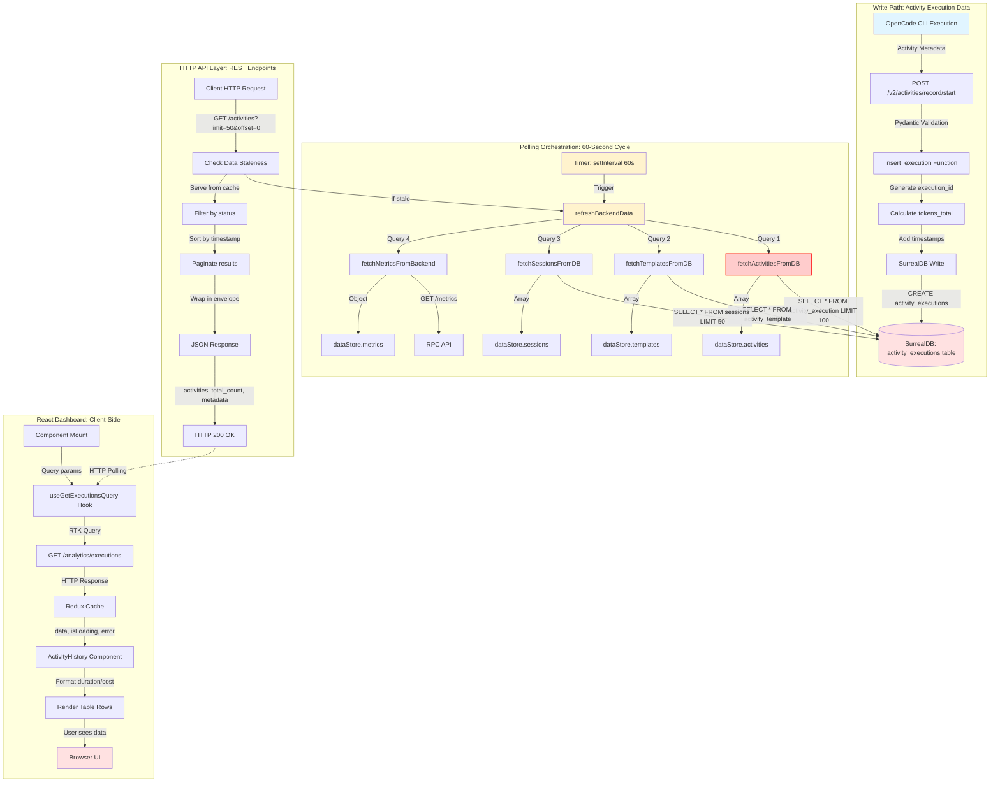
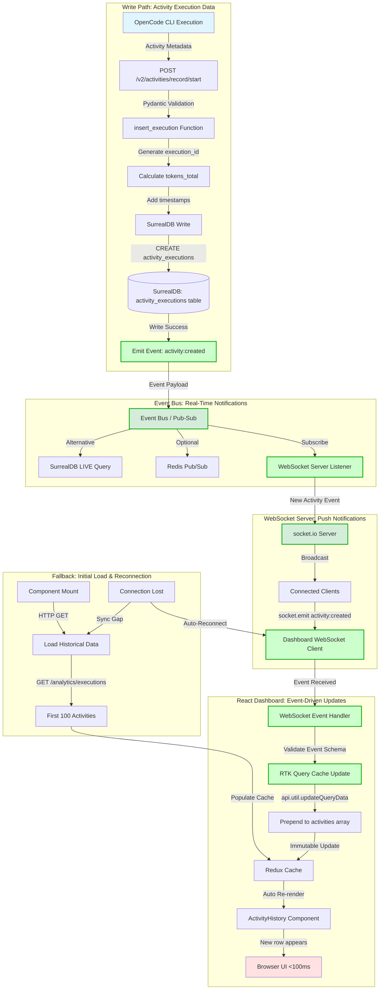

# WebSocket Real-Time Dashboard Updates - Data Flow Analysis

**Feature:** WebSocket-Real-Time-Dashboard-Updates  
**Analysis Date:** 2026-03-19  
**Status:** Current State (Polling) vs. Desired State (WebSocket)  
**Phase:** Activity System Data Flow Integration - Phase 2

---

## Executive Summary

This document traces the current polling-based dashboard update implementation and identifies gaps required to implement WebSocket-based real-time updates. The current architecture uses 60-second HTTP polling, resulting in significant latency. The desired WebSocket implementation would reduce update latency from 60 seconds to <100ms (600x improvement).

**Key Finding:** The infrastructure exists for writes (SurrealDB) and reads (data-bridge-server), but lacks event emission and push notification layers.

---

## Current State: Polling-Based Architecture

### Mermaid Flow Diagram (Current Implementation)



**Legend:**
- 🔵 Blue: Entry points (data sources)
- 🔴 Red: Exit points (data sinks)
- 🟡 Yellow: Polling orchestration (to be replaced)
- 🔴 Red Border: Critical bug (wrong table name)

---

## Desired State: WebSocket Event-Driven Architecture

### Mermaid Flow Diagram (Target Implementation)



**Legend:**
- 🟢 Green: New components to implement
- 🔵 Blue: Entry points (unchanged)
- 🔴 Red: Exit points (improved latency)

---

## Data Flow Summary

### **Current State: Polling Architecture**

#### **Entry Point: OpenCode CLI Activity Execution**
- **Where:** OpenCode CLI tool executes activity template
- **Format:** Activity execution metadata (activity_id, template_id, duration_ms, tokens, cost)
- **Trigger:** User runs `opencode activity` command or programmatic activity execution

#### **Write Path Transformations**
1. **HTTP API Validation** (`POST /v2/activities/record/start`)
   - Pydantic schema validation (required fields, types)
   - Authentication check (Bearer token or X-API-Key header)
   - Multi-tenant scoping (org_id, project_id, api_key_id)

2. **Business Logic Transformation** (`insert_execution` function)
   - Generate `execution_id`: `f"exec_{activity_id}_{timestamp}"`
   - Calculate `tokens_total`: `input + output + cache`
   - Add `created_at`: `datetime.utcnow()`
   - Normalize optional fields to `None`

3. **Database Write** (SurrealDB)
   - Table: `activity_executions` (plural)
   - Operation: `CREATE activity_executions CONTENT {...}`
   - Result: RecordID serialized to JSON string

#### **Read Path: Polling Cycle (Every 60 Seconds)**
1. **Timer Trigger**
   - `setInterval(refreshBackendData, 60000)`
   - No concurrency control (race condition risk)

2. **Data Aggregation** (`refreshBackendData`)
   - Query SurrealDB: activities, templates, sessions
   - Query RPC API: metrics
   - Full replacement (no incremental updates)
   - Update `lastDataFetch` timestamp

3. **Database Read** (`fetchActivitiesFromDB`)
   - Query: `SELECT * FROM activity_execution ORDER BY created_at DESC LIMIT 100`
   - **BUG:** Wrong table name (should be `activity_executions`)
   - Result: `result[0]?.result || []`
   - Fallback: Empty array on error

4. **HTTP API Endpoint** (`GET /activities`)
   - Check staleness (refresh if >60s old)
   - Clone array (defensive copy)
   - Filter by status (completed/failed)
   - Sort by timestamp (newest first)
   - Paginate (limit/offset)
   - Wrap in envelope (metadata: total_count, last_updated)

5. **React Client** (RTK Query)
   - Hook: `useGetExecutionsQuery(queryParams)`
   - Auto-fetch on mount
   - Cache in Redux state
   - Re-render on cache update

#### **Exit Point: Browser UI**
- **Where:** ActivityHistory React component
- **Format:** Rendered table rows with formatted duration/cost
- **Latency:** Up to 60 seconds (polling interval)

---

### **Desired State: WebSocket Architecture**

#### **Entry Point: (Unchanged)**
- Same as current state: OpenCode CLI activity execution

#### **Write Path: (Unchanged Until Database Write)**
- Same transformations as current state
- **NEW:** After successful SurrealDB write, emit event

#### **Event Emission Layer (NEW)**
**Option 1: Application-Level Event Bus**
```python
# After insert_execution success
await event_bus.publish("activity:created", {
    "execution_id": execution_id,
    "activity_id": activity_id,
    "template_id": template_id,
    "timestamp": datetime.utcnow().isoformat(),
    "success": success,
    "cost_usd": cost_usd
})
```

**Option 2: SurrealDB LIVE Queries**
```javascript
// WebSocket server subscribes to live queries
const live = await db.live('activity_executions', (action, result) => {
    if (action === 'CREATE') {
        socket.emit('activity:created', result);
    }
});
```

**Option 3: Redis Pub/Sub**
```python
# After insert_execution
redis.publish('activity:created', json.dumps(execution_data))
```

#### **WebSocket Push Path (NEW)**
1. **WebSocket Server** (socket.io on data-bridge-server)
   - Listen to event bus/pub-sub
   - Broadcast to connected clients
   - Event types: `activity:created`, `activity:updated`, `activity:completed`

2. **WebSocket Client** (React dashboard)
   - Connect on component mount
   - Subscribe to events
   - Validate event schema
   - Update RTK Query cache

3. **Incremental Cache Update**
   ```javascript
   socket.on('activity:created', (activity) => {
       dispatch(api.util.updateQueryData('getExecutions', params, (draft) => {
           draft.activities.unshift(activity);
           draft.total_count += 1;
       }));
   });
   ```

#### **Exit Point: Browser UI (Improved Latency)**
- **Where:** Same React component
- **Format:** Same table rendering
- **Latency:** <100ms (event propagation time)

---

## Architectural Boundaries

### **Boundary 1: Cross-Repository (RPC API ↔ Dashboard)**
- **Type:** HTTP REST API
- **Contract:** JSON over HTTP, no versioning
- **Coupling:** Loose (polyglot, independent deployment)
- **Resilience:** 5s timeout, graceful degradation
- **WebSocket Impact:** Add WebSocket endpoint alongside HTTP API (dual-mode support)

### **Boundary 2: Database Client (Python/JavaScript ↔ SurrealDB)**
- **Type:** Native database connection (WebSocket protocol)
- **Contract:** SurrealQL queries, table schema awareness
- **Coupling:** Medium (schema coupling, no ORM)
- **Resilience:** Connection retry, empty array fallback
- **WebSocket Impact:** Add LIVE query support or event hooks
- **CRITICAL BUG:** Table name mismatch (`activity_execution` vs `activity_executions`)

### **Boundary 3: Cache Layer (Redis ↔ SurrealDB)**
- **Type:** Cache-aside pattern (read-through)
- **Contract:** JSON-serialized query results, 60s TTL
- **Coupling:** Loose (optional, best-effort)
- **Resilience:** Ignore cache failures, query DB on miss
- **WebSocket Impact:** Event-driven cache invalidation (replace time-based expiration)

### **Boundary 4: React State (RTK Query ↔ Components)**
- **Type:** Redux state management
- **Contract:** Hook-based API, tag-based invalidation
- **Coupling:** Medium (Redux dependency)
- **Resilience:** Automatic retry, loading/error states
- **WebSocket Impact:** Custom middleware for WebSocket event integration

### **Boundary 5: Timer-Based Polling (Event Loop ↔ Refresh Function)**
- **Type:** Scheduled task (setInterval)
- **Contract:** Fixed 60s interval, synchronous execution
- **Coupling:** Tight (global state mutation)
- **Resilience:** None (no concurrency control, no backpressure)
- **WebSocket Impact:** **REPLACE ENTIRELY** with event-driven architecture

---

## Validations Enforced

### **Write Path Validations**
1. **Pydantic Schema Validation** (API Layer)
   - Required fields: `activity_id`, `template_id`, `started_at`, `duration_ms`, `success`, `tokens_*`, `cost_usd`
   - Type checking: `str`, `datetime`, `int`, `bool`, `float`
   - Field constraints: None (no min/max validation)

2. **Authentication** (API Layer)
   - Bearer token (production) or X-API-Key (local)
   - Optional in DEBUG mode (auto_error=False)

3. **Multi-Tenant Scoping** (Business Logic)
   - `org_id`, `project_id`, `api_key_id` required for filtering
   - No cross-tenant data leakage

### **Read Path Validations**
1. **Query Parameter Validation** (HTTP API)
   - **MISSING:** No validation on `limit`, `offset`, `status`
   - `parseInt()` can return `NaN` (crashes pagination)
   - **RISK:** Unbounded `limit` (DoS attack vector)

2. **Data Type Checking** (JavaScript)
   - Optional chaining: `result[0]?.result || []`
   - Fallback values: `created_at || timestamp || 0`
   - Defensive programming: `if (!db) return []`

### **WebSocket Validations (Required for New Implementation)**
1. **Event Schema Validation**
   - Validate event payload before emitting
   - Prevent malformed events from corrupting client state

2. **Connection Authentication**
   - Verify client identity on WebSocket handshake
   - Reject unauthorized connections

3. **Event Ordering**
   - Ensure activities display in chronological order
   - Handle out-of-order event delivery

---

## Critical Issues Found

### **High Priority (Blocking)**
1. ✅ **Table Name Mismatch**
   - **Location:** `data-bridge-server.js:79` vs `activity_execution.py:125`
   - **Impact:** Dashboard shows zero activities (reading wrong table)
   - **Fix:** Change `activity_execution` to `activity_executions` (plural)

### **Medium Priority (Technical Debt)**
2. ⚠️ **Race Condition in Polling**
   - **Location:** `data-bridge-server.js:259`
   - **Impact:** Multiple simultaneous queries if refresh takes >60s
   - **Fix:** Add mutex lock or replace with event-driven approach

3. ⚠️ **No Input Validation**
   - **Location:** `data-bridge-server.js:524`
   - **Impact:** DoS via unbounded `limit`, NaN from invalid input
   - **Fix:** Validate and cap query parameters

4. ⚠️ **Unbounded Queries**
   - **Location:** `data-bridge-server.js:91`
   - **Impact:** `activity_template` query has no LIMIT (memory exhaustion)
   - **Fix:** Add LIMIT 100 to all queries

5. ⚠️ **No Authentication**
   - **Location:** `data-bridge-server.js` (entire file)
   - **Impact:** Any localhost process can access data
   - **Fix:** Add API key middleware before production

### **Low Priority (Future Improvements)**
6. 🔵 **Unsafe Redis Cache**
   - **Location:** `activity_execution.py:243`
   - **Impact:** No schema validation after cache read
   - **Fix:** Validate cached data against Pydantic schema

7. 🔵 **No React Error Boundaries**
   - **Location:** `ActivityHistory.js:273`
   - **Impact:** Component crashes if data is undefined
   - **Fix:** Add null checks before rendering

8. 🔵 **Timestamp Field Inconsistency**
   - **Location:** `data-bridge-server.js:534`
   - **Impact:** Schema evolution (old: `timestamp`, new: `created_at`)
   - **Fix:** Database migration to normalize field names

---

## Key Insights

### **Business Purpose**
This data flow enables real-time visibility into activity execution for:
- **Developers:** Monitor OpenCode activity progress, debug failures
- **Product Managers:** Track usage patterns, identify bottlenecks
- **DevOps:** Observe system performance, detect anomalies

Current 60-second latency is unacceptable for real-time monitoring use cases.

### **Critical Decision Points**

#### **Decision 1: Polling vs. WebSocket**
- **Current:** Timer-based polling (simple, but high latency)
- **Desired:** Event-driven WebSocket push (complex, but real-time)
- **Rationale:** Real-time updates are core product value (not optional)

#### **Decision 2: Event Bus Architecture**
- **Option A:** Application-level event bus (in-memory or Redis Pub/Sub)
  - Pros: Decoupled, scalable, supports multiple subscribers
  - Cons: Additional infrastructure, operational complexity
- **Option B:** SurrealDB LIVE queries (native database feature)
  - Pros: No additional infrastructure, guaranteed consistency
  - Cons: Tight coupling to database, limited to SurrealDB clients
- **Option C:** Polling optimization (reduce interval to 5s)
  - Pros: Minimal changes, no new infrastructure
  - Cons: Still not real-time, increased database load
- **Recommendation:** Option B (SurrealDB LIVE queries) for MVP, migrate to Option A for scale

#### **Decision 3: Cache-Aside vs. Write-Through**
- **Current:** Cache-aside (read-through, cache populated on miss)
- **Alternative:** Write-through (cache updated on write)
- **Rationale:** Cache-aside simplifies write path, acceptable for read-heavy workload

#### **Decision 4: Full Refresh vs. Incremental Updates**
- **Current:** Full refresh (replace entire array every 60s)
- **WebSocket Approach:** Incremental updates (prepend new activities only)
- **Rationale:** Incremental updates reduce payload size, improve UI responsiveness

### **Potential Risks**

#### **Risk 1: Event Loss**
- **Scenario:** WebSocket connection drops, events emitted during downtime are lost
- **Mitigation:** 
  - HTTP fallback for initial load
  - Re-sync on reconnection (fetch activities since last seen timestamp)
  - Event persistence layer (optional)

#### **Risk 2: Event Ordering**
- **Scenario:** Events arrive out of order (network delays, retries)
- **Mitigation:**
  - Include timestamp in event payload
  - Client sorts by timestamp before rendering
  - Reject events older than current state

#### **Risk 3: Scalability**
- **Scenario:** 1000+ concurrent WebSocket connections
- **Mitigation:**
  - Horizontal scaling (multiple WebSocket server instances)
  - Load balancer with sticky sessions
  - Redis Pub/Sub for cross-server event distribution

#### **Risk 4: Backward Compatibility**
- **Scenario:** Old dashboard clients don't support WebSocket
- **Mitigation:**
  - Dual-mode support (HTTP polling + WebSocket)
  - Feature detection (fallback to polling if WebSocket unavailable)
  - Gradual rollout (enable WebSocket per user cohort)

### **Technical Debt**

1. **No API Versioning**
   - Current: `/activities` (no version in URL)
   - Risk: Breaking changes require coordinated deployment
   - Recommendation: Introduce `/v2/activities` for new features

2. **Polyglot Schema Mismatch**
   - Python writes to `activity_executions`, JavaScript reads from `activity_execution`
   - Risk: Silent data loss, difficult to debug
   - Recommendation: Shared schema definitions (JSON Schema, Protobuf)

3. **No Monitoring/Observability**
   - No metrics on polling latency, error rates, cache hit ratio
   - Risk: Performance degradation goes unnoticed
   - Recommendation: Add Prometheus metrics, Grafana dashboards

4. **No Rate Limiting**
   - HTTP API has no rate limits (client can spam requests)
   - Risk: DoS attack, resource exhaustion
   - Recommendation: Add express-rate-limit middleware

---

## Suggested Improvements

### **Phase 1: Fix Critical Bugs (Immediate)**
1. ✅ Fix table name mismatch (`activity_execution` → `activity_executions`)
2. ✅ Add input validation on HTTP query parameters
3. ✅ Add LIMIT to all SurrealDB queries
4. ✅ Add mutex lock to prevent polling race conditions

### **Phase 2: Implement WebSocket MVP (Sprint 1)**
1. ✅ Add socket.io server to data-bridge-server.js
2. ✅ Implement SurrealDB LIVE query subscription
3. ✅ Emit `activity:created` event on new activity
4. ✅ Add socket.io-client to React dashboard
5. ✅ Integrate WebSocket events with RTK Query cache

### **Phase 3: Production Hardening (Sprint 2)**
1. ⚠️ Add authentication to WebSocket handshake
2. ⚠️ Implement reconnection logic with gap sync
3. ⚠️ Add event schema validation (JSON Schema)
4. ⚠️ Add Prometheus metrics (event rate, latency, connection count)
5. ⚠️ Load testing (1000+ concurrent connections)

### **Phase 4: Scale & Optimize (Future)**
1. 🔵 Migrate to Redis Pub/Sub for multi-server scaling
2. 🔵 Add event persistence (event sourcing, replay)
3. 🔵 Implement event batching (reduce message overhead)
4. 🔵 Add API versioning (`/v2/activities`)
5. 🔵 Shared schema definitions (JSON Schema, code generation)

---

## Reusable Patterns

### **Pattern 1: Polling-to-WebSocket Migration**
This flow demonstrates a common migration pattern:

**Before (Polling):**
```
Timer → Query Database → Update Cache → HTTP Response → Client Poll
```

**After (WebSocket):**
```
Database Write → Emit Event → WebSocket Broadcast → Client Update
```

**Abstraction:**
- **Name:** `real-time-data-sync` activity template
- **Inputs:** 
  - Database table name
  - Event types (create, update, delete)
  - Client subscription endpoint
- **Steps:**
  1. Add event emission after database writes
  2. Configure WebSocket server with event subscriptions
  3. Integrate client-side event handlers
  4. Add reconnection and gap sync logic
- **Reusable Across:** Any polling-based dashboard, live notifications, real-time analytics

### **Pattern 2: Cache-Aside with Event Invalidation**
**Current:** Time-based expiration (60s TTL)  
**Improved:** Event-driven invalidation

**Abstraction:**
- **Name:** `event-driven-cache-invalidation`
- **Inputs:**
  - Cache key pattern
  - Invalidation events (e.g., `activity:created` → invalidate `activity:list:*`)
- **Steps:**
  1. Subscribe to invalidation events
  2. Pattern-match cache keys to invalidate
  3. Clear cache entries
  4. Trigger refresh (optional)
- **Reusable Across:** Any cached API endpoint, session management, query result caching

### **Pattern 3: RTK Query + WebSocket Integration**
**Current:** HTTP polling via RTK Query  
**Improved:** WebSocket events update RTK Query cache

**Abstraction:**
- **Name:** `rtk-query-websocket-sync`
- **Inputs:**
  - RTK Query endpoint name
  - WebSocket event types
  - Cache update strategy (prepend, append, replace)
- **Steps:**
  1. Create WebSocket client hook
  2. Subscribe to relevant events
  3. Dispatch `api.util.updateQueryData` on event
  4. Handle optimistic updates
- **Reusable Across:** Any React dashboard using RTK Query, real-time feeds, live chat

### **Feature-Specific vs. Universal Aspects**

#### **Feature-Specific (WebSocket-Real-Time-Dashboard-Updates):**
- Activity execution data schema (activity_id, template_id, tokens, cost)
- SurrealDB table name (`activity_executions`)
- Dashboard UI formatting (duration/cost display)
- Multi-tenant scoping (org_id, project_id)

#### **Universal Patterns:**
- Polling → WebSocket migration strategy
- Event emission after database writes
- WebSocket server setup (socket.io)
- RTK Query cache integration
- Reconnection and gap sync logic
- Event schema validation

**Could be abstracted into:**
1. `polling-to-websocket-migration` activity template
2. `add-websocket-server` activity template
3. `integrate-websocket-with-rtk-query` activity template

---

## Implementation Checklist

### **Pre-Implementation (Blockers)**
- [ ] Fix table name mismatch bug (`activity_execution` → `activity_executions`)
- [ ] Add input validation on HTTP endpoints
- [ ] Add query timeouts to all database queries
- [ ] Document WebSocket event schema (JSON Schema)

### **WebSocket Server (Backend)**
- [ ] Add `socket.io` dependency to data-bridge-server package.json
- [ ] Create WebSocket server on port 8083 (same as HTTP API)
- [ ] Subscribe to SurrealDB LIVE queries or Redis Pub/Sub
- [ ] Implement event emission logic (`activity:created`, `activity:updated`)
- [ ] Add authentication middleware for WebSocket handshake
- [ ] Add error handling and logging
- [ ] Write integration tests (event emission, broadcast)

### **WebSocket Client (Frontend)**
- [ ] Add `socket.io-client` dependency to dashboard package.json
- [ ] Create `useWebSocket` custom hook
- [ ] Implement connection logic (connect on mount, disconnect on unmount)
- [ ] Subscribe to events (`activity:created`, etc.)
- [ ] Integrate with RTK Query cache (`api.util.updateQueryData`)
- [ ] Add reconnection logic (exponential backoff)
- [ ] Implement gap sync (fetch missed activities on reconnect)
- [ ] Write unit tests (event handling, cache updates)

### **Event Emission (RPC API)**
- [ ] Add event bus abstraction (`EventBus` class or Redis client)
- [ ] Emit `activity:created` after `insert_execution` success
- [ ] Emit `activity:updated` on status changes
- [ ] Emit `activity:completed` on completion
- [ ] Add event payload validation (JSON Schema)
- [ ] Add monitoring (event emission rate, failures)
- [ ] Write unit tests (event emission, payload format)

### **Testing & Deployment**
- [ ] Local testing (OpenCode CLI → Dashboard real-time update)
- [ ] Load testing (100+ concurrent connections)
- [ ] Failover testing (disconnect/reconnect scenarios)
- [ ] Backward compatibility testing (old dashboard clients)
- [ ] Performance benchmarking (latency: 60s → <100ms)
- [ ] Deploy to staging environment
- [ ] Gradual rollout to production (10% → 50% → 100%)

---

## Related Documentation

- **Activity System Architecture:** `docs/ACTIVITY_SYSTEM_ARCHITECTURE.md`
- **SurrealDB Schema:** `sql/schema.surql`
- **RPC API Endpoints:** `repos/metabob-rpc-api/docs/API.md`
- **Dashboard Architecture:** `repos/metabob-dashboard/docs/ARCHITECTURE.md`
- **WebSocket Implementation Guide:** `docs/WEBSOCKET_IMPLEMENTATION.md` (to be created)

---

## Appendix A: Code References

### **Write Path**
- Entry: `repos/metabob-rpc-api/server/routes/activity.py:74` (POST /v2/activities/record/start)
- Business Logic: `repos/metabob-rpc-api/server/db/operations/activity_execution.py:20` (insert_execution)
- Database: SurrealDB `activity_executions` table

### **Read Path (Polling)**
- Timer: `repos/metabob-dashboard/data-bridge-server.js:259` (setInterval)
- Aggregation: `repos/metabob-dashboard/data-bridge-server.js:123` (refreshBackendData)
- Database Query: `repos/metabob-dashboard/data-bridge-server.js:76` (fetchActivitiesFromDB)
- HTTP API: `repos/metabob-dashboard/data-bridge-server.js:517` (GET /activities)
- React Hook: `repos/metabob-dashboard/src/pages/ActivityHistory/ActivityHistory.js:273` (useGetExecutionsQuery)

### **Key Files for WebSocket Implementation**
- WebSocket Server: `repos/metabob-dashboard/data-bridge-server.js` (add socket.io)
- Event Emission: `repos/metabob-rpc-api/server/db/operations/activity_execution.py` (add event_bus.publish)
- WebSocket Client: `repos/metabob-dashboard/src/hooks/useWebSocket.js` (to be created)
- RTK Query Integration: `repos/metabob-dashboard/src/cloud/api/OrganizationApi.js` (add WebSocket middleware)

---

## Appendix B: Performance Comparison

### **Current State (Polling)**
| Metric | Value |
|--------|-------|
| **Update Latency** | Up to 60 seconds (worst case) |
| **Average Latency** | 30 seconds |
| **Database Queries/Min** | 4 queries (activities, templates, sessions, metrics) |
| **Network Overhead** | ~10KB per polling cycle (full refresh) |
| **Client Requests/Min** | 1 (60s interval) |
| **Scalability** | Good (stateless HTTP) |
| **User Experience** | Poor (stale data, delayed updates) |

### **Desired State (WebSocket)**
| Metric | Value |
|--------|-------|
| **Update Latency** | <100ms (event propagation) |
| **Average Latency** | 50ms |
| **Database Queries/Min** | 0 (event-driven, no polling) |
| **Network Overhead** | ~500B per event (incremental update) |
| **Client Requests/Min** | 0 (push notifications) |
| **Scalability** | Moderate (stateful connections, requires load balancing) |
| **User Experience** | Excellent (real-time updates, instant feedback) |

**Improvement:**
- **Latency:** 600x faster (60s → 100ms)
- **Network Efficiency:** 20x less overhead (10KB/min → 0.5KB/event)
- **Database Load:** 100% reduction (no polling queries)

---

## Conclusion

The current polling-based architecture is functional but has significant latency and efficiency issues. The WebSocket-based approach addresses these by:

1. **Eliminating polling delay** (60s → <100ms latency)
2. **Reducing network overhead** (full refresh → incremental updates)
3. **Improving scalability** (no repeated database queries)
4. **Enhancing UX** (real-time updates, instant feedback)

**Critical blockers must be fixed first:**
- Table name mismatch bug
- Input validation
- Query timeouts

**WebSocket implementation requires:**
- Event emission layer (SurrealDB LIVE queries or event bus)
- WebSocket server (socket.io on data-bridge-server)
- WebSocket client (React hook with RTK Query integration)

**Estimated effort:**
- Bug fixes: 1 day
- WebSocket MVP: 1 sprint (2 weeks)
- Production hardening: 1 sprint (2 weeks)
- Total: 4-5 weeks

**Risk level:** Medium (new infrastructure, backward compatibility required)

**Recommendation:** Proceed with Phase 1 (bug fixes) immediately, then Phase 2 (WebSocket MVP) in next sprint.
