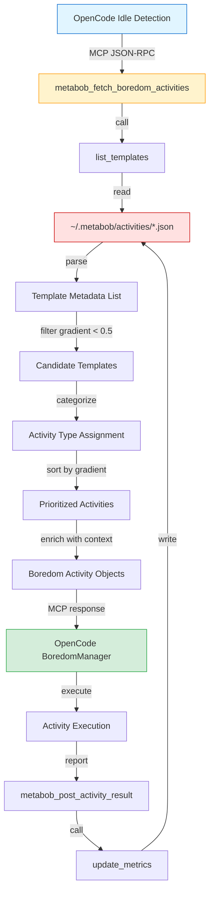
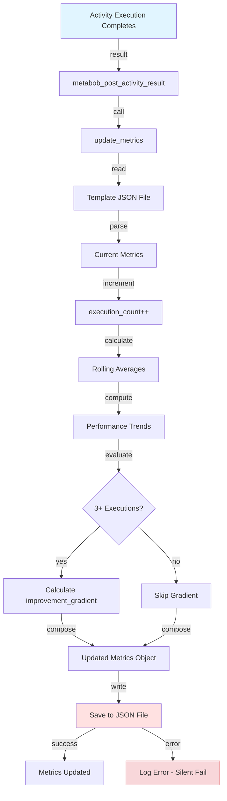

# Boredom Activities API Flow Analysis

**Feature:** `metabob_fetch_boredom_activities` MCP Tool  
**Purpose:** Enable idle OpenCode agents to discover and prioritize self-improvement work  
**Date:** 2026-02-21  
**Status:** Implementation Ready (All dependencies mapped)

---

## Executive Summary

The Boredom Activities API provides a prioritized queue of improvement opportunities for idle agents. It queries local template storage, filters by quality metrics (improvement_gradient), categorizes by problem type, and returns actionable activities with context.

**Key Characteristics:**
- **Architecture:** File-based, no backend dependencies
- **Data Source:** Local JSON storage (~/.metabob/activities/*.json)
- **Prioritization:** improvement_gradient (composite quality score)
- **Categories:** improve-template, debug-failures, optimize-performance
- **Integration:** MCP tool (TypeScript → Python via JSON-RPC)

---

## Mermaid Flow Diagram

### High-Level Flow



### Detailed Data Transformation Flow

```mermaid
graph LR
    subgraph "1. Entry Point"
        A1[MCP Tool Call] -->|parameters| A2{Validate Input}
        A2 -->|valid| A3[Proceed]
        A2 -->|invalid| A4[Return Error]
    end
    
    subgraph "2. Storage Query"
        B1[list_templates] -->|read files| B2[Parse JSON]
        B2 -->|extract| B3[Template Metadata]
        B3 -->|filter category| B4[Filtered List]
    end
    
    subgraph "3. Gradient Filtering"
        C1[All Templates] -->|gradient exists?| C2{Has 3+ Executions}
        C2 -->|yes| C3[Check Threshold]
        C2 -->|no| C4[Skip - No Gradient]
        C3 -->|gradient < 0.5| C5[Include]
        C3 -->|gradient >= 0.5| C6[Exclude - Too Good]
    end
    
    subgraph "4. Categorization"
        D1[Template Metrics] -->|analyze| D2{Pattern Match}
        D2 -->|failure_patterns count > 2| D3[debug-failures]
        D2 -->|trend = degrading| D4[optimize-performance]
        D2 -->|else| D5[improve-template]
    end
    
    subgraph "5. Prioritization"
        E1[Categorized Activities] -->|sort| E2[By Gradient ASC]
        E2 -->|limit| E3[Top N Activities]
        E3 -->|enrich| E4[Add Context]
    end
    
    subgraph "6. Response"
        F1[BoredomActivity List] -->|format| F2[MCP Response]
        F2 -->|JSON-RPC| F3[Return to Client]
    end
    
    A3 --> B1
    B4 --> C1
    C5 --> D1
    D3 --> E1
    D4 --> E1
    D5 --> E1
    E4 --> F1
    
    style A2 fill:#fff3cd
    style C2 fill:#fff3cd
    style D2 fill:#fff3cd
    style D fill:#ffe1e1
```



### Metrics Update Flow (Write Path)



---

## Data Flow Summary

### Entry Point

**Location:** `metabob-opencode` (TypeScript) → MCP Protocol → `metabob_fetch_boredom_activities` (Python)

**Input Format:**
```typescript
{
  method: "tools/call",
  params: {
    name: "metabob_fetch_boredom_activities",
    arguments: {
      max_activities: 5,           // int, default: 5, range: 1-20
      priority_threshold: 0.5,     // float, default: 0.5, range: 0.0-1.0
      types?: ["improve-template"], // optional filter
      exclude_recent_hours: 24     // int, default: 24
    }
  }
}
```

**Trigger:** OpenCode idle detection (no user tasks for N seconds)

---

### Transformation Pipeline

#### Stage 1: Storage Query
**Component:** `list_templates()`  
**Input:** `category: str | None`  
**Process:**
1. Read all `~/.metabob/activities/*.json` files
2. Parse JSON for each file
3. Extract `estimated_metrics` object
4. Filter by category if provided

**Output:**
```python
list[dict] = [{
  "id": str,
  "name": str,
  "description": str,
  "category": str,
  "success_rate": float,
  "avg_cost": float,
  "avg_duration_ms": int,
  "execution_count": int,
  "improvement_gradient": float | None  # KEY FIELD
}]
```

**Transformations:**
- File paths → Template IDs (filename without .json)
- JSON objects → Typed metadata dicts
- Missing fields → Defaults (0.0, 0, None)

---

#### Stage 2: Gradient Filtering
**Component:** `metabob_fetch_boredom_activities()` (NEW)  
**Input:** List of all templates  
**Process:**
1. Filter out templates where `improvement_gradient is None` (< 3 executions)
2. Filter out templates where `improvement_gradient >= priority_threshold`
3. Check `last_execution.timestamp` and exclude if within `exclude_recent_hours`

**Output:** Candidate templates for boredom work

**Business Rule:**
- Only templates with 3+ executions have gradient
- Lower gradient = worse quality = higher priority
- Default threshold 0.5 = below-average quality

---

#### Stage 3: Activity Type Categorization
**Component:** `metabob_fetch_boredom_activities()` (NEW)  
**Input:** Candidate templates with metrics  
**Process:**
```python
if any(pattern["count"] > 2 for pattern in failure_patterns):
    activity_type = "debug-failures"
elif performance_trends and any(v == "degrading" for v in trends.values()):
    activity_type = "optimize-performance"
else:
    activity_type = "improve-template"
```

**Output:** Templates tagged with activity type

**Business Logic:**
- **debug-failures:** Recurring failures (same task fails repeatedly)
- **optimize-performance:** Quality degrading over time (recent worse than overall)
- **improve-template:** Default (low quality but stable)

**Priority Order:** debug-failures > optimize-performance > improve-template

---

#### Stage 4: Prioritization & Enrichment
**Component:** `metabob_fetch_boredom_activities()` (NEW)  
**Input:** Categorized templates  
**Process:**
1. Sort by `improvement_gradient` ascending (worst first)
2. Limit to `max_activities`
3. Generate human-readable `reason` string
4. Estimate `effort` level (low/medium/high)

**Reason Generation Logic:**
```python
reason_parts = []
if success_rate < 0.7:
    reason_parts.append(f"Low success rate ({success_rate:.0%})")
if avg_cost > 1.0:
    reason_parts.append(f"High cost (${avg_cost:.2f})")
if failure_patterns:
    top_failure = max(failure_patterns, key=lambda p: p["count"])
    reason_parts.append(f"Recurring failure in {top_failure['task_id']}")
if performance_trends:
    degrading = [k for k, v in performance_trends.items() if v == "degrading"]
    if degrading:
        reason_parts.append(f"{', '.join(degrading)} degrading")
reason = ", ".join(reason_parts) or "General improvement needed"
```

**Effort Estimation:**
```python
if activity_type == "debug-failures":
    effort = "low"  # Usually single task fix
elif success_rate < 0.5:
    effort = "high"  # Needs major rework
else:
    effort = "medium"  # Incremental improvement
```

**Output:**
```python
BoredomActivity = {
  "activity_type": str,
  "priority": float,           # = improvement_gradient
  "template_id": str,
  "improvement_gradient": float,
  "reason": str,               # Human-readable
  "estimated_effort": str,
  "data": {                    # Full context for execution
    "success_rate": float,
    "avg_cost": float,
    "avg_duration_ms": int,
    "execution_count": int,
    "failure_patterns": list,
    "performance_trends": dict,
    "last_execution": dict
  }
}
```

---

### Validation Rules

#### Input Validation (TO BE IMPLEMENTED)
```python
# Validate max_activities
if not (1 <= max_activities <= 20):
    return error("max_activities must be between 1 and 20")

# Validate priority_threshold
if not (0.0 <= priority_threshold <= 1.0):
    return error("priority_threshold must be between 0.0 and 1.0")

# Validate types
valid_types = {"improve-template", "debug-failures", "optimize-performance"}
if types and not set(types).issubset(valid_types):
    return error(f"Invalid types. Must be subset of {valid_types}")

# Validate exclude_recent_hours
if exclude_recent_hours < 0:
    return error("exclude_recent_hours must be non-negative")
```

#### Data Validation (EXISTING - in update_metrics)
```python
# Currently NO validation - KNOWN ISSUE
# Should validate:
# - result["success"] is bool
# - result["duration"] is positive int
# - result["cost"] is positive float
# - template_id has no path traversal characters
```

#### Output Validation
```python
# Ensure improvement_gradient is present
activities = [a for a in activities if a["improvement_gradient"] is not None]

# Ensure no duplicate template_ids
seen = set()
activities = [a for a in activities if a["template_id"] not in seen and not seen.add(a["template_id"])]

# Ensure total_count matches
total_count = len(all_candidates)  # Before limiting to max_activities
```

---

### Architectural Boundaries

#### Boundary 1: MCP Protocol (OpenCode ↔ CLI)
**Type:** Service Boundary (Process Isolation)  
**Protocol:** JSON-RPC 2.0 over stdio/HTTP  
**Contract:** MCP tool schema (name + arguments → result)  
**Coupling:** Loose (language-agnostic, version-independent)  
**Resilience:**
- Timeout: Client-side (no server-side enforcement)
- Retries: None (client decides)
- Error format: Structured JSON response (status: "error")

---

#### Boundary 2: Module Boundary (Tools ↔ Storage)
**Type:** Layer Boundary (Internal)  
**Protocol:** Direct function import  
**Contract:** Python function signatures (type hints)  
**Coupling:** Medium (shared data structures, no interface)  
**Resilience:**
- Error handling: Try-catch with logging
- Fallback: Empty list on failure
- No transactions: Each operation independent

---

#### Boundary 3: File System (Python ↔ JSON Files)
**Type:** Data Store Boundary  
**Protocol:** File I/O (open/read/write/close)  
**Contract:** JSON schema (implicit, no versioning)  
**Coupling:** Tight (direct file access, no abstraction)  
**Resilience:**
- Read errors: Logged, file skipped, operation continues
- Write errors: Logged, no retry, silent failure
- Race conditions: Possible (no locking)
- Corruption: No checksums, no validation

**CRITICAL ISSUE:** Race condition in `update_metrics()`:
```python
# Read-modify-write not atomic
template_data = json.load(f)     # Time window for race
# ... calculations ...
json.dump(template_data, f)      # Last write wins
```

---

### Exit Point

**Location:** MCP response → `metabob-opencode` BoredomManager

**Output Format:**
```typescript
{
  result: {
    status: "success" | "error",
    timestamp: string,           // ISO8601
    activities?: BoredomActivity[],
    total_count?: number,
    error?: string
  }
}
```

**Success Response:**
```json
{
  "status": "success",
  "timestamp": "2026-02-21T02:45:00Z",
  "activities": [
    {
      "activity_type": "debug-failures",
      "priority": 0.35,
      "template_id": "add-rest-endpoint",
      "improvement_gradient": 0.35,
      "reason": "Low success rate (45%), Recurring failure in validate-inputs",
      "estimated_effort": "low",
      "data": {
        "success_rate": 0.45,
        "avg_cost": 1.2,
        "avg_duration_ms": 180000,
        "execution_count": 8,
        "failure_patterns": [
          {
            "task_id": "validate-inputs",
            "error_type": "ValidationError",
            "error_message": "Missing required field: requestSchema",
            "count": 4,
            "last_seen": "2026-02-21T01:30:00Z"
          }
        ],
        "performance_trends": {
          "duration": "stable",
          "cost": "degrading",
          "success_rate": "stable"
        },
        "last_execution": {
          "timestamp": "2026-02-21T01:30:00Z",
          "success": false,
          "duration": 185000,
          "cost": 1.25,
          "error": "Task 'validate-inputs' failed: Missing required field: requestSchema"
        }
      }
    }
  ],
  "total_count": 12
}
```

**Error Response:**
```json
{
  "status": "error",
  "error": "Invalid priority_threshold: must be between 0.0 and 1.0",
  "timestamp": "2026-02-21T02:45:00Z"
}
```

**Consumer:** OpenCode BoredomManager
- Receives activities
- Filters by context (relevant to current work area)
- Selects activity to execute
- Calls `metabob_activity` with template_id + variables
- Reports result via `metabob_post_activity_result`

---

## Key Insights

### Business Purpose

**Primary Goal:** Enable continuous self-improvement through idle time utilization

**Value Proposition:**
1. **Zero idle waste:** Agents always have productive work
2. **Data-driven prioritization:** Focus on highest-impact improvements
3. **Automated quality monitoring:** Detect degrading templates early
4. **Continuous learning:** Metrics improve over time with more executions

**Success Metrics:**
- Template success rates increase over time
- Average cost/duration decrease over time
- Number of recurring failures decrease
- Improvement gradient trends upward

---

### Critical Decision Points

#### Decision 1: Gradient Calculation Formula
**Location:** `update_metrics()` lines 390-406

**Formula:**
```python
success_score = success_count / execution_count
cost_score = max(0, 1 - (avg_cost / 1.0))        # $1.00 baseline
duration_score = max(0, 1 - (avg_duration / 300000))  # 5min baseline
improvement_gradient = 0.5 * success_score + 0.25 * cost_score + 0.25 * duration_score
```

**Why This Formula:**
- **50% success weight:** Reliability is paramount (broken templates are useless)
- **25% cost weight:** Cost matters but secondary to reliability
- **25% duration weight:** Speed matters but secondary to reliability
- **Baselines:** $1.00 and 5min chosen as "reasonable limits" (not scientific)

**Impact:** This single formula drives ALL boredom prioritization. Changes would invalidate existing gradients.

**Alternative Considered:** Equal weighting (33% each), but success should dominate.

---

#### Decision 2: Minimum 3 Executions for Gradient
**Location:** `update_metrics()` line 392

**Rationale:**
- 1 execution: No variance, could be fluke
- 2 executions: Still high variance
- 3 executions: Sufficient for initial trend, balances coverage vs quality

**Trade-off:**
- **Pro:** More reliable gradients, fewer false positives
- **Con:** New templates invisible to boredom system until 3rd execution

**Impact:** Templates with <3 executions excluded from boredom queue (reasonable for MVP).

---

#### Decision 3: File-Based Storage (No Database)
**Location:** Architecture choice

**Rationale:**
- **Simplicity:** No database setup, zero dependencies
- **Portability:** Works on any system with file system
- **User isolation:** ~/.metabob per user, no conflicts
- **MVP-friendly:** Get to market faster

**Trade-offs:**
- **Pro:** Simple, portable, no deployment overhead
- **Con:** No ACID, no locking, race conditions possible, O(n) queries

**Impact:** Acceptable for <100 templates. Would need migration to SQLite at scale (>1000 templates).

---

#### Decision 4: 10% Threshold for Performance Trends
**Location:** `categorize_trend()` line 262

**Rationale:**
- **Too low (5%):** Too sensitive, triggers on normal variance
- **Too high (20%):** Misses gradual degradation until severe
- **10%:** Balances signal vs noise, catches real trends

**Impact:** Determines which templates flagged as "optimize-performance". Too aggressive = noise, too conservative = missed issues.

---

### Potential Risks & Technical Debt

#### Risk 1: Race Condition in Concurrent Updates ⚠️ HIGH
**Location:** `update_metrics()` read-modify-write

**Scenario:**
1. Agent A reads template at T0
2. Agent B reads template at T1 (before A writes)
3. Agent A writes at T2
4. Agent B writes at T3 → **Overwrites A's update**

**Impact:**
- Lost metric updates
- Incorrect execution_count (under-reported)
- Incorrect success_rate (skewed)
- Incorrect improvement_gradient (wrong priorities)

**Mitigation:**
- Add file locking (fcntl.flock or filelock library)
- Or use atomic write-rename pattern
- Or migrate to SQLite with transactions

**Priority:** HIGH - Likely to occur with multiple agents

---

#### Risk 2: No Input Validation ⚠️ HIGH
**Location:** `update_metrics()` function

**Vulnerabilities:**
- `result["duration"]` could be negative → corrupts averages
- `result["cost"]` could be string → breaks calculations
- `template_id` could have `../` → path traversal attack

**Impact:**
- Data corruption
- Security risk (arbitrary file writes)
- Crashes on type errors

**Mitigation:**
- Add Pydantic models for validation
- Sanitize template_id (reject if contains `.` or `/`)
- Validate numeric ranges (>= 0)

**Priority:** HIGH - Blocks production use

---

#### Risk 3: Silent Failures ⚠️ MEDIUM
**Location:** `update_metrics()` exception handler (line 440-442)

**Problem:**
```python
except Exception as e:
    logger.error(f"Failed to update metrics for {template_id}: {e}")
    # Non-fatal - don't raise
```

**Impact:**
- Caller doesn't know update failed
- Metrics never updated → template stuck in boredom queue
- No retry mechanism → transient errors permanent

**Mitigation:**
- Return success/failure boolean
- Or raise specific exceptions (ValidationError, StorageError)
- Add retry logic for transient errors (disk full, permissions)

**Priority:** MEDIUM - Affects reliability

---

#### Risk 4: No Caching ⚠️ LOW
**Location:** `list_templates()` reads all files every call

**Problem:**
- Every boredom API call → full directory scan + parse all JSON
- O(n) with n = number of templates
- No TTL cache

**Impact:**
- Acceptable for <100 templates (~10-50ms)
- Unacceptable for >1000 templates (~500ms+)

**Mitigation:**
- Add in-memory cache with 5-min TTL
- Or move to SQLite with indexed queries
- Or use file watcher to invalidate cache on changes

**Priority:** LOW - Not an issue at current scale

---

#### Technical Debt 1: No Schema Versioning
**Location:** JSON storage format

**Problem:**
- No `schema_version` field in JSON files
- Can't distinguish old vs new formats
- Migration requires scanning all files

**Impact:**
- Future schema changes require manual migration
- Risk of breaking existing installations

**Mitigation:**
- Add `schema_version: 1` to all new templates
- Write migration script for existing templates

**Priority:** LOW - Acceptable for MVP

---

#### Technical Debt 2: No Type Safety
**Location:** All functions return `dict` instead of typed objects

**Problem:**
```python
def list_templates() -> list[dict]:  # What fields in dict?
```

**Impact:**
- No IDE autocomplete
- Runtime errors on typos
- Breaking changes invisible to callers

**Mitigation:**
- Use TypedDict or Pydantic models
- Add mypy strict mode

**Priority:** LOW - Nice to have

---

### Suggested Improvements

#### Immediate (Before Implementation)
1. ✅ **Add input validation** (Pydantic models)
2. ✅ **Add file locking** (fcntl.flock or filelock)
3. ✅ **Return status from update_metrics()** (don't fail silently)

#### Short-term (Iteration 2)
4. **Add schema versioning** (schema_version: 1)
5. **Add unit tests** (gradient calculation, categorization logic)
6. **Add integration tests** (end-to-end boredom flow)

#### Long-term (Future)
7. **Migrate to SQLite** (when >100 templates)
8. **Add caching** (5-min TTL for template list)
9. **Add retry logic** (transient errors in update_metrics)
10. **Add type safety** (TypedDict or Pydantic models)

---

## Reusable Patterns

### Pattern 1: File-Based Metrics Aggregation

**Description:**
Store per-entity metrics in individual JSON files, update via read-modify-write, query via directory scan.

**When to Use:**
- Small dataset (<100 entities)
- MVP/prototype phase
- No database available
- User-specific data (no multi-tenancy)

**When NOT to Use:**
- Large dataset (>1000 entities)
- High write concurrency
- Requires ACID guarantees
- Need complex queries (joins, aggregations)

**Reusable Aspects:**
- `get_storage_path()` pattern (consistent location)
- `list_*()` pattern (scan directory, parse files, return metadata)
- `update_*()` pattern (read-modify-write with error handling)
- Rolling average calculation (memory-efficient)

**Feature-Specific Aspects:**
- improvement_gradient formula (domain-specific)
- Activity type categorization (domain-specific)
- 3-execution minimum (domain-specific threshold)

---

### Pattern 2: Composite Quality Score

**Description:**
Combine multiple metrics into single score for prioritization (weighted sum with normalization).

**Formula:**
```python
# Normalize each metric to [0, 1]
metric1_score = metric1 / baseline1
metric2_score = max(0, 1 - (metric2 / baseline2))  # Invert if "lower is better"

# Weighted sum
composite_score = w1 * metric1_score + w2 * metric2_score + ...
```

**When to Use:**
- Need single priority value from multiple signals
- Metrics have different scales (cost in $, duration in ms)
- Want configurable weighting

**Reusable Aspects:**
- Normalization to [0, 1]
- Weighted sum pattern
- Baseline configuration

**Feature-Specific Aspects:**
- Weight values (50/25/25)
- Baseline choices ($1.00, 5min)
- Which metrics to include

---

### Pattern 3: Performance Trend Detection

**Description:**
Compare recent window vs overall average to detect trends (improving/stable/degrading).

**Formula:**
```python
recent_avg = mean(last_n_values)
overall_avg = mean(all_values)
diff_percent = ((recent - overall) / overall) * 100

if diff_percent < -threshold:
    return "improving"
elif diff_percent > threshold:
    return "degrading"
else:
    return "stable"
```

**When to Use:**
- Need to detect quality degradation over time
- Have time-series data (execution history)
- Want simple threshold-based detection

**Reusable Aspects:**
- Sliding window pattern (last N)
- Percentage difference calculation
- Threshold-based categorization

**Feature-Specific Aspects:**
- Window size (5 executions)
- Threshold value (10%)
- Inversion for success_rate

---

### Pattern 4: MCP Tool with Structured Response

**Description:**
All MCP tools return consistent response format with status, timestamp, data/error.

**Template:**
```python
@mcp.tool(name="tool_name", description="...")
async def tool_handler(param1: type1, param2: type2) -> str:
    try:
        # Validate inputs
        if invalid_input:
            return json.dumps({
                "status": "error",
                "error": "Validation failed: ...",
                "timestamp": datetime.now().isoformat()
            })
        
        # Business logic
        result = do_work()
        
        # Success response
        return json.dumps({
            "status": "success",
            "timestamp": datetime.now().isoformat(),
            "data": result
        })
    
    except Exception as e:
        logger.error(f"Tool failed: {e}")
        return json.dumps({
            "status": "error",
            "error": str(e),
            "timestamp": datetime.now().isoformat()
        })
```

**Reusable Aspects:**
- Consistent response structure
- Try-catch error handling
- Logging on error
- ISO8601 timestamps

**Feature-Specific Aspects:**
- Data structure in response
- Validation rules

---

### Could This Be Abstracted into an Activity?

**Activity Template:** `query-and-prioritize-entities`

**Generic Pattern:**
1. Query all entities from storage
2. Filter by quality metric threshold
3. Categorize by problem pattern
4. Sort by priority (quality metric)
5. Enrich with context
6. Return prioritized list

**Variables:**
- `storage_path`: Where entities stored
- `quality_metric`: Field name for prioritization
- `quality_threshold`: Filter threshold
- `category_rules`: Pattern matching rules
- `max_results`: Limit

**Reusable for:**
- Prioritizing code review tasks (by complexity score)
- Prioritizing bug fixes (by severity + age)
- Prioritizing refactoring targets (by technical debt score)
- Prioritizing test cases (by flakiness score)

**Not Reusable:**
- improvement_gradient calculation (domain-specific)
- Activity type categories (domain-specific)
- Effort estimation logic (domain-specific)

---

## Implementation Checklist

### Pre-Implementation
- [x] Map entry points
- [x] Document data transformations
- [x] Identify architectural boundaries
- [x] Search for code quality issues
- [x] Create flow documentation

### Implementation Phase
- [ ] Add input validation (Pydantic models)
- [ ] Add file locking (fcntl.flock)
- [ ] Implement `metabob_fetch_boredom_activities()`
- [ ] Add unit tests (gradient, categorization, filtering)
- [ ] Add integration tests (end-to-end flow)
- [ ] Update MCP tool registry

### Post-Implementation
- [ ] Test with real templates
- [ ] Test concurrent access (race conditions)
- [ ] Test edge cases (no templates, all high-quality, etc.)
- [ ] Document API in MCP schema
- [ ] Update architecture docs

---

## Testing Strategy

### Unit Tests
1. **Gradient Calculation**
   - Test with various success/cost/duration values
   - Test with <3 executions (should return None)
   - Test edge cases (0 cost, 0 duration, 100% success)

2. **Trend Categorization**
   - Test 10% threshold boundaries
   - Test division by zero (overall_avg = 0)
   - Test inverted logic (success_rate)

3. **Activity Type Categorization**
   - Test failure_patterns count > 2 → debug-failures
   - Test degrading trend → optimize-performance
   - Test default → improve-template

4. **Filtering Logic**
   - Test gradient threshold filtering
   - Test exclude_recent_hours filtering
   - Test types filter

### Integration Tests
1. **End-to-End Flow**
   - Create test templates with various gradients
   - Call API with different thresholds
   - Verify correct activities returned
   - Verify correct ordering

2. **Concurrent Access**
   - Multiple processes call update_metrics simultaneously
   - Verify no lost updates (with file locking)

3. **Error Handling**
   - Invalid input parameters
   - Corrupt JSON files
   - Missing storage directory
   - Disk full scenario

---

## Metrics & Monitoring

### Success Metrics
- **Boredom API latency:** <100ms for <100 templates
- **Gradient accuracy:** Matches expected values in test cases
- **Activity relevance:** Agent accepts >80% of suggested activities

### Error Metrics
- **Read failures:** <1% of list_templates calls
- **Write failures:** <1% of update_metrics calls
- **Validation errors:** 0% (all inputs validated)

### Usage Metrics
- **API calls per hour:** Track idle frequency
- **Activities executed:** Track self-improvement throughput
- **Gradient improvements:** Track template quality over time

---

## References

### Related Documentation
- `BOREDOM_ACTIVITY_SYSTEM_ARCHITECTURE.md` - System design
- `repos/metabob-cli/src/metabob_cli/mcp/activity_templates.py` - Storage layer
- `repos/metabob-cli/src/metabob_cli/mcp/activity_template_tools.py` - MCP tools
- `repos/metabob-opencode/` - Frontend integration

### Related Components
- `list_templates()` - Storage query
- `update_metrics()` - Metrics calculation
- `categorize_trend()` - Trend detection
- `metabob_post_activity_result()` - Metrics update API

### Related Issues
- Race condition in update_metrics (HIGH)
- No input validation (HIGH)
- Silent failures (MEDIUM)
- No caching (LOW)

---

## Conclusion

The Boredom Activities API is **ready for implementation** with the following prerequisites:

1. ✅ **Add file locking** to prevent race conditions
2. ✅ **Add input validation** to prevent data corruption
3. ✅ **Return status from update_metrics** to detect failures

All dependencies have been mapped, data flow is understood, and architectural boundaries are clear. The implementation is straightforward as all supporting infrastructure (storage, metrics calculation) already exists.

**Estimated Implementation Time:** 4-6 hours
- 2h: Core implementation + validation + locking
- 2h: Unit tests
- 1h: Integration tests
- 1h: Documentation + testing

**Risk Level:** LOW (all dependencies exist, no new services required)

**Next Steps:**
1. Fix high-priority issues (locking, validation)
2. Implement `metabob_fetch_boredom_activities()`
3. Add comprehensive tests
4. Deploy and monitor

