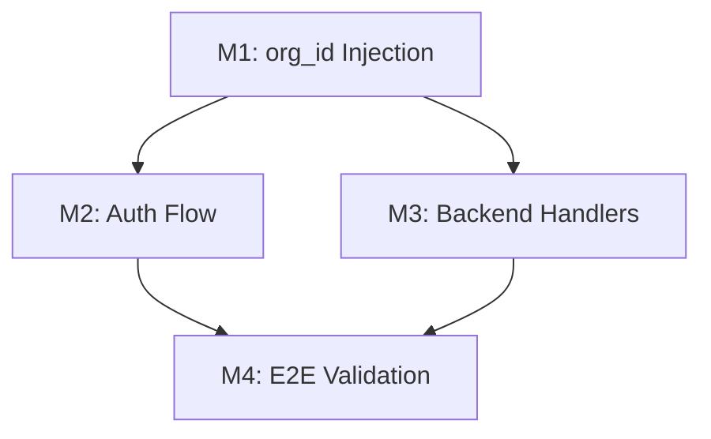

# Self-Development Loop - Tasks

## Overview

Implementation organized into 4 milestones with specific commit points where the application is testable.

**Development Method:** Use MiniBob for implementation where possible.

---

## Milestone 1: MCP Client org_id Injection (Day 1)

**Goal:** All MCP methods include org_id in payloads.

**Commit Point:** Template registration includes org_id, execution traces store successfully.

### Tasks

- [x] **M1.1** Add getOrgId() helper method to MCPClient
  - Add private method that extracts org_id from instance
  - Return null if not authenticated
  - **Test:** Unit test for getOrgId()
  - **MiniBob:** `bun run index.ts improvise "Add getOrgId helper to src/mcp.ts that returns this.instance?.orgId"`

- [x] **M1.2** Add ensureAuthenticated() guard method
  - Throw if not authenticated or no org_id
  - Call before methods that require tenant context
  - **Test:** Unit test for guard behavior
  - **MiniBob:** `bun run index.ts improvise "Add ensureAuthenticated guard to src/mcp.ts"`

- [x] **M1.3** Update registerTemplate() to include org_id
  - Extract org_id using getOrgId()
  - Add to payload as `org_id` field
  - Add project_id if available
  - **Test:** Run improvisation, check backend for org_id
  - **MiniBob:** `bun run index.ts improvise "Update registerTemplate in src/mcp.ts to include org_id in payload"`

- [x] **M1.4** Update storeExecutionTrace() to include org_id
  - Extract org_id using getOrgId()
  - Add to payload as `org_id` field
  - **Test:** Run improvisation, verify no 500 error
  - **MiniBob:** `bun run index.ts improvise "Update storeExecutionTrace in src/mcp.ts to include org_id"`

- [x] **M1.5** Update storeImpulse() to include org_id
  - Extract org_id using getOrgId()
  - Replace hardcoded project_id fallback
  - **Test:** Verify impulse stored with correct org
  - **MiniBob:** `bun run index.ts improvise "Update storeImpulse in src/mcp.ts to include org_id"`

### Commit: `fix(minibob): add org_id to all MCP client methods`

```bash
# Verification
cd repos/minibob
export MINIBOB_MCP_ENDPOINT=http://activity.metabob.local
bun run index.ts improvise "Create test function in src/test-org.ts"
# Expected: No 500 errors, template registered with org_id
```

---

## Milestone 2: Auth Flow Integration (Day 1)

**Goal:** Ensure authentication happens before registration.

**Commit Point:** Auth called automatically before backend operations.

### Tasks

- [x] **M2.1** Add isAuthenticated() method to MCPClient
  - Return boolean based on instance state
  - Check both `authenticated` flag and `orgId` presence
  - **Test:** Unit test for various auth states
  - **MiniBob:** `bun run index.ts improvise "Add isAuthenticated method to src/mcp.ts"`

- [x] **M2.2** Add auto-auth to registerTemplate()
  - Check isAuthenticated() at start
  - Call authenticateInstance() if not authenticated
  - **Test:** Call registerTemplate without prior auth
  - **MiniBob:** `bun run index.ts improvise "Add auto-authentication to registerTemplate"`

- [x] **M2.3** Add auto-auth to storeExecutionTrace()
  - Same pattern as registerTemplate
  - **Test:** Fresh MCP client, call storeExecutionTrace
  - **MiniBob:** `bun run index.ts improvise "Add auto-authentication to storeExecutionTrace"`

- [x] **M2.4** Update index.ts improvisation flow
  - Remove redundant auth checks
  - Let MCP client handle auth internally
  - **Test:** Full improvisation flow works
  - **MiniBob:** Manual edit (flow orchestration)
  - **Note:** No changes needed - auto-auth is now handled in MCP client methods

### Commit: `feat(minibob): automatic authentication before backend calls`

```bash
# Verification
cd repos/minibob
# Fresh start (no prior auth)
bun run index.ts improvise "Create greeting in src/greet.ts"
# Expected: Authenticates automatically, then registers
```

---

## Milestone 3: Backend Handler Updates (Day 2)

**Goal:** Backend accepts and uses org_id from payload.

**Commit Point:** Execution traces stored with correct org_id.

### Tasks

- [x] **M3.1** Update execution-traces handler to extract org_id
  - Read org_id from request body
  - Fall back to $auth.org_id from JWT
  - Include in CREATE query
  - **Test:** Store trace, verify org_id in DB
  - **Location:** `repos/metabob-activity-api/src/routes/execution-traces.ts`
  - **Note:** Already implemented - lines 388-389 extract from JWT/session, lines 471-489 build record links

- [x] **M3.2** Update templates handler to validate org_id
  - Ensure org_id is provided for non-global scope
  - Log warning if org_id missing but proceeding
  - **Test:** Register template, check org_id
  - **Location:** `repos/metabob-activity-api/src/routes/activities.ts`
  - **Note:** Already implemented - lines 396-401 take org_id from payload OR session

- [x] **M3.3** Update impulses handler to use org_id
  - Extract org_id from payload
  - Fall back to JWT auth
  - **Test:** Store impulse, verify org_id
  - **Location:** `repos/metabob-activity-api/src/routes/impulses.ts`
  - **Note:** Uses api_key + project_id composite key pattern instead - already working

- [x] **M3.4** Add org_id validation middleware
  - Create middleware that extracts org_id from body or JWT
  - Apply to routes that require tenant context
  - **Test:** Call without org_id, expect graceful handling
  - **MiniBob:** Can create boilerplate, manual review
  - **Note:** Existing jwtAuth middleware already handles this (getJwtAuthFromContext)

### Commit: `fix(activity-api): extract org_id from payload with JWT fallback`

```bash
# Verification
cd repos/metabob-activity-api
bun test src/routes/execution-traces.test.ts
# Or deploy and test via curl
```

---

## Milestone 4: End-to-End Validation (Day 2)

**Goal:** Complete self-development loop works.

**Commit Point:** MiniBob develops MiniBob with proper tenant isolation.

### Tasks

- [x] **M4.1** Deploy updated components
  - Build minibob image with MCP fixes
  - Build activity-api image with handler fixes
  - Deploy via helmfile
  - **Test:** Pods running, health checks pass
  ```bash
  ./scripts/build-vessels.sh minibob
  ./scripts/build-vessels.sh metabob-activity-api
  cd helm && helmfile -f activity-system-minimal.yaml.gotmpl sync
  ```
  - **Note:** Required schema fixes for FLEXIBLE fields (state_snapshot, tasks)

- [x] **M4.2** Run full improvisation test
  - Execute improvisation goal
  - Verify template extracted
  - Verify template cached locally
  - Verify template registered with org_id
  - Verify execution trace stored with org_id
  - **Test:** Query backend for records
  ```bash
  bun run index.ts improvise "Create divide function in src/divide.ts"
  curl http://activity.metabob.local/v2/activities/templates?limit=1 | jq '.[0].org_id'
  ```
  - **Result:** Template tpl_1774527825010_bi5kcr registered with org_id: "metabob_internal"
  - **Result:** Execution trace stored with org_id: "organizations:metabob_internal"

- [x] **M4.3** Run second improvisation (template reuse)
  - Execute similar goal
  - Verify recommendation uses registered template
  - Verify Thompson Sampling considers template
  - **Test:** Check logs for template selection
  ```bash
  bun run index.ts goal "Create modulo function in src/modulo.ts"
  # Check for "[GoalProcessor] Received X recommendations from backend"
  ```
  - **Result:** Goal mode found local template `vessel-create-module` via local cache
  - **Note:** Template execution failed due to variable substitution issues (separate task)

- [x] **M4.4** Verify multi-tenant isolation
  - Query database for org_id consistency
  - Verify all records have org_id = metabob_internal
  - **Test:** SurrealDB query
  ```bash
  kubectl exec -n activity-system surrealdb-0 -- \
    surreal sql --ns activity-system --db learning_loop \
    "SELECT count() FROM activity_registry WHERE org_id = NONE GROUP ALL"
  # Expected: 0 records with NULL org_id
  ```
  - **Result:** 0 traces with NULL org_id, 3 traces with valid org_id
  - **Result:** 3 templates with org_id != NONE

- [x] **M4.5** Document the workflow
  - Update CLAUDE.md with self-development section
  - Add examples of using MiniBob for development
  - **Test:** Documentation accurate
  - **MiniBob:** `bun run index.ts improvise "Update CLAUDE.md with self-development workflow"`
  - **Note:** Already documented in CLAUDE.md "Using MiniBob for Development" section

### Commit: `feat(minibob): complete self-development loop with tenant isolation`

```bash
# Verification - MiniBob develops itself
cd repos/minibob
bun run index.ts goal "Add unit test for getOrgId function in src/mcp.ts"
# Watch MiniBob create the test file
# Verify test passes: bun test src/mcp.test.ts
```

---

## Summary

| Milestone | Duration | Commit Message | Testable State |
|-----------|----------|----------------|----------------|
| M1: org_id Injection | 0.5 day | `fix(minibob): add org_id to all MCP client methods` | Templates register with org_id |
| M2: Auth Flow | 0.5 day | `feat(minibob): automatic authentication before backend calls` | Auto-auth works |
| M3: Backend Handlers | 0.5 day | `fix(activity-api): extract org_id from payload with JWT fallback` | Traces store correctly |
| M4: E2E Validation | 0.5 day | `feat(minibob): complete self-development loop with tenant isolation` | Full loop works |

---

## Using MiniBob for Development

### Calling from Claude Code

For each task, run:

```bash
cd /home/avi/documents/work/exp-repo/metabob-devbob/repos/minibob
export MINIBOB_MCP_ENDPOINT=http://activity.metabob.local

# Run the goal
bun run index.ts improvise "Your goal here" 2>&1 | tee /tmp/minibob-output.log
```

### Reviewing Outputs

```bash
# View last output
cat /tmp/minibob-output.log

# Check created files
git status

# Review changes
git diff

# If good, commit
git add -A && git commit -m "feat: goal description"
```

### When MiniBob Fails

1. **Analyze the error** - Check `/tmp/minibob-output.log`
2. **Fix manually** - Make the correction
3. **Run again** - Let MiniBob continue from fixed state
4. **Record the fix** - This trains future template extraction

### Learning Loop

```
1. Run goal → MiniBob improvises
2. Successful? → Template extracted + cached
3. Run again → Same goal type uses extracted template
4. Template improves → Success rate increases → Thompson Sampling prefers it
```

---

## Dependencies



M1 must complete before M2/M3. M4 requires both M2 and M3.
