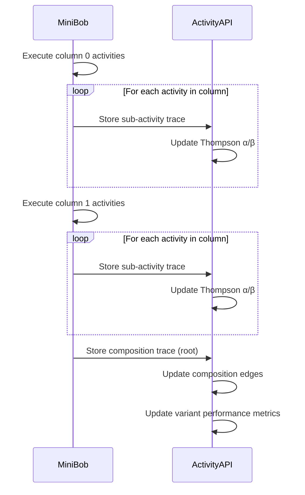

# Trajectory Editor: Key Questions Answered

> **Purpose**: Direct answers to the architectural questions about proper flow
>
> **Date**: 2026-04-24

## Question 1: Goal-to-Trajectory Flow

### Q: Should goals generate entire trajectories upfront (current approach)?

**Answer: NO**

**Current approach is wrong:**
- `/goal-paths/recommend` returns complete paths only if previously executed
- Trajectory appears "finished" before any work happens
- No dynamic composition - just historical playback
- Contradicts the "process-of-becoming" principle

**Proper approach:**
- Goals become **impulses** with metadata (not just text strings)
- Call `POST /v2/activities/recommend` **iteratively** after each activity addition
- Recommendations adapt to **current impulse state space** (available shapes)
- Trajectory **emerges** through user + system collaboration

### Q: Should goals be inserted as impulses that dynamically resolve to activities?

**Answer: YES**

Goals are impulses that delegate to resolvers:

```typescript
const goalImpulse: Impulse = {
  id: 'goal-1',
  pointer: {
    type: 'memo',  // Or 'goal' type if custom resolver exists
    content: goalText,
  },
  metadata: {
    shape: 'goal',
    summary: goalText,
    domain: extractDomain(goalText), // security, performance, etc.
    category: extractCategory(goalText), // bugfix, feature, etc.
  },
  loaded: true,
  content: goalText,
};
```

This impulse is passed to Thompson Sampling recommendations, which return activities that can process it.

### Q: What's the role of Thompson Sampling in path selection?

**Answer: ITERATIVE GUIDANCE, NOT COMPLETE PATH GENERATION**

Thompson Sampling is used at **each step**:

```
Step 1: User enters goal
  → Call /recommend with shapes: ['goal']
  → Backend returns: [activity_A (confidence: 0.87), activity_B (0.72), ...]
  → User adds activity_A to column 0

Step 2: Activity A added
  → Available shapes now: ['goal', ...activity_A.output_shapes]
  → Call /recommend with new shapes
  → Backend returns: [activity_C (confidence: 0.91), activity_D (0.65), ...]
  → User adds activity_C to column 1

Step 3: Activity C added
  → Available shapes now: [...previous, ...activity_C.output_shapes]
  → Call /recommend with updated shapes
  → ...continues until goal satisfied
```

**Key Points:**
- Thompson Sampling ranks candidates at each step, not entire paths
- Shape-conditioned scoring ensures compatibility with current state
- Exploration rate (e.g., 0.2) allows trying new combinations
- User can override at any point (manual selection from palette)

---

## Question 2: Impulse Integration

### Q: Should users manually insert impulses between activities?

**Answer: NO (except for testing/override)**

**Default behavior (90% of cases):**
- Impulses flow **automatically** from activity outputs
- When Activity A completes, its `output_shapes` become impulses in state space
- Next activity (Activity B) declares `input_shapes` and consumes them
- User doesn't need to think about impulses at all

**Manual insertion (10% of cases):**
- **Testing**: "Use this fixture error_log from file X"
- **Branching**: "If error occurs, inject this fallback impulse"
- **External data**: "Pull this impulse from API Y"
- **Debugging**: "Override this impulse with known good data"

**UI Implication:**
- Show "Available Impulses" panel (read-only by default)
- Allow "Add Impulse" button for advanced users
- Most users never interact with impulse panel directly

### Q: Should impulses be automatically created from activity outputs?

**Answer: YES - THIS IS THE CORE MECHANISM**

When an activity is added to the trajectory:

```typescript
// Activity declares output shapes
const activity = {
  id: 'debug-null-pointer',
  output_shapes: ['error_analysis', 'patch', 'test_result'],
  // ...
};

// When added to trajectory, create impulses automatically
addActivity(activity, column);

// Behind the scenes:
const outputImpulses = activity.output_shapes.map(shape => ({
  id: `impulse-${activity.id}-${shape}`,
  pointer: {
    type: 'activityOutput',
    activityId: activity.id,
    shape: shape,
  },
  metadata: {
    shape: shape,
    producedBy: activity.id,
    summary: `Output from ${activity.name}`,
  },
  loaded: false, // Not loaded yet (will be during execution)
}));

// Add to impulse state space
stateSpace.addImpulses(outputImpulses);

// Next activity can now consume these shapes
const availableShapes = stateSpace.getAvailableShapes();
// Returns: ['goal', 'error_analysis', 'patch', 'test_result']
```

**During execution:**
- Impulses are placeholders until activity runs
- When activity executes, impulse.content is populated
- Next activity loads impulse and uses content

**Visualization:**
```
┌──────────────┐
│  Activity A  │
│ debug-bug    │
└──────┬───────┘
       │ Produces:
       ├─ error_analysis (impulse created automatically)
       ├─ patch (impulse created automatically)
       └─ test_result (impulse created automatically)

       ▼
┌──────────────┐
│  Activity B  │
│  write-test  │  Consumes: error_analysis, test_result
└──────────────┘
```

### Q: How do goal impulses delegate to resolvers like MiniBob?

**Answer: THROUGH ACTIVITY RECOMMENDATION AND EXECUTION**

**Step-by-step delegation:**

1. **Goal impulse is created:**
   ```typescript
   const goalImpulse = { shape: 'goal', content: 'Fix auth bug', ... };
   ```

2. **Frontend requests recommendations:**
   ```typescript
   const recommendations = await fetch('/v2/activities/recommend', {
     body: JSON.stringify({
       goal_description: goalImpulse.content,
       available_shapes: ['goal'],
       exploration_rate: 0.2,
     }),
   });
   ```

3. **Backend uses Thompson Sampling:**
   - Queries activities where `input_shapes` includes 'goal'
   - Ranks by success rate for this shape combination
   - Returns top 3 candidates

4. **User selects activity:**
   - Activity is added to trajectory
   - Activity declares which resolver it uses per task

5. **Execution time - MiniBob processes:**
   ```typescript
   // MiniBob executes activity
   for (const task of activity.tasks) {
     if (task.resolver === 'llm') {
       // LLM resolver handles this task
       const result = await llmResolver.resolve(task, impulses);
     } else if (task.resolver === 'bash') {
       // Bash resolver handles this task
       const result = await bashResolver.resolve(task, impulses);
     }
   }
   ```

**Key insight:**
- Goal impulse doesn't "call" resolvers directly
- Goal → Activity recommendation → Activity execution → Resolver invocation
- Each layer delegates responsibility through the impulse-activity model

---

## Question 3: Execution Model

### Q: Should trajectories execute sequentially (column by column)?

**Answer: YES (with parallel execution within columns)**

**Execution order:**

```
Column 0 (all rows execute in parallel)
  Row 0: Activity A
  Row 1: Activity B  } Execute simultaneously
  Row 2: Activity C
  ↓ (wait for all to complete)

Column 1 (all rows execute in parallel)
  Row 0: Activity D
  Row 1: Activity E  } Execute simultaneously
  ↓ (wait for all to complete)

Column 2
  Row 0: Activity F
```

**Implementation:**

```typescript
async function executeTrajectory(activities: TrajectoryActivity[]) {
  // Group by column
  const columns = groupBy(activities, a => a.column);
  const sortedColumns = Object.keys(columns).sort((a, b) => Number(a) - Number(b));

  for (const columnIndex of sortedColumns) {
    const activitiesInColumn = columns[columnIndex];

    // Execute all activities in this column in parallel
    const results = await Promise.all(
      activitiesInColumn.map(activity => executeActivity(activity))
    );

    // All must succeed before moving to next column
    if (results.some(r => r.status === 'failed')) {
      throw new Error(`Column ${columnIndex} execution failed`);
    }

    // Collect output impulses from this column
    const outputImpulses = results.flatMap(r => r.output_impulses);
    stateSpace.addImpulses(outputImpulses);
  }
}
```

**Why this model?**
- **Columns = sequence**: Represents causal dependencies (A must complete before B)
- **Rows = parallelism**: Represents independent work (A and B can run simultaneously)
- **Impulse availability**: Column N+1 can only access impulses from columns 0...N

### Q: Should parallel activities in the same column execute concurrently?

**Answer: YES**

**Concurrency semantics:**

```typescript
// Column 0 has 3 activities
const column0 = [
  { row: 0, activity: 'analyze-error' },
  { row: 1, activity: 'check-tests' },
  { row: 2, activity: 'scan-dependencies' },
];

// All three execute concurrently
const results = await Promise.all([
  executeActivity(column0[0]),  // Starts immediately
  executeActivity(column0[1]),  // Starts immediately
  executeActivity(column0[2]),  // Starts immediately
]);

// Wait for all to complete before column 1
```

**Constraints:**
- All activities in same column must have **compatible input shapes** (can run with same available impulses)
- No output from row 1 can be used by row 2 in same column (must wait for next column)
- If any activity in column fails, entire column fails

**Use cases:**
- **Parallel analysis**: Analyze code quality + security + performance simultaneously
- **Multiple resolvers**: Query different data sources in parallel
- **Redundancy**: Try multiple approaches, take first success (future: add early-exit logic)

### Q: How are execution traces captured and stored?

**Answer: HIERARCHICAL TRACES WITH COMPOSITION LINKS**

**Trace structure:**

```typescript
const compositionTrace: ExecutionTrace = {
  id: 'exec-root-123',
  activity_id: 'meta-trajectory-456',
  variant_id: 'meta-trajectory-456:v1',

  // Input to entire trajectory
  input_impulses: [
    { id: 'goal-1', shape: 'goal', content: 'Fix auth bug' },
  ],

  // Sub-executions (one per activity in trajectory)
  sub_executions: [
    {
      id: 'exec-sub-1',
      activity_id: 'debug-null-pointer',
      sequence_position: 0, // Column
      parallel_group: 0,    // Row
      input_impulses: [/* inherited + column-specific */],
      output_impulses: [/* created by this activity */],
      outcome: { success: true, duration_ms: 12000, cost_usd: 0.05 },
      parent_execution_id: 'exec-root-123',
    },
    {
      id: 'exec-sub-2',
      activity_id: 'write-tests',
      sequence_position: 1,
      parallel_group: 0,
      input_impulses: [/* from previous column */],
      output_impulses: [/* created */],
      outcome: { success: true, duration_ms: 8000, cost_usd: 0.03 },
      parent_execution_id: 'exec-root-123',
    },
  ],

  // Composition metadata
  composition_chain: ['debug-null-pointer', 'write-tests'], // Activity IDs in order
  parent_execution_id: null, // This is root

  // Final outcome
  output_impulses: [/* combined outputs from last column */],
  outcome: {
    success: true,
    duration_ms: 45000, // Total
    cost_usd: 0.23,     // Total
  },
};
```

**Storage flow:**



**Learning data captured:**

From traces, the backend learns:

1. **Activity success rates**: Per-activity Thompson Sampling (α/β)
2. **Shape-conditioned scores**: Success rate for specific input shape combinations
3. **Composition patterns**: Which activities work well together (edge weights)
4. **Variant performance**: Which variant of an activity performs best
5. **Cost/duration metrics**: Resource usage per activity

---

## Question 4: Learning from Execution

### Q: How do executed trajectories feed back into Thompson Sampling?

**Answer: AUTOMATIC UPDATE ON TRACE STORAGE**

**Update flow:**

```sql
-- When trace is stored (success):
UPDATE activity_template
SET thompson.alpha = thompson.alpha + 1
WHERE variant_id = $trace.variant_id;

-- When trace is stored (failure):
UPDATE activity_template
SET thompson.beta = thompson.beta + 1
WHERE variant_id = $trace.variant_id;

-- Shape-conditioned update:
INSERT INTO variant_performance_metrics (
  activity_id,
  variant_id,
  shape_signature,
  alpha,
  beta
) VALUES (
  $trace.activity_id,
  $trace.variant_id,
  $trace.input_shape_signature,
  1, -- Success
  0
) ON DUPLICATE KEY UPDATE
  alpha = alpha + 1;
```

**Next recommendation:**

```typescript
// Next user with similar goal
const recommendations = await thomsonSampling({
  available_shapes: ['goal', 'error_log'],
  exploration_rate: 0.2,
});

// Thompson Sampling uses updated α/β values
// Activity that succeeded gets higher score
// Activity that failed gets lower score
```

**Effect over time:**

```
Execution 1: activity_A (α=1, β=1) → succeeds → (α=2, β=1)
Execution 2: activity_A (α=2, β=1) → succeeds → (α=3, β=1)
Execution 3: activity_A (α=3, β=1) → fails → (α=3, β=2)

Success rate = α/(α+β) = 3/5 = 0.6

Next recommendation samples from Beta(3, 2)
  → Higher probability than Beta(1, 1)
  → But not 100% (exploration still possible)
```

### Q: How are variants automatically created from failed executions?

**Answer: TRAILBLAZING - CREATE NEW VARIANT FROM IMPROVISATION**

**Variant creation scenarios:**

**Scenario 1: User modifies trajectory before execution**

```typescript
// User loads template
const originalTemplate = loadTemplate('debug-null-pointer:v1');

// User modifies: adds extra activity
modifyTrajectory(originalTemplate, modifications);

// User executes
const execution = await executeTrajectory(modifiedTrajectory);

// If successful, create new variant
if (execution.success) {
  const newVariant = {
    ...originalTemplate,
    variant_id: 'debug-null-pointer:v2',
    composition: modifiedComposition,
    thompson: { alpha: 1, beta: 1 }, // Reset
    metadata: {
      parent_variant: 'debug-null-pointer:v1',
      created_from_execution: execution.trace_id,
      modification_type: 'user_edited',
    },
  };

  await storeTemplate(newVariant);
}
```

**Scenario 2: Activity fails, improvisation succeeds**

```typescript
// Activity A fails
const execution1 = await executeActivity('debug-null-pointer:v1', impulses);
// Result: { success: false, error: 'Missing dependency X' }

// User improvises (tries different approach)
const improvisation = await improviseSolution(execution1);
// Result: { success: true, steps: [...] }

// Ribosome extracts new variant
const newVariant = ribosomeExtract(improvisation, {
  activity_id: 'debug-null-pointer',
  input_shapes: execution1.input_shapes,
  output_shapes: improvisation.output_shapes,
});

// Store as new variant
await storeTemplate({
  ...newVariant,
  variant_id: 'debug-null-pointer:v2',
  thompson: { alpha: 1, beta: 1 },
  metadata: {
    parent_variant: 'debug-null-pointer:v1',
    created_from_execution: execution1.trace_id,
    modification_type: 'improvisation_success',
  },
});
```

**Scenario 3: Automatic variant from composition patterns**

```typescript
// Backend detects common pattern
// "debug-null-pointer" often followed by "write-tests"
// Create composite variant

const compositeVariant = {
  id: 'debug-and-test',
  variant_id: 'debug-and-test:v1',
  type: 'composition',
  composition: {
    type: 'sequential',
    sub_activities: [
      { activity_id: 'debug-null-pointer', position: 0 },
      { activity_id: 'write-tests', position: 1 },
    ],
  },
  input_shapes: ['goal', 'error_log', 'source_code'],
  output_shapes: ['patch', 'test_result'],
  thompson: { alpha: 1, beta: 1 },
};

await storeTemplate(compositeVariant);
```

**Key Points:**
- Variants are NOT created on every execution (too many)
- Only created when **something new is learned**
- User modifications, successful improvisation, or detected patterns
- Each variant competes via Thompson Sampling

### Q: What's the role of the ribosome pattern?

**Answer: EXTRACTING REUSABLE TEMPLATES FROM SUCCESSFUL IMPROVISATIONS**

**Ribosome pattern:**

```typescript
async function ribosomeExtract(
  improvisationTrace: ExecutionTrace,
  constraints: {
    activity_id: string;
    input_shapes: string[];
    output_shapes: string[];
  }
): Promise<ActivityTemplate> {
  // 1. Analyze the successful improvisation
  const steps = improvisationTrace.tasks;

  // 2. Extract task sequence
  const tasks = steps.map(step => ({
    id: step.id,
    description: step.description,
    resolver: step.resolver_used,
    params: step.params,
    validation: step.validation_rules,
  }));

  // 3. Identify impulse dependencies
  const impulseRefs = analyzeImpulseDependencies(steps);

  // 4. Create activity template
  const template: ActivityTemplate = {
    id: constraints.activity_id,
    variant_id: `${constraints.activity_id}:v${nextVersion}`,
    name: generateName(improvisationTrace),
    description: extractDescription(improvisationTrace),
    category: inferCategory(improvisationTrace),

    input_shapes: constraints.input_shapes,
    output_shapes: constraints.output_shapes,

    tasks: tasks,
    impulse_requirements: impulseRefs,

    thompson: { alpha: 1, beta: 1 },

    metadata: {
      extracted_from_trace: improvisationTrace.id,
      extraction_method: 'ribosome',
      confidence: calculateConfidence(improvisationTrace),
    },
  };

  return template;
}
```

**When to use ribosome:**

1. **User-driven**: User clicks "Save as Template" after successful execution
2. **Automatic**: Backend detects repeated improvisation patterns
3. **Learning**: System extracts high-confidence patterns periodically

**Benefits:**

- Converts one-time successes into reusable patterns
- System learns from doing, not from being told
- Templates emerge from actual work, not speculation

---

## Summary Table

| Question | Current | Proper | Impact |
|----------|---------|--------|--------|
| **Goal → Trajectory** | Complete path upfront | Iterative recommendations | Enables dynamic composition |
| **Impulses** | Invisible | Automatic + visible state space | Users understand data flow |
| **Execution** | Separate from creation | Integrated (composition = execution) | Learning loop closes |
| **Parallelism** | Not supported | Column = sequence, row = parallel | Better performance |
| **Learning** | No feedback | Automatic Thompson updates | System improves over time |
| **Variants** | Manual only | Automatic from modifications | Patterns emerge naturally |
| **Ribosome** | Not implemented | Extracts templates from improvisation | System teaches itself |

---

## Next Actions

1. **Update GoalInputBox component**:
   - Create goal impulse (not just text)
   - Call `/activities/recommend` instead of `/goal-paths/recommend`

2. **Add AvailableImpulsesPanel**:
   - Show current impulse state space
   - Update after each activity addition

3. **Implement computeAvailableShapes()**:
   - Extract shapes from activity chain
   - Use for recommendation requests

4. **Add MiniBob `/execute-composition` endpoint**:
   - Accept trajectory structure
   - Execute sequentially by column
   - Store traces with composition links

5. **Connect execution to editor**:
   - "Execute Trajectory" button
   - Show execution progress
   - Navigate to trace view on completion

6. **Enable automatic variant creation**:
   - Detect trajectory modifications
   - Create variants on successful execution
   - Update Thompson Sampling

---

**Files Referenced:**
- `/home/avi/documents/work/exp-repo/metabob-devbob/repos/workbench/src/pages/TrajectoryEditorPage.tsx`
- `/home/avi/documents/work/exp-repo/metabob-devbob/repos/workbench/src/stores/trajectoryStore.ts`
- `/home/avi/documents/work/exp-repo/metabob-devbob/repos/workbench/src/components/trajectory/GoalInputBox.tsx`
- `/home/avi/documents/work/exp-repo/metabob-devbob/repos/workbench/src/components/trajectory/SuggestNextActivity.tsx`
- `/home/avi/documents/work/exp-repo/metabob-devbob/docs/architecture/IMPULSE_ACTIVITY_FOUNDATION.md`
- `/home/avi/documents/work/exp-repo/metabob-devbob/docs/architecture/sequences/01-activity-selection.md`
