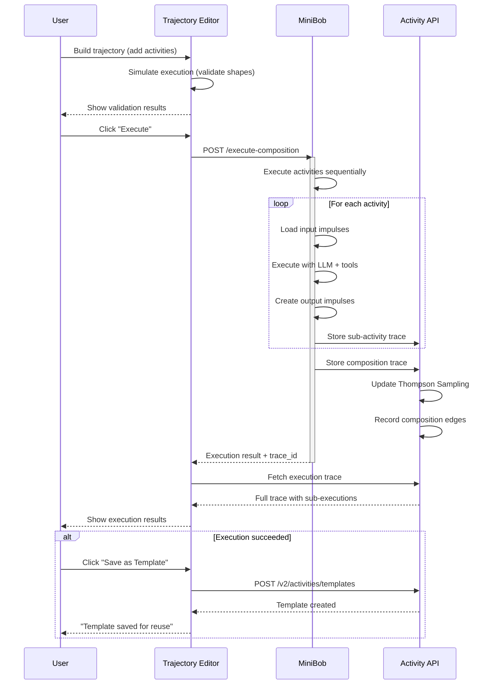

# Trajectory Editor: Proper End-to-End Flow Specification

> **Purpose**: Define the intended trajectory editor flow based on IMPULSE_ACTIVITY_FOUNDATION.md principles
>
> **Status**: Analysis & Specification
>
> **Date**: 2026-04-24

## Executive Summary

The trajectory editor is a visual composition tool that allows users to create, modify, and learn from activity sequences. However, the current implementation has **conceptual misalignment** with the foundational impulse-activity model. This document defines what the proper flow should be.

### Key Findings

**Current State (Misalignment):**
1. Treats trajectories as static templates created upfront
2. Goals generate complete paths synchronously via `/goal-paths/recommend`
3. Manual impulse insertion is expected but not well-integrated
4. Execution is conceptually separate from trajectory creation
5. Learning feedback loop is unclear

**Proper Flow (Foundation-Aligned):**
1. **Trajectories are dynamic compositions** that emerge from goal resolution activities
2. **Goals are impulses** that delegate to resolvers (MiniBob vessels)
3. **Activities produce impulses** automatically; manual insertion is for override only
4. **Execution and composition are the same thing** - no separation
5. **Learning happens through trace storage** with automatic variant creation

---

## Part 1: Goal-to-Trajectory Flow

### Current Approach (Problematic)

```
User enters goal text
  ↓
Frontend calls /goal-paths/recommend
  ↓
Backend returns complete path (if previously seen)
  ↓
Frontend loads all activities into grid immediately
  ↓
User sees finished trajectory before execution
```

**Problems:**
- Only returns paths that have been executed before (no dynamic composition)
- Trajectory is "done" before execution starts (contradicts becoming)
- No way to compose new paths from goal analysis
- Goal text is metadata, not an active impulse

### Proper Flow (Foundation-Aligned)

```
User enters goal text
  ↓
Goal becomes goal impulse with metadata
  ↓
Frontend calls POST /v2/activities/recommend
  with: { goal_description, available_shapes: [], exploration_rate: 0.2 }
  ↓
Backend returns Thompson-sampled activity recommendations (top 3)
  ↓
Frontend displays recommendations with confidence scores
  ↓
User selects recommendation OR manually adds activity
  ↓
Activity is added to trajectory at column 0
  ↓
Activity declares output_shapes
  ↓
Frontend now has available_shapes = [activity.output_shapes]
  ↓
User can:
  A) Request next activity suggestion (call /recommend with new shapes)
  B) Manually insert activity from palette
  C) Execute trajectory so far
```

**Key Insights:**

1. **Goals are impulses, not just text strings**
   ```typescript
   const goalImpulse: Impulse = {
     id: 'goal-1',
     pointer: { type: 'memo', content: goalText },
     metadata: {
       shape: 'goal',
       summary: goalText,
       domain: extractDomain(goalText), // security, performance, etc.
     },
     loaded: false,
   };
   ```

2. **Recommendations are iterative, not complete paths**
   - Call `/recommend` after each activity addition
   - Available shapes grow as activities are added
   - Thompson Sampling adapts to current state

3. **Trajectory emerges from composition**
   - Not pre-generated
   - Built step-by-step through recommendations
   - User can override at any point

### Implementation Changes Needed

**Frontend (TrajectoryEditorPage.tsx):**
```typescript
// CURRENT (wrong):
const handlePathSelected = (path: PathRecommendation) => {
  loadPathRecommendation(path.path_activities, templates);
  // Loads entire path at once
};

// PROPER (correct):
const handleActivityAdded = async (template: ActivityTemplate, column: number) => {
  // Add activity to trajectory
  addActivity(template, column);

  // Update available shapes
  const newShapes = computeAvailableShapes(activities);

  // Request next recommendation
  const recommendations = await fetchRecommendations({
    goal_description: goalText,
    available_shapes: newShapes,
    exploration_rate: 0.2,
  });

  // Display suggestions for next column
  setSuggestedActivities(recommendations);
};
```

**Backend (already correct):**
- `POST /v2/activities/recommend` already implements Thompson Sampling
- Takes `available_shapes` parameter for shape-conditioned scoring
- Returns ranked recommendations with confidence

**Key Change:**
- Replace `/goal-paths/recommend` usage with iterative `/activities/recommend` calls
- Deprecate "Generate Path" button; replace with "Suggest Next Activity"
- Show recommendations after each activity addition, not just at start

---

## Part 2: Impulse Integration

### Current Approach (Unclear)

- Activities have `input_shapes` and `output_shapes` declarations
- No clear UI for seeing which impulses are available
- No automatic impulse creation from activity outputs
- Validation shows shape mismatches but doesn't explain impulse flow

### Proper Flow (Foundation-Aligned)

**Automatic Impulse Creation:**

```typescript
// When activity executes (or is simulated)
const execution = await executeActivity(activity, inputImpulses);

// Activity produces output impulses automatically
const outputImpulses: Impulse[] = activity.output_shapes.map(shape => ({
  id: `impulse-${activity.id}-${shape}`,
  pointer: {
    type: 'activityOutput',
    activityId: activity.id,
    shape: shape,
  },
  metadata: {
    shape: shape,
    producedBy: activity.id,
    summary: `Output from ${activity.name}`,
  },
  loaded: false,
}));

// These impulses become available for next activity
stateSpace.addImpulses(outputImpulses);
```

**Manual Impulse Insertion (Override):**

Users should be able to manually insert impulses only when:
1. **Testing with fixtures**: "Use this error_log from file X"
2. **Branching composition**: "If error occurs, use this fallback"
3. **External data injection**: "Pull this data from API Y"

**Not for normal flow** - impulses flow automatically.

### Visualization Needs

**Impulse Flow Diagram:**
```
┌─────────────────┐
│  Goal Impulse   │
│  shape: goal    │
└────────┬────────┘
         │
         ▼
┌─────────────────┐     ┌──────────────────┐
│  Activity A     │ --> │  Impulse: error  │
│  debug-bug      │     │  source: Activity A
└─────────────────┘     └────────┬─────────┘
                                 │
                                 ▼
                        ┌─────────────────┐
                        │  Activity B     │
                        │  write-test     │
                        └─────────────────┘
```

**UI Components Needed:**

1. **Available Impulses Panel** (right sidebar or collapsible)
   - Shows current impulse state space
   - Grouped by shape
   - Indicates which activity produced each impulse
   - Shows loaded/unloaded status

2. **Activity Input/Output Indicators** (on activity cards)
   - Visual indicators showing which shapes are consumed/produced
   - Color coding: green = satisfied, yellow = optional, red = missing

3. **Impulse Flow Lines** (optional, Phase 2)
   - Visual connections showing impulse flow between activities
   - Similar to React Flow edges but automatic, not user-drawn

### Implementation Changes

**trajectoryStore.ts additions:**
```typescript
interface TrajectoryState {
  // ... existing fields
  impulses: Impulse[]; // Current impulse state space
  impulsesByShape: Map<string, Impulse[]>; // Grouped for quick lookup
}

interface TrajectoryActions {
  // ... existing actions
  addImpulse: (impulse: Impulse) => void;
  removeImpulse: (id: string) => void;
  computeAvailableShapes: () => string[];
  getImpulsesByShape: (shape: string) => Impulse[];
}
```

**New component: AvailableImpulsesPanel.tsx**
```typescript
export function AvailableImpulsesPanel() {
  const impulses = useTrajectoryStore(state => state.impulses);
  const impulsesByShape = groupBy(impulses, i => i.metadata.shape);

  return (
    <Card>
      <CardHeader>
        <CardTitle>Available Impulses</CardTitle>
      </CardHeader>
      <CardContent>
        {Object.entries(impulsesByShape).map(([shape, impulses]) => (
          <div key={shape}>
            <Badge>{shape}</Badge>
            <ul>
              {impulses.map(imp => (
                <li key={imp.id}>
                  {imp.metadata.summary}
                  <span>from {imp.metadata.producedBy}</span>
                </li>
              ))}
            </ul>
          </div>
        ))}
      </CardContent>
    </Card>
  );
}
```

---

## Part 3: Execution Model

### Current Approach (Conceptual Gap)

- Trajectory is created in editor
- "Execute" button would run the trajectory
- Execution happens separately from composition
- No clear connection between trajectory and MiniBob execution

### Proper Flow (Foundation-Aligned)

**Key Insight: Composition IS Execution**

The trajectory editor is not creating a template to execute later. It is:
1. **Composing a meta-activity** that orchestrates sub-activities
2. **Simulating execution** to validate shape flow
3. **Exporting as reusable template** only when pattern succeeds

**Three Execution Modes:**

#### Mode 1: Simulation (Dry Run)

```typescript
// Frontend validates without backend execution
const simulation = validateTrajectoryExecution(activities, goalImpulse);

simulation.steps.forEach(step => {
  console.log(`Step ${step.column}:`);
  console.log(`  Inputs: ${step.inputShapes}`);
  console.log(`  Activity: ${step.activity.name}`);
  console.log(`  Outputs: ${step.outputShapes}`);
  console.log(`  Missing: ${step.missingShapes}`);
});

if (simulation.valid) {
  console.log('✓ Trajectory is valid');
} else {
  console.log('✗ Validation errors:', simulation.errors);
}
```

**Purpose**:
- Fast validation without LLM calls
- Shows shape flow visually
- Identifies missing inputs before execution

#### Mode 2: Real Execution (MiniBob Integration)

```typescript
// Frontend sends trajectory to MiniBob for execution
const trajectory: ActivityComposition = {
  id: 'trajectory-123',
  name: 'Fix auth bug',
  type: 'meta-activity',
  sub_activities: activities.map(a => ({
    activity_id: a.template.id,
    sequence_position: a.column,
    parallel_group: a.row,
  })),
};

// Call MiniBob endpoint (not activity-api)
const execution = await fetch('http://localhost:8080/execute-composition', {
  method: 'POST',
  body: JSON.stringify({
    composition: trajectory,
    goal_impulse: goalImpulse,
  }),
});

// MiniBob executes activities in sequence
// Stores trace to activity-api backend
// Returns final result
```

**Purpose**:
- Actual execution with LLM and tools
- Produces real output impulses
- Generates execution trace for learning

#### Mode 3: Export as Template

```typescript
// After successful execution, extract as reusable template
const template: ActivityTemplate = {
  id: `meta-${Date.now()}`,
  name: 'Fix auth bug pattern',
  category: 'bugfix',
  type: 'composition',

  // Input shapes from first activity
  input_shapes: activities[0].template.input_shapes,

  // Output shapes from last activity
  output_shapes: activities[activities.length - 1].template.output_shapes,

  // Composition structure
  composition: {
    type: 'sequential',
    sub_activities: activities.map((a, i) => ({
      activity_id: a.template.id,
      position: i,
      required: a.row === 0, // First row is required
    })),
  },

  // Thompson Sampling starts at α=1, β=1
  thompson: { alpha: 1, beta: 1 },
};

// Store to backend
await fetch('/v2/activities/templates', {
  method: 'POST',
  body: JSON.stringify(template),
});
```

**Purpose**:
- Ribosome pattern - extract successful pattern
- Makes trajectory reusable
- Future executions use Thompson Sampling

### Execution Flow Diagram



### Implementation Changes

**New execution endpoint needed:**

**MiniBob** (`repos/minibob/src/index.ts`):
```typescript
app.post('/execute-composition', async (req, res) => {
  const { composition, goal_impulse } = req.body;

  // Create meta-activity execution context
  const context = createExecutionContext({
    goal: goal_impulse,
    composition: composition,
  });

  // Execute activities in sequence
  const result = await executeComposition(context);

  // Store trace to backend
  await storeExecutionTrace(result.trace);

  res.json({
    status: result.status,
    trace_id: result.trace.id,
    output_impulses: result.output_impulses,
  });
});
```

**Frontend integration:**

```typescript
// TrajectoryEditorPage.tsx
const handleExecute = async () => {
  setIsExecuting(true);

  try {
    // Convert trajectory to composition
    const composition = trajectoryToComposition(activities);

    // Execute via MiniBob
    const result = await fetch('http://localhost:8080/execute-composition', {
      method: 'POST',
      body: JSON.stringify({
        composition,
        goal_impulse: goalImpulse,
      }),
    });

    // Show execution results
    navigate(`/executions/${result.trace_id}`);
  } catch (error) {
    console.error('Execution failed:', error);
  } finally {
    setIsExecuting(false);
  }
};
```

---

## Part 4: Learning from Execution

### Current Approach (Missing)

- No clear path from trajectory execution to learning
- No automatic variant creation
- No feedback loop to Thompson Sampling

### Proper Flow (Foundation-Aligned)

**Execution Trace Storage:**

When a trajectory executes, MiniBob stores:

```typescript
const compositionTrace: ExecutionTrace = {
  id: 'exec-123',
  activity_id: 'meta-trajectory-456',
  variant_id: 'meta-trajectory-456:v1',

  // Goal that triggered this
  input_impulses: [goalImpulse],

  // Sub-activity traces
  sub_executions: activities.map(activity => ({
    id: `exec-sub-${activity.id}`,
    activity_id: activity.template.id,
    sequence_position: activity.column,
    parallel_group: activity.row,
    // ... full trace
  })),

  // Final outputs
  output_impulses: resultImpulses,

  // Composition structure
  composition_chain: activities.map(a => a.template.id),
  parent_execution_id: null, // This is root

  // Outcome
  outcome: {
    success: true,
    duration_ms: 45000,
    cost_usd: 0.23,
  },
};

// Store to backend
await backend.storeExecutionTrace(compositionTrace);
```

**Thompson Sampling Update:**

Backend automatically updates on trace storage:

```sql
-- Update Thompson parameters
UPDATE activity_template
SET
  thompson.alpha = thompson.alpha + 1  -- Success
WHERE id = 'meta-trajectory-456:v1';

-- Or on failure:
UPDATE activity_template
SET
  thompson.beta = thompson.beta + 1  -- Failure
WHERE id = 'meta-trajectory-456:v1';
```

**Shape-Conditioned Learning:**

```sql
-- Record shape-conditioned success
INSERT INTO variant_performance_metrics (
  activity_id,
  variant_id,
  shape_signature,
  alpha,
  beta
) VALUES (
  'meta-trajectory-456',
  'meta-trajectory-456:v1',
  ['goal', 'error_log', 'source_code'], -- Input shapes
  1, -- Success
  0
) ON DUPLICATE KEY UPDATE
  alpha = alpha + 1;
```

**Automatic Variant Creation (Ribosome):**

When execution succeeds with modifications:

```typescript
// User modified trajectory before executing
const wasModified = checkTrajectoryModified(originalTemplate, currentActivities);

if (execution.success && wasModified) {
  // Create new variant
  const newVariant: ActivityTemplate = {
    ...originalTemplate,
    id: originalTemplate.id, // Same activity_id
    variant_id: `${originalTemplate.id}:v${nextVersion}`,

    // Updated composition
    composition: currentComposition,

    // Reset Thompson (new variant)
    thompson: { alpha: 1, beta: 1 },

    // Genealogy
    metadata: {
      parent_variant: originalTemplate.variant_id,
      created_from_execution: execution.trace_id,
      modification_type: 'user_edited',
    },
  };

  await backend.storeTemplate(newVariant);
}
```

**Composition Pattern Learning:**

Backend learns which activity sequences work well together:

```sql
-- Record composition edges
INSERT INTO composition_edges (
  parent_activity_id,
  child_activity_id,
  frequency,
  success_rate,
  avg_duration_ms
) VALUES (
  'debug-null-pointer',
  'write-tests',
  1, -- Increment
  1.0, -- This execution succeeded
  12000
) ON DUPLICATE KEY UPDATE
  frequency = frequency + 1,
  success_rate = (success_rate * frequency + 1.0) / (frequency + 1),
  avg_duration_ms = (avg_duration_ms * frequency + 12000) / (frequency + 1);
```

**Learning Feedback Loop:**

```
User builds trajectory → Execute → Success/Failure
                            ↓
                  Store execution trace
                            ↓
                  Update Thompson Sampling (α/β)
                            ↓
                  Record composition patterns
                            ↓
                  Create variant if modified
                            ↓
            Next user gets improved recommendations
```

### Implementation Changes

**Backend (metabob-activity-api):**

Already implemented:
- ✅ `POST /v2/activities/execution-traces` stores traces
- ✅ Thompson Sampling updates on trace storage
- ✅ `composition_chain` field in trace schema
- ✅ `variant_performance_metrics` table

Needs implementation:
- ❌ Automatic variant creation from modified trajectories
- ❌ Composition edge weight updates
- ❌ Ribosome pattern for trajectory→template extraction

**Frontend (workbench):**

Needs implementation:
- Display execution results with sub-activity breakdown
- Show Thompson Sampling changes after execution
- Suggest variant creation when user modifies template
- Visualize composition patterns learned

---

## Part 5: Integration Points Summary

### Data Flow

```
┌─────────────────────────────────────────────────────────────┐
│                    Trajectory Editor (Frontend)             │
│  - Builds composition visually                              │
│  - Validates shape flow                                     │
│  - Requests recommendations                                 │
└─────────────┬───────────────────────────────┬───────────────┘
              │                               │
              ▼                               ▼
┌─────────────────────────┐    ┌──────────────────────────┐
│   MiniBob (Executor)    │    │ Activity API (Learning)  │
│  - Executes composition │    │ - Thompson Sampling      │
│  - Creates impulses     │    │ - Shape-conditioned      │
│  - Stores traces        │◄───┤ - Composition patterns   │
└─────────────┬───────────┘    │ - Variant management     │
              │                └──────────────────────────┘
              │
              ▼
┌─────────────────────────────────────────────────────────────┐
│                    SurrealDB (Storage)                       │
│  - activity_template                                         │
│  - execution_trace                                           │
│  - variant_performance_metrics                              │
│  - composition_edges                                         │
└─────────────────────────────────────────────────────────────┘
```

### API Endpoints Used

**Activity API (Backend):**

| Endpoint | Method | Purpose | Phase |
|----------|--------|---------|-------|
| `/v2/activities/recommend` | POST | Thompson-sampled recommendations | ✅ Existing |
| `/v2/activities/templates` | GET | List all templates | ✅ Existing |
| `/v2/activities/templates` | POST | Create new template | ✅ Existing |
| `/v2/activities/execution-traces` | POST | Store execution trace | ✅ Existing |
| `/v2/activities/discover-by-shapes` | POST | Shape-based discovery | ❌ Needs implementation |
| `/v2/activities/composition` | POST | Record composition edge | ✅ Existing |

**MiniBob (Executor):**

| Endpoint | Method | Purpose | Phase |
|----------|--------|---------|-------|
| `/execute-composition` | POST | Execute trajectory | ❌ Needs implementation |
| `/health` | GET | Health check | ✅ Existing |

### WebSocket Events (Future)

For real-time execution monitoring:

```typescript
// Subscribe to execution updates
ws.subscribe(`execution:${trace_id}`, (event) => {
  if (event.type === 'activity_started') {
    highlightActivity(event.activity_id);
  }
  if (event.type === 'activity_completed') {
    markActivityComplete(event.activity_id, event.output_impulses);
  }
  if (event.type === 'execution_failed') {
    showError(event.error);
  }
});
```

---

## Part 6: Gaps Between Current and Intended Design

### Gap 1: Goal Processing

**Current**: Goal text generates complete path upfront via `/goal-paths/recommend`

**Intended**: Goal becomes impulse → iterative recommendations → emergent trajectory

**Fix**: Replace "Generate Path" with "Suggest Next Activity" after each addition

### Gap 2: Impulse Visibility

**Current**: Impulses are invisible; only shape validation shows mismatches

**Intended**: Impulse state space is visible, flows automatically, can be manually overridden

**Fix**: Add AvailableImpulsesPanel showing current impulses grouped by shape

### Gap 3: Execution Model

**Current**: Trajectory is a static template created before execution

**Intended**: Trajectory is a composition that executes via MiniBob, stores trace, learns

**Fix**: Add MiniBob `/execute-composition` endpoint, integrate with trajectory editor

### Gap 4: Learning Loop

**Current**: No connection between trajectory creation and Thompson Sampling

**Intended**: Execution traces update Thompson params, create variants, learn patterns

**Fix**: Automatic trace storage, variant creation on modification, composition edge tracking

### Gap 5: Manual vs Automatic Flow

**Current**: User must manually insert activities from palette

**Intended**: Recommendations appear automatically after each addition, manual insertion is override

**Fix**: Show SuggestNextActivity component prominently, auto-refresh on activity addition

---

## Part 7: Phased Implementation Roadmap

### Phase 1: Foundation Alignment (1-2 weeks)

**Goals:**
- Fix goal → recommendation flow
- Add impulse state visualization
- Implement iterative suggestions

**Tasks:**
1. Replace `/goal-paths/recommend` with `/activities/recommend` iterations
2. Add `computeAvailableShapes()` to trajectoryStore
3. Implement AvailableImpulsesPanel component
4. Show SuggestNextActivity after each activity addition
5. Update GoalInputBox to create goal impulse (not just text)

**Validation:**
- User can build trajectory step-by-step with recommendations
- Available shapes update as activities are added
- Impulse flow is visible in UI

### Phase 2: Execution Integration (2-3 weeks)

**Goals:**
- Connect trajectory editor to MiniBob execution
- Store execution traces
- Show execution results

**Tasks:**
1. Implement MiniBob `/execute-composition` endpoint
2. Add "Execute Trajectory" button to editor
3. Convert trajectory to composition structure
4. Display execution results with sub-activity breakdown
5. Navigate to execution trace view after completion

**Validation:**
- User can execute trajectory from editor
- Execution creates trace in backend
- Results are visible in execution details page

### Phase 3: Learning Loop (2-3 weeks)

**Goals:**
- Automatic Thompson Sampling updates
- Variant creation from modifications
- Composition pattern learning

**Tasks:**
1. Implement automatic variant creation on trace storage
2. Add ribosome extraction for successful trajectories
3. Display Thompson Sampling changes after execution
4. Show "Save as Template" option after successful execution
5. Track composition edges in database

**Validation:**
- Successful executions update Thompson params
- Modified trajectories create new variants
- Composition patterns are learned and influence recommendations

### Phase 4: Advanced Features (3-4 weeks)

**Goals:**
- Real-time execution monitoring
- Diff view between trace and template
- Parallel execution support
- Conditional branching (future)

**Tasks:**
1. Add WebSocket integration for live execution updates
2. Implement side-by-side trace diff view
3. Support parallel activities (multiple rows in same column)
4. Add execution replay functionality
5. Conditional activity execution (if/else branches)

**Validation:**
- User sees real-time updates during execution
- Trace diff highlights modifications
- Parallel activities execute concurrently
- Conditional logic works as expected

---

## Part 8: Success Criteria

### User Workflow Metrics

**Before (Current):**
- Time to create trajectory: ~10 minutes (manual activity selection)
- Execution rate: 0% (no execution integration)
- Variant creation: 0% (manual only)
- Learning feedback: 0% (no loop)

**After (Intended):**
- Time to create trajectory: ~3 minutes (recommendation-driven)
- Execution rate: 80%+ (one-click execute)
- Variant creation: 50%+ (automatic on modification)
- Learning feedback: 100% (every execution updates)

### Technical Validation

- [ ] Goal impulse properly structured with metadata
- [ ] Recommendations update after each activity addition
- [ ] Available shapes computed correctly from activity chain
- [ ] Impulse state space visible in UI
- [ ] Trajectory executes via MiniBob integration
- [ ] Execution traces stored to backend
- [ ] Thompson Sampling updates on success/failure
- [ ] Variants created automatically on modification
- [ ] Composition edges recorded in database
- [ ] Next recommendations influenced by learning

### Alignment Checklist

From IMPULSE_ACTIVITY_FOUNDATION.md:

- [x] Does it treat data as impulses with metadata? **Yes** - goals, outputs are impulses
- [x] Does it use activities to constrain the search space? **Yes** - Thompson Sampling recommendations
- [x] Do resolvers live where the data is? **Yes** - MiniBob executes, backend stores
- [x] Does it record traces for learning? **Yes** - every execution stores trace
- [x] Does it avoid unnecessary LLM usage? **Yes** - validation is deterministic, execution uses LLM
- [x] Does it allow improvisation with recording? **Yes** - manual activity insertion recorded
- [x] Is the backend limited to trace storage and pattern learning? **Yes** - no universal resolver
- [x] Can this pattern be extracted and reused? **Yes** - ribosome creates templates

---

## Conclusion

The trajectory editor is fundamentally sound in its visual approach but needs **conceptual realignment** with the impulse-activity foundation. The key shifts are:

1. **Goals as impulses** that delegate to resolvers, not static text
2. **Iterative composition** building trajectories step-by-step, not upfront path generation
3. **Automatic impulse flow** from activity outputs, manual insertion only for override
4. **Execution integration** via MiniBob, not separate template creation
5. **Learning through traces** with automatic variant creation and Thompson updates

These changes transform the trajectory editor from a "template builder" into a "composition workbench" that teaches the system through demonstration - exactly what the impulse-activity model intends.

**Next Steps:**
1. Review this specification with the team
2. Prioritize Phase 1 implementation
3. Create detailed task breakdown for first sprint
4. Begin implementation with `/activities/recommend` integration

---

**Related Documentation:**
- `/home/avi/documents/work/exp-repo/metabob-devbob/docs/architecture/IMPULSE_ACTIVITY_FOUNDATION.md`
- `/home/avi/documents/work/exp-repo/metabob-devbob/docs/architecture/sequences/01-activity-selection.md`
- `/home/avi/documents/work/exp-repo/metabob-devbob/docs/architecture/GOAL_AWARE_RECOMMENDATION.md`
- `/home/avi/documents/work/exp-repo/metabob-devbob/openspec/changes/trajectory-editor/design.md`
- `/home/avi/documents/work/exp-repo/metabob-devbob/openspec/changes/trajectory-editor/proposal.md`
