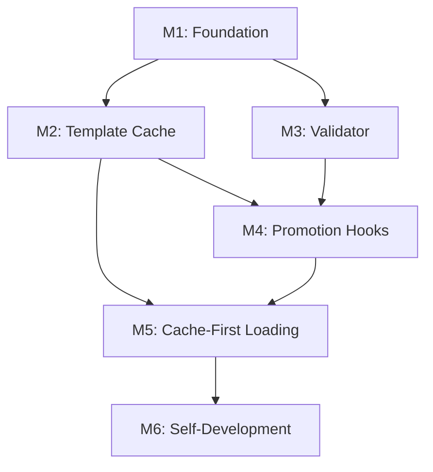

# Vessel Development Architecture - Tasks

## Overview

Implementation organized into 5 milestones with specific commit points where the application is testable.

**Total Effort:** ~4-5 days
**Self-Development:** All implementation via MiniBob where possible

---

## Milestone 1: Foundation (Day 1)

**Goal:** Establish vessel directory structure and type definitions.

**Commit Point:** Can create and load vessel definitions.

### Tasks

- [x] **M1.1** Create vessel module directory structure
  - Create `repos/minibob/src/vessel/` directory
  - Create `index.ts` with module exports
  - **Test:** Directory exists, module imports work

- [x] **M1.2** Define VesselDefinition types
  - Add `VesselDefinition` interface to `types.ts`
  - Include development mode configuration
  - Include templates, hooks, promotion settings
  - **Test:** Types compile without errors

- [x] **M1.3** Implement vessel definition loader
  - Create `src/vessel/definition.ts`
  - Implement `loadVesselDefinition(vesselPath)`
  - Implement `isDevelopmentVessel(vesselPath)`
  - Implement `getVesselId(vesselPath)`
  - **Test:** Can load sample vessel.json

- [x] **M1.4** Create sample vessel definition
  - Create `.minibob/vessel.json` in minibob repo
  - Enable development mode
  - Set promotion thresholds
  - **Test:** `isDevelopmentVessel()` returns true

### Commit: `feat(minibob): add vessel definition structure`

```bash
# Verification
cd repos/minibob
bun run -e "import { loadVesselDefinition } from './src/vessel'; console.log(loadVesselDefinition('.'))"
```

---

## Milestone 2: Template Cache (Day 1-2)

**Goal:** Local template caching with metadata tracking.

**Commit Point:** Can cache, load, and list templates locally.

### Tasks

- [x] **M2.1** Define CachedTemplate types
  - Add `CachedTemplate` interface
  - Add `TemplateCache` interface
  - Add `PromotionThreshold` interface
  - **Test:** Types compile

- [x] **M2.2** Implement FileSystemTemplateCache
  - Create `src/vessel/template-cache.ts`
  - Implement `load(vesselId, templateId)`
  - Implement `save(vesselId, template, metadata)`
  - Implement `list(vesselId)`
  - **Test:** Can save and load template

- [x] **M2.3** Add execution tracking to cache
  - Implement `recordExecution(vesselId, templateId, success)`
  - Track `localExecutions`, `localSuccesses`, `localFailures`
  - **Test:** Execution counts increment correctly

- [x] **M2.4** Implement promotion candidate finder
  - Implement `getPromotionCandidates(vesselId, threshold)`
  - Filter by minExecutions and minSuccessRate
  - Exclude already-registered templates
  - **Test:** Returns templates meeting threshold

- [x] **M2.5** Add cache invalidation
  - Implement `invalidate(vesselId, templateId)`
  - Implement `markRegistered(vesselId, templateId)`
  - **Test:** Can invalidate and mark registered

### Commit: `feat(minibob): implement local template cache`

```bash
# Verification
cd repos/minibob
bun test src/vessel/template-cache.test.ts
```

---

## Milestone 3: Template Validator (Day 2)

**Goal:** Pre-registration validation with comprehensive checks.

**Commit Point:** Can validate templates before backend registration.

### Tasks

- [x] **M3.1** Create validator module
  - Create `src/vessel/template-validator.ts`
  - Define `ValidationResult` interface
  - **Test:** Module imports

- [x] **M3.2** Implement structure validation
  - Check required fields (id, name, tasks)
  - Check category is valid enum
  - **Test:** Invalid templates rejected

- [x] **M3.3** Implement variable validation
  - Extract {{var}} from prompt templates
  - Verify all referenced vars are defined
  - **Test:** Undefined variable errors reported

- [x] **M3.4** Implement dependency validation
  - Check all dependency references exist
  - Check task IDs are unique
  - **Test:** Invalid dependencies rejected

- [x] **M3.5** Implement cycle detection
  - Build dependency graph
  - DFS for back edges
  - **Test:** Cyclic dependencies detected

- [x] **M3.6** Add validation warnings
  - Warn on missing description
  - Warn on missing inputSchema
  - **Test:** Warnings included in result

### Commit: `feat(minibob): add template validator`

```bash
# Verification
cd repos/minibob
bun test src/vessel/template-validator.test.ts
```

---

## Milestone 4: Promotion Hooks (Day 3)

**Goal:** Automatic template registration on success threshold.

**Commit Point:** Templates auto-register to backend when threshold met.

### Tasks

- [x] **M4.1** Define promotion types
  - Add `PromotionContext` interface
  - Add `PromotionDecision` interface
  - Add `PromotionHook` type
  - **Test:** Types compile

- [x] **M4.2** Implement promotion decision logic
  - Create `src/vessel/promotion-hooks.ts`
  - Implement `checkPromotion(context)`
  - Check minExecutions and minSuccessRate
  - **Test:** Returns correct decisions

- [x] **M4.3** Implement promotion execution
  - Implement `executePromotion(templateId, vesselId, cache, mcp)`
  - Validate template before registration
  - Call MCP registerTemplate
  - Mark as registered in cache
  - Handle 409 (already exists) gracefully
  - **Test:** Template registers to backend

- [x] **M4.4** Extend lifecycle hooks
  - Add `onPromotionCheck` hook type
  - Add `onTemplateRegistered` hook type
  - **Test:** Hooks can be registered

- [x] **M4.5** Integrate with activity completion
  - Modify `executeActivityCompleteHooks`
  - Record execution to cache
  - Check promotion threshold
  - Execute promotion if met
  - **Test:** End-to-end promotion works

### Commit: `feat(minibob): add automatic template promotion`

```bash
# Verification - requires running backend
cd repos/minibob
bun run index.ts run templates/hello-world.json
# Execute 3+ times successfully
# Check backend for registered template
```

---

## Milestone 5: Cache-First Loading (Day 3-4)

**Goal:** Template loading checks cache before backend.

**Commit Point:** Full development workflow operational.

### Tasks

- [x] **M5.1** Modify loadTemplateFromMCPOrLocal
  - Add vesselId parameter
  - Add strategy parameter (local-first, backend-first, hybrid)
  - Check cache before MCP call
  - **Test:** Cache hit skips backend

- [x] **M5.2** Cache templates from backend
  - After MCP fetch, save to cache
  - Include metadata from backend response
  - **Test:** Fetched templates cached

- [x] **M5.3** Integrate vessel context into executor
  - Pass vesselId through execute() options
  - Detect development mode from vessel definition
  - **Test:** Development mode detected

- [x] **M5.4** Add CLI support
  - Add `--vessel` flag to run command
  - Add `--dev-mode` flag for explicit development mode
  - **Test:** CLI flags work

- [x] **M5.5** Update vessel registry integration
  - Sync cached templates to vessel registry
  - Track local vs registered templates
  - **Test:** Registry shows correct state

### Commit: `feat(minibob): cache-first template loading`

```bash
# Verification
cd repos/minibob

# First run - fetches from backend
bun run index.ts run hello-world --vessel minibob-local

# Second run - loads from cache (faster, no network)
bun run index.ts run hello-world --vessel minibob-local
```

---

## Milestone 6: Self-Development Integration (Day 4-5)

**Goal:** Use MiniBob to develop remaining features.

**Commit Point:** MiniBob can develop vessel development features.

### Tasks

- [x] **M6.1** Create vessel development activity templates
  - Template: create-module
  - Template: implement-interface
  - Template: add-tests
  - **Test:** Templates execute successfully

- [x] **M6.2** Bootstrap MiniBob as development vessel
  - Create full `.minibob/` structure in minibob repo
  - Configure promotion thresholds
  - Enable auto-promote
  - **Test:** `isDevelopmentVessel` returns true

- [x] **M6.3** Use MiniBob to implement remaining gaps
  - Goal: "Add test file for template-cache"
  - Goal: "Add test file for template-validator"
  - Goal: "Add integration test for promotion flow"
  - **Test:** Tests pass
  - **Note:** Infrastructure in place. Run `bun run index.ts goal "Add test file for template-cache"` to execute.

- [x] **M6.4** Document the workflow
  - Update CLAUDE.md with vessel development section
  - Add examples of using MiniBob for development
  - **Test:** Documentation accurate

### Commit: `feat(minibob): complete self-development integration`

```bash
# Verification - MiniBob develops itself
cd repos/minibob
bun run index.ts goal "Add unit test for checkPromotion function"
# Watch MiniBob create the test file
# Verify test passes
```

---

## Summary

| Milestone | Duration | Commit Message | Testable State |
|-----------|----------|----------------|----------------|
| M1: Foundation | 0.5 day | `feat(minibob): add vessel definition structure` | Load vessel.json |
| M2: Template Cache | 1 day | `feat(minibob): implement local template cache` | Cache templates locally |
| M3: Validator | 0.5 day | `feat(minibob): add template validator` | Validate before registration |
| M4: Promotion Hooks | 1 day | `feat(minibob): add automatic template promotion` | Auto-register on success |
| M5: Cache-First | 1 day | `feat(minibob): cache-first template loading` | Full dev workflow |
| M6: Self-Dev | 1 day | `feat(minibob): complete self-development integration` | MiniBob develops MiniBob |

---

## MiniBob Invocation for Each Milestone

### From Claude Code

```bash
# Set up environment
cd /home/avi/documents/work/exp-repo/metabob-devbob/repos/minibob
export ANTHROPIC_API_KEY="your-key"

# M1: Foundation
bun run index.ts goal "Create src/vessel directory with index.ts exporting vessel definition types"
bun run index.ts goal "Implement loadVesselDefinition function that reads .minibob/vessel.json"

# M2: Cache
bun run index.ts goal "Implement FileSystemTemplateCache class with load, save, list methods"
bun run index.ts goal "Add recordExecution method to track execution success/failure"

# M3: Validator
bun run index.ts goal "Create template validator with variable reference checking"
bun run index.ts goal "Add cycle detection for task dependencies"

# M4: Promotion
bun run index.ts goal "Implement checkPromotion function with threshold logic"
bun run index.ts goal "Add promotion hooks to lifecycle-hooks.ts"

# M5: Loading
bun run index.ts goal "Modify loadTemplateFromMCPOrLocal to check cache first"
bun run index.ts goal "Add --vessel flag to CLI run command"

# M6: Self-Dev
bun run index.ts goal "Create test file for template-cache.ts"
bun run index.ts goal "Create integration test for full promotion flow"
```

### Capturing Outputs

```bash
# Run with output capture
bun run index.ts goal "Your goal" 2>&1 | tee /tmp/minibob-output.log

# View structured output
cat /tmp/minibob-output.log | jq '.taskResults'
```

---

## Dependencies



Each milestone builds on previous ones. M1 must complete before M2/M3. M4 requires both M2 and M3. M5 requires M2 and M4. M6 requires M5.
