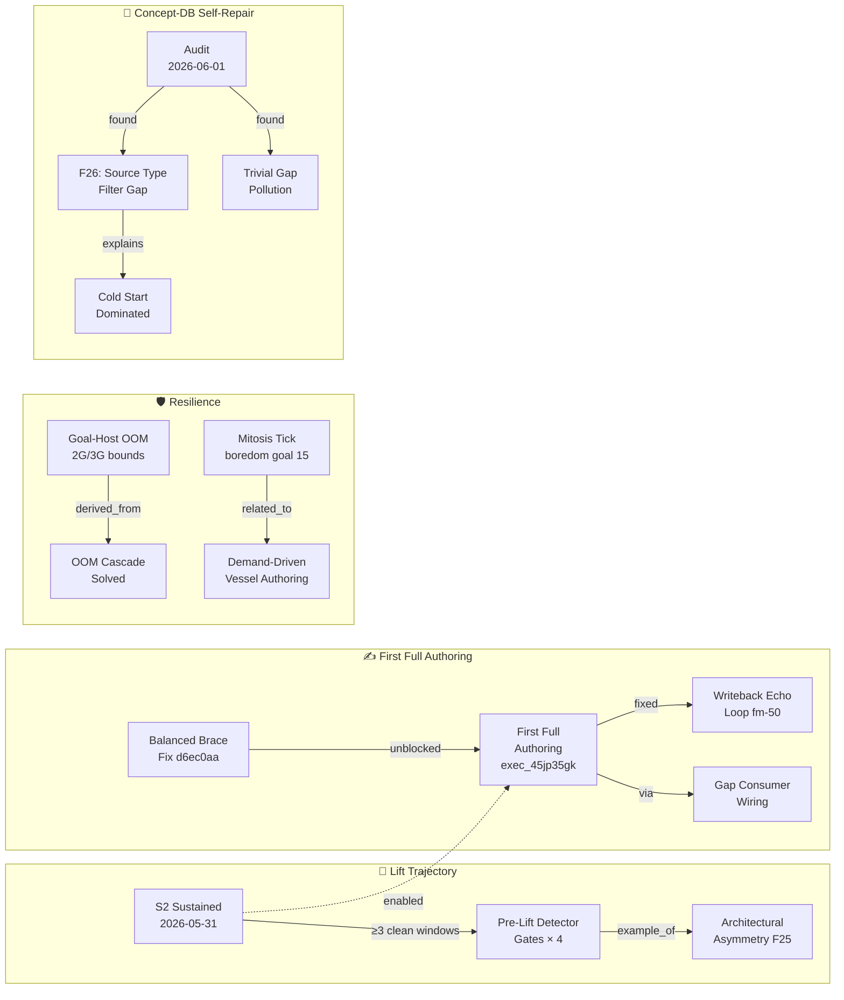

# Substrate Learning

> How the substrate accumulates knowledge, closes gaps, and evolves toward autonomous development.

This dashboard is a curated view of the substrate's learning state — what it has discovered, what chains of insight connect those discoveries, and what signals show actual usage. The 838+ concept notes in `concept-db/` are the raw material; this note tells the story.

---

## Current Phase

| Signal | Value |
|---|---|
| **Phase** | S2 — substrate-authored, supervised |
| **S2 sustained since** | 2026-05-31 (3 consecutive boredom windows) |
| **First full autonomous authoring** | 2026-06-01 (exec_45jp35gk, 14 tasks green) |
| **Concept-db size** | ~620 concepts across 6 source types |
| **Vault notes** | 838 synced notes |
| **Concepts with active signal** | ~15 (loaded > 0) |
| **Operator role** | Anchor maintainer + adversarial tester |

> [!tip] What S2 means
> The substrate now authors development artifacts (templates, spec proposals, concepts) without operator prompting. The operator's job has shifted from *writing features* to *validating that autonomous authoring is real* — checking that "substrate-authored" commits trace back to actual execution chains, not operator shadow-labeling.

---

## The Learning Chain

Key concept chains from recent sessions. Each box links to its vault note.



**Navigate to concept notes:**
- [[S2 Sustained Milestone]] · [[Pre Lift Detector Gates]] · [[Architectural Asymmetry · MNYEq]]
- [[Activity Create Variant Balanced Brace Fix]] · [[Substrate First Full Authoring Milestone]] · [[Writeback Echo Loop · kxeA7]]
- [[Goal Host Oom Containment]] · [[Oom Cascade Solved · wYVTk]] · [[Mitosis Tick Autonomous Primitive]]
- [[Concept Db Audit 2026 06 01]] · [[Prime Substrate Concepts Source Type Filter Gap]] · [[Concept Learning Currently Cold Start Dominated]] · [[Trivial Gap Duplicate Pollution]]

---

## What "Learning" Means Here

The substrate learns through four interlocking mechanisms:

### 1. Thompson Sampling (template selection)
Every execution updates a Beta distribution for its template:
- **Success** → α += reward → template selected more often next time
- **Failure** → β += penalty (weighted by failure type: full for `verifier_negative`, half for `budget_exhausted`)
- Templates that consistently work rise in rankings. Bad templates decay. The selector converges toward what actually works for each goal shape.

### 2. Concept accumulation (the substrate's vocabulary)
When `draft-gap-closing-activity` generates a new template, it queries concept-db as *priors*. Concepts the substrate has seen before steer what the LLM drafts — toward patterns that worked, away from patterns that failed.

> [!warning] Cold-start gap (being closed)
> Most concepts have `times_loaded = 0` — the substrate hadn't read them back yet. Root cause: [[Prime Substrate Concepts Source Type Filter Gap|F26]] only queried `impulse_signature` source type. Fixed 2026-05-30, activated by today's vessel restart. Signal will now accumulate as the boredom loop runs.

### 3. Ribosome extraction (execution → template)
Successful goal-host executions are extracted into reusable templates by ribosome-vessel. The pattern that worked once becomes a named activity the selector can pick again. The template library grows from evidence, not from operator writing.

### 4. Gap detection → variant drafting
Boredom-vessel fires topology-discovery goals that detect gaps (unmet shapes, repeated failures, orphaned producers). `draft-gap-closing-activity` authors a new template variant targeting the gap. Since 2026-06-01 this loop runs end-to-end: gap → variant authored → registered → concept minted. The substrate self-improves.

---

## Active Concepts (Signal > 0)

Concepts where `times_loaded > 0` — the substrate has actually read these as priors during drafting. The most load-bearing nodes in the knowledge graph right now.

| Concept | Loaded | Significance |
|---|---|---|
| [[Selector Anchor Vocabulary Gate]] | 12 | Template selection is lexical; vocabulary drives what gets selected |
| [[Substrate Curation Baseline 2026 05 31\|Curation Baseline 2026-05-31]] | 12 | Pre-curation snapshot; substrate reads it to know what to clean |
| [[Substrate Gap Consumer Wiring · M7qeU]] | 11 | The gap→drafter wiring; most-loaded concept in the graph |
| [[Concept Db Audit 2026 06 01]] | 8 | Audit findings read as prior for upkeep drafts |
| [[Architectural Asymmetry · MNYEq]] | 8 | F25 finding; substrate reads it when drafting recommend-path fixes |
| [[Substrate Curation Outcome 2026 05 31\|Curation Outcome 2026-05-31]] | 8 | Post-curation state; substrate reads to assess self-repair progress |
| [[Oom Cascade Solved · wYVTk]] | 5 | OOM pattern; read when drafting resilience activities |
| [[Substrate Vessel Dev Loop]] | 5 | Dev loop mechanics; read when drafting vessel-restart activities |

> [!info] Why loaded ≠ succeeded
> `times_loaded` counts how many times the concept was included in a drafting prompt. `times_succeeded` counts how many of those drafts then ran to a successful execution. The gap is expected — most drafts are still cold-started. As the gap-closing loop completes more executions, `times_succeeded` will rise and concept `relevance` will increase, giving stronger steering to future drafts.

---

## Gaps Being Closed

What the substrate has identified and is actively working on:

### Concept-DB Health
- [[Trivial Gap Duplicate Pollution]] — boredom-ticker flooding graph with noise (dedup gate shipped today)
- [[Prime Substrate Concepts Source Type Filter Gap]] — hand-minted concepts invisible to draft loop (fixed + restarted)
- [[Concept Learning Currently Cold Start Dominated]] — signal accumulation just starting

### Vessel Discovery & Liveness
- [[Discovery Liveness Gate Missing Pattern]] — registered vessels with fresh TTL but high failure rate not filtered
- [[Producer Consumer Contract Asymmetry · dTKPs]] — consumers declared but producers unshipped

### Authoring Completeness  
- [[Llm Prompt Terminal Task Pattern Gap]] — terminal-task types not explicitly named in activity prompts
- [[Lm Authoring Prompt Gap Closes Via Self Dispatch]] — self-dispatch closure requires explicit resolver naming

### Infrastructure
- [[Substrate Self Repair Loop Closure Via Sandboxed Write Channel]] — self-repair via operator_review_patch not yet closed
- [[Diagnostic Asymmetry Silent Corruption Pattern]] — substrate diagnoses authored templates but not authored vault notes

---

## Browse by Concept Family

| Folder | Notes | What's there |
|---|---|---|
| `concept-db/extracted/` | ~163 | Bug patterns, gap findings, architectural discoveries from traces |
| `concept-db/memo/` | ~51 | Session percolations, milestones, decisions |
| `concept-db/vessel_construction_pattern/` | ~405 | Implementation patterns, CLAUDE.md constitutional knowledge |
| `concept-db/impulse_activity_pattern/` | ~210 | Foundation model — impulse/activity/vessel contracts |
| `concept-db/human_input/` | ~7 | User preferences and operator corrections |

---

## Topology Coverage

Activity-api is the topology explorer. It tracks which (pool-signature × template) pairs have been attempted and learns which transitions succeed. Now observable:

```
GET http://localhost:18080/v2/activities/topology-coverage
Authorization: ApiKey <key>
```

| Field | Meaning |
|---|---|
| `distinct_pool_signatures` | Unique impulse-pool states seen |
| `total_v1_observations` | Precondition-conditioned Thompson observations |
| `dark_signature_count` | Pool signatures with ≤1 template tried — unexplored |
| `top_signatures[].exploration` | Exploitation (proven) vs. exploration (first contact) |

Each `/recommend` response now includes per-recommendation:
- `pool_signature` — 16-char hash of the current impulse pool
- `exploration: true/false` — whether this is an exploration move
- `signature_observations` — how many times this (template × pool) has run before

**Current state**: `cold_start` — no v1 observations yet. Populates after first execution completes through the wiring (ias-executor now sends `impulse_state_space` with every template-selection call).

> [!note] Remaining item
> `autoDraft` pre-recommend in goal-host is still a raw fetch (no `impulse_state_space`). Moving `autoDraft` into activity-api's `/recommend` handler closes this — selection oracle owns the draft decision, goal-host becomes a pure executor.

---

## Goal Dispatch

> [!todo] In progress — sidebar panel being added
> Once live, the **Goal Dispatch** sidebar lets you:
> - Type a goal and dispatch it directly to `goal-host-vessel` (port 8210)
> - Watch task events stream live in the sidebar via the existing WebSocket connection
> - Each execution creates a `Goals/` vault note with live-updating status
> - Concepts minted during execution appear here on the next 5-min sync
>
> **Shortcut (when live):** ribbon icon or `Ctrl+Shift+G`

---

*Last updated: 2026-06-03 · Phase: S2 (substrate-authored, supervised)*
